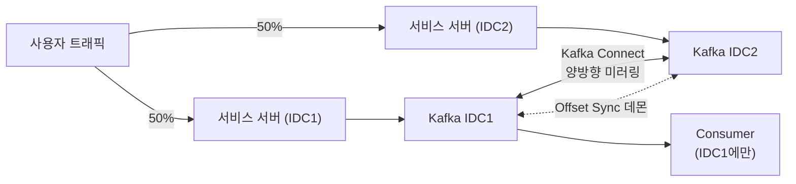

| | |
| --- | --- |
| 발표 | SLASH 23, Data 트랙 |
| 연사 | 강병수 (토스증권 데이터 플랫폼팀 Data Engineer) |
| 자료 | [세션 페이지](https://toss.im/slash-23/session-detail/B2-6) · [발표 영상](https://www.youtube.com/watch?v=Pzkioe7Dvo4) |

Toss Tech 3부작으로 정리된 Kafka 데이터센터 이중화의 원본 발표다. 글 세 편이 미러링 도구와 Offset Sync의 구현 세부를 다룬다면, 발표는 그 앞단인 "왜 이중화해야 하는가", "왜 Active-Standby가 아닌가", 그리고 "IDC 장애가 났을 때 무엇을 어떤 순서로 하는가"에 무게가 있다. 구현 세부는 [Kafka 이중화 리뷰](/posts/toss-securities-kafka-dual-datacenter-review/)에서 글 세 편을 근거로 다뤘으므로, 이 글은 발표 영상과 자동 생성 자막에 있는 것만 정리한다. 표현은 내 말로 바꿨다.

## 토스증권에서 Kafka가 맡는 것

Kafka는 producer, consumer, 그리고 메시지를 저장하고 꺼내 주는 broker로 구성된다. 토스증권에서 Kafka가 지나는 자리를 발표자는 다섯 가지로 나눴다.

| 용도 | 내용 |
| --- | --- |
| 시세 | 한국·미국 주식시장의 체결가, 호가, 각종 거래소 정보를 사용자에게 실시간 제공 |
| 서비스 간 통신 | MSA 구성이라 서비스 간 통신과 서버의 비동기 처리 |
| 외부 수신 | 종목별 공시 등 언론사 같은 외부 기관에서 오는 메시지 |
| 빅데이터 플랫폼 | 서버·클라이언트 로그 전부, 네트워크·보안 장비의 시스템 로그, 서비스 DB의 CDC. consumer가 Hadoop, Kudu, Elasticsearch 등 저장소로 보낸다 |
| 스트림 처리 | 실시간 로그 변환에 ksqlDB를 적극 활용 |

로깅 큐부터 시세처럼 증권 서비스의 핵심까지 전부 Kafka를 지난다. 그래서 Kafka 장애는 "상상하기도 싫은" 상황인데, 장애는 운영하다 보면 필연적으로 난다. 안 나기를 기도하는 것보다 **징후를 미리 감지하는 시스템과 발생 시 대응 시나리오**를 갖추는 것이 안정적 운영의 방법이라는 것이 발표의 전제다.

## 두 종류의 장애

장애는 크게 둘이다. 클러스터 내 일부 노드 장애는 디스크·메모리 같은 하드웨어부터 OS 설정, Kafka 버그까지 원인이 다양하지만, Kafka가 분산 시스템이라 일부 노드가 죽어도 가용성을 유지하도록 설계돼 있고 오랜 운영 경험으로 모니터링과 대응 프로세스가 잡혀 있어 극복 가능하다. 반면 IDC 전면 장애는 이중화가 없으면 서비스를 지속할 수 없는 치명적 장애이고, 오직 IDC 이중화로만 막을 수 있다.

이중화가 없는 상황을 가정하면 클라이언트가 IDC 한 곳과 통신하며 매매하다가 그 IDC가 죽으면 복구할 때까지 서비스를 쓸 수 없다. 돈이 오가는 서비스라 정말 피하고 싶은 상황이고, 증권사들은 메인 IDC와 떨어진 곳에 DR(Disaster Recovery) 시스템을 구축해야 한다.

## Active-Standby를 택하지 않은 이유

DR은 보통 Active-Standby로 구성한다. Standby는 장애 시 Active가 될 준비를 하고 있다는 뜻인데, 발표자는 그 준비를 믿지 않았다. 장애가 잦지 않아 평시에 잘 관리하지 않으면 **막상 장애가 나도 Standby가 제대로 동작하지 않는 경우가 많고**, 시스템이 최신 상태가 아니어서 장애가 해결되지 않는 경우도 많다. 그래서 토스증권은 Active-Active를 지향한다. 평시에도 두 IDC 모두 Active로 쓴다.

Kafka 이중화는 말로는 좋아 보이지만 구성과 운영이 어렵다. 특히 Kafka 같은 stateful 시스템은 고민할 것이 많다. Kafka에서 상태는 저장 중인 메시지 자체이고, 클러스터 구성원과 리더가 누구인지이고, replica가 어디 있는지이며, [consumer group](/posts/kafka-consumer-group-rebalance/)의 소비 기록인 [offset](/posts/kafka-storage-internals/)이다. 두 IDC에 클러스터를 각각 세우면 이 상태들의 일관성을 어떻게 유지할지 정해야 한다.

## 구조

사용자 트래픽이 두 IDC로 50%씩 들어간다. Active-Active라 가능하다. 각 IDC에 절반씩 들어온 메시지를 Kafka Connect로 상대 IDC에 실시간 미러링해 양쪽이 전체 메시지를 갖게 한다. 동시에 Offset Sync 데몬이 consumer group offset을 양쪽 IDC 간에 실시간으로 맞춘다.

특이한 점은 **consumer가 한쪽 IDC에만** 떠 있다는 것이다. 이유는 중복 소비다. 미러링으로 양쪽 클러스터가 각각 100%, 합쳐 200%가 되므로 두 클러스터에 다 붙으면 메시지를 2배 중복 소비한다. 그래서 한쪽에서만 소비한다.

### 메시지 미러링

앞단 서비스 서버도 Active-Active라 트래픽이 반반 들어온다고 하면, 각 클러스터는 자기 IDC 메시지 절반만 갖고 consumer는 절반밖에 못 가져간다. Kafka Connect가 반대쪽 메시지를 가져오고 내 것을 반대쪽으로 보내야 consumer가 전체를 가져간다. 이 양방향 미러링 잡이 라이브 토픽 수만큼, 수백 개 필요하고, 그것이 이중화 이후의 운영 부담이 된다.

### Offset Sync

offset은 consumer group이 어디까지 소비했는지의 번호다. 이 번호를 알아야 유실·중복 없이 이어서 소비한다. consumer는 offset을 broker에 저장하므로 양쪽 클러스터가 다 갖고 있어야 한다. IDC 장애나 IDC 작업으로 consumer가 다른 IDC로 옮겨야 할 때, 이전에 소비하던 곳부터 유실 없이 재개하려면 다른 IDC에도 offset이 있어야 한다. 미러링과 크게 다르지 않지만, offset은 클러스터가 다르면 번호 체계가 다르다. 같은 메시지라도 IDC1과 IDC2에서 붙는 offset 번호가 다를 수 있으므로, 상대 IDC에 맞는 번호로 바꿔 저장해야 한다.

## 곱절로 늘어난 운영을 자동화로

이중화 뒤에는 해야 할 일과 관리할 것이 곱절이다. 클러스터 수가 2배이고 미러링과 Offset Sync가 추가 부담이다. 데이터 플랫폼팀은 제한된 인원으로 이를 최소화하려고 자동화 도구를 많이 만들었다. 수백 개 토픽의 이중화 상태를 관리하고 서비스가 발전하며 새로 생기는 토픽의 이중화를 자동 생성하는 Kafka 관리 앱을 만들어 운영 공수를 줄였다.

모니터링도 같이 는다. 여러 클러스터를 24시간 보고 있을 수 없으므로 자동화했다. 클러스터의 모든 메트릭을 Prometheus로 수집하고 Thanos Ruler로 정의한 조건이 충족되면 알린다. 모든 로그는 Elasticsearch로 실시간 수집하고 에러 로그 발생 시 알린다. 여기서 나아가 더 정확한 징후 감지를 위해 시계열 이상 탐지 ML 모델도 개발 중이었다.

## IDC1 장애를 가정한 대응 순서

발표는 실제 장애 사례가 아니라 IDC1에 장애가 났다고 가정하고 순서를 설명했다. 평시에는 IDC1과 IDC2로 트래픽이 절반씩 들어가고, 서비스 서버는 자기 IDC의 Kafka에 쓰며, 미러링과 Offset Sync가 돌고, consumer는 IDC1에만 붙어 있다.

IDC1에 장애가 나면 할 일은 두 가지다.

1. 사용자 트래픽을 전부 IDC2로 보낸다. 이제 IDC2 클러스터가 100%의 메시지를 받는다.
2. consumer를 IDC2로 옮긴다. Offset Sync 데몬이 IDC1에서 어디까지 소비했는지를 IDC2에 실시간으로 맞춰 두었으므로, 주소만 IDC1에서 IDC2로 바꿔 붙으면 이전에 소비하던 구간부터 유실 없이 재개한다.

두 단계 사이에서 발표자는 broker 입장의 메시지 일관성을 설명했다. 장애 이전에 IDC1에 들어오던 메시지는 실시간으로 IDC2에 미러링 중이었으므로 온전히 넘어와 있을 것이고, 장애 이후 메시지는 전부 IDC2로 간다. 그래서 IDC2 broker가 모든 메시지를 갖고 있고 일관성이 유지된 상태라는 것이다. 발표에서 이것은 별도의 확인 작업이 아니라, 미러링이 실시간으로 돌고 있었다는 전제에서 나온 결론이다.

이로써 IDC 장애에도 최소한의 다운타임으로 Kafka를 쓸 수 있게 됐고, 처음 정의한 두 장애 케이스 중 IDC 전면 장애도 대응 가능해졌다. 발표자는 마지막에 선을 그었다. 실제 IDC 장애에서 토스증권 서비스가 완벽히 지속되려면 Kafka만이 아니라 시스템 전반의 이중화가 필요하고, Kafka 이중화는 그 여정의 한 과정이다.

## 리뷰

Active-Standby를 거부한 논거는 기술이 아니라 운영이다. 발표자의 논거를 내 말로 줄이면 "평소 쓰지 않는 것은 장애 때 동작하지 않는다"이고, 이것은 이중화 구성의 기술적 우열이 아니라 사람과 조직이 Standby를 어떻게 방치하는지에 대한 관찰이다. Active-Active는 그 관찰에 대한 답이고, 그 대가(미러링 수백 개, offset 번호 체계 변환, 클러스터 2배)를 자동화로 갚는 구조다. Toss Tech #1은 아키텍처 선택 기준을 가용성, 성능 저하 여부, 운영 난이도 세 가지로 놓고 운영 편의성은 상대적으로 덜 중요하다고 적었다([#1 구성](https://toss.tech/article/kafka-distribution-1)). 나는 그 결정의 원형이 이 발표에 있다고 본다.

나는 consumer를 한쪽에만 둔 것을 이 설계의 핵심 제약으로 읽는다. 양쪽에 다 있으면 2배 소비이고, 한쪽에만 있으면 전환이 필요하다. 전환이 필요하니 Offset Sync가 필요하고, Offset Sync가 어려운 이유는 번호 체계가 다르기 때문이다. 이 발표는 그 연쇄를 처음부터 끝까지 한 줄로 보여 주는데, Toss Tech #3의 timestamp 검색과 헤더 참조 전략은 이 연쇄의 마지막 고리를 푸는 방법이다.

장애 시 순서가 명시돼 있다는 점도 좋다. 트래픽 전환 → consumer 전환. 이중화 설계 발표에서 "구성"만 말하고 "그날 무엇을 하는가"를 말하지 않는 경우가 많은데, 이 발표는 순서를 놓았다. 다만 그 사이의 메시지 일관성은 확인 단계가 아니라 "실시간으로 미러링 중이었다"는 전제로 설명된다. 나는 이 지점이 가장 약하다고 본다. 장애 순간 미러링이 따라잡지 못한 메시지가 있었다면, 그 메시지는 IDC2에 없으므로 consumer를 옮겨도 소비되지 않는다. [Kafka 이중화 리뷰](/posts/toss-securities-kafka-dual-datacenter-review/)에서 "미러링 창의 메시지는 늦게, 순서가 바뀐 채 도착한다"고 남긴 질문이 이 2단계에 걸려 있다.

## 남는 질문

- 1단계 "트래픽을 IDC2로 보낸다"와 3단계 "consumer를 옮긴다" 사이의 시간. 그 사이 IDC2에 쌓이는 메시지는 consumer가 없어 처리되지 않는다. 몇 분이 걸리는지, 자동인지 사람이 하는지. Toss Tech 글의 대시보드(`Mirroring`·`InSync` 상태)가 이 판단의 근거로 보이지만 발표 시점에는 언급이 없다.
- Offset Sync가 "실시간"이라고 했는데, Toss Tech #3의 헤더 참조 방식은 30초 주기로 돌고 한 주기에 동기화가 수행될 확률이 50%라서, 5분간 한 번도 수행되지 않을 확률을 약 0.1%로 계산한다([#3 Offset Sync](https://toss.tech/article/kafka-distribution-3)). 같은 글은 핵심 요구사항 첫째로 "재난 상황 시, 중복은 최소화하되, 유실은 절대 발생하면 안 된다"를 둔다. 나는 발표의 "실시간"을 "주기적"으로 읽어야 하고, 주기 사이에 쌓인 차이가 장애 시 중복 소비로 나타날 것이라고 본다. 발표만 들으면 그 창이 없는 것처럼 들린다.
- 서비스 서버가 자기 IDC의 Kafka에 쓴다는 것은 producer도 IDC에 고정된다는 뜻이다. IDC1 장애 시 IDC1의 서비스 서버는 어차피 같이 죽으므로 문제가 없지만, Kafka IDC1만 죽고 서비스 서버 IDC1은 살아 있는 부분 장애에서 producer가 IDC2 Kafka로 넘어가는 경로가 있는지.
- consumer가 한쪽에만 있으면 그 IDC의 consumer 파드 장애는 IDC 장애가 아닌데도 소비가 멈춘다. consumer 자체의 다중화(같은 IDC 안에서)는 별개 문제인데, 발표는 IDC 단위만 다뤘다.
- 시세처럼 지연에 민감한 토픽도 같은 미러링을 타는지. 시세 플랫폼의 수신부와 처리부 사이는 이 발표와 같은 해 [다른 세션](/posts/slash23-realtime-quote-platform/)에서 Redis Pub/Sub으로 갔는데, 그 경로의 IDC 이중화는 어떻게 되는지.

## 참고

- [세션 페이지](https://toss.im/slash-23/session-detail/B2-6)
- [발표 영상](https://www.youtube.com/watch?v=Pzkioe7Dvo4)
- 발표를 글로 정리한 3부작: [#1 구성](https://toss.tech/article/kafka-distribution-1) · [#2 데이터 미러링](https://toss.tech/article/kafka-distribution-2) · [#3 Offset Sync](https://toss.tech/article/kafka-distribution-3)
- 글 세 편을 근거로 한 리뷰: [토스증권 Kafka 데이터센터 이중화 리뷰](/posts/toss-securities-kafka-dual-datacenter-review/)
- 같은 IDC 이중화의 다른 답: SLASH 23 Elasticsearch 클러스터 개선기 세션
