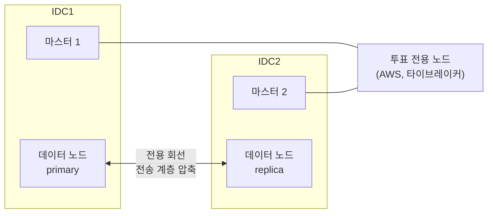

| | |
| --- | --- |
| 발표 | SLASH 23, Data 트랙 |
| 연사 | 이준환 (토스증권 데이터 플랫폼팀 Data Engineer) |
| 자료 | [세션 페이지](https://toss.im/slash-23/session-detail/B2-7) · [발표 영상](https://www.youtube.com/watch?v=_SJYU4lHa28) |

하루 6TB, 약 53억 건의 로그를 90일 보관하는 온프레미스 Elasticsearch 클러스터를 1년 동안 개선한 기록이다. 순서대로 Hot-Warm 구조, 장애의 원인이었던 인덱스 매핑, Logstash를 Vector로 바꾼 파이프라인 전환, 그리고 Elastic이 권장하지 않는 "두 데이터센터에 걸친 하나의 클러스터"를 어떻게 안전하게 만들었는지가 나온다. 내용은 발표 영상과 자동 생성 자막을 근거로 했고, 표현은 내 말로 바꿨다.

## 규모와 Hot-Warm

클라이언트 로그, 서버 로그, 시스템 로그가 약 90개의 파이프라인을 거쳐 하루 6TB, 약 53억 건 들어온다. 90일만 유지해도 570TB다. 온프레미스라 클러스터가 커질수록 저장 공간과 관리 부담이 같이 는다.

거의 모든 검색과 분석은 최근 보름 이내 로그를 대상으로 한다. 그래서 **Hot-Warm** 구조를 넣었다. Hot 노드보다 3배 큰 디스크를 가진 Warm 노드를 두고, 인덱스 생명주기 정책(ILM)으로 오래된 인덱스를 Warm으로 옮기고, 롤오버 후 90일이 지나면 삭제한다. 확장 방향이 목적에 따라 갈린다. 최근 로그를 더 오래 두고 싶으면 Hot을, 전체 로그를 더 오래 두고 싶으면 Warm만 늘린다.

## 장애의 원인은 매핑에 있었다

수백 TB 규모가 되자 장애가 잦아졌다. 클러스터가 느려져 인덱싱이 지연되고, Kibana 검색이 느려지고, 데이터 노드가 내려갔다. 느려졌을 때 노드 상태에는 공통 패턴이 있었다. **fielddata 메모리를 매우 많이 쓰고, 긴 GC가 빈번해서 GC가 끝날 때까지 클러스터가 멈추는** 것이다.

### fielddata

doc values가 도입되기 전 Elasticsearch는 집계와 정렬을 위해 필드 값을 힙의 fielddata 영역에 올렸다. 큰 인덱스의 필드를 힙에 올리면 JVM 메모리가 늘 부족하고 긴 GC가 난다. 그래서 파일 시스템을 쓰는 컬럼 기반 doc values로 발전해 힙을 덜 쓰고 OS 캐시를 쓰게 됐다. 지금은 특별한 경우가 아니면 fielddata를 쓸 일이 없다.

토스증권의 장애 당시 fielddata 옵션이 켜진 필드는 **단 7개**였다. 하지만 유입량이 워낙 많아 그 7개만으로 힙이 금방 차고 GC가 잦아졌다. doc values를 지원하지 않는 text 타입을 집계하려고 fielddata를 켤 수는 있지만, 가급적 쓰지 말고 다른 방법으로 풀라는 것이 발표자의 권고다.

### mapping explosion과 동적 매핑

명시적 설정이 없으면 Elasticsearch는 들어온 JSON 그대로 인덱싱하며 스키마를 동적으로 갱신한다. JSON 키가 매우 많으면 mapping explosion이 일어나고, 마스터 노드가 클러스터 상태를 갱신·관리하는 데 리소스를 많이 써 불안정해진다.

가장 좋은 것은 키가 너무 많은 데이터를 인덱싱하지 않는 것이다. 임의 구조의 데이터를 꼭 넣어야 한다면 세 가지 수단이 있다.

| 수단 | 효과 |
| --- | --- |
| dynamic template | 매핑을 지정하지 않은 문자열을 `keyword`로 매핑. 기본 동적 매핑은 문자열을 `text`+`keyword` 두 타입으로 만들고, `text`는 analyze 과정과 풀텍스트 자료구조 때문에 인덱싱 작업과 디스크를 더 쓴다 |
| `flattened` 타입 | 중첩 JSON을 평평하게 펼쳐 하나의 필드에 keyword로 인덱싱. 토스증권 서비스 로그의 request/response는 키가 매우 다양해 이 타입으로 넣는다 |
| `dynamic: false` | 명시적으로 매핑한 필드만 인덱싱. 더 엄격한 통제가 필요할 때 |

하루 수십억 건에서 필드를 두 타입으로 두 번씩 인덱싱하는 기본 동적 매핑을 쓰면 인덱싱 속도가 그만큼 느려지고 인덱스도 커진다. 세 수단의 목적은 하나다. **인덱스에 의도하지 않은 필드가 너무 많이 생기지 않게 하는 것.** 클러스터가 느리고 불안정하면 원인은 대부분 비효율적인 매핑이므로, 먼저 볼 것은 필드가 너무 많은지, fielddata를 쓰는 필드가 있는지, 기본 동적 매핑을 쓰고 있는지 세 가지다.

### 샤드와 인덱스 설정

샤드 수에 정답은 없지만 토스증권은 heavy 인덱스의 primary 샤드 수를 데이터 노드 수와 같게 했다. CPU에 여유가 있으면 primary를 더 늘려 초당 인덱싱 처리량을 올릴 수 있고, 그때는 특정 노드에 쏠리지 않게 노드 수의 배수로 잡는다. refresh interval은 60초로 늘려 세그먼트 생성과 머지를 줄였고, flush threshold size는 기본 512MB의 두 배인 1GB로 올려 translog flush 빈도를 낮췄다. slow query 로깅을 켜서 비싼 쿼리를 모니터링한다.

## Logstash에서 Vector로

90여 개 파이프라인이 각각 Logstash로 돌고 있었다. Logstash는 범용적이지만 JVM 기반이라 리소스를 많이 쓴다. 운영 편의를 위해 파이프라인마다 별도 프로세스로 띄우다 보니 Kubernetes 클러스터에서 **260GB** 넘는 메모리를 쓰는 상황이 됐다. 파이프라인은 더 늘어날 예정이라 경량 대체재가 필요했다.

후보는 Datadog이 공개한 Vector와 Treasure Data의 Fluentd였다. Fluentd도 오래 검증됐지만 로그 가공이 Logstash나 Vector보다 불편하다고 봤고, Vector는 로그 가공과 정제를 Logstash처럼 **코드로 유연하게** 쓸 수 있다는 점이 가장 컸다. Rust 기반 경량 도구로 고성능과 메모리 효율을 목표로 하고, 다양한 source와 sink를 제공하며, Vector Remap Language로 Logstash 이상으로 가공할 수 있다. 문서가 잘 돼 있어 90여 개 파이프라인을 금방 옮겼다. Logstash에서 아쉬웠던 파이프라인 모니터링은 Prometheus exporter로 쉽게 붙였다.

효과는 극적이었다. 메모리 약 260GB → **10GB 수준**(96% 감소), Kubernetes 파드의 CPU **55코어 → 27코어**(절반).

## 두 IDC에 하나의 클러스터

데이터센터 이중화로 새 IDC가 생기자 거기서 나오는 로그를 수집할 클러스터가 필요했다. 이 큰 클러스터를 한 세트 더 만들 수도 있지만, **두 IDC에 걸친 하나의 클러스터**를 검토했다.

Elastic은 권장하지 않는 구성이다. 노드들이 빈번히 통신하므로 IDC 간 지연이 크면 전체 성능이 떨어진다. 하지만 IDC 간 거리가 짧고 지연이 작다면 AWS 서울 리전의 가용 영역처럼 볼 수 있지 않을까 생각했고, 수백 TB 로그 수집·분석이 목적이라 약간의 지연보다 비용 절감이 크다고 판단했다. 대신 조건이 붙는다.

- **전용 회선.** 샤드 복제·복구가 네트워크를 많이 쓰므로 클러스터용 회선을 따로 둔다. 전송 계층에서 인덱싱 데이터를 압축해 대역폭을 아낀다.
- **투표 전용 마스터를 제3의 장소에.** 각 IDC에 마스터를 하나씩 두고, 마스터 선출 투표만 하는 노드를 AWS에 둬서 총 3대로 만든다. IDC 간 회선(DCI)이 끊겨도 한쪽이 과반을 얻어 split-brain을 막는다.
- **shard awareness.** primary와 replica가 서로 다른 IDC에 배치되게 해서 한 IDC 장애에 데이터가 남는다.
- **forced awareness.** 일시적 DCI 장애 때 샤드 복제가 과도하게 일어나지 않도록, 양쪽 IDC 노드가 모두 클러스터에 합류했을 때만 샤드 배치가 일어나게 한다.

DCI가 끊기면 한쪽 IDC가 투표로 마스터를 뽑고 그쪽 노드만 남는다. 장애가 풀리면 반대편 노드가 다시 합류한다. 이 구조로 데이터센터 하나의 장애를 견디는 클러스터가 됐다.

## 리뷰

**장애의 원인이 "규모"가 아니라 "설정 7개"였다.** 수백 TB에서 클러스터가 죽으면 노드를 늘리고 싶어진다. 발표자는 노드 상태의 공통 패턴(fielddata + 긴 GC)에서 원인을 좁혔고, fielddata 필드 7개와 기본 동적 매핑이 범인이었다. 규모는 문제를 드러냈을 뿐이다. "느리면 먼저 매핑을 보라"는 조언은 이 경험에서 나온 것이다.

**같은 회사가 Kafka에서는 stretched를 거부하고 Elasticsearch에서는 채택했다.** [Kafka 이중화 리뷰](/posts/toss-securities-kafka-dual-datacenter-review/)에서 토스증권은 두 IDC에 걸친 stretched cluster를 ZooKeeper split-brain과 지연 때문에 거부하고 Active-Active 미러링을 택했다. 이 발표는 반대로 stretched를 택했다. 차이는 데이터의 성격이다. Kafka는 서비스의 핵심 경로라 ms 지연이 곧 사용자 경험이고, 로그는 수집·분석용이라 "조금의 지연보다 비용 절감"이 크다. 그리고 split-brain은 투표 전용 노드를 제3의 장소에 두는 것으로 풀었다. 같은 조직이 같은 질문에 다른 답을 내린 근거가 데이터 성격이라는 점이 일관된다.

**파이프라인 전환의 효과가 숫자로 크다.** 260GB → 10GB는 도구 하나를 바꾼 결과다. 그런데 결정의 근거는 "가볍다"가 아니라 "가공 코드를 Logstash처럼 쓸 수 있다"였다. 성능은 두 후보 모두 가벼웠고, 갈린 지점은 90개 파이프라인의 가공 로직을 옮길 수 있느냐였다.

## 남는 질문

- IDC 간 지연이 "작다"의 기준. 가용 영역으로 볼 수 있으려면 몇 ms 이하여야 하고, 그 지연이 인덱싱 처리량과 검색 지연에 얼마나 반영됐는지 숫자가 없다.
- primary는 IDC1, replica는 IDC2로 고정하면 인덱싱 쓰기는 항상 IDC 간 회선을 탄다. 양쪽 IDC의 Vector가 각자 가까운 노드에 쓰더라도 primary가 반대편이면 결국 건너간다. 전용 회선의 대역폭을 어떻게 산정했는지.
- 투표 전용 노드가 AWS에 있으면 온프레미스 두 IDC와 AWS 사이 세 경로가 있다. AWS 쪽 경로만 끊기면 두 IDC가 서로는 보이는데 투표 노드는 못 보는 상태가 되는데, 그때 quorum은 어떻게 되는지.
- Hot-Warm의 이동 시점(며칠 뒤 Warm으로 가는지)과 Warm 노드에서의 검색 지연 허용치.
- Vector 전환 뒤 로그 유실 여부를 어떻게 검증했는지. 파이프라인을 바꾸면 그 사이 건수 차이를 대사해야 하는데 그 과정은 언급되지 않았다.

## 참고

- [세션 페이지](https://toss.im/slash-23/session-detail/B2-7)
- [발표 영상](https://www.youtube.com/watch?v=_SJYU4lHa28)
- 같은 연사의 후속 발표: TMC 25 "급증하는 데이터를 위한 온프레미스 인프라 개선" (이 시리즈에서 따로 다룬다)
