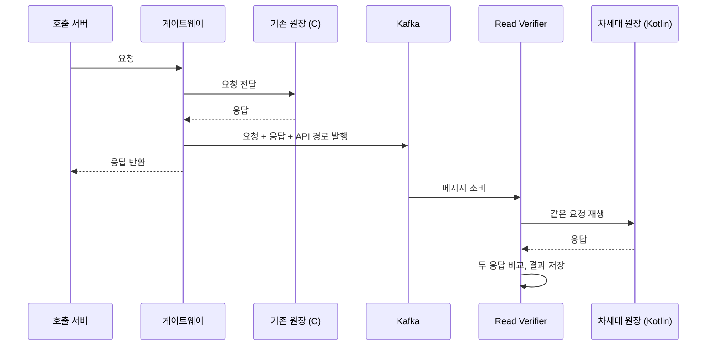

| | |
| --- | --- |
| 발표 | SLASH 24, Server 트랙 |
| 연사 | 양승영 (토스증권 국내주식 원장팀 Server Developer), 박종수 (토스뱅크 Server Developer) |
| 자료 | [세션 페이지](https://toss.im/slash-24/sessions/3) · [발표 영상](https://www.youtube.com/watch?v=D3p-V5Sr7gk) |

두 회사가 반씩 나눠 발표한 세션이다. 앞 절반은 토스증권의 국내 원장 차세대 프로젝트에서 운영 트래픽을 그대로 재생해 새 시스템을 검증한 "Verifier" 이야기이고, 뒤 절반은 토스뱅크가 대출 시스템의 10년 뒤 거래를 지금 검증하기 위해 시간을 옮기는 시뮬레이션 환경을 만든 이야기다. 이 글은 토스증권 쪽을 중심으로 정리하고, 토스뱅크 쪽은 대비되는 지점만 짚는다. 내용은 발표 영상과 자동 생성 자막을 근거로 했고, 표현은 내 말로 바꿨다.

## 문제: C 원장을 Kotlin MSA로 바꾸면서 무엇을 지킬 것인가

국내 원장 차세대 프로젝트는 C 기반 모놀리식 원장을 Kotlin 기반 MSA 원장으로 바꾸는 일이다. 언어가 바뀌니 패러다임과 개발 방식이 다 바뀌는데, 운영 중인 기존 원장과 자연스럽게 어울려야 했다. 세 가지를 지키기로 했다.

1. API 스펙 유지
2. DB 스키마 유지
3. 주요 비즈니스 로직 유지

이 셋을 지키면 기존 원장을 쓰던 서버들이 새 원장을 그대로 쓸 수 있고, 문제가 생기면 기존 원장으로 롤백할 수 있다. 대신 어려움도 따라온다. 기존 원장이 계속 운영되며 새 요구사항에 맞춰 바뀌므로, 그 변경을 매번 차세대 원장에도 옮겨야 한다. 테스트도 무거웠다. 기능마다 세세한 테스트 코드를 쓸 인력이 부족했고, 통합 테스트 한 번을 위해 맞춰야 하는 선행 조건이 많았다.

개발 사이클을 "기능 개발 → 테스트 환경 배포 → 테스트·검증·확인 → 버그 수정"의 반복으로 놓고, 어디에서 리소스를 아낄 수 있는지 봤다. 버그 수정은 사람이 해야 하고, 배포는 이미 자동화돼 있었다. 남은 것은 테스트와 검증·확인이었고, 여기를 자동화하기로 했다.

## Read Verifier: 조회 API는 운영 트래픽으로 검증한다

국내 원장은 모든 트래픽이 게이트웨이 서버를 거친다. 그래서 게이트웨이로 들어오고 나가는 요청과 응답만 보면 됐다.

게이트웨이가 응답을 내보내기 전에 요청·응답·API 경로 같은 부가 정보를 Kafka 메시지로 발행한다. Verifier는 그 메시지로 차세대 원장을 호출하고, 응답을 비교해 결과를 저장한다. DB를 바꾸지 않는 조회 API는 이것으로 검증이 끝난다. 비동기라 사용자 응답 시간에 영향이 없다.

Kafka를 두고 애플리케이션 레벨에서 직접 구현한 덕에 운영 환경용 제어도 붙일 수 있었다. 어드민 화면에서 API별 Verifier 사용 여부, 사용 시간, 트래픽 비율, 재시도 여부를 바꾸면 즉시 반영된다. API별 검증 결과는 주기적으로 리포트된다. 발표자는 이 과정이 테스트 환경과 운영 환경의 엣지 케이스를 찾아냈고, 차세대 원장을 운영에 올릴 때 "심리적으로도 실질적으로도" 안정감을 줬다고 했다.

## Write Verifier: 쓰기 API는 먼저 실행해 보고 롤백한다

Read Verifier가 유용하다 보니 DB를 바꾸는 API도 검증하고 싶어졌다. 이쪽은 아이디어 단계부터 쉽지 않았다고 한다. 최종 구조는 이렇다.

1. 게이트웨이가 요청을 기존 원장에 보내기 **전에** 가로채 차세대 원장으로 먼저 보낸다.
2. 차세대 원장은 요청을 처리하되 트랜잭션을 마치기 전에, 그 트랜잭션 안에서 실행된 DML을 모은다.
3. 모은 DML을 조회 쿼리로 바꿔 DB에서 "처리됐다면 어떤 결과일지"를 가져온다.
4. 그 결과와 조회 쿼리를 Redis에 저장하고 **트랜잭션을 롤백**한 뒤 게이트웨이에 응답한다.
5. 게이트웨이가 요청을 기존 원장에 보내 실제로 처리한다.
6. 게이트웨이가 Verifier에 검증을 요청하면, Verifier는 Redis의 조회 쿼리로 기존 원장이 실제로 남긴 결과를 DB에서 읽어 미리 저장해 둔 결과와 비교한다.

DML을 잡는 데는 p6spy를, 잡은 쿼리를 구문 분석해 DML만 골라 SELECT로 바꾸는 데는 ANTLR을 썼다. p6spy는 보통 쿼리 로깅용이지만 실행 시점에 실제 쿼리를 감지할 수 있어서 수집기로 쓴 것이다.

대안으로 DB를 하나 더 두고 각각 처리한 뒤 데이터를 비교하는 방법도 있었다. 테이블이 1,000개를 넘어서 기각했다. 별도 DB를 두면 스키마와 데이터를 준실시간으로 맞춰야 하고, 테스트 중 데이터가 틀어지면 다시 맞춰야 한다. DB 하나에 롤백으로 가는 편이 오래 검증하기에 간편했다.

Write Verifier의 성격은 Read와 다르다. 기존 원장보다 먼저 처리해야 하므로 **동기**이고, 사용자에게 영향을 주지 않으려고 **개발 환경에서만** 썼다. 대상 프로젝트 코드에 손대지 않도록 라이브러리로 만들어 붙였다. 검증 결과는 실시간으로 리포트돼서, 테스트 뒤 갱신된 테이블의 컬럼을 하나씩 눈으로 확인하는 시간이 사라졌고 사람보다 정확했다.

## 대비: 토스뱅크는 시간을 옮긴다

뒤 절반은 대체가 아니라 완전히 새로운 시스템을 어떻게 검증하느냐다. 대출은 최대 10년짜리 약정이고, 기준금리 변경 같은 이벤트가 고객이 고른 주기에 맞춰 10년 동안 정확히 반영돼야 한다. 종단간 테스트는 몇 달짜리 거래를 기다릴 수 없고, 데이터를 조작해 날짜를 앞당기면 오류가 조작 때문인지 로직 때문인지 가리기 어렵다.

해법은 모놀리식 구조를 이용해 시뮬레이션 환경을 만든 것이다. 대출 시스템과 에이전트를 한 Kubernetes 파드에 두고, 시뮬레이션마다 프로시저로 독립 DB를 3분 안에 복제하며, 프레임워크의 시간 함수가 실제 시각 대신 Redis에 저장된 시뮬레이션 시각을 읽도록 바꿨다. 실시간 거래와 배치 거래를 시간을 옮겨 가며 순서대로 실행하고, SELECT로 상태를 검증한다. 프로젝트 이름은 시간대를 옮긴다는 뜻의 "앞으로"이고, 출시 뒤에는 회귀 테스트로 반복 실행한다.

두 발표를 나란히 놓으면 검증의 축이 다르다. 토스증권은 **공간**을 복제했다. 같은 요청을 두 시스템에 넣고 결과를 비교한다. 토스뱅크는 **시간**을 복제했다. 같은 시스템을 미래 시각으로 돌려 상태를 검증한다. 전자는 비교 대상(레거시)이 있을 때, 후자는 없을 때의 답이다.

## 리뷰

**레거시가 곧 오라클이다.** 새 시스템이 맞는지를 판정하는 기준이 명세 문서가 아니라 운영 중인 기존 시스템의 실제 응답이다. 명세는 낡거나 빠지지만 운영 트래픽은 지금 고객이 실제로 보내는 요청이고, 엣지 케이스는 거기에 다 들어 있다. API 스펙과 DB 스키마를 유지하기로 한 첫 결정이 이 검증 방식을 가능하게 했다. 스펙을 바꿨다면 응답을 1:1로 비교할 수 없었을 것이다.

**쓰기 검증을 "실행 후 롤백 + DML을 SELECT로 변환"으로 푼 것이 이 발표의 핵심 기술이다.** 데이터베이스를 두 벌 두는 것은 누구나 떠올리지만 1,000개 테이블에서는 동기화 자체가 프로젝트가 된다. 대신 새 원장이 "하려던 일"을 쿼리 수준에서 포착해, 기존 원장이 "실제로 한 일"과 같은 쿼리로 비교한다. 비교 단위를 응답 본문이 아니라 DB 상태로 내린 것이다.

**운영 환경 제어를 처음부터 넣었다.** API별 비율·시간·재시도를 어드민에서 즉시 바꿀 수 있어야 운영 트래픽에 붙일 수 있다. 검증 도구가 서비스에 부하를 주는 순간 아무도 켜지 않는다.

## 남는 질문

- Read Verifier는 응답을 비교하는데, 응답에 시각·시퀀스·랜덤 값처럼 두 시스템이 다를 수밖에 없는 필드가 있으면 어떻게 걸렀는가. 비교 규칙을 API별로 관리했는지가 궁금하다.
- Write Verifier는 차세대 원장이 먼저 실행하고 롤백한 뒤 기존 원장이 실행한다. 그 사이에 같은 계좌를 건드리는 다른 요청이 끼어들면 미리 계산한 결과와 실제 결과가 정당하게 달라질 수 있다. 개발 환경 한정이라 빈도는 낮겠지만, 그런 불일치를 오탐으로 분류하는 기준이 있었는지.
- DML을 SELECT로 바꾸는 변환은 INSERT·UPDATE·DELETE마다 규칙이 다르고, 서브쿼리나 벌크 연산에서는 단순 변환이 안 된다. 어디까지 자동 변환했고 어디부터 사람이 봤는지.
- 검증이 끝난 뒤 실제 전환은 어떻게 했는가. API 단위로 트래픽을 옮겼는지, 한 번에 옮겼는지, Read Verifier의 트래픽 비율 제어가 전환 도구로도 쓰였는지.

## 참고

- [세션 페이지](https://toss.im/slash-24/sessions/3)
- [발표 영상](https://www.youtube.com/watch?v=D3p-V5Sr7gk)
- 같은 원장 시스템의 다른 면: [토스증권 시세·주문 아키텍처 리뷰](/posts/toss-securities-market-data-and-order-architecture/)
