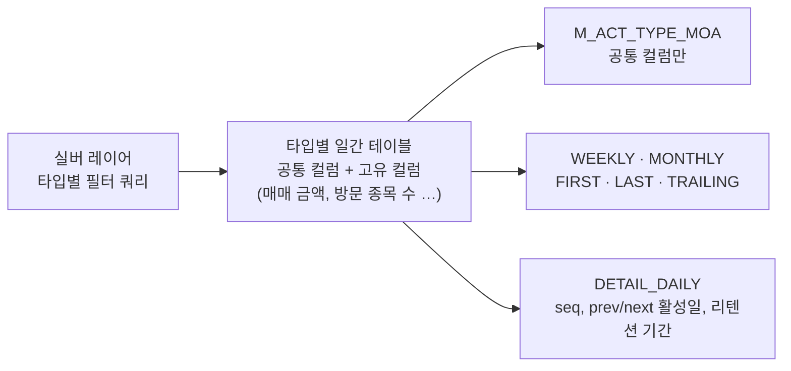

| | |
| --- | --- |
| 발표 | SLASH 24, Data 트랙 |
| 연사 | 이준호 (토스증권 Data Warehouse Team Leader) |
| 자료 | [세션 페이지](https://toss.im/slash-24/sessions/8) · [발표 영상](https://www.youtube.com/watch?v=MWDVBZycou4) |

"1월 한 달 주식을 매매한 사용자 수", "30일 이탈했다 돌아온 사용자", "증권 방문 → 종목 상세 → 거래의 일간 퍼널" 같은 질문에 다섯 줄짜리 SQL로 답하기 위해 DW를 어떻게 설계했는지에 대한 발표다. 핵심은 "액트 타입(act type)"이라는 코드 하나를 정의하면 일간·주간·월간·최초·최종·트레일링 테이블 열 개가 자동으로 만들어지는 활성 유저(AU) 모델이고, 그 모델을 한 번 뜯어고친 이유와 결과가 함께 나온다. 내용은 발표 영상과 자동 생성 자막을 근거로 했고, 표현은 내 말로 바꿨다.

## 문제: 질문은 유형화되는데 전처리는 매번 한다

의사결정자가 월간 체결 주문 건수를 보려면 주문 테이블과 체결 테이블을 찾고, 필터링도 복잡하다. 분석 전에 데이터를 찾고 전처리하는 과정이 늘 지지부진하다. 그런데 자주 들어오는 질문은 몇 가지로 유형화된다. 사용자가 언제 방문했는가를 일·주·월 단위로, 신규·이탈·복귀가 몇 명인가, 복귀했다면 며칠 만인가, 이탈했다면 마지막 이용 기준 얼마나 지났는가. DW 담당자나 분석가라면 공감할 목록이다. 이 전처리를 미리 해 두자는 것이 출발점이다.

## 액트 타입: 지표를 코드로 정의하고 테이블을 찍어 낸다

토스증권은 특정 지표를 **액트 타입** 코드로 지정하고, 그 코드에 대해 여러 관점에서 측정한 테이블을 미리 만드는 파이프라인을 둔다. 100개가 넘는 타입이 정의돼 있고, 디멘션 테이블에 코드와 설명이 관리된다. 예를 들어 `STK_*`는 국내·해외 매매 유저 통합, `STK_*_KR`은 국내 주식 매매 유저 같은 식이다.

액트 타입을 정의하면 그 서비스에서 활성화된 레코드를 원본에서 거르는 쿼리를 하나 쓴다. 방문자 로그 테이블에서 앱 방문만 걸러내는 식이고, 이것이 타입마다 하나씩 있다. 그 결과를 한 통(`AU_LIST`)에 모으면 일간 유저 기준 집계가 되고, 거기서 주간·월간, 타입별 최초 활성화 레코드(`FIRST`), 최종 활성화 레코드(`LAST`), 최근 1·7·30일 유니크 유저(트레일링)를 만든다. 액트 타입만 정의하면 일·주·월 단위 질문에 바로 답할 수 있게 되는 것이다.

## 첫 모델이 풀지 못한 세 가지

1. **네이밍 컨벤션이 없었다.** `AU_LIST`가 있는데 데일리라는 표시가 없고, 주간·월간 테이블이 있는지 `AU_LIST`만 쓰는 사람은 몰랐다. 주간과 월간 테이블의 컬럼 컨벤션과 담긴 정보도 서로 달랐다.
2. **타입별 고유 지표를 담지 못했다.** 모든 타입을 한 통에 넣다 보니 공통 지표만 남았다. 활성화됐는가, 몇 번 했는가 정도다. 증권의 거래 액트 타입이라면 일·주·월 매매 금액이 궁금한데 담을 곳이 없었다.
3. **복귀·이탈을 집계할 정보가 없었다.** 자주 묻는 지표인데 그때마다 별도 테이블을 만들어야 했고 관리가 점점 어려워졌다.

## 두 번째 모델

### 이름에 모델·주제·집계 키·기간을 넣는다

테이블 이름을 네 영역으로 고정했다.

| 영역 | 뜻 | 예 |
| --- | --- | --- |
| 모델 | `F`(fact), `D`(dimension), `M_`(여러 주제를 한 통에 담은 모음 테이블) | `F`, `M_` |
| 주제 | 서비스 또는 주제 영역 | `STK_LOG`, `ACT_TYPE_MOA`(모든 액트 타입의 모음) |
| 집계 키 | 어떤 컬럼 기준으로 집계했는가 | `UKEY`(유저 키) |
| 기간 | 집계 기간 접미사 | `DAILY`, `WEEKLY`, `MONTHLY`, `FIRST`, `LAST`, `TRAILING_7`, `TRAILING_30` |

트레일링 1·7·30을 한 테이블에 넣던 것을 접미사로 분리했다. `M_` 접두사는 토스증권만 쓰는 표기인데, 하나의 주제가 아니라 여러 주제를 한 통에 담은 "모음(MOA)" 테이블임을 이름에서 알게 하려는 것이다.

### 실버 레이어를 버리지 않고 타입별 일간 테이블로 남긴다

기존에는 실버 레이어에서 만든 결과를 `AU_LIST`에 넣고 버렸다. 새 모델은 그 결과를 **액트 타입별 일간 테이블**로 남긴다. 여기에는 공통 컬럼과 함께 타입별로 특수하게 집계해야 하는 컬럼이 들어간다. `STK_LOG`라면 어떤 종목 코드를, 몇 개의 종목을 방문했는지까지 담긴다. 마지막에 모음 테이블(`M_ACT_TYPE_MOA`)로 합칠 때는 예전처럼 공통 컬럼만 담는다. 매매 금액 같은 질문은 타입별 테이블에서, "모든 타입을 가로지르는" 질문은 모음 테이블에서 답한다.

### DETAIL_DAILY: 한 테이블로 신규·복귀·이탈을 다 푼다

이탈·복귀를 위해 유저 키 기준의 `DETAIL_DAILY` 테이블을 만든다. 구성은 이렇다.

| 컬럼 | 뜻 |
| --- | --- |
| `seq_no` | 그 액트 타입에 활성화된 순번. 1일·3일·4일에 활성화됐다면 1, 2, 3 |
| `prev_activation_date` | 직전 활성화 일자. 첫 레코드는 없음 |
| `retention_period` | 직전과의 간격 |
| `next_activation_date` | 다음 활성화 일자 |
| `churn_period` | 다음까지의 간격 |
| `is_last` | 이 사용자의 마지막 레코드인가 |

이 테이블 하나로 신규 유저는 `seq_no = 1`, 마지막 활성 유저는 `is_last = 1`, 30일 이탈 후 복귀는 `retention_period >= 30`, 30일 이상 이탈은 `churn_period >= 30`으로 구한다. 발표자가 강조한 지점은 이탈 기간의 정의가 액트 타입마다, 분석 주제마다 다르다는 것이다. 예전에는 기간이 바뀔 때마다 테이블을 새로 만들었는데 이제는 숫자만 바꾸면 된다.

## 운영: 재활용, 병렬도, 백필

**코드 재활용.** 타입별 고유 컬럼을 집계해야 하는데 타입마다 코드를 쓰지 않고, 일간 테이블 생성 PySpark 하나에 모든 경우를 처리하는 집계 로직을 집약했다. 파일 다섯 개로 액트 타입 하나당 테이블 열 개가 만들어지고, 그 다섯 개가 모든 타입을 커버한다.

**병렬도.** 배치 툴은 Airflow이고 Spark operator를 부를 때 타입별 설정값을 같이 넘긴다. Airflow의 priority weight로 오래 걸리는 태스크를 먼저 돌린다. 긴 태스크가 마지막에 걸리면 리드 타임을 다 잡아먹으니, 큰 것부터 돌리고 빈 슬롯에 작은 것이 들어가게 하는 것이다. Spark의 executor 메모리와 shuffle partition도 타입마다 다르게 줘서 무거운 타입에 넉넉히 배정한다. 의존성도 줄였다. 종목 상세 방문은 통합·국내·해외 세 가지로 집계하는데, 실버 테이블을 만들 때 국가 코드를 같이 넣어 두면 그 테이블 하나에서 세 개를 다 만든다.

**백필.** 집계의 절반은 RDBMS 데이터지만 절반은 앱 로그다. 로그는 프론트엔드 코드가 바뀐 것을 늦게 알면 짧게는 이틀, 길게는 두세 달치를 백필해야 한다. Airflow Variable로 제어하도록 만들었다. 타입 선택 모드(`include`/`exclude`)와 타입 목록으로 어느 타입을 돌릴지, 타깃 스텝으로 열 개 테이블 중 어느 것만 다시 만들지, 시작·종료일과 분할 단위(예: 30일)로 기간을 잘라서 돌린다. 두세 달치를 한 번에 돌리면 메모리가 터지므로 잘라야 하고, 일간은 30일씩, 주간은 4주씩, 월간은 한 달씩 겹치지 않고 빠짐없이 잘린다.

## 활용: 접미사와 코드만 바꾼다

1월 한 달 주식 매매 기록은 `F_STK_LOG_UKEY_DAILY`에 날짜 조건만 걸면 다섯 줄이다. 커뮤니티 글 작성 기록은 도메인이 완전히 다른데도 코드를 `COM_*`로 바꾸기만 하면 된다. 일간 유저 수는 `_DAILY`, 월간은 `_MONTHLY`로 접미사만 바꾼다. 모음 테이블에서는 액트 타입 코드만 바꾸면 같은 결과가 나온다. 매매 금액이 필요하면 타입별 테이블에, 신규 매매 유저는 `DETAIL_DAILY`에 `seq_no = 1`, 복귀는 `retention_period`.

증권 방문 → 종목 상세 방문 → 거래의 메인 퍼널은 예전엔 긴 쿼리와 많은 조인이 필요했는데, 모음 테이블에서 액트 타입 세 개를 찍어 각각 집계하면 열 줄 안팎이다. 월간으로 보려면 `_MONTHLY`, 트레일링은 `_TRAILING_*`로 바꾸면 끝이다.

결과로 분석 속도가 빨라졌고 애드혹 테이블이 많이 줄었으며, 토스증권 밖 토스 커뮤니티에서도 쓰고 있다. 남은 과제였던 "신규 액트 타입을 쉽게 추가하는 어드민"은 발표 준비 중 만들어져, 디멘션 레코드 삽입과 타입별 고유 컬럼 설정과 최초 테이블 생성 쿼리를 한 화면에서 입력한다. 테이블이 정형화되어 있으니 text-to-SQL LLM이 잘 될 것이라는 가정으로 내부 프로젝트가 진행 중이라고 했다.

## 리뷰

**지표를 코드로 만들면 테이블은 파생물이 된다.** 액트 타입은 "이 지표는 무엇인가"를 한 번만 정의하고, 기간·순번·간격 같은 관점은 파이프라인이 기계적으로 붙인다. 분석가는 테이블 이름의 접미사만 바꾸면 되고, DW 팀은 새 타입을 어드민에 한 줄 넣으면 된다. 첫 모델도 이 방향이었지만 "공통만 담는다"는 제약 때문에 절반만 성공했고, 두 번째 모델은 타입별 테이블을 남겨 그 제약을 풀었다.

**DETAIL_DAILY가 이 발표에서 가장 재사용성이 높은 부분이다.** 활성화 시퀀스에 이전·다음 일자와 간격을 붙여 두면 신규·복귀·이탈·리텐션이 전부 WHERE 절 하나가 된다. 윈도우 함수(`LAG`, `LEAD`, `ROW_NUMBER`)를 매번 쓰는 대신 한 번 물리화한 것이다.

**백필을 설계의 일부로 다뤘다.** 로그 기반 지표는 원천이 바뀌면 다시 계산해야 하고, 그 작업이 고통스러우면 결국 안 하게 된다. 타입·스텝·기간을 잘라 돌릴 수 있게 만든 것은 운영을 겪어 본 사람의 설계다.

## 남는 질문

- 액트 타입이 100개를 넘고 타입마다 테이블 열 개면 1,000개 안팎의 테이블이다. 이름 규칙이 있어도 발견 가능성은 별개 문제인데, 카탈로그나 검색을 어떻게 두는지.
- 액트 타입의 정의(실버 쿼리)가 바뀌면 과거 집계와 의미가 달라진다. 정의 변경의 버전 관리와, 변경 시 어디까지 백필하는지의 규칙이 있는지.
- 모음 테이블과 타입별 테이블은 같은 원천에서 갈라지므로 공통 컬럼의 수치가 같아야 한다. 두 경로가 어긋나는 것을 검사하는 장치가 있는지.
- 이탈 기간을 숫자 하나로 바꾸는 것은 편하지만 조직에서 "이탈"의 표준 정의를 잃을 수도 있다. 표준값을 어디에 두는지.

## 참고

- [세션 페이지](https://toss.im/slash-24/sessions/8)
- [발표 영상](https://www.youtube.com/watch?v=MWDVBZycou4)
