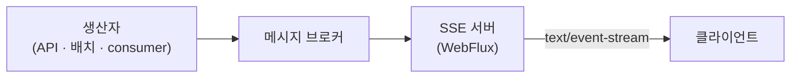

| | |
| --- | --- |
| 발표 | SLASH 24, Server 트랙 |
| 연사 | 전연빈 (토스증권 Server Platform Team Leader) |
| 자료 | [세션 페이지](https://toss.im/slash-24/sessions/12) · [발표 영상](https://www.youtube.com/watch?v=ovGgdPPUZ2I) |

보유 자산 화면이 3초마다 폴링하던 것을 서버 푸시로 바꾼 이야기다. 짧은 발표인데 안에 세 가지가 들어 있다. WebSocket과 SSE를 어떤 기준으로 나눠 쓰는가, 클라이언트로 메시지를 보내는 방식(브로드캐스트·유니캐스트)을 어떻게 구현했는가, 그리고 서버 쪽 메시지 브로커를 Kafka → Redis Pub/Sub → NATS로 왜 옮겼는가. 내용은 발표 영상과 자동 생성 자막을 근거로 했고, 표현은 내 말로 바꿨다.

## 문제: 3초 폴링이 데이터 소스를 밀어낸다

보유 자산 화면은 준실시간을 위해 3초마다 aggregation API를 폴링했다. 사용자가 늘면서 CPU 사용률이 SLA로 잡아 둔 50%를 넘겼다. 폴링은 서빙 레이어에서 끝나지 않는다. 그 뒤의 Redis, Oracle, MySQL까지 3초마다 두드리므로 데이터 소스 부하가 같이 올라갔다.

핵심 관찰은 이것이다. **보유 자산은 3초마다 바뀌지 않는다.** 바뀌는 순간은 주문이 체결되거나 재조회가 필요한 이벤트가 발행될 때뿐이다. 그러니 그 이벤트가 났을 때만 클라이언트가 API를 부르면 된다. 중간에 푸시 레이어를 두어 "지금 다시 조회하라"는 신호만 보내기로 했다.

## WebSocket과 SSE를 나누는 기준

| | WebSocket | SSE |
| --- | --- | --- |
| 방향 | 양방향 | 서버 → 클라이언트 |
| 프로토콜 | 별도 | HTTP, `text/event-stream` |
| 재연결 | 직접 구현 | 브라우저가 자동 재연결 |
| 토스증권 용도 | 시세. 화면을 옮길 때마다 종목을 구독·해지해야 하므로 양방향이 필요 | 폴링 제거, 개인화 데이터 이벤트 푸시 |

SSE는 클라이언트가 HTTP 요청을 하나 열고 서버가 `text/event-stream`으로 응답하면 그 커넥션 하나가 데이터 파이프라인이 되는 구조다. 이후 서버는 데이터가 생길 때마다 그 커넥션으로 내려보낸다.

## 클라이언트로 보내는 두 방식

### 브로드캐스트: 채널 하나, 모두에게

브로커에서 받은 메시지를 연결된 모든 클라이언트에 그대로 팬아웃한다. WebFlux로 구현했고 코드가 짧다. 브로드캐스트 채널을 하나 만들고, 서버가 뜨자마자 브로커를 구독해서, 받은 메시지를 SSE 메시지로 바꿔 채널에 흘리면 끝이다.

실제로 쓴 곳은 FOMC 발표 때 열었던 단일 채팅방이다. 영상을 서빙한 것이 아니라 실시간 의견을 나누는 방이었고, 빠르게 만들어야 해서 브로드캐스트로 갔다. 클라이언트가 API 서버로 메시지를 보내면 API 서버가 브로커에 넣고, SSE 서버가 받아 모두에게 뿌린다.

### 유니캐스트: 사용자마다 채널 하나

개인화된 데이터는 브로드캐스트로 안 된다. SSE 서버가 사용자별 단독 채널을 만들고, 클라이언트는 자기 채널만 구독한다. 연결이 맺어지면 개인용 데이터 스트림을 주입받아 SSE 메시지로 내려보낸다.

개인용 스트림은 이렇게 만든다. Flux 스트림을 하나 만들고 본인 메시지만 거르는 리스너를 발급한다. 클라이언트가 연결됐으니 브로커에 "이 사용자 메시지를 받겠다"고 구독을 요청한다. 연결이 끊기면 브로커에 구독 취소를 요청한다. 연결의 생명주기와 브로커 구독의 생명주기를 같게 묶은 것이다.

이것을 보유 자산 폴링에 적용했다. 주문 API가 원본인 Oracle을 바꾸고, 체결·재조회 이벤트가 나면 읽기 저장소인 Redis·MySQL이 갱신된다. 그 이벤트를 SSE 서버가 사용자 채널로 흘리고, 클라이언트는 그때만 보유 종목 API를 부른다. 3초 폴링을 없앤 결과 약 30%의 성능 개선을 확인했다.

## 접속자 판별에 세션 테이블을 만들지 않았다

두 번째 사례는 종목 최고가 알림이다. 메시지 플랫폼 팀에서 FCM 푸시가 용량을 넘고 있다는 연락이 왔다. 알림은 모두 FCM 푸시 서버를 거쳐 FCM으로 나가고 있었는데, 앱을 열고 있는 사용자에게까지 FCM을 쓸 이유가 없다. 접속 중이면 SSE로, 미접속이면 FCM으로 나누기로 했다.

문제는 "지금 접속 중인가"를 어떻게 아느냐다. 세션 테이블을 따로 두지 않고 **Redis Pub/Sub의 구독자 수**로 풀었다. SSE 서버는 클라이언트가 연결되면 그 사용자 채널을 `SUBSCRIBE`한다. FCM 푸시 서버는 아무것도 묻지 않고 그 채널에 `PUBLISH`한다. Redis는 publish 결과로 구독자 수를 돌려주므로, 1 이상이면 접속 중이라 SSE로 나간 것이고 0이면 미접속이라 FCM으로 보낸다. 실제로 알림의 약 10%가 SSE로 나갔다.

## 브로커를 세 번 골랐다

| 브로커 | 어떻게 쓰이는가 | 평가 |
| --- | --- | --- |
| Kafka | SSE 서버마다 group id를 따로 줘서 모든 메시지를 받고, 연결된 사용자 것만 내려보낸다 | 된다. 그러나 접속·미접속 사용자의 메시지가 전부 모든 SSE 서버로 오므로 불필요한 네트워크 I/O와 필터링이 생긴다. at-least-once가 SSE와 안 맞는다고 판단 |
| Redis Pub/Sub | SSE 서버가 연결된 사용자 채널만 구독. 발행자는 채널에만 publish | 구독한 것만 온다. at-most-once. 부하 테스트에서 약 60K 처리량 |
| NATS | 같은 pub/sub 모델. Go 기반, 키-값이 아니라 pub/sub 전용 | Redis Pub/Sub 대비 약 5배 처리량. 최종 선택 |

Kafka를 뺀 이유가 흥미롭다. 보통은 유실 없음이 장점인데, 여기서는 그 성질이 오히려 비용이다. 접속하지 않은 사용자의 메시지까지 SSE 서버가 받아서 버려야 하기 때문이다. 푸시 신호는 놓쳐도 다음 이벤트가 오거나 사용자가 화면을 열면 어차피 조회하므로, at-most-once로 충분하다.

NATS 클러스터에서 부하 분산이 어떻게 되는지도 설명했다. 클라이언트가 NATS 2번 노드에 subject `MSG`로 publish하면, 2번 노드는 클러스터 포트로 1번 노드에 전달하고, 1번 노드가 그 subject의 구독자에게 보낸다. 2번 노드가 1번에 구독자가 있다는 것을 아는 이유는 각 노드가 두 장부를 갖기 때문이다. 자기가 라우팅할 장부와 다른 서버로 라우팅할 장부. 이 장부는 구독·해지 시점에 `RS+`/`RS-` 명령이 클러스터 포트로 모든 노드에 팬아웃되며 갱신된다.

## 트러블슈팅: 2×N초에 끊기는 연결

WebSocket이나 SSE는 클라이언트가 언제 끊겼는지 서버가 정확히 모르므로 heartbeat로 좀비 커넥션을 확인해야 한다. 그런데 HTTP 로그를 보니 연결이 2초, 4초, 6초처럼 **2×N초**에 끊기고 있었다. 사용자 패턴이 제각각인데 끊기는 시각이 규칙적이면 인프라를 의심해야 한다.

Kubernetes 클러스터와 L7 HTTP 프록시 사이를 TCP 덤프로 봤다. heartbeat를 보낸 직후 L7 프록시가 RST를 돌려주고 있었다. RST 자체는 현실에서 흔하지만, FIN 없이 heartbeat 뒤에 계속 RST가 오는 것은 이상하다. L7 장비 쪽 이슈였고, TCP 프록시 모드로 바꾸고 FIN이 업스트림까지 올라오게 하자 정상적으로 닫혔다. 발표자는 이것이 토스증권 환경에만 있는 문제일 수 있지만, SSE를 도입한다면 커넥션이 정상적으로 닫히는지 볼 수 있는 모니터링이 필요하다고 정리했다.

## 리뷰

**푸시로 데이터를 보내지 않고 "다시 조회하라"는 신호만 보낸다.** 보유 자산 자체를 푸시하면 SSE 서버가 자산 계산 로직과 데이터 소스를 알아야 하고, 정확성 책임까지 진다. 신호만 보내면 정확한 값은 기존 API가 책임지고 SSE 서버는 얇게 남는다. 2022년 실시간 시세 발표에서 사용자 자산 갱신을 같은 방식으로 풀었던 것([시세·주문 아키텍처 리뷰](/posts/toss-securities-market-data-and-order-architecture/))과 같은 원칙이다.

**at-most-once가 맞는 자리를 정확히 골랐다.** Kafka가 최선인 곳과 아닌 곳을 데이터의 성격으로 갈랐다. 푸시 신호는 잃어도 되고, 그래서 브로커를 처리량 기준으로 고를 수 있었다. 유실 허용 여부를 먼저 정하고 도구를 고르는 습관이 여기서도 보인다.

**세션 저장소 대신 브로커의 부수 효과를 썼다.** publish의 반환값(구독자 수)으로 접속 여부를 판별한 것은 작지만 좋은 설계다. 세션 테이블은 만들면 갱신·만료·정합성 문제가 따라오는데, 구독 자체가 곧 세션이니 그 문제가 없다.

## 남는 질문

- SSE 서버가 여러 대일 때 사용자 채널 구독은 그 사용자가 붙은 서버에서만 이뤄지므로, NATS의 라우팅 장부가 곧 "누가 어디 붙어 있는가"가 된다. 서버가 죽으면 그 구독은 사라지고 클라이언트가 재연결하며 다시 구독할 텐데, 재연결 사이에 발행된 신호는 잃는다. 재연결 직후 한 번 강제 조회하는 규칙이 클라이언트에 있는지.
- 30% 개선의 분모가 무엇인지. 서빙 레이어 CPU인지, 데이터 소스 QPS인지, 폴링 요청 수인지에 따라 뜻이 다르다.
- FCM 대체는 접속자 10%에 대한 것인데, 나머지 90%의 FCM 용량 문제는 다른 방법으로 풀었는지.
- 2×N초 RST는 heartbeat 간격이 2초였다는 뜻으로 읽힌다. 프록시 idle timeout과 heartbeat 간격의 관계를 어떻게 잡았는지.

## 참고

- [세션 페이지](https://toss.im/slash-24/sessions/12)
- [발표 영상](https://www.youtube.com/watch?v=ovGgdPPUZ2I)
- 같은 연사의 CQRS 답변: [토스증권 서버 개발자가 많이 듣는 질문 4가지](https://toss.im/career/article/secu_server-chapter-2) · [리뷰](/posts/toss-securities-cqrs-validator-vs-parity-pay/)
