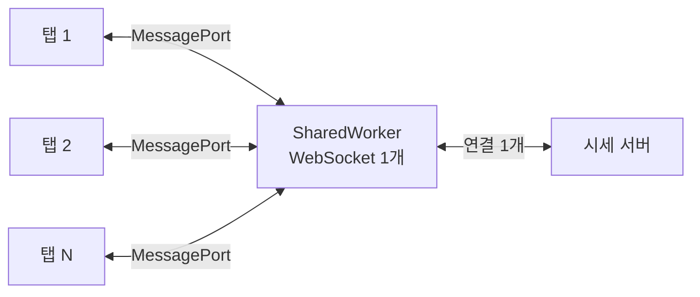

| | |
| --- | --- |
| 발표 | SLASH 24, Frontend 트랙 |
| 연사 | 박건영 (토스증권 Frontend Developer) |
| 자료 | [세션 페이지](https://toss.im/slash-24/sessions/13) · [발표 영상](https://www.youtube.com/watch?v=SVt1-Opp3Wo) |

토스증권 PC가 나오면서 생긴 문제 하나를 끝까지 따라간 발표다. 모바일 앱에서는 사용자당 프론트엔드가 하나만 열리므로 전역 변수에 WebSocket 하나를 두면 됐다. PC에서는 탭을 여러 개 열어 두는 것이 보통이고, 탭마다 WebSocket이 생기니 사용자당 연결 수가 2배, 3배로 늘어난다. 서버를 증설하는 대신 프론트엔드에서 연결 수 자체를 줄이는 방법을 찾았고, 답은 SharedWorker였다. 내용은 발표 영상과 자동 생성 자막을 근거로 했고, 표현은 내 말로 바꿨다.

## 문제: 탭 수만큼 늘어나는 연결

토스증권은 종목별 현재가와 등락률을 WebSocket으로 받아 화면에 그린다. 브라우저에서 각 탭은 다른 스레드에서 돌고 변수를 공유하지 못하므로, 탭을 열 때마다 WebSocket 객체가 새로 생기고 서버 연결도 그만큼 생긴다. 모든 사용자를 놓고 보면 사용자당 연결이 사용 패턴에 따라 몇 배로 불어나고, 서버는 그 트래픽을 받기 위해 인프라를 늘리고 구조를 바꿔야 한다.

먼저 떠올린 두 방법은 기각됐다.

| 방법 | 왜 안 되는가 |
| --- | --- |
| 포커스된 탭만 연결하고 나머지는 끊는다 | 화면에 떠 있지만 포커스가 없는 탭은 실시간 데이터가 멈춰 보인다. 창을 좌우로 배열해 쓰는 사용자 경험을 해친다 |
| `visibilitychange`로 보이는 탭만 연결한다 | 최소화된 탭은 걸러지지만, 동시에 보이는 탭 수만큼 연결은 여전히 생긴다. 줄이긴 해도 근본 해결이 아니다 |

상황에 맞게 끊기가 어렵다면 **연결의 개수 자체를 줄여야** 한다. 탭마다 WebSocket을 하나씩 만드는 대신 하나를 여러 탭이 공유하려면, WebSocket 객체를 탭 바깥에 둘 곳이 필요하다.

## Web Worker: Dedicated와 Shared

탭의 JavaScript는 한 스레드에서 돌지만 Web Worker API로 추가 스레드를 만들 수 있다. 두 종류가 있다.

**Dedicated Worker**는 그 탭 전용의 추가 스레드다. `new Worker('worker.js')`로 만들고, 메인 스레드와 워커 스레드는 서로의 변수를 볼 수 없으므로 `postMessage`와 `message` 이벤트로 데이터를 주고받는다. 다른 탭에서 또 만들면 그 탭의 워커 스레드가 따로 생긴다. 연산을 분산해 성능을 올리는 데 쓰지, 연결 수 문제와는 관련이 없다.

**SharedWorker**는 워커 스레드를 **여러 탭이 공유**한다. `new SharedWorker('worker.js')`를 다른 탭에서 또 호출해도 새 스레드가 생기지 않고 기존 스레드에 붙는다. 조건은 둘이다. 같은 origin이어야 하고, 워커가 불러오는 JavaScript 파일 경로가 같아야 한다. 하나라도 다르면 별도 SharedWorker가 생긴다.

통신 인터페이스가 조금 다르다. SharedWorker는 MessageChannel을 쓴다. 두 스레드 사이의 다리이고 양 끝에 MessagePort가 하나씩 있다. 탭에서 SharedWorker를 만들면 워커 스레드에 `connect` 이벤트가 오고, 그 이벤트의 `ports` 필드에 그 탭과 연결된 MessagePort가 들어 있다. 나중에 탭에 데이터를 보내려면 이 포트가 필요하므로 배열에 보관한다. 탭 → 워커는 탭 쪽 포트의 `postMessage`, 워커 → 모든 탭은 보관한 포트 배열을 순회하며 `postMessage`다.

Worker 안에서 브라우저의 모든 기능을 쓸 수 있는 것은 아니지만, **WebSocket은 SharedWorker에서 쓸 수 있다.**

## 구조: 브라우저당 WebSocket 하나

WebSocket을 SharedWorker에 올리면 탭이 몇 개든 WebSocket 객체는 하나이고, 서버 연결은 브라우저당 하나가 된다. 서버에서 오는 데이터는 워커의 WebSocket이 먼저 받아 각 탭에 다시 전달하고, 탭에서 서버로 보낼 데이터는 탭 → 워커 → WebSocket 순으로 나간다.

남은 고려는 브라우저 지원이다. Safari는 비교적 최근까지 SharedWorker를 지원하지 않았고 일부 모바일 브라우저도 지원하지 않는다. 그렇다고 WebSocket 로직을 하나 더 만들지는 않았다. 지원하지 않는 브라우저에서는 **Dedicated Worker를 폴백**으로 쓴다. 탭당 WebSocket이 하나씩 생기긴 하지만 거의 모든 브라우저가 지원하고 SharedWorker와 비슷한 환경이라 같은 WebSocket 로직을 재활용할 수 있다. 사용량 기준으로 보면 대부분의 브라우저가 SharedWorker를 지원하고, 토스증권 PC는 데스크톱·노트북 사용자를 겨냥하므로 충분히 많은 사용자에게 적용된다고 판단했다.

## 구현에서 걸린 두 가지

### 번들러가 파일 이름을 바꾼다

`new SharedWorker(경로)`의 경로는 로컬 파일 경로가 아니라 **실제 서버에서의 JavaScript 파일 경로**여야 한다. 그런데 webpack 같은 번들러는 빌드하면서 파일을 합치고 이름을 바꾼다. 물음표 자리에 무엇을 넣어야 하는가. 다행히 번들러들이 Web Worker를 위한 방법을 제공한다. webpack은 생성자에 `URL` 객체를 넣는 방식을 안내하고, 빌드 시 이를 인식해 실제 경로로 바꿔 준다.

### 닫힌 탭을 워커가 알 방법이 없다

탭이 닫히면 그 탭을 위해 워커가 들고 있던 이벤트 핸들러 같은 리소스를 정리해야 메모리가 새지 않는다. 그런데 SharedWorker와 MessagePort는 **탭이 닫혔을 때의 이벤트를 제공하지 않는다.**

첫 번째 시도는 탭의 메인 스레드에서 `beforeunload`를 잡아 워커에 알리는 것이다. 이 이벤트는 상황에 따라 호출되지 않는다. 최소화된 탭을 닫으면 안 올 수 있다. 신뢰할 수 없으므로 누수가 남는다.

두 번째 방법이 이 발표의 기술적 백미다. MessagePort에는 특징이 하나 있다. 두 스레드를 잇는 포트 쌍 중 한쪽이 닫혀 쓸모가 없어지면 다른 쪽도 사용하지 않는 것으로 간주돼 **가비지 컬렉션될 수 있다.** 그러니 탭이 닫혀 워커 쪽 포트가 GC되는 순간을 잡으면 된다. 문제는 워커가 그 포트를 배열에 보관하고 있어서 브라우저가 "아직 쓰는 중"으로 보고 GC하지 않는다는 것이다.

여기서 `WeakRef`를 쓴다. `WeakRef`로 감싸면 WeakRef 자체를 들고 있어도 안쪽 객체는 사용 중으로 간주되지 않아 GC될 수 있다. `deref()`가 `undefined`를 돌려주면 안쪽 객체가 회수된 것이다. 포트를 WeakRef로 감싸 배열에 보관하고, 타이머로 주기적으로 `deref()`를 확인하면 어떤 탭이 닫혔는지 감지할 수 있다. 감지한 탭의 리소스를 해제해 누수를 막았다.

## 리뷰

**서버 문제를 프론트엔드에서 풀었다.** 연결 수가 늘면 보통 서버 증설이 답이고 프론트엔드는 기다린다. 발표자는 "서버가 해 주면 프론트엔드에는 가장 좋지만 서버 리소스가 필연적으로 더 든다"고 말하고 프론트엔드에서 연결 수를 줄이는 쪽으로 갔다. 연결 수를 탭당 1에서 브라우저당 1로 만든 것은 서버 입장에서 사용자 수가 PC 출시 전과 같아진다는 뜻이다.

**폴백을 "다른 구현"이 아니라 "다른 스레드 모델에 같은 구현"으로 했다.** SharedWorker 미지원 브라우저를 위해 WebSocket 로직을 두 벌 유지하면 유지보수가 곧 무너진다. Dedicated Worker가 SharedWorker와 실행 환경이 비슷하다는 점을 이용해 로직 하나로 두 모드를 돌렸다.

**플랫폼이 이벤트를 안 주면 GC를 이벤트로 쓴다.** 탭 종료 이벤트가 없다는 것은 명세의 빈틈인데, MessagePort의 GC 특성과 WeakRef를 조합해 우회했다. 명세 문서만 읽어서는 나오지 않고, 브라우저가 객체를 어떻게 다루는지 알아야 나오는 해법이다.

## 남는 질문

- 워커 안의 WebSocket이 끊겼을 때 재연결과 재구독은 누가 하는가. 각 탭이 구독한 종목 집합을 워커가 합집합으로 관리해야 하고, 재연결 뒤 그 집합을 다시 서버에 보내야 한다. 탭 하나가 구독을 해지해도 다른 탭이 같은 종목을 보고 있으면 서버에는 해지를 보내면 안 되는데, 이 참조 카운팅이 워커에 있는지.
- WeakRef 폴링 주기가 곧 리소스 회수 지연이다. 주기를 얼마로 잡았고, GC가 언제 돌지는 브라우저 몫이므로 "닫힌 뒤 최대 얼마 안에 정리된다"는 보장이 없는데 그 점은 받아들였는지.
- 같은 origin이지만 서로 다른 배포 버전의 탭(배포 직후 옛 탭과 새 탭)이 공존하면 워커 스크립트 경로가 달라 SharedWorker가 둘이 된다. 배포 시 연결이 잠시 2개가 되는 것을 허용했는지, 아니면 경로를 고정했는지.
- SharedWorker 도입 전후로 서버 측 연결 수가 실제로 얼마나 줄었는지는 발표에 숫자가 없었다.

## 참고

- [세션 페이지](https://toss.im/slash-24/sessions/13)
- [발표 영상](https://www.youtube.com/watch?v=SVt1-Opp3Wo)
- 서버 쪽 시세 WebSocket 구조: [토스증권 시세·주문 아키텍처 리뷰](/posts/toss-securities-market-data-and-order-architecture/)
