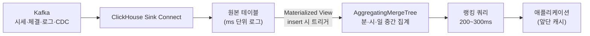

| | |
| --- | --- |
| 발표 | SLASH 24, Data 트랙 |
| 연사 | 정채문 (토스증권 Data Engineer) |
| 자료 | [세션 페이지](https://toss.im/slash-24/sessions/29) · [발표 영상](https://www.youtube.com/watch?v=8P2OL7cwFEU) |

거래대금·인기·급상승·업종 같은 랭킹이 1분마다 Airflow 배치로 갱신되던 구조를 ClickHouse 위의 실시간 쿼리로 바꾼 이야기다. 발표의 재미는 "ClickHouse를 썼다"가 아니라 랭킹 종류마다 다른 테이블 엔진을 고른 근거에 있다. Kafka 엔진을 써 보고 버린 이유, MaterializedMySQL을 테스트하고 보류한 이유도 나온다. 내용은 발표 영상과 자동 생성 자막을 근거로 했고, 표현은 내 말로 바꿨다.

## 문제: 1분 배치, 선형으로 늘어나는 Airflow 잡, 분석계와의 자원 경합

토스증권 랭킹은 실시간 차트의 거래 관련 랭킹, 인기·급상승·급락, ETF·채권, 그리고 토스가 분류한 업종 카테고리 랭킹까지 여럿이다. 잘 돌아가고 있었지만 세 가지 고민이 있었다.

1. **실시간성 요구가 분에서 초로 내려왔다.** 기존 갱신 주기는 1분이고, 랭킹 집계 자체가 평균 10초대였다. 분 단위에서 초 단위로 가기에는 구조상 여지가 없었다.
2. **비즈니스 로직이 늘수록 잡이 선형으로 는다.** 모든 랭킹을 Airflow 잡으로 미리 만들어 두는 구조라, 사용자가 고를 수 있는 옵션마다 잡이 하나씩 붙는다. 랭킹별로 개발하기도 운영하기도 어려운 상태였다.
3. **분석계 위에서 돌고 있었다.** 시세·체결·주식 데이터가 Kafka → Sink Connect → HDFS로 쌓이고 Impala가 쿼리해 데이터셋을 만든다. 같은 클러스터에서 거대한 DW 파이프라인과 분석가들의 무거운 애드혹 쿼리가 돌아서, 자원 경합이나 부족으로 랭킹 갱신이 지연되거나 실패하는 일이 종종 있었다.

그래서 랭킹에 필요한 데이터를 한곳에 모아 두고 **쿼리 기반으로 실시간 집계**하는 플랫폼을 만들기로 했다. OLAP 엔진을 조사해 ClickHouse를 골랐다. 오픈소스 분산 컬럼 지향 DB로 로그 수집·집계 성능이 좋고 운영 구조가 단순하다는 점 외에, 두 가지를 특히 봤다. 다양한 테이블 엔진으로 대량 데이터셋을 집계에 유리한 형태로 **미리** 준비할 수 있고, Materialized View로 실시간 파이프라인을 만들어 별도 추출 없이 데이터를 제공할 수 있다는 것이다.

## 실시간 입수: Kafka 엔진을 써 보고 Sink Connect로 갔다

랭킹에는 실시간 시세, 주식 체결, 클라이언트 로그, 그리고 CDC가 필요하다. 먼저 ClickHouse가 제공하는 **Kafka 엔진**을 테스트했다. 별도 Connect 없이 `ENGINE = Kafka`로 브로커 주소·토픽·consumer group만 지정하면 ClickHouse 안에 Kafka를 바로 읽는 큐 테이블이 생기고, 그 위에 Materialized View를 걸어 타깃 테이블로 insert를 트리거한다. 이 층에서 변환과 필터링도 된다. 대신 큐 테이블·MV·타깃까지 서너 개의 테이블 세트가 필요하다.

부하 테스트는 장비 5대 클러스터, 초당 약 70만 건이 들어오는 토픽으로 했다. 실제 쓰기가 일어나는 일부 노드에서 CPU가 올랐고, consumer lag은 장 시작 직후 생겼다가 한 시간 뒤 안정됐으며, 메모리는 바이패스 적재라 거의 쓰지 않았다. 초당 약 60만 건이 타깃 테이블에 들어가는 것을 확인했고, 랭킹용 실시간 입수에는 문제가 없다고 봤다.

그런데 채택하지 않았다. 이유는 둘이다. Kafka 엔진은 ClickHouse 서버 안에서 consumer가 함께 뜨는 구조라 **서버와 리소스를 공유**하는 점이 나빴고, 테이블 세트가 서너 개씩 필요해 관리가 불편했다. 대신 ClickHouse가 만든 **ClickHouse Sink Connect**를 토스증권 환경에 맞춰 수정해서 Kafka Connect 쪽에서 독립적으로 관리하고, ClickHouse 서버의 안정성을 높였다.

## CDC: MaterializedMySQL을 테스트하고 보류했다

종목 메타 정보는 장중에도 바뀌고, 관심 랭킹·커뮤니티 랭킹에도 CDC가 필요하다. ClickHouse의 **MaterializedMySQL** 데이터베이스 엔진은 선언만 하면 MySQL 복제본이 되고, 원하는 테이블만 오버라이딩해서 초기 덤프를 뜬 뒤 binlog를 읽어 실시간 반영한다. 주식 메타 테이블(약 2만여 건)로 테스트했더니 초기 덤프가 뜨고, 원본에서 종목 하나를 삭제하자 binlog로 바로 반영돼 카운트가 1 줄었다.

하지만 실험적(experimental) 기능이라 지금은 쓰지 않는다. 현재는 다른 CDC 도구와 ClickHouse Sink Connect를 엮어 변경을 적재하고, 정식 기능이 되면 활용할 예정이다.

## 랭킹 종류별 테이블 엔진

| 랭킹 | 데이터 | 엔진 | 이유 |
| --- | --- | --- | --- |
| 급상승·급락 | 실시간 시세 | ReplacingMergeTree | 가장 최근 시세 하나만 필요. 키+버전으로 최신 레코드만 유지해 물리적으로 읽는 양을 줄인다 |
| 거래대금·거래량·인기·관심 | 국내·해외 체결, 클라이언트 로그, CDC | Materialized View + AggregatingMergeTree | 원본이 시간당 1억 건이라 실시간 집계가 물리적으로 안 나옴. 분·시·일 단위 중간 집계 테이블을 미리 만든다 |

**ReplacingMergeTree**는 MergeTree 계열이다. insert가 파트 단위로 쌓이고 백그라운드에서 작은 파트가 큰 파트로 머지되는 라이프사이클을 갖는데, 머지 시 같은 키의 중복 레코드를 검사해 버전이 높은 것만 남긴다. 중복 제거와 upsert에 쓰인다. 급상승·급락은 최신 시세만 있으면 되므로 이 엔진이 읽기 양을 줄여 준다.

거래·인기 쪽은 다르다. 인기 랭킹은 클라이언트 로그의 조회 데이터로 만드는데, 토스증권 클라이언트 로그는 **시간당 약 1억 건**이다. 원본에서 바로 필터링·집계하면 평균 600~700ms, 느리면 1초가 걸렸다. ClickHouse가 아무리 빨라도 실시간 서비스 수준은 아니었다. 그래서 중간 집계 테이블을 두어 읽는 양을 줄였다.

Materialized View는 소스 테이블에 insert가 일어날 때 트리거되어 변환한 결과를 타깃 테이블에 넣는다. 초·시·월 단위 집계를 실시간으로 넣을 수 있고 필터링과 조인도 된다. 예를 들어 `trading_attention_yn = 'N'` 필터가 걸린 MV에 종목 메타 두 건을 넣으면 조건에 맞는 것만 들어가고, 두 소스 테이블을 실시간으로 조인해 저장해 두면 쿼리 시점에 조인이 필요 없다.

**AggregatingMergeTree**는 머지 시 aggregate function으로 집계 함수의 중간 결과나 최종 결과를 저장한다. 디스크를 줄이고 읽기 성능을 올린다. 특정 기간에 한 사용자가 여러 번 조회해도 계산된 UV 하나로 바로 확인할 수 있다. 밀리초 단위 로그를 분·시·일 단위로 미리 집계해 담아 두면 일별·주간별 기간 랭킹도 같은 테이블로 대응된다.

효과는 숫자로 나왔다. 장이 열리고 한 시간 동안 1억 건 이상 쌓인 로그가 종목·분 단위 중간 집계에서 **약 46만 건**으로 줄었다. 애플리케이션에서 ClickHouse에 걸리는 쿼리는 평균 600ms대에서 **200~300ms**로 내려갔다.

## 최종 구조와 결과

시세·로그·체결·주식 데이터가 Kafka로 들어오고, Kafka Streams 전처리를 거쳐 Sink Connect로 ClickHouse의 여러 테이블에 저장된다. 애플리케이션이 요청할 때마다 실시간 윈도우 크기가 반영된 쿼리가 돌아 **초 단위 랭킹**이 된다. 다만 ClickHouse는 적은 수의 요청으로 큰 범위의 데이터를 다루는 OLAP DB라, 요청이 많은 화면은 앞단에 캐시를 두툼하게 두고, 요청이 적거나 페이지 깊이가 깊은 곳만 온디맨드로 ClickHouse가 받는다.

- 랭킹을 만드는 잡 시간 10~20초 → 쿼리 200~300ms
- 별도 데이터 추출 없이 MV로 기간별 랭킹을 실시간 생성
- 분석계에서 서비스용 ClickHouse를 분리해 자원 경합 제거

랭킹 외에도 과거 데이터를 포함한 대용량 집계 수요가 많아 다양한 엔진으로 실시간 서비스에 쓰고 있고, 내부 분석에도 적극 쓰고 있다고 했다.

## 리뷰

**"미리 집계"의 위치를 옮긴 것이 본질이다.** 기존 구조도 미리 집계했다. Airflow 잡이 1분마다 완성된 랭킹을 만들어 뒀다. 새 구조도 미리 집계한다. 다만 완성된 랭킹이 아니라 **분·시·일 단위 중간 집계**까지만 미리 하고, 최종 랭킹은 요청 시점에 쿼리로 만든다. 옵션 조합마다 잡을 두던 선형 증가가 사라지고, 윈도우 크기 같은 파라미터가 쿼리 인자로 내려간다. 배치 산출물의 단위를 어디까지 내릴지 정하는 문제였다.

**같은 엔진 안에서도 데이터 성격별로 다른 저장 방식을 골랐다.** 최신 값만 의미 있는 시세는 ReplacingMergeTree로 낡은 것을 버리고, 누적이 의미 있는 로그는 AggregatingMergeTree로 합친다. 시세 파이프라인에서 호가와 체결을 갈랐던 것([시세·주문 아키텍처 리뷰](/posts/toss-securities-market-data-and-order-architecture/))과 같은 사고방식이 저장 엔진 선택에서도 보인다.

**편한 기능을 두 번 시험하고 두 번 보류했다.** Kafka 엔진은 성능이 충분했는데도 리소스 공유와 관리 단위 때문에, MaterializedMySQL은 동작했는데도 experimental이라 보류했다. "된다"와 "운영한다"를 구분한 결정이다.

## 남는 질문

- 서비스용 ClickHouse의 가용성. 랭킹은 장중 항상 보이는 화면인데, ClickHouse 노드 장애 시 캐시가 얼마나 버티고 그 사이 랭킹은 어떻게 보이는가.
- 중간 집계 테이블의 지연. MV는 insert 시점에 트리거되지만 AggregatingMergeTree의 머지는 백그라운드다. 머지 전의 파트가 여러 개일 때 쿼리에서 `-Merge` 조합자로 합쳐 읽는 비용이 "초 단위"를 얼마나 잠식하는지.
- 급상승·급락은 ReplacingMergeTree로 최신 시세만 남기는데, 머지 전에는 중복 레코드가 남아 있다. 쿼리 시 `FINAL`을 쓰는지, argMax로 처리하는지, 그 비용은.
- 분석계와 서비스계를 분리했다면 같은 원천 데이터가 두 클러스터에 두 번 적재된다. 두 쪽의 수치가 어긋났을 때 무엇을 기준으로 삼는지.

## 참고

- [세션 페이지](https://toss.im/slash-24/sessions/29)
- [발표 영상](https://www.youtube.com/watch?v=8P2OL7cwFEU)
- 같은 연사의 후속 발표: TMC 25 "증권사 실시간 alert 플랫폼 고군분투기" (이 시리즈에서 따로 다룬다)
