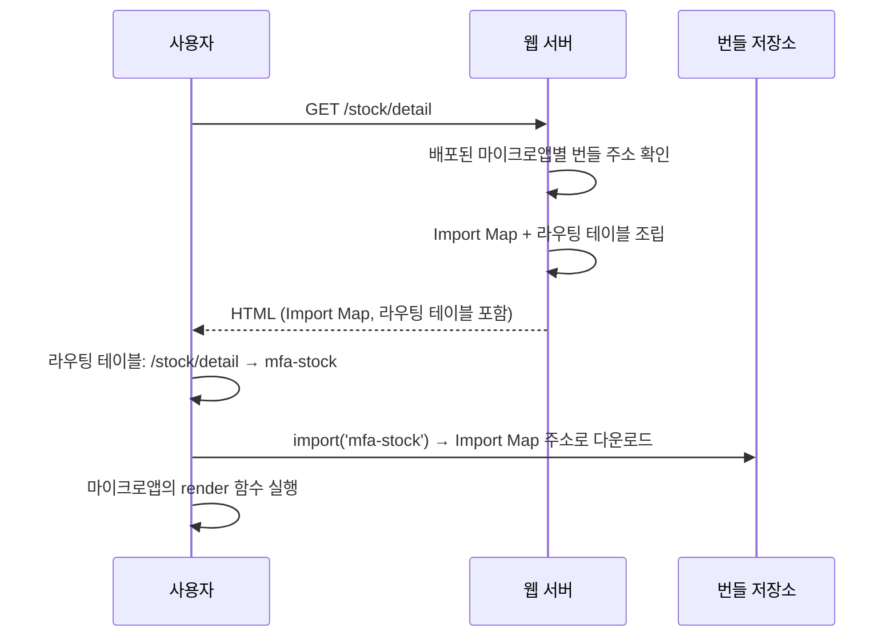

| | |
| --- | --- |
| 발표 | 토스 메이커스 컨퍼런스 25 (TMC 25), Engineering 트랙 |
| 연사 | 박건영, 장재영 (토스증권 Frontend Developer) |
| 자료 | [발표 영상](https://www.youtube.com/watch?v=6g49EaSKZHg) · [TMC 25](https://toss.im/tmc-25) |

토스 앱 증권 탭 전체가 Next.js 앱 하나였다. 450페이지가 넘고, 한 빌드에 PR 40개가 실려 나가고, 빌드 30분에 개발 서버 기동 5분. 이것을 팀별 ESM 번들로 쪼개고, 웹 서버가 요청마다 Import Map과 라우팅 테이블을 조립해 HTML에 실어 보내는 구조로 바꿨다. 같은 구조 위에서 팀별 독립 배포, 서비스별 카나리, 브랜치별 프리뷰, 로컬 오버라이드 개발 환경이 전부 "Import Map의 주소를 바꾸는 것"으로 구현된다. 내용은 발표 영상과 자동 생성 자막을 근거로 했고, 표현은 내 말로 바꿨다.

## 문제: 하나의 배포에 모든 변경이 실린다

MTS는 토스 앱 안에서 모바일 웹을 띄우는 웹뷰 서비스이고 Next.js와 React로 만든다. 초창기에는 코드베이스 하나에 다 몰아넣는 것이 공통 코드를 참조하기 좋아 개발 속도에 유리했다. 서비스가 커지자 모놀리식의 문제가 나왔다.

- 20명 넘는 챕터원이 동시에 개발한 기능이 한 번에 빌드·배포된다. 한 빌드에 많게는 **PR 40개**. 하나에 문제가 있어 롤백하면 나머지 39개도 같이 롤백된다. 배포와 롤백이 부담스러워진다.
- 코드가 많아 어떤 변경이 어디에 영향을 줄지 예상하기 어렵다. A 기능을 고쳤는데 B 기능이 바뀌는 것을 모르고 배포하면 장애다.
- 450페이지가 한 빌드에 있어 **빌드 30분, 개발 서버 5분**.

근본 원인은 수많은 변경이 **한 배포에 같이 나가야만 하는** 구조라고 봤다. 배포 단위를 기능별로 나누면 변경의 영향 범위가 줄어 위 문제가 풀린다.

## 분할 단위와 통합 방식

어떤 단위로 나눌까. 기존 화면을 살펴보니 **한 페이지에는 거의 하나의 도메인만** 나왔다. 그래서 "한 페이지에 여러 마이크로앱이 동시에 나타나지 않는다"는 규칙을 세우고, 마이크로앱 하나가 여러 페이지를 가지는 **페이지 단위 분할**로 설계했다.

마이크로앱을 불러오는 방식으로는 마이크로앱마다 다른 HTML을 쓰거나 iframe에 로드하는 방법이 있다. 토스증권은 사용자가 여러 도메인의 페이지를 자주 넘나들기 때문에 성능을 위해 **JavaScript 런타임 통합**을 골랐다. 호스트 앱이 별도 배포된 마이크로앱의 모듈을 동적으로 불러와 실행하는 방식이다. SPA의 동적 페이지 로딩과 비슷하지만, 가져오는 코드가 **완전히 따로 빌드·배포된 번들**일 수 있다는 점이 다르다.

## Native ESM과 Import Map

ESM은 JavaScript 모듈 표준이고 보통 webpack 같은 번들러가 처리하지만, 번들러 없이 **브라우저가 네이티브로** `import`를 처리할 수도 있다. 브라우저가 `import`를 만나면 `from` 절의 주소에서 모듈을 다운로드해 실행한다. 다만 실제 웹 주소를 써야 한다. 외부 패키지처럼 이름으로 import하려면 **Import Map**이다. HTML `<head>`에 선언하면 모듈 이름을 다운로드 주소로 매핑한다. `import mod from 'hello'`는 원래 오류지만, Import Map에 `hello`의 주소를 적어 두면 브라우저가 그 주소에서 가져온다.

둘을 조합하면 마이크로 프론트엔드가 된다. 마이크로앱을 로딩하는 모듈 이름을 정하고(예: `mfa-a`), Import Map에서 실제 파일 경로(`/a/mfa.js`)로 매핑하고, 호스트가 `import('mfa-a')`하면 그 파일이 내려와 마이크로앱 코드가 실행된다.

## 핵심: 웹 서버가 요청마다 HTML을 조립한다

Import Map은 누가 언제 만드는가. 여러 방법 중 **HTML을 내려주는 웹 서버가 조립**하는 방식을 택했다. 서버 사이드 렌더링과 비슷하다.

HTML에는 두 가지가 실린다. **라우팅 테이블**은 각 URL 경로가 어떤 마이크로앱에 속하는지의 전체 정보이고, **Import Map**은 각 마이크로앱의 ESM 번들이 어느 저장소 주소에 있는지다. `/stock/detail`로 들어오면 라우팅 테이블을 보고 `mfa-stock`을 가져와야 한다는 것을 알고, Import Map의 주소에서 리소스를 받는다.

마이크로앱은 미리 정한 인터페이스에 맞는 렌더링 함수를 선언해 두고, 호스트가 실행하면 페이지가 그려진다. 마이크로앱 안에서 React를 로딩한다. 라우팅은 문제였다. 이동할 페이지가 현재 마이크로앱 안에 있을 수도 밖에 있을 수도 있어서, 라우터가 이동 전에 새 마이크로앱을 불러와야 할 때가 있다. 기존 SPA 라우팅 라이브러리는 앱 하나 안에서 동작하는 것을 가정해 그대로 쓰기 어려웠고, **마이크로 프론트엔드에 최적화된 SPA 라우터를 직접 만들었다.**

## 같은 구조로 만든 네 가지

팀별로 산출물이 각각의 ESM 번들로 빌드·배포된다. 홈, 종목 상세, 매매, 계좌, 채권 팀이 각자 번들을 갖는다. 그 위에서 아래 네 가지가 전부 "Import Map의 주소를 무엇으로 조립하느냐"로 구현된다.

| 기능 | 구현 |
| --- | --- |
| 팀별 독립 배포 | 매매 팀만 코드를 고쳐 `trading v2` 번들이 빌드되면, 웹 서버가 이를 감지해 Import Map의 trading 주소만 v2로 바꿔 조립한다. 다른 서비스는 그대로, 매매만 새 버전 |
| 서비스별 카나리 | 사용자마다 1~100의 쿠키 값이 있고, 웹 서버가 설정된 카나리 비율에 따라 그 사용자에게 v1 주소를 줄지 v2 주소를 줄지 정한다. 서비스마다 비율을 따로 조절하고, 100%에 도달하면 전원에게 v2 |
| 브랜치 프리뷰 | 개발자가 브랜치에 푸시하면 그 브랜치 기준 ESM 번들이 빌드·업로드되고 브랜치별 서브도메인이 생긴다. 그 서브도메인으로 접근하면 웹 서버가 해당 번들을 Import Map에 매핑해 준다. 디자이너·QA가 정식 배포 전에 서브도메인만 받으면 검증할 수 있다 |
| 로컬 개발 | 빌드된 번들 대신, 개발 중인 서비스의 Import Map 주소만 localhost로 오버라이드한다. 전체를 개발 서버로 띄우지 않고 그 서비스만 띄운다 |

## 남은 두 문제

**번들 크기.** 공통 라이브러리가 서비스마다 포함돼 번들이 커졌다. 내부 유틸이나 컴포넌트는 중복돼도 크기에 큰 영향이 없었지만 Sentry 같은 무거운 라이브러리는 최적화가 필요했다. 모든 서비스가 쓸 만한 공통 모듈을 **shared modules**라는 별도 서비스로 분리해 ESM 번들로 배포하고 Import Map에 경로를 넣었다. 어느 서비스에서 접근하든 같은 리소스를 받아 중복이 사라진다.

**브라우저 호환성.** 토스증권이 대상으로 삼는 범위 안에 ESM과 Import Map을 쓸 수 없는 경우가 있었다. 동적으로 모듈을 가져오는 라이브러리 **SystemJS**를 Import Map의 폴백으로 써서 해결했다.

결과: Next.js 모놀리식 하나에서 N개 마이크로앱, N개 빌드, N개 배포로. **빌드 30분 → 1분, 개발 서버 5분 → 5초**, 그리고 독립 배포.

## 리뷰

**모든 배포 기능이 한 지점으로 수렴한다.** 독립 배포, 카나리, 프리뷰, 로컬 오버라이드는 보통 각각 CI/CD 파이프라인, 트래픽 라우터, 프리뷰 인프라, dev 프록시로 따로 만든다. 여기서는 전부 "HTML을 만들 때 Import Map에 어떤 주소를 적을 것인가"라는 하나의 결정이다. 웹 서버가 요청마다 HTML을 조립하기로 한 선택이 이 수렴을 가능하게 했다. 정적 HTML이었다면 카나리도 프리뷰도 다른 층에서 풀어야 했다.

**분할 규칙을 코드가 아니라 화면에서 찾았다.** "한 페이지에 한 도메인"이라는 관찰이 페이지 단위 분할을 정당화했고, 그 덕에 마이크로앱 간 조합(한 화면에 여러 앱)이라는 가장 어려운 문제를 피했다. 마이크로 프론트엔드가 실패하는 흔한 이유가 그 조합에서 나오는데, 도메인 경계가 화면 경계와 일치하는 제품이라 가능했다.

**표준에 올라탄 대가는 폴백이다.** Module Federation 같은 번들러 기능 대신 브라우저 표준(ESM, Import Map)을 썼기 때문에 번들러 종속이 없고 구조가 단순하다. 대신 표준을 지원하지 않는 브라우저를 SystemJS로 메워야 했다. 발표는 그 범위가 "대상 범위 안에 있었다"고만 했는데, 웹뷰라 토스 앱이 쓰는 WebView 버전이 곧 대상 범위일 것이다.

**SLASH 24 SharedWorker 발표와 같은 연사다.** [그때](/posts/slash24-sharedworker-one-websocket/)는 PC 브라우저의 탭 수 문제를 브라우저 API로 풀었고, 이번엔 배포 단위 문제를 브라우저 표준으로 풀었다. 프레임워크 위가 아니라 브라우저 자체에서 답을 찾는 방식이 반복된다.

## 남는 질문

- 라우팅 테이블과 Import Map이 HTML에 실린다는 것은 사용자가 페이지를 연 시점의 스냅샷이라는 뜻이다. 페이지를 열어 둔 채 매매 팀이 v2를 배포하면, 이 사용자는 다음 새 HTML 요청까지 v1 번들 주소를 갖고 있다. 마이크로앱 간 이동 시 이미 내려간 v1 주소로 가져오는지, 새 주소를 다시 받는지. 서버에서 v1 번들을 언제까지 유지하는지.
- 카나리 비율을 서비스마다 따로 두면 한 사용자가 매매 v2 + 계좌 v1 조합을 볼 수 있다. 서비스 간 인터페이스가 바뀌는 배포에서 그 조합이 깨지지 않게 하는 호환성 규칙이 있는지.
- shared modules도 버전이 있다. Sentry를 올리면 모든 마이크로앱이 동시에 새 버전을 받는데, 그것이 "독립 배포"와 충돌하는 지점이다. shared modules의 배포는 누가 소유하고 카나리는 어떻게 하는지.
- 자체 SPA 라우터의 세부는 생략됐다. 마이크로앱 경계를 넘는 이동에서 스크롤 위치, 상태 보존, 뒤로 가기 처리가 어떻게 되는지가 궁금하다.
- Next.js에서 벗어났으니 SSR은 어떻게 됐는가. 웹 서버가 HTML을 조립한다고 했지만 마이크로앱은 클라이언트에서 React를 로딩해 렌더링하므로, 첫 화면의 SSR 이점은 포기한 것으로 보인다.

## 참고

- [발표 영상](https://www.youtube.com/watch?v=6g49EaSKZHg)
- [TMC 25](https://toss.im/tmc-25)
- 같은 연사의 앞선 발표: [SLASH 24 SharedWorker 리뷰](/posts/slash24-sharedworker-one-websocket/)
