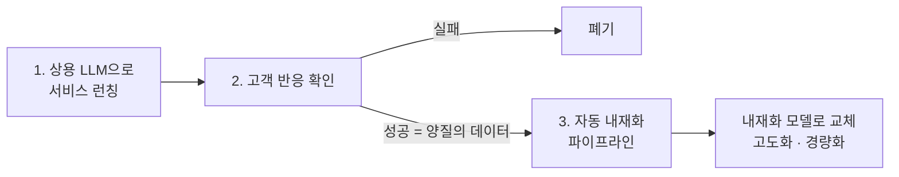

| | |
| --- | --- |
| 발표 | 토스 메이커스 컨퍼런스 25 (TMC 25), Engineering 트랙 |
| 연사 | 김민규 (토스증권 Machine Learning Engineer) |
| 자료 | [발표 영상](https://www.youtube.com/watch?v=VulWhToQUp8) · [TMC 25](https://toss.im/tmc-25) |

LLM을 직접 만들 수는 없고, 상용 LLM에만 기대기엔 불안정하다. 이 둘 사이에서 토스증권이 택한 전략은 "상용 LLM으로 서비스를 먼저 내고, 고객이 선택한 서비스의 데이터로 작은 모델을 자동 학습해 갈아 끼운다"이다. 제목 STEAL THE SHOW는 거대한 LLM이라는 쇼에서 우리에게 필요한 가장 중요한 부분만 가져온다는 뜻이고, 기술 용어로는 knowledge distillation이다. 발표의 무게는 증류 자체보다 그 과정을 Kubeflow 파이프라인으로 자동화하면서 어디가 어려웠는지에 있다. 내용은 발표 영상과 자동 생성 자막을 근거로 했고, 표현은 내 말로 바꿨다.

## 상용 LLM만으로는 안 되는 이유

토스증권은 뉴스 요약, 한 시간짜리 실적 발표 콜 요약, 전날 시황 요약, 주가 급변 시 관련 뉴스 요약 같은 곳에 상용 LLM을 쓰고 있다. 이 서비스들에는 공통점이 둘 있다. **정보를 짧게 요약하는 콘텐츠**이고, **실시간이 중요하지 않다**.

첫 번째 공통점은 상용 LLM을 커스터마이즈하기 어렵다는 데서 온다. 범용 다재다능함을 위해 만들어져서 금융 인사이트나 금융 용어 이해가 부족하고, 프롬프팅으로 주입하는 데는 한계가 있다. 두 번째는 속도보다 **안정성** 문제다. 올해 2월 ChatGPT가 결제 방식을 후불에서 선불로 바꿨는데 충전이 되지 않아 "잔액 없음" 알림과 함께 오랫동안 아무것도 쓸 수 없었다. 내부 모델이라면 고치거나 스케일 아웃하거나 어떻게든 해소했겠지만, 외부 문제라 할 수 있는 것은 "빨리 고쳐 주세요"라고 비는 것뿐이었다. 고객 서비스의 안정성을 남에게 담보하는 것은 위험이고, 그래서 내재화는 선택이 아니라 필수라고 봤다.

## 그런데 직접 만들 수는 없다

데이터, 코드, 모델, 테크 리포트가 공개돼 있어 따라 하면 Llama 같은 것을 만들 수는 있다. 빠진 것은 비용이다. Meta는 Llama 학습에 GPU 16,000개를 썼고, Anthropic은 2027년까지 학습 비용이 1,000억 달러가 될 것이라 전망했으며, 경제적으로 만들었다는 DeepSeek도 5억 달러다. 토스는 LLM이 목적인 회사가 아니라 이 정도를 투자할 여력이 없고, 대부분의 기업이 그럴 것이다.

하지만 그런 범용 LLM이 필요한 것도 아니다. 범용 LLM 기업과 토스증권의 차이는 셋이다. **도메인**(코드나 그림은 못 해도 되고 금융만 잘하면 된다), **언어**(한국어와 영어로 한정할 수 있다), **트래픽**(학습도 서빙도 그들보다 훨씬 적다). 그래서 쇼 전체가 아니라 가장 중요한 부분만 가져온다.

## Knowledge distillation, 네 단계

선생 모델(상용 LLM)과 학생 모델(우리 모델)이 있다. 뉴스 요약이라면 금융 뉴스를 선생에게 넣어 요약을 대량으로 받고, (뉴스, 요약) 쌍으로 학생을 학습시킨다. 내재화는 데이터 수집 → 정제 → 학습 → 평가의 네 단계다. 수집은 상용 LLM으로 대량 확보, 정제는 오류·중복 제거, 학습은 오픈소스로, 평가는 "정말 ChatGPT만큼 하는가".

이 과정에는 최소 수개월, ML 엔지니어 5~10명이 든다. 그리고 여기서 빠뜨린 질문이 하나 있다. **이 모델을 토스증권 고객이 원하는가.** 토스는 고객의 금융 문제를 빠르고 쉽게 풀어 주는 회사다. 수개월 걸려 훌륭한 모델을 만들어도 고객이 안 쓰면 수개월을 버린 것이다.

## 두 마리 토끼: 서비스 먼저, 내재화는 자동으로

| | 상용 LLM | 내재화 모델 |
| --- | --- | --- |
| 서비스 개발 속도 | 빠르다 | 느리다 |
| 비용·안정성 | 비싸고 불안정하다 | 안정적이다 |

장점만 취하는 방법은 세 단계다.

금융 회사라 상용 LLM을 그냥 쓸 수는 없고 혁신금융 같은 절차를 거쳐야 하지만, 처음부터 만드는 것보다는 빠르게 런칭할 수 있다. 고객이 쓰거나 안 쓰거나로 답한다. 실패한 서비스는 버리고, 성공한 서비스의 데이터는 **고객이 선택했으므로 양질**이라고 판단해 내재화한다. 이 세 단계를 자동화하면 빠른 런칭과 안정적 운영을 동시에 얻는다.

## 자동화에서 어려웠던 것

### 데이터: 가장 오래 걸리던 단계가 짧아진다

전통적으로 ML 엔지니어의 시간 중 데이터 정제가 60%, 수집이 19%로 약 80%가 데이터였다. 이 전략에서는 서비스에서 이미 나온 데이터를 쓰므로 그 부담이 크게 준다. 폐기된 서비스의 데이터는 내재화할 필요도 보관할 이유도 없어 버리고, 성공한 서비스의 데이터만 수집·처리한다. 데이터는 학습용 분할과 나중에 나올 평가 모델 학습용까지 네 갈래로 나뉜다. 중복 제거 같은 간단한 정제는 여전히 들어가지만 예전보다 훨씬 간소하다.

### 학습: 환경, 자원, 설정

instruction 데이터로 SFT(supervised fine-tuning)를 한다. 학습 자체는 오픈소스 코드와 모델을 쓰니 어렵지 않은데, 자동화에는 세 어려움이 있었다.

1. **학습 환경 관리.** 사람마다 Python과 패키지 버전이 다르고, 베이스 모델에 따라 transformers 버전도 달라진다.
2. **자원 관리.**
3. **학습 설정.** 고전 ML에서는 문제가 아니었는데, LLM의 멀티 GPU·멀티 노드 학습은 DeepSpeed 설정 등 configuration이 매우 많아진다.

1·2는 자체 Kubernetes 위에 구축한 **Kubeflow**로 환경 분리와 자원 관리를 풀었고, 3은 Git 기반 형상 관리로 설정을 동기화한다.

### 평가: 사람을 로봇으로 바꾸기

생성 모델 평가는 고전적으로 사람이 했다. 서비스 데이터와 학습 모델의 생성 결과를 같은 뉴스에 대해 1만 쌍쯤 놓고 하나씩 A가 낫다, B가 낫다를 매긴다. 학습 모델이 이기면 교체한다. 자동화와 속도가 목표인데 이 방식은 맞지 않는다.

자동화 수단은 둘이다. **Reward model**은 프롬프트와 요약이 들어오면 얼마나 잘 맞는지를 점수로 낸다. **LLM-as-a-judge**는 자연어로 평가한다. 둘 다 있으면 자동화되지만, 갖는 것 자체가 시간을 쓴다. reward model은 데이터를 모아 학습해야 하고, judge는 프롬프트가 정말 잘 동작하는지 검증해야 한다.

두 가지 트릭으로 자동화했다. reward model은 **서비스 데이터를 양질로 가정**하고, ChatGPT보다 못할 것으로 보이는 오픈소스 모델 몇 개로 생성한 결과와 쌍을 만들어 "어느 쪽이 나은가"를 자동으로 학습시킨다. judge는 자동화할 방법이 없는데, 어차피 1단계에서 서비스를 하려면 사람의 기준을 통과해야 하고 그때 쓴 평가 지표와 프롬프트가 있다. 서비스 팀이 고른 그 **양질의 프롬프트를 그대로** judge에 쓴다. 이렇게 해도 성능이 안 나오면 DPO나 RLHF 같은 preference optimization으로 갈 수 있지만, 거기까지는 아직 자동화되지 않았다.

### 실제 파이프라인

Kubeflow Pipelines 위에 만들었다. 데이터 수집 단계가 돌면 데이터 레지스트리에 적재되고 학습 단계가 트리거되며, MLflow 같은 도구로 학습을 추적하고, 모델이 나오면 평가 단계로 간다. 평가 결과는 사내 메신저로 "reward model 기준 우리 모델 승률이 더 높다"처럼 전달되고, 리더보드로 어느 모델이 제일 좋은지 본다.

결과로 보여 준 세 요약(ChatGPT, Hugging Face의 Llama 70B, 직접 학습한 더 작은 모델)은 발표자 말로 "처음엔 구분된다고 생각했는데 다시 읽으니 구분이 잘 안 된다". 거의 비슷하다는 뜻이다. 남은 일은 자동화로 번 시간으로 성능을 고도화하고, 더 작은 모델로 경량화해 잘 서빙하는 것이다.

## 리뷰

**"고객이 선택했으니 양질"이라는 가정이 이 전략의 축이다.** 데이터 정제에 80%를 쓰던 ML 공정에서 정제를 거의 없앤 근거가 이것이다. 레이블링을 사람이 아니라 시장이 한 셈이다. 같은 가정이 평가에도 재사용된다. reward model의 정답 쪽이 서비스 데이터이고, judge의 프롬프트가 서비스 런칭 때 통과한 프롬프트다. 하나의 가정으로 수집·정제·평가 세 단계를 동시에 단순화했다.

**내재화의 순서를 뒤집었다.** 보통은 "모델을 만들고 서비스에 붙인다"인데, 여기서는 "서비스를 하고 살아남으면 모델을 만든다"이다. 수개월짜리 투자를 PMF가 확인된 곳에만 쓴다. ML 팀이 아니라 제품 조직의 논리로 ML 파이프라인을 설계한 것이다.

**안정성 논거가 비용 논거보다 먼저 나왔다.** 상용 LLM을 버리는 이유로 흔히 토큰 비용을 말하는데, 발표는 결제 시스템 변경 사고를 들어 "우리가 할 수 있는 것이 기도뿐인 상태"를 문제로 삼았다. 금융 서비스에서 외부 의존이 곧 장애 도메인이 된다는 관점은 [해외주식 브로커 격리](/posts/toss-securities-market-data-and-order-architecture/)와 같은 뿌리다.

## 남는 질문

- "고객이 선택했으니 양질"은 서비스 수준의 판단이다. 서비스가 성공했어도 개별 요약 중에는 틀린 것(환각, 숫자 오류)이 섞여 있을 텐데, 그것을 학생이 그대로 배운다. 건별 품질 필터가 없다면 선생의 오류가 증류된다.
- reward model을 "서비스 데이터 vs 약한 오픈소스 모델" 쌍으로 학습하면, reward model은 "ChatGPT 스타일인가"를 배우지 "정확한가"를 배우지 않을 수 있다. 학생이 선생의 문체를 흉내 내면 높은 점수를 받는 구조인데, 이 편향을 어떻게 다루는지.
- 내재화 모델로 교체한 뒤에도 서비스 데이터는 계속 쌓인다. 그 데이터는 이제 학생이 만든 것이므로, 다음 라운드 학습에 넣으면 자기 출력을 학습하는 순환이 된다. 교체 후의 데이터 수집 규칙이 궁금하다.
- 상용 LLM 장애가 문제였다면, 내재화 모델의 장애(GPU 노드 장애, 서빙 지연)에 대한 폴백은 반대로 상용 LLM인지. 양방향 폴백이면 결국 상용 의존이 남는다.
- 혁신금융 절차가 상용 LLM 서비스 런칭의 전제라면, 그 절차가 "빠른 런칭"의 병목이 될 수 있다. 실제 리드 타임이 어느 정도인지.

## 참고

- [발표 영상](https://www.youtube.com/watch?v=VulWhToQUp8)
- [TMC 25](https://toss.im/tmc-25)
- 같은 팀의 GPU 운영 발표: [비싼 GPU, 낭비 없이 제대로 운영하는 법 리뷰](/posts/tmc25-gpu-cluster-efficiency/)
