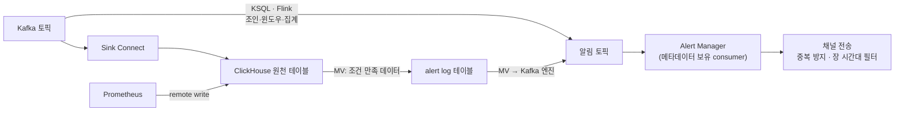

| | |
| --- | --- |
| 발표 | 토스 메이커스 컨퍼런스 25 (TMC 25), Engineering 트랙 |
| 연사 | 정채문, 송지수 (토스증권 실시간 데이터팀 Data Engineer) |
| 자료 | [발표 영상](https://www.youtube.com/watch?v=fcTPQAt7KkA) · [TMC 25](https://toss.im/tmc-25) |

SLASH 24에서 ClickHouse로 랭킹을 옮겼던 팀이 이번엔 알림을 옮겼다. Grafana·Elasticsearch 알림처럼 주기적으로 조회해서 조건을 보는 폴링 구조를 Kafka·KSQL·Flink·ClickHouse Materialized View 위의 스트림 탐지로 바꾸고, 사용자가 개발자 없이 클릭으로 알림을 만드는 플랫폼 "클럿"을 만든 이야기다. 뒤에는 로그·메트릭·트레이스를 ClickHouse 한곳에 모으는 옵저버빌리티 스택(ClickStack, HyperDX) 실험이 붙는다. 내용은 발표 영상과 자동 생성 자막을 근거로 했고, 표현은 내 말로 바꿨다.

## 문제: 알림은 오는데 대응은 안 한다

팀마다 대시보드와 알림을 만들다 보니 하루에 오는 알림이 예상보다 훨씬 많다. 증권사라 특정 시간대에 몰리고, 반복되는 것도 있고, 즉시 대응해야 하는 것도 섞여 있다. 그중 유의미한 것은 얼마나 될까. 대부분 이미 아는 것이거나 한두 번 보면 무시하게 되는 것들이다. 민감한 조건이 단순 반복해서 울리거나, 배포 직후 일시 오류거나. 알림이 많아지면 정작 중요한 신호를 놓친다.

기존 구조에서는 여러 시스템에 데이터가 따로 저장돼 있고 Grafana·ES 알림·각종 스케줄러가 알림을 보낸다. 받은 사람은 원인을 찾으려 여러 데이터 소스를 연결한 대시보드와 Kibana를 오가며 본다. 고민은 네 가지였다.

1. **레이어 간 의존.** 마이크로서비스, 인프라 구성 요소, 외부 API까지 한 서비스에 여러 레이어가 얽혀 있어 장애 하나가 여러 레이어에 번진다. 단일 소스가 아니라 여러 소스를 연결해 관계를 봐야 한다.
2. **로그·메트릭·트레이스가 다른 저장소에 있다.** 연관 분석이 어렵고 엔지니어가 시간 기준으로 수동으로 잇는다. 로그는 검색 엔진에 있어 텍스트 검색엔 강하지만 집계엔 약하고, 메트릭 저장소는 시각화는 빠르지만 미리 집계해 버려 원본 로그로 역추적이 어렵다.
3. **폴링의 지연과 유실.** Grafana·ES 알림은 주기적으로 조회해 조건을 만족할 때만 보낸다. 조건이 발생해도 도착까지 몇 분 걸리고, 일정 시간의 집계값을 보내는 데는 맞지만 조건을 만족하는 **각각의 이벤트를 즉시** 보내는 데는 한계가 있다. 짧은 시간에 몰리면 일부가 누락되기도 했다.
4. **도메인 민감도.** 증권은 정규장·애프터장·휴장일·공시 같은 시간과 외부 이벤트에 따라 민감도가 완전히 달라진다. 단순 조건이 아니라 장 시간대와 시장 상황을 아는 탐지가 필요하다.

목표는 다양한 소스에서 실시간 수집 → 프로세싱 → 집계 → 알림까지 자동화된 시스템을 **내재화**하는 것이었다.

## 데이터를 ClickHouse 한곳에 모은다

ClickHouse는 이미 Kafka로 들어오는 이벤트 데이터의 빠른 집계·필터링·이력 분석에 쓰이고 있었고, Prometheus는 서비스·인프라의 시계열 메트릭을 갖고 있었다. 데이터 플랫폼은 실시간 활용 목적의 **Hot 레이어**(대용량을 빠르게 분석해 실시간 대시보드·알림에 쓰는 OLAP 영역)와 시간이 지난 데이터를 아카이빙하는 **Cold 레이어**로 나뉘어 있는데, ClickHouse는 단순 저장소가 아니라 실시간 분석의 전략적 저장 레이어다. 과제는 Hot 레이어와 알림에 필요한 데이터를 한곳에 모으는 것, 즉 ClickHouse와 Prometheus를 어떻게 잇느냐였다.

Prometheus를 대체하지 않고 **remote write**로 ClickHouse에 흘렸다. ClickHouse의 TimeSeries 테이블 엔진이 Prometheus 데이터를 받는다. PromQL은 러닝 커브가 높고 여러 메트릭을 조합한 상관관계 분석에서 문법적 한계로 쿼리가 복잡해지는데, 메트릭이 ClickHouse에 오면 SQL로 유연하게 분석할 수 있다.

들어오는 데이터가 늘자 테이블 생성과 적재 파이프라인 자동화도 필요해졌다. 대부분 Kafka로 들어오므로 **스키마 레지스트리 기반으로 ClickHouse DDL을 생성**하고, 토픽과 테이블 이름으로 Kafka Sink Connect 적재 파이프라인도 자동 생성한다. 원천이든 가공 데이터든 쉽게 ClickHouse에 넣을 수 있는 기반이다.

## 클럿: 세 단계로 만드는 알림

목표는 실시간과, 엔지니어 개입 없이 누구나 정확한 알림을 만드는 것이었다. 생성은 세 단계다.

1. **데이터 선택.** Kafka 토픽, ClickHouse 테이블, Prometheus 메트릭을 자유롭게 탐색해 고른다.
2. **가공.** 필터링과 시간 기반 집계를 설정한다.
3. **조건과 전송.** 발송 조건과 전송 방식을 고르면 끝이다.

탐지 파이프라인은 SQL 기반으로 KSQL, Flink, ClickHouse 위에 생성된다. 알림 생성 요청을 템플릿화해 쿼리가 자동으로 만들어지므로 개발자 없이 조건을 정의할 수 있고, Kafka·ClickHouse 외의 소스가 추가돼도 대응할 기반을 뒀다.

두 경로가 있다. **실시간이 중요한 알림**은 Kafka에서 바로 처리한다. KSQL·Flink 같은 스트림 처리로 조인·윈도우·집계를 표현하고, 토픽을 실시간으로 소비해 사용자가 지정한 전처리를 거쳐 최종 토픽에 넣는다. **과거 패턴과의 대비처럼 상태가 필요한 알림**은 ClickHouse가 맡는다. 장기간·대용량 집계 데이터를 갖고 있기 때문이다. 원천 테이블에 데이터가 들어올 때 사용자 조건별로 만들어진 Materialized View 파이프라인이 돌아, 조건을 만족하는 데이터가 하나의 alert log 테이블에 쌓인다.

모든 소스의 알림 데이터를 하나의 토픽으로 모으기 위해 ClickHouse에서 Kafka로 **되돌려 보낸다.** alert log 테이블에서 Kafka 엔진 테이블로 MV를 연결해, 조건을 만족한 데이터가 토픽으로 나가게 했다. Kafka 엔진은 메시지를 소비할 뿐 아니라 produce도 할 수 있다는 점을 쓴 것이다. SLASH 24 발표에서는 Kafka 엔진을 적재용으로 쓰다 버렸는데([리뷰](/posts/slash24-clickhouse-ranking/)), 여기서는 반대 방향에 다시 쓴다.

실시간 알림 외에, 각 팀이 Airflow나 Spring Batch로 따로 돌리던 모니터링도 한곳으로 모으려고 사용자가 SQL을 등록하고 스케줄 주기를 설정하는 기능을 뒀다.

## 탐지와 전파를 분리한다

탐지 결과가 하나의 토픽에 모이므로 **Alert Manager**가 그 토픽을 구독한다. 발송 조건, 메시지 포맷, 수신 채널 같은 메타데이터를 컨슈머가 들고 있어서 사용자가 알림을 수정해도 바로 반영된다. 사용자는 선택한 데이터의 필드로 메시지를 자유롭게 쓰고, Alert Manager가 실제 값으로 치환해 맞춤 메시지를 만든다.

전송 옵션이 "꼭 필요한 알림만" 받게 하는 장치다.

- **중복 방지.** 최초 발생 후 일정 시간 동안 발송하지 않거나, 일정 시간 안에 여러 번 조건을 만족할 때만 발송한다.
- **장 구분과 시간대 필터.** 국내 정규장, 해외 정규장 같은 장 구분과 설정 시간대로 세밀하게 거른다.

발송 이력과 통계도 제공한다. 어떤 시간대에 알림이 몰리는지, 어떤 지표가 영향을 주는지, 개선 뒤 알림이 얼마나 줄었는지를 볼 수 있어서 알림 자체를 분석 대상으로 삼을 수 있다.

## 옵저버빌리티로: ClickStack과 HyperDX

데이터가 한곳에 모이자 사용자가 원본을 직접 탐색할 환경이 필요해졌다. 기존 플랫폼은 정의된 쿼리와 집계 시각화엔 좋았지만 원본 데이터의 즉각적 탐색엔 아쉬웠다. **HyperDX**를 도입해 옵저버빌리티 레이어로 얹었다. **ClickStack**은 OpenTelemetry·ClickHouse·HyperDX를 아우르는 스택으로, OTel 표준으로 로그·메트릭·트레이스를 수집·저장하고 검색·시각화하며 표준화된 로그로 이슈를 빨리 잡는다. 아직 베타지만 프로덕션에 적용해 실험 중이다. 주요 기능은 SQL과 Lucene 기반의 빠른 텍스트 검색과 이벤트 패턴 분석, 서비스 현황 대시보드, 요청이 어떤 서비스 경로를 거치는지 보는 트레이스다.

앞으로는 Kafka 데이터 패턴을 학습한 모델로 이상 패턴이 보이는 즉시 보내는 AI 알림을 실험 중이고, ClickHouse의 데이터로 패턴을 더 정교하게 학습해 알림 정확도를 올리고 원인을 자동 추론하는 방향을 말했다.

## 리뷰

**폴링에서 스트림으로 바뀐 것이 이 발표의 축이다.** "N분마다 조회해서 조건을 본다"는 구조는 집계 알림에는 맞지만 이벤트 단위 알림에는 지연과 누락이 구조적으로 있다. Kafka에서 바로 처리하거나, ClickHouse에 insert되는 순간 MV가 도는 방식은 조건 검사가 데이터 도착에 붙어 있어 폴링 간격이라는 개념 자체가 없다. 그리고 "상태가 필요한 알림"은 ClickHouse로 보내 두 경로를 나눈 것이 실용적이다. 스트림만으로 과거 대비를 하려면 상태 저장이 복잡해진다.

**알림의 품질을 "탐지"가 아니라 "전송 옵션"에서 다뤘다.** 중복 방지, 횟수 조건, 장 시간대 필터는 탐지 로직과 분리된 Alert Manager에 있다. 같은 탐지 결과를 두고 누구는 즉시, 누구는 세 번 쌓이면 받게 할 수 있다는 뜻이다. 알림 피로의 원인이 조건 자체보다 "언제, 얼마나 자주 보내는가"에 있다는 진단에 맞는 설계다.

**ClickHouse를 저장소가 아니라 허브로 쓴다.** 랭킹 발표 때 "분석계에서 서비스용 ClickHouse를 분리했다"고 했는데, 이번엔 메트릭(Prometheus remote write)까지 끌어들여 로그·메트릭·이벤트를 SQL 하나로 조인한다. 같은 팀이 1년 사이에 ClickHouse의 역할을 "빠른 집계"에서 "시그널 통합 지점"으로 옮긴 것이다.

## 남는 질문

- 두 경로(Kafka 스트림 vs ClickHouse MV)의 선택은 누가 하는가. 사용자가 세 단계 UI에서 고르는 것인지, 조건의 형태(윈도우 유무, 과거 대비 유무)로 플랫폼이 자동 판별하는지.
- ClickHouse MV는 insert 블록 단위로 돌고 Sink Connect는 배치로 넣으므로, ClickHouse 경로의 지연은 "Connect 배치 간격 + MV 실행"이다. 이 경로의 실제 알림 지연이 폴링 대비 얼마나 줄었는지 숫자가 없다.
- ClickHouse → Kafka 엔진으로 되돌리는 경로는 Kafka 엔진 테이블이 ClickHouse 서버 안에서 producer로 뜨는 구조다. SLASH 24에서 consumer 쪽 리소스 공유를 이유로 Kafka 엔진을 버렸는데, producer 쪽에서는 같은 우려가 없었는지.
- 사용자가 만든 MV가 늘면 원천 테이블 insert마다 MV 전부가 실행된다. 알림 수가 수백 개가 됐을 때 insert 지연이 원천 적재에 미치는 영향과, MV 수의 상한을 두는지.
- "장 시간대 필터"는 휴장일·조기 폐장 같은 달력 데이터를 어디서 가져오는지. 발표에서 도메인 민감도를 네 번째 고민으로 꼽았는데, 구현은 시간대 필터까지만 나왔다.

## 참고

- [발표 영상](https://www.youtube.com/watch?v=fcTPQAt7KkA)
- [TMC 25](https://toss.im/tmc-25)
- 같은 팀의 앞선 발표: [SLASH 24 ClickHouse 랭킹 리뷰](/posts/slash24-clickhouse-ranking/)
