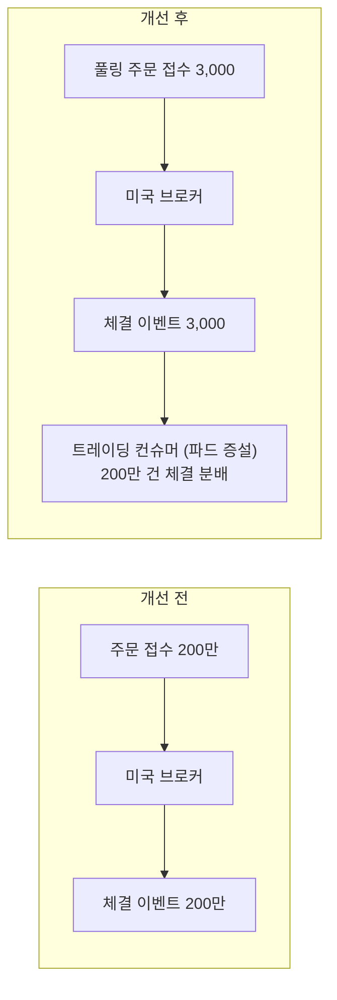

| | |
| --- | --- |
| 발표 | 토스 메이커스 컨퍼런스 25 (TMC 25), Engineering 트랙 |
| 연사 | 김광훈 (토스증권 Server Developer) |
| 자료 | [발표 영상](https://www.youtube.com/watch?v=I_PEfXDRDX4) · [TMC 25](https://toss.im/tmc-25) |

해외주식 "주식모으기"의 배치 주문이 하루 2만 건에서 200만 건으로 100배 늘어나는 동안 세 번 구조를 바꾼 기록이다. 코루틴과 비동기 호출로 시작해, 소수점 주문을 종목별로 합쳐 보내는 풀링 주문으로 갔고, 분배와 체결을 Kafka로 분리해 3,000 TPS(초당 처리 건수)까지 올렸다가 후단이 못 버텨 다시 낮췄다. 성능을 올린 이야기이면서 성능을 올리면 무엇이 깨지는지의 이야기이기도 하다. 내용은 발표 영상과 자동 생성 자막을 근거로 했고, 표현은 내 말로 바꿨다.

## 배경: 바다를 건너는 주문

해외주식은 토스증권이 직접 개발한 원장 시스템으로, Kotlin과 Spring Boot이며 Oracle·MySQL·Redis·Kafka·Impala·ClickHouse를 용도별로 쓰고, ELK·Grafana·Pinpoint로 모니터링하며 전부 Kubernetes 위에서 돈다. 가장 큰 특징은 바다를 건너는 통신이다. 고객 주문을 미국 현지 브로커에 접수하면 브로커가 NASDAQ·NYSE·AMEX에 내고, 체결되면 체결 이벤트를 돌려준다. 오픈 초기 왕복 약 300ms였다.

주식 시장의 특징이 하나 더 있다. 장 시간이 정해져 있고, 받은 주문은 그 안에 반드시 처리해야 한다. 트래픽은 미국 정규장 개장 시각에 집중된다. 주문 수가 늘수록 단계별 엔지니어링이 필요한 이유다.

주식모으기는 주식을 정기적으로 모으는 제품이다. 1주 10만 원짜리 주식을 1만 원어치 사면 0.1주이므로 대부분이 소수점 주문이다. 하루 주문이 런칭 때 약 2만 건에서 지금 약 200만 건이다.

## 1차: 코루틴, 비동기, TPS 제한

초기 구조는 단순했다. 트리거 배치가 그날 나가야 할 주문을 미리 DB에 쌓고, 미국 정규장이 열리면 트레이딩 배치가 브로커에 보낸다. 1년 만에 2만 건이 50만 건으로 25배 늘자 문제가 생겼다. 장 초반 고객 주문까지 몰리면서 브로커 처리가 지연되고, 뒤 주문까지 연쇄로 밀렸다. Tomcat 스레드가 밀리는 것과 같은 모양이다.

싱글 스레드 배치를 코루틴으로 병렬화했다. TPS는 "스레드당 초당 처리 수 × 코루틴 스레드 수"로 어림한다. 코루틴 스레드 수는 [HikariCP](/posts/hikaricp/) maximum pool size와 같게 잡았다. 커넥션 풀보다 크면 커넥션 타임아웃이 나기 때문이다. 외부 API 호출은 `@Async`로 동기에서 비동기로 바꿨다. 토스증권이 공통으로 RestTemplate을 쓰고 있어서 적용이 간단했다.

발표자가 든 산정 예시가 이 구조의 상한과 하한을 보여 준다.

| 조건 | 동시 작업 수 | 요청당 시간 | TPS |
| --- | --- | --- | --- |
| 단일 스레드 | 1 | 0.5초 | 2 |
| 코루틴 30 | 30 | 0.5초 | 60 |
| 코루틴 30 + Async 스레드 풀 300 | 최대 300 | 0.5초 | 최대 600, 최소 60 |

최대 600은 코루틴이 스레드 풀에 지연 없이 작업을 분배했을 때이고, 최악은 코루틴 수인 60이다.

TPS를 다루는 방법은 분산과 조절 둘이다. 분산은 배치 시간 이동이었다. 전체 주문의 절반이 고객 주문, 절반이 주식모으기인데 고객 주문은 실시간성이 중요해 통제할 수 없고, 주식모으기는 배치 시간을 마음대로 정할 수 있다. 그래서 정규장 개장 15분 뒤로 옮겼다. 발표자는 배치 시간만 바꿨는데 효과가 매우 강력했다고 했다. 조절은 resilience4j RateLimiter다. 원하는 TPS를 배치 파라미터로 받아 그 속도로 브로커에 접수한다. 브로커 쪽 사정으로 최대 200 TPS로 제한했다.

1차 결과: 모두가 아는 기술로, 최소 엔지니어링으로 50만 주문을 200 TPS로 약 40분에 처리했다.

## 2차: 풀링 주문

1년이 더 지나 50만이 150만이 됐고(지금은 200만), 고객 주문도 늘어 브로커 제한이 150 TPS로 내려갔다. 150만 건을 150 TPS로 처리하면 2시간 40분이고, 200만이면 3~4시간을 넘긴다. 새 구조가 필요했다.

풀링 주문은 같은 종목의 소수점 주문을 모아 하나의 주문으로 보내는 것이다. A 종목 0.1주 주문 열 개를 열 번 보내는 대신 1주 주문 하나로 보내면 브로커 부담이 준다. 금융법상 풀링은 소수점 주문에만 허용되고 1주·2주 같은 정수 주문은 합칠 수 없는데, 주식모으기는 대부분 소수점이라 가능했다. 주문은 종목별로 따로 접수하므로 풀링 주문 수는 곧 종목 수다. 주식모으기가 쓰는 종목이 약 3,000개라, 200만 주문이 3,000건으로 줄었고 접수는 수 초에 끝난다.

장점은 벌크 처리와 병렬 처리다. 모아서 보내니 외부 트래픽이 줄고, 모아서 받은 체결을 200만 건으로 나누는 일은 토스 서버 안에서 한다. 브로커 의존을 낮추고 TPS 제어권을 토스가 갖는다. 발표자의 말로 벌크는 쉽다. 모아서 던지면 된다. 어려운 것은 병렬 분배다. 구현에 따라 처리량이 갈리고, 잘못하면 동시성 문제가 난다.

분배는 이렇게 한다. A 종목에 0.5주·0.2주·0.3주 주문이 있으면 합쳐 1주를 보낸다. 체결 이벤트가 주문 ID를 키로 오면 원천 주문 1·2·3번을 조회하고, 남은 수량 1주에서 0.2를 빼 체결시키고, 0.8에서 0.5를 빼 체결시키고, 나머지 0.3을 체결시킨다.

컨슈머에서 고려한 것 둘:

- 멱등성. Kafka에서 exactly-once는 매우 어렵고 외부 환경에 따라 이벤트가 중복 발행될 수 있으므로 [at-least-once](/posts/kafka-delivery-guarantees/)를 전제한다. 이미 체결된 소수점 주문은 제외하는 방식으로 코드에서 막았다.
- 동시성. 멱등성만으로는 부족하다. 처리가 끝나지 않은 이벤트가 동시에 처리되면 정합이 꼬인다. 주문 ID를 키로 [분산락](/posts/kleppmann-distributed-locking/)을 걸고 트랜잭션을 처리했다.

2차 결과: 150 TPS에서 400 TPS로 올랐고, 150만 주문이 약 1시간에 끝났다. 그런데 아키텍처 복잡도가 올라간 것에 비해 성능이 아쉬웠다.

## 3차: 분배와 체결을 Kafka로 분리

구간별 처리 시간을 쟀더니 마지막의 체결 한 건에 약 20ms가 걸렸다. 스레드 하나로는 50 TPS다. 분배는 단순 가감산이라 애플리케이션에서 매우 빠른데, 분배하고 20ms 기다리고 분배하고 20ms 기다리는 것을 같은 트랜잭션으로 묶을 이유가 없었다. 그래서 분배와 체결을 Kafka로 분리했다.

처리량은 400 TPS에서 3,000 TPS로 올랐다. 그리고 사이드 이펙트가 터졌다.

| 증상 | 원인 |
| --- | --- |
| Kafka 토픽 lag 급증 | 해외주식 원장은 가장 안쪽 코어 서비스다. MSA에서 코어의 성능이 오르면 Kafka로 이어진 외부 서비스도 같이 올라야 한다. 소비 속도가 생산 속도를 못 따라가 lag 그래프가 90도로 치솟았다 |
| CDC 지연 | 국내·해외 원장이 분리돼 있고 통합 Oracle에 CDC 파이프라인으로 동기화하는데, TPS가 오르자 동기화가 밀렸다 |
| DB 부하 | DB CPU가 75%까지 올랐다 |

lag(컨슈머가 아직 처리하지 못한 메시지 수) 그래프의 읽는 법도 설명했다. 상승 구간은 처리가 생산을 못 따라가는 것이고, 계단 폭은 컨슈머가 한 번에 처리하는 크기, 기울기는 처리 속도다. 기울기를 없애 버리면 안정적으로 운영된다.

서비스와 장비가 준비되지 않았다고 판단해 TPS를 다시 낮췄다. 여기서 문제는 제어 방식이다. 배치는 실행마다 파라미터로 주면 되지만, 컨슈머는 롤링 업데이트라 배포로 값을 바꾸면 수 초에 끝나지도 않는다. 배포 없이 동적으로 바꾸고 싶어서 Redis에 TPS 값을 저장해 공유했다. 그런데 100만 TPS 시스템이면 Redis에도 100만 TPS가 간다([thundering herd](/posts/cache-stampede/)). 로컬 캐시를 두고 TTL 10초로 잡았다. 10초 안에 동기화되면 충분하다고 봤다. 제어 위치는 수량을 분배하고 체결 이벤트를 발행하는 흐름 중 수량을 분배하는 쪽이다.

마지막 함정은 Kafka 컨슈머 설정이다. 스레드가 한 작업을 오래 잡고 있으면 그 사이 `poll()`을 못 불러 [컨슈머 그룹 리밸런싱](/posts/kafka-consumer-group-rebalance/)이 난다. `max.poll.interval.ms` 기본값은 5분(300000ms)인데, 이 안에 poll하지 않으면 비정상으로 간주돼 그룹에서 제외된다. Kafka 문서도 이 시간 안에 `poll()`이 호출되지 않으면 "the consumer is considered failed and the group will rebalance"라고 적는다(컨슈머를 실패로 보고 그룹이 리밸런스한다, [Consumer Configs](https://kafka.apache.org/41/configuration/consumer-configs/)). 제외된 컨슈머가 작업을 끝내고 다시 poll하면 리밸런싱이 나고, 그 안에서 또 제한 시간을 넘기면 또 제외되는 무한 리밸런싱이 생긴다. 스레드 처리 시간이 5분을 넘긴다면 이 값을 반드시 고쳐야 한다.

서비스에 맞게 TPS를 조절한 뒤 리소스가 안정적으로 쓰이는 것을 확인했다.

## 리뷰

내가 보기에 가장 싸게 큰 효과를 낸 조치는 코드가 아니었다. 배치 시간을 개장 15분 뒤로 옮긴 것이다. 통제할 수 없는 트래픽(고객 주문)과 통제할 수 있는 트래픽(배치)을 구분하고, 후자를 피크에서 뺐다. 발표자도 이 조치를 두고 최소 엔지니어링으로 굉장히 큰 효과를 봤다고 했고, 1차를 정리할 때 다시 최소 엔지니어링이라는 말을 썼다.

나는 풀링을 트래픽을 줄인 것이 아니라 옮긴 것으로 읽는다. 브로커로 가는 요청은 200만에서 3,000으로 줄었지만, 200만 건의 체결 분배는 이제 토스 서버가 한다. 외부 의존을 내부 부하로 바꾼 것이고, 그래서 TPS 제어권이 토스에 생겼다. 3차에서 3,000 TPS를 냈다가 후단(Kafka 소비자, [CDC](/posts/cdc-principles-and-limits/), DB)이 못 버텨 낮춘 것도 그 부하가 안쪽으로 옮겨 왔기 때문으로 본다. 코어 서비스의 성능이 오르면 Kafka로 이어진 의존 서비스도 같이 올라야 한다는 발표자의 관찰은 다른 시스템에도 옮겨 쓸 수 있다.

분배와 체결의 트랜잭션을 나눈 것은 정합성 관점에서 물어야 할 지점이다. 한 트랜잭션이었을 때는 분배와 체결이 원자적이었다. Kafka로 나누면 분배는 됐는데 체결 이벤트가 소비되지 못한 상태가 생긴다. 발표에서 멱등성(이미 체결된 주문 제외)과 분산락은 2차의 체결 이벤트 컨슈머를 설명할 때 나왔고, 3차에서 나뉜 뒤의 "분배 완료·체결 미완료"가 얼마나 오래 남을 수 있고 그것을 누가 확인하는지는 나오지 않았다. [ParityPay에서 outbox로 같은 창을 닫았던 것](/posts/parity-pay-outbox/)과 비교해 읽을 만하다.

## 남는 질문

- 풀링 주문 하나가 브로커에서 부분 체결되거나 거부되면 원천 주문 수십만 건에 어떻게 반영되는가. 1주를 보냈는데 0.7주만 체결되면 0.5·0.2·0.3 중 누가 못 받는가.
- 분배 순서. 원천 주문을 조회해 순서대로 빼 나가는데, 그 순서(접수순, 금액순, 무작위)가 부분 체결 시 공정성을 결정한다.
- 분산락의 키가 주문 ID면 같은 풀링 주문의 체결 이벤트는 직렬화되지만, 다른 종목은 병렬이다. 3,000 TPS의 병렬도가 곧 종목 수(3,000)인 셈인데, 특정 종목에 주문이 몰리면(예: 한 종목이 전체의 30%) 그 종목의 분배가 병목이 되지 않는지.
- 체결 이벤트가 중복 발행됐을 때 "이미 체결된 주문 제외"는 원천 주문 단위의 멱등이다. 풀링 주문 단위의 체결 이벤트 자체가 두 번 오면 분배가 두 번 도는데, 두 번째 분배에서 모든 원천이 제외되므로 무해하다는 뜻으로 읽힌다. 그 사이 분산락 대기가 길어지는 것은 감수한 것인지.
- Redis TPS 값의 TTL 10초는 "낮추는" 방향으로는 안전하지만 "높이는" 방향에서는 10초 동안 파드마다 다른 TPS로 도는 창이 생긴다. 총 TPS 상한을 파드 수로 나눠 배분하는지, 전역 리미터인지.

## 참고

- [발표 영상](https://www.youtube.com/watch?v=I_PEfXDRDX4)
- [TMC 25](https://toss.im/tmc-25)
- [Apache Kafka Consumer Configs, max.poll.interval.ms](https://kafka.apache.org/41/configuration/consumer-configs/)
- 같은 시스템의 다른 면: [해외주식 서비스 안정화 사례 (Toss Tech)](https://toss.tech/article/28738) · [시세·주문 아키텍처 리뷰](/posts/toss-securities-market-data-and-order-architecture/)
