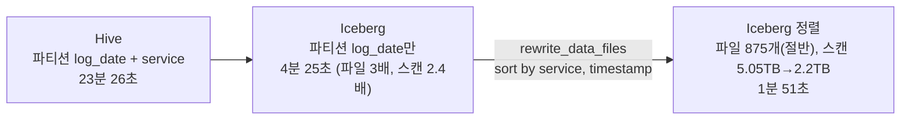

| | |
| --- | --- |
| 발표 | 토스 메이커스 컨퍼런스 25 (TMC 25), Engineering 트랙 |
| 연사 | 김수완, 이준환 (토스증권 데이터 인프라팀 Data Engineer) |
| 자료 | [발표 영상](https://www.youtube.com/watch?v=xae12xy3gC0) · [TMC 25](https://toss.im/tmc-25) |

134대 노드, 15PB 중 12PB 사용, 하루 27TB 입수, 테이블 14,000개. 그 규모가 5년 뒤 90PB가 된다는 예측 앞에서 "노드를 더 늘리는 것"으로는 안 된다고 판단한 팀의 두 가지 대응이다. 앞 절반은 Hive 테이블 포맷을 Apache Iceberg로 바꾸면서 겪은 일(전환 직후 쿼리가 더 느려졌고, 정렬 최적화로 뒤집은 과정)이고, 뒤 절반은 온프레미스에 Ceph 오브젝트 스토리지를 직접 세워 저장 효율을 33%에서 66%로 올리는 계획이다. 내용은 발표 영상과 자동 생성 자막을 근거로 했고, 표현은 내 말로 바꿨다.

## 규모와 예측

토스증권 데이터 플랫폼은 Hadoop 기반이다. HDFS와 YARN, 실시간 처리용 Apache Kudu, 대화형 쿼리용 Impala, 복잡한 처리용 Spark의 통합 플랫폼이다.

| 항목 | 수치 |
| --- | --- |
| 데이터 노드 | 134대, 6,210 vCore, 46TB 메모리 |
| 저장 | 15PB 중 12PB 사용, 하루 27TB 입수, 테이블 약 14,000개 |
| 하루 처리 | 배치 쿼리 160만 건, 애드혹 쿼리 약 1,000건, 스캔 1PB |

2029년까지 데이터 볼륨은 90PB를 넘고 일 스캔은 6PB가 될 것으로 예측했다. 지수적으로 느는 이유는 사용자 서비스가 일정 비율로 늘면 로그 테이블과 정제·집계 테이블이 그에 비례해 늘기 때문이다. 현재의 7배가 5년 안에 온다는 뜻이고, 노드만 늘려서는 메타데이터 병목, 스몰 파일의 네트워크 비효율, 3 레플리카의 저장 비효율을 감당할 수 없다. 이것이 오브젝트 스토리지 전환과 Iceberg 도입의 계기다.

## 데이터 폭증이 실제로 일으킨 문제

시스템 관리와 쿼리 성능 양쪽에서 다섯 가지다. 하루 수십만 개 생기는 **스몰 파일**(클러스터 평균 파일 크기 52MB, 이상적인 128MB의 절반). HDFS 3 레플리카 때문에 실제 데이터의 3배 공간이 필요한 **저장 효율 33%**. 스몰 파일과 입수량 증가로 HDFS NameNode와 Impala catalog에 걸리는 **카탈로그 부하**. 파일이 많을수록 열고 닫는 비용과 리스팅·필터링 시간이 급증하는 **쿼리 성능 저하**. 같은 데이터에 더 많은 스레드와 메타데이터 메모리가 드는 **리소스 소비**.

운영에서 나타난 사례 셋:

- **파티션과 스몰 파일의 증가.** 날짜 외에 파티션 키를 더 잡은 테이블에서 파티션 수가 급증하고, 파티션마다 스몰 파일이 생겨 쿼리 플랜 시간이 늘었다. Impala는 카탈로그 데몬 메모리에 테이블 메타데이터를 캐시하는데, 파일마다 위치·크기·블록 정보를 올려야 하니 카탈로그가 커졌고, 이것을 statestore를 통해 coordinator로 보내는 RPC가 **크기 제한에 걸리는** 일이 있었다.
- **파티션 키 누락.** 휴먼 에러로 파티션 키를 빼먹으면 풀 스캔이 돌고 다른 작업이 대기하며 전체가 지연됐다.
- **단일 레코드 삭제의 비효율.** Hive 포맷은 레코드 하나를 지우려 해도 파티션 전체를 INSERT OVERWRITE 해야 한다.

## Iceberg: 네 가지 기능이 세 가지 문제를 푼다

Iceberg는 데이터를 어떻게 조직·관리할지의 표준인 오픈 테이블 포맷이다. 효율적인 업데이트·삭제·증분 처리, Spark·Impala·Trino·Flink 등 거의 모든 엔진 지원, 계층적 메타데이터, 스냅샷 기반 일관성이 특징이다.

| Iceberg 기능 | 푸는 문제 |
| --- | --- |
| 계층적 메타데이터 | Hive는 카탈로그 데몬이 모든 파일 정보를 메모리에 유지하지만, Iceberg는 메타데이터 파일 포인터만 갖고 필요한 시점에 manifest를 읽는다. `REFRESH`/`INVALIDATE METADATA`가 몇 분에서 몇 초로 줄고 카탈로그 메모리가 준다. manifest의 통계로 불필요한 파일을 미리 제외하는 파일 프루닝도 강력하다 |
| `rewrite_data_files` | manifest에서 작은 파일을 찾아 큰 파일로 병합하고 manifest를 갱신한다. 스몰 파일 문제의 상당 부분을 해결 |
| Hidden partitioning | 타임스탬프를 일 단위로 파티셔닝하는 변환 규칙을 테이블에 정의해 두면, 쿼리에 파티션 키 없이 타임스탬프 조건만 써도 필요한 파티션만 읽는다. 키 누락 풀 스캔이 근본적으로 사라진다 |
| Merge-on-read | 기존 파일은 두고, 삭제할 레코드 정보만 delete 파일에 기록하고, 새 데이터는 별도 파일에 추가한다. 읽을 때 병합한다. 1TB 파티션에서 한 건 고치려고 1TB를 다시 쓰던 것이 사라진다 |

## 첫 전환 사례: 서비스 로그 테이블, 그리고 예상 밖의 결과

첫 대상은 토스증권에서 가장 큰 서비스 로그 테이블이다. 과거에 이 테이블 하나가 하루 27TB를 받았고(지금 클러스터 전체 입수량과 맞먹는다), 크기는 1PB다. 가장 크니 스몰 파일도 가장 많고 쿼리도 가장 느렸으며, 하나만 고쳐도 클러스터 전체 효과가 클 것으로 봤다. Hive에서는 `log_date`와 `service` 두 파티션 키를 썼는데, 오브젝트 수를 줄이려고 Iceberg에서는 `log_date` 하나로 줄였다.

그런데 **쿼리가 더 느려졌다.** 특정 날짜의 특정 서비스 로그 건수를 세는 단순 집계에서 스캔 파일 수가 3배, 스캔 크기가 2.4배 늘었고 실행 시간이 3분 26초에서 4분 25초가 됐다. 원인은 파티션 키를 단순화한 것이었다. `service` 파티션이 사라지자 그 서비스의 데이터가 파일 전체에 흩어져 프루닝이 안 됐다.

해법은 파티션을 되살리는 것이 아니라 **정렬**이었다. `rewrite_data_files`에 `sort_order = service, timestamp`, `strategy = sort`를 줘서 파일을 합치면서 서비스별로 정렬해 다시 쓴다. 같은 서비스 데이터가 같은 파일에 모이니 각 파일의 min/max 통계로 불필요한 파일을 정확히 제외할 수 있게 됐다.

발표에서 Hive의 실행 시간이 한 번은 3분 26초, 한 번은 23분 26초로 언급되는데, 자막의 오인식일 수 있어 두 숫자를 그대로 적어 둔다. 어느 쪽이든 정렬 최적화 후 1분 51초는 Hive보다 빠르고 전환 직후보다 훨씬 빠르다.

전체 효과는 이렇다. Zstandard 압축으로 저장 크기 48% 감소, 스몰 파일 병합으로 일 파일 증가 수 97% 감소, hidden partitioning으로 쿼리 최적화 간소화, merge-on-read로 효율적 업데이트·삭제, Impala 카탈로그 메모리 30% 감소(파일이 줄고 Hive Metastore에 포인터만 저장). 이 모두가 테이블 하나에서 나온 것이다.

전환 뒤 과제는 **옵저버빌리티와 유지보수**다. 모든 Iceberg 테이블의 크기와 파일 수를 모니터링해 급성장하거나 비정상 패턴인 테이블을 본다. 유지보수 작업은 Airflow DAG로 돌리는데, 테이블마다 스케줄링하고 모니터링해야 해서 100개, 1,000개가 되자 관리가 어려워졌다. Apache Amoro(인큐베이팅)의 self-optimizing 서비스를 PoC 중이다. 모든 테이블을 지켜보다 필요한 시점에 자동으로 최적화하는 것을 기대한다.

## 오브젝트 스토리지: 33%에서 66%로

Iceberg로 관리 효율을 올려도 5년 뒤 6배 이상의 데이터를 물리적으로 둘 공간은 남는 문제다. HDFS 3-copy는 노드 2대 손실을 견디지만 효율이 33%다. 1PB를 저장하려면 3PB가 필요하다. **Erasure coding**으로 같은 내구성에 효율을 올려야 한다.

오브젝트 스토리지를 택한 이유는 셋이다. **스토리지와 컴퓨팅의 분리**(저장 계층은 복제·EC에 집중하고 컴퓨팅은 목적별 엔진을 고른다. 과거엔 네트워크가 병목이라 비효율이었지만 25G·100G 이더넷이 보편화되며 실용적이 됐다), **erasure coding**(1.25PB에 EC 4+2를 쓰면 노드 2대 손실을 견디며 디스크 효율 66%), **클라우드 네이티브**(온프레미스지만 나중에 S3나 Cloudflare R2로 거의 같게 옮길 수 있다).

수요도 넷이다. Iceberg + Trino·Spark·StarRocks의 **데이터 레이크하우스**, 브로커 retention을 오브젝트 스토리지에 위임해 브로커 증설 없이 retention을 늘리고 장애 복구·리밸런싱도 빨라지는 **Kafka tiered storage**, Kubernetes에서 ReadWriteMany를 지원하는 POSIX 파일 시스템 **JuiceFS**, 1PB를 넘긴 Elasticsearch 클러스터의 replica·오래된 인덱스를 오브젝트 스토리지로 보내는 **searchable snapshot**.

후보는 Ceph, CubeFS, SeaweedFS, MinIO였다. SeaweedFS와 CubeFS는 설정·운영이 간결하지만 대규모 운영 레퍼런스와 문서가 아쉬웠고, MinIO는 엔터프라이즈 기능에 라이선스가 필요했다. **Ceph**를 골랐다. 오래 검증된 분산 스토리지이고 대규모 레퍼런스가 풍부하며 다양한 EC 프로파일을 지원하고, 오브젝트 라이프사이클 규칙과 파일 크기 기반 자동 티어링으로 intelligent tiering을 구현할 수 있다. 대신 러닝 커브와 운영 비용이 있다.

첫 구성은 **Cold Ceph**다. Hadoop에 있는 1년 이상 된 장기 데이터를 이관해 HDFS 가용 용량을 확보하고 NameNode 메타데이터 부담을 줄인다. OSD 160개, 총 1.25PB, EC 4+2로 효율 66%, EC 플러그인은 하드웨어 가속을 받는 ISA(향후 Ceph 기본 플러그인이 될 예정임을 확인했다). 이후 Warm·Hot용 올플래시 Ceph를 단계적으로 구축해 규모가 작고 접근이 잦은 테이블부터 옮긴다. 수명 주기에 따라 올플래시 풀에서 HDD 풀로 정책 기반으로 옮기는 라이프사이클 정책이 S3 intelligent tiering과 같은 역할을 한다.

올플래시에는 **QLC SSD**를 본다. 셀당 4비트라 같은 면적에 더 많이 저장하고, HDD 장애 스트레스에서 벗어나며, 7.68TB부터 122TB까지 있어 노드 하나에 수백 TB를 구성할 수 있다. 단점은 TLC 대비 가격 경쟁력이 아직 뚜렷하지 않다는 것과 내구성이다. QLC는 5년 0.5 DWPD(보증 기간 동안 하루에 전체 용량의 몇 배를 쓸 수 있는지)로 일반 SSD의 1.0보다 낮다. 실제로 구축해 측정하니 Hot 레이어 OSD 평균 0.35, Warm 0.11이라 0.5 안에 충분히 들어왔다.

## 리뷰

**"전환하면 빨라진다"가 아니라 "전환 직후 느려졌고 왜 그런지 찾았다"를 발표했다.** 파티션 키를 줄인 결정은 오브젝트 수를 줄이려는 옳은 방향이었고, 그 대가로 프루닝을 잃었으며, 정렬로 프루닝을 되찾았다. 파티셔닝과 정렬은 같은 목적(데이터 지역성)을 다른 비용(오브젝트 수 vs 재작성 비용)으로 달성하는 수단이고, 이 사례는 그 둘을 맞바꾼 기록이다. 발표에서 가장 재사용 가치가 높은 부분이다.

**규모 예측이 설계를 정했다.** "5년 뒤 7배"라는 숫자가 없었다면 노드 증설로 버텼을 것이고, Iceberg도 Ceph도 "언젠가"가 됐을 것이다. 지수 증가의 원인(서비스 증가에 비례하는 파생 테이블)까지 설명한 것이 예측의 설득력이다.

**SLASH 23 Elasticsearch 발표와 이어진다.** [당시](/posts/slash23-elasticsearch-cluster/) 570TB였던 로그 클러스터가 1PB를 넘겼고, 그때 없던 답(searchable snapshot을 오브젝트 스토리지로)이 이번에 나왔다. 같은 연사가 2년에 걸쳐 같은 문제의 다음 층을 발표한 것이다.

**QLC 내구성을 스펙이 아니라 실측으로 판단했다.** 0.5 DWPD라는 숫자만 보면 불안하지만, 실제 워크로드가 0.35·0.11이라는 것을 재고 나서 결정했다. 오브젝트 스토리지는 쓰기보다 읽기가 많다는 성질이 숫자로 확인된 것이다.

## 남는 질문

- 정렬 최적화는 `rewrite_data_files`를 돌린 뒤의 상태다. 이후 새로 들어오는 데이터는 정렬돼 있지 않으므로, 최신 파티션에서는 프루닝이 약하다. 재작성 주기와, 재작성 전 데이터를 읽는 쿼리의 성능은 어떤지.
- Hidden partitioning으로 `service` 파티션을 없앴는데, 정렬은 `service`가 첫 키다. 사실상 `service`를 파티션에서 정렬로 옮긴 것인데, 파티션 수 감소와 정렬 유지 비용 사이의 손익을 어떻게 봤는지.
- Cold Ceph로 1년 이상 데이터를 옮기면 Impala·Spark가 HDFS와 Ceph 양쪽을 읽어야 한다. 테이블 하나가 두 스토리지에 걸치는지(파티션별 위치), 아니면 테이블 단위로 옮기는지.
- Kafka tiered storage와 Elasticsearch searchable snapshot은 각각 브로커·ES 클러스터의 장애 복구 경로에 오브젝트 스토리지를 넣는 것이다. Ceph 자체의 장애가 이제 Kafka와 ES의 장애가 되는데, Ceph의 가용성 목표를 어떻게 잡았는지.
- Amoro PoC의 판단 기준. self-optimizing이 언제 무엇을 재작성할지를 결정하는데, 그 결정이 틀렸을 때(불필요한 재작성으로 I/O 낭비) 어떻게 되돌리는지.

## 참고

- [발표 영상](https://www.youtube.com/watch?v=xae12xy3gC0)
- [TMC 25](https://toss.im/tmc-25)
- 같은 연사의 앞선 발표: [SLASH 23 Elasticsearch 클러스터 개선기 리뷰](/posts/slash23-elasticsearch-cluster/)
