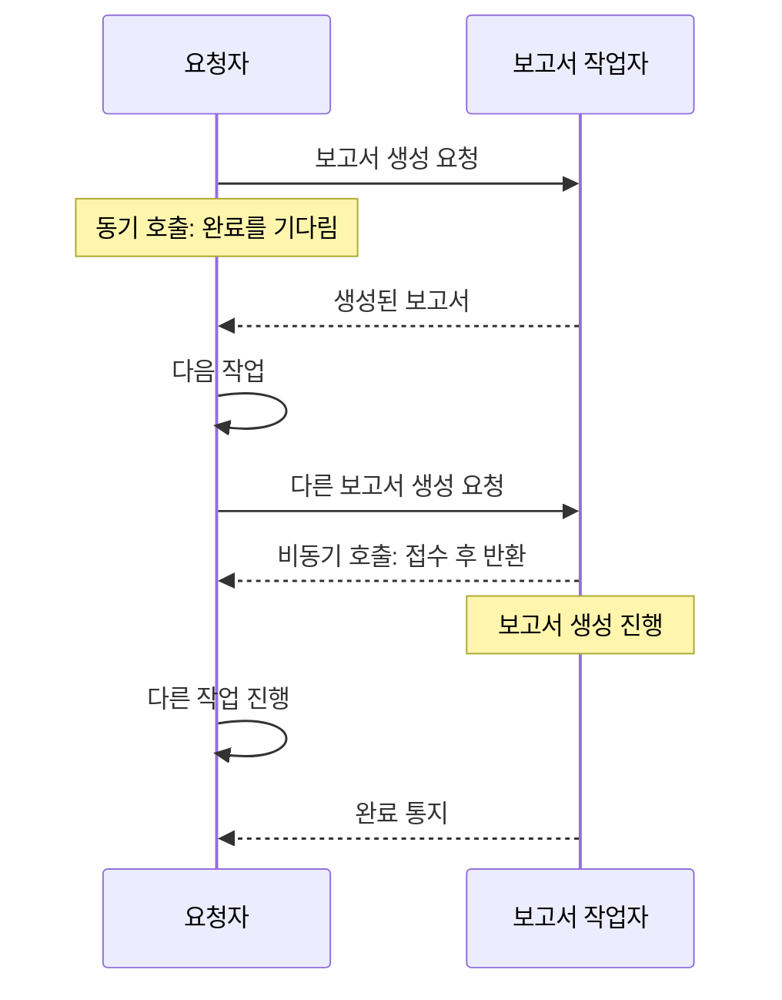

> 강의: [그림으로이해하는 동기(sync) 비동기(async)의 개념에 대한 가장 직관적인 이해](https://www.inflearn.com/course/sync-async-%EA%B0%9C%EB%85%90-%EC%9D%B4%ED%95%B4/dashboard?cid=324755)
>
> 인프런 완강 표시(2/2강, 100%)를 확인한 강의의 학습 정리다. 미리보기와 본편의 한국어 스크립트를 참고했다. 아래 도표와 예시는 이해를 돕기 위해 새로 구성했으며, 보충 설명은 강의 요약과 구분했다.

비동기, 동시 실행, 병렬 실행을 모두 “여러 일을 한꺼번에 하는 것”으로 묶으면 코드를 설명하기 어려워진다. 작업을 다른 곳에 맡겼다는 사실만으로 호출자가 기다리지 않는다고 말할 수 없고, 기다리지 않는다고 해서 맡긴 작업들이 동시에 실행되는 것도 아니다.

이 강의에서 가져갈 핵심은 관찰 대상을 나누는 것이다. 동기·비동기를 설명할 때는 **작업을 요청하는 쪽의 흐름**을 보고, 직렬·동시 처리를 설명할 때는 맡긴 작업들이 실행되는 방식을 본다.

## 호출자가 기다리는가

본편 0:32~5:19는 두 스레드 사이의 작업 전달로 동기와 비동기를 비교한다. 작업을 전달한 다음 완료까지 기다리면, 호출자는 그동안 자신의 다음 작업으로 넘어가지 못한다. 완료를 기다리지 않고 반환받으면 호출자는 다른 일을 진행할 수 있다.

다음은 그 차이를 주문 보고서 생성이라는 별도의 예시로 옮긴 그림이다. 시간 비율이나 실제 처리 속도를 나타낸 것은 아니다.

여기서 기다리지 않는다는 말은 결과가 필요 없다는 뜻이 아니다. 강의도 본편 3:05 부근에서 완료 시점을 나중에 확인하는 처리가 별도로 필요할 수 있다고 설명한다. 작업을 맡기는 시점과 결과를 사용하는 시점이 분리되는 것으로 이해하면 자연스럽다.

## 맡긴 작업은 어떤 순서로 실행되는가

본편 5:45~10:54는 직렬 처리와 동시 처리를 비교한다. 강의는 하나의 작업 스레드와 여러 작업 스레드라는 그림을 사용하고, 순서가 필요한 일과 서로 독립적인 일을 구분한다.

이 설명을 적용할 때는 스레드 개수에 앞서 작업 사이의 의존성을 적어 보는 편이 유용하다. 예를 들어 보고서의 원본 파일을 만드는 일과 그 파일을 압축하는 일은 순서가 필요하다. 서로 다른 고객의 보고서는 독립적으로 생성할 수 있는지 검토할 수 있다.

| 구분하는 축 | 질문 | 보고서 생성 예시 |
| --- | --- | --- |
| 동기·비동기 | 요청자가 완료 전에 다음 일을 할 수 있는가? | 요청 후 대기하거나 접수 응답을 받고 돌아간다. |
| 직렬·동시 처리 | 맡긴 작업들의 실행이 겹칠 수 있는가? | 보고서를 하나씩 만들거나 여러 작업을 진행한다. |

두 축을 분리하면 비동기로 요청하면서도 작업은 하나씩 처리하는 구성이 가능하다는 점이 보인다.

이 그림에서는 요청자가 보고서 완성을 기다리지 않지만, 작업자는 앞의 보고서를 마친 뒤 다음 것을 처리한다. 따라서 비동기 호출이라는 정보만으로 처리량이나 실행 순서를 판단할 수 없다.

## 화면의 반응성을 지키는 이유

본편 11:18 이후에는 이미지 다운로드와 화면 처리를 같은 스레드에 몰아줄 때 스크롤이 끊기는 사례가 나온다. 오래 걸리는 작업을 처리하는 동안 사용자 입력과 화면 갱신이 밀릴 수 있다는 설명이다.

이 사례에서 주목할 점은 다운로드 자체의 소요 시간과 사용자가 느끼는 반응성이 다르다는 것이다. 작업을 분리하는 목적은 다운로드를 무조건 더 빨리 끝내는 데만 있지 않다. 다운로드가 진행되는 동안에도 화면이 입력에 응답할 수 있게 만드는 데 있다.

서버에서도 비슷한 질문을 던질 수 있다. 보고서 생성 요청을 접수한 뒤 작업 상태를 조회하게 만들면, 사용자는 긴 HTTP 응답을 기다리는 대신 진행 상태를 확인할 수 있다. 다만 이것은 강의의 구현 예제가 아니라, 기다림을 분리한다는 개념을 서버 API에 적용해 본 설계 예시다.

## 보충: 동시성과 병렬성은 구분한다

강의는 스레드 그림으로 직관을 설명한다. 이 그림을 일반적인 정의로 넓힐 때는 동시성과 병렬성을 따로 구분할 필요가 있다. Go 공식 블로그의 [Concurrency is not parallelism](https://go.dev/blog/waza-talk)은 동시성을 독립적으로 실행되는 프로세스의 구성으로, 병렬성을 계산들이 실제로 동시에 실행되는 것으로 구분한다.

여러 작업의 진행 구간이 겹쳐도 CPU에서 같은 순간에 모두 실행되는 것은 아닐 수 있다. 따라서 “비동기니까 병렬로 실행된다”거나 “동시 처리를 하니 반드시 더 빠르다”는 결론은 이 강의의 그림만으로 내릴 수 없다. 호출 방식과 실행 구조를 먼저 확인하고, 속도는 해당 환경에서 측정해야 한다.

## 코드에서 확인할 질문

비동기 API를 만나면 이름보다 호출 이후의 흐름을 확인하려 한다. 특히 다음 세 가지를 구분해서 보면 실행 구조를 설명하기 쉽다.

- 호출이 반환됐다는 사실이 작업 완료를 뜻하는가, 접수만 뜻하는가?
- 다음 작업이 앞선 작업의 결과를 필요로 하는가?
- 완료와 실패를 어느 시점에, 어떤 경로로 확인하는가?

이 질문들은 비동기 적용 여부와 별개로 남는다. 보고서 요청을 즉시 접수했다고 응답하더라도, 생성 실패를 알릴 방법이 없다면 사용자는 결과를 기다릴 수밖에 없다. 호출자의 기다림을 줄인 설계가 결과 확인까지 다루는지 함께 봐야 한다.

## 참고

- [인프런 강의](https://www.inflearn.com/course/sync-async-%EA%B0%9C%EB%85%90-%EC%9D%B4%ED%95%B4/dashboard?cid=324755): 미리보기와 본편 한국어 스크립트. 시간 표시는 본편 기준이다.
- [Concurrency is not parallelism](https://go.dev/blog/waza-talk): 강의 밖에서 동시성과 병렬성의 구분을 보충한 자료.
