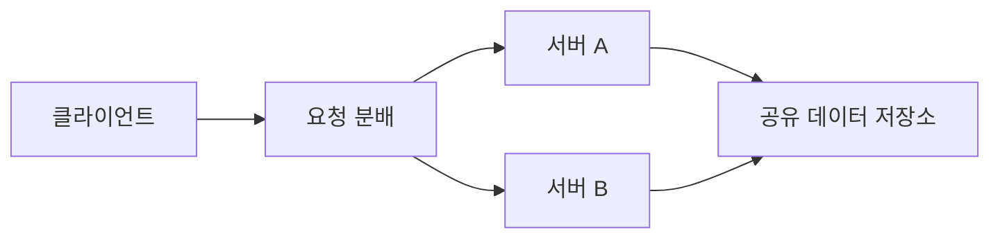
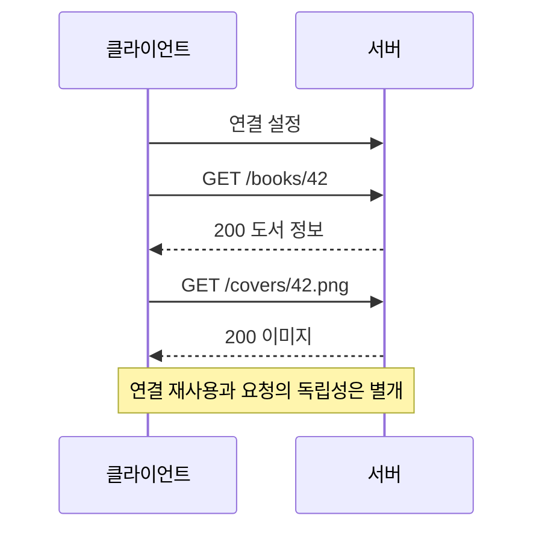

> 이 글은 김영한님의 [모든 개발자를 위한 HTTP 웹 기본 지식](https://www.inflearn.com/course/http-웹-네트워크/dashboard?cid=326277) 강의를 학습한 내용을 정리한 글입니다.
>
> [학습성과](/learning-evidence/inflearn-http-basics/)

HTTP를 배우면서 자주 섞이는 두 문장이 있다. “HTTP는 무상태다”와 “HTTP는 연결을 유지하지 않는다”다. 전자는 요청을 해석하는 의미에 관한 이야기이고, 후자는 전송 연결의 수명에 관한 이야기다. 두 문장을 같은 뜻으로 받아들이면 로그인과 연결 재사용을 설명하기 어려워진다.

## 클라이언트와 서버 사이의 계약

HTTP는 HTML만 보내는 통로가 아니다. JSON, 이미지, 바이너리 등 여러 표현을 전달할 수 있다. 클라이언트가 요청을 보내고 서버가 응답하는 구조를 통해 화면과 서버의 처리 책임을 나눌 수 있다.

| 책임 | 도서 서비스 예시 |
| --- | --- |
| 클라이언트 | 검색 조건 입력, 요청 생성, 결과 표시 |
| 서버 | 조건 해석, 접근 권한 확인, 데이터 조회, 응답 생성 |
| HTTP 계약 | 메서드, 대상, 헤더, 상태 코드, 본문 형식 |

클라이언트·서버 분리가 있다고 해서 클라이언트 코드가 반드시 동기적으로 대기한다는 뜻은 아니다. 비동기 API를 사용하는 구현과 요청·응답이라는 프로토콜 구조는 양립한다.

## 상태를 어디에 두는가

서버 A가 직전 요청에서 선택한 도서 번호를 기억하고, 다음 요청에는 “대출할게요”만 보낸다고 가정하자. 다음 요청을 서버 B가 받으면 무엇을 대출해야 하는지 모른다.

반면 요청에 도서 번호와 사용자 식별에 필요한 정보를 함께 보내고 필요한 상태를 조회할 수 있다면, 특정 서버의 직전 대화에 대한 의존을 줄일 수 있다.



이 그림이 데이터베이스를 없애자는 의미는 아니다. 무상태성을 “서버에 데이터가 없다”로 이해하면 안 된다. 도서 재고나 대출 기록은 여전히 저장되어야 한다. 줄이려는 것은 요청을 처리하기 위해 특정 연결이나 특정 인스턴스의 이전 대화만을 알아야 하는 의존이다.

인증 세션도 별도의 설계 문제다. 세션 식별자를 매 요청에 전달하더라도 서버가 세션 상태를 보관할 수 있다. 이때는 세션 저장소, 만료, 인스턴스 간 공유 같은 조건을 함께 고려한다.

## 무상태여도 연결은 재사용할 수 있다

연결을 요청마다 새로 만들면 연결 설정 비용이 반복된다. 반대로 계속 열어 두면 연결을 위한 자원과 제한을 관리해야 한다. 현대 HTTP를 설명하면서 무조건 “응답하면 연결이 끊긴다”고 쓰는 것은 부정확하다.

HTTP/1.1은 기본적으로 지속 연결을 사용한다. 같은 연결에서 여러 요청과 응답을 주고받을 수 있다. [RFC 9112, Persistence](https://www.rfc-editor.org/rfc/rfc9112.html#section-9.3)



연결을 재사용해도 두 번째 요청이 첫 번째 요청의 사용자임을 HTTP가 자동으로 인증해 주지는 않는다. 요청별 인증 정보와 애플리케이션의 검증이 필요하다.

## 메시지에서 의미와 데이터를 나눈다

아래는 설명용 HTTP/1.1 응답이다. 본문 `{"id":42}`는 ASCII 기준 9바이트이며 마지막 줄바꿈은 본문에 포함하지 않는다고 가정한다.

```http
HTTP/1.1 200 OK
Content-Type: application/json
Content-Length: 9

{"id":42}
```

| 부분 | 읽을 내용 |
| --- | --- |
| 시작 줄 | 응답의 프로토콜 버전과 상태 코드 |
| 헤더 | 표현의 형식, 길이 등 처리에 필요한 정보 |
| 빈 줄 | 헤더와 본문의 경계 |
| 본문 | 전달할 데이터 |

요청 시작 줄에는 메서드, 요청 대상, 버전이 들어간다. 응답 시작 줄에는 상태 코드가 들어간다. 헤더 필드 이름은 대소문자를 구분하지 않지만, 모든 헤더 값도 그렇다고 일반화해서는 안 된다.

`Content-Length`는 글자 수가 아니라 바이트 수다. 한글 문자열을 담은 JSON에서는 문자열 길이를 그대로 넣는 구현이 잘못된 경계를 만들 수 있다. 실제 애플리케이션에서는 프레임워크나 서버가 메시지를 올바르게 구성하도록 하는 편이 안전하다.

## 버전과 의미를 나누어 읽기

HTTP/1.1의 텍스트 메시지는 개념을 배우기 좋다. 다만 HTTP/2와 HTTP/3의 실제 전송 형식까지 같은 텍스트 줄 구조라고 생각하면 안 된다. 메서드·상태 코드·필드의 의미와 전송 형식을 분리해서 이해해야 한다.

복습할 때는 “로그인 상태”, “TCP 연결 상태”, “리소스의 저장된 상태”를 각각 다른 상자에 넣어 보자. 세 상태를 구분하면 무상태 서버, 세션 공유, 연결 풀이라는 설명이 서로 모순처럼 보이지 않는다.

## 참고

- [모든 것이 HTTP](https://www.inflearn.com/courses/lecture?courseId=326277&unitId=61359), [클라이언트 서버 구조](https://www.inflearn.com/courses/lecture?courseId=326277&unitId=61360)
- [Stateful, Stateless](https://www.inflearn.com/courses/lecture?courseId=326277&unitId=61361), [비 연결성](https://www.inflearn.com/courses/lecture?courseId=326277&unitId=61362), [HTTP 메시지](https://www.inflearn.com/courses/lecture?courseId=326277&unitId=61363)
- [RFC 9112: HTTP/1.1](https://www.rfc-editor.org/rfc/rfc9112.html)
