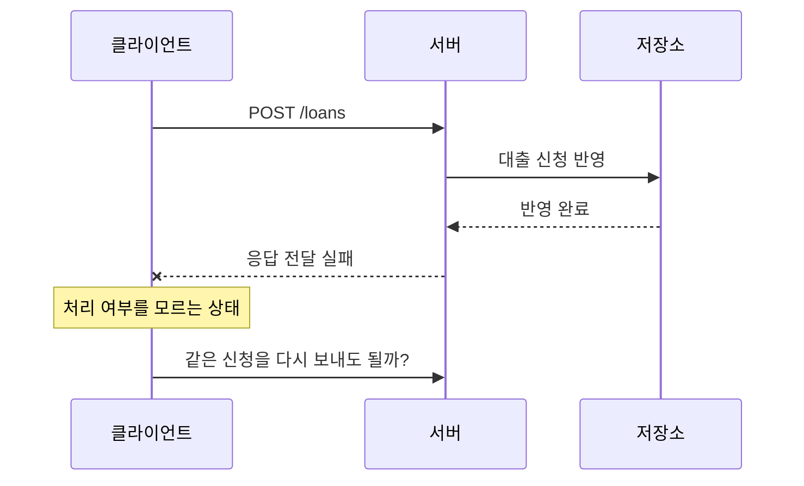

> 이 글은 김영한님의 [모든 개발자를 위한 HTTP 웹 기본 지식](https://www.inflearn.com/course/http-웹-네트워크/dashboard?cid=326277) 강의를 학습한 내용을 정리한 글입니다.
>
> [학습성과](/learning-evidence/inflearn-http-basics/)

메서드 섹션은 API의 URI를 설계하는 문제에서 출발한다. URI에 모든 동작을 적기 전에, 무엇을 대상으로 하는 요청인지 먼저 정하고 동작의 의미를 메서드로 표현한다. 이 구분은 URL을 보기 좋게 만드는 것뿐 아니라 자동 재시도와 캐시 같은 공통 동작에도 영향을 준다.

## 대상과 동작을 분리한다

도서 API를 설계한다면 다음과 같이 시작할 수 있다.

| 요청 | 대상 | 의도 |
| --- | --- | --- |
| `GET /books` | 도서 컬렉션 | 목록 조회 |
| `POST /books` | 도서 컬렉션 | 새 도서 등록 처리 |
| `GET /books/42` | 특정 도서 | 표현 조회 |
| `PUT /books/42` | 특정 도서 | 전달한 표현으로 대체 |
| `PATCH /books/42` | 특정 도서 | 지정한 부분 변경 |
| `DELETE /books/42` | 특정 도서 | 해당 리소스의 연결 제거 |

이 표는 데이터베이스 명령과의 일대일 대응표가 아니다. DELETE를 처리하면서 내부적으로 삭제 표시만 남길 수도 있고, POST는 등록 외의 처리에도 사용될 수 있다. 외부에 드러나는 계약과 저장소 구현을 분리해야 한다.

## GET과 POST는 데이터 위치만으로 나뉘지 않는다

GET은 표현을 가져오는 요청이다. 검색 조건은 보통 질의 문자열로 전달한다. 조회 결과의 URI를 공유하거나 즐겨찾기할 수 있다는 장점도 있다.

```http
GET /books?author=kim&page=2 HTTP/1.1
Host: catalog.example
Accept: application/json

```

POST는 대상 리소스가 정한 방식으로 요청 내용을 처리하도록 한다. 도서 등록이나 출판 처리처럼 새로운 상태 변화가 필요한 작업에 사용할 수 있다. 단순히 “본문이 있으면 POST”라는 기준은 부족하다.

GET 본문에 복잡한 검색 조건을 넣고 싶을 수 있지만, 일반적으로 합의된 의미가 없고 중간 장비와 구현의 호환성 문제도 있다. 이런 경우에는 조회 의미, URI 공유 가능성, 캐시 요구를 함께 검토하고 별도 검색 API 계약을 정해야 한다.

## PUT과 PATCH는 누락된 필드의 의미가 다르다

기존 도서 표현이 다음과 같다고 하자.

```json
{"title":"Network Notes","language":"ko"}
```

PUT으로 제목만 보냈을 때 서버가 빠진 `language`를 자동으로 유지해 줄 것이라고 기대하면 안 된다. PUT은 전달한 표현으로 대체하는 의미이기 때문이다. 실제로 생략 가능한 필드, 기본값, 서버 관리 필드의 처리는 API 스키마로 명확히 해야 한다.

PATCH는 변경 문서를 해석해 일부를 수정한다. 여기서도 “JSON을 일부 보낸다”만으로 계약이 완성되지는 않는다. 생략과 `null`의 차이, 배열 수정 방법, 적용 가능한 콘텐츠 타입을 정해야 한다.

```text
제목을 "New Title"로 설정한다 -> 반복해도 같은 제목
대출 횟수를 1 증가시킨다       -> 반복하면 계속 증가
```

두 번째와 같은 변경도 부분 수정이므로 PATCH라는 이름만으로 멱등성을 보장할 수 없다. 중요한 것은 실제 변경 연산이다.

## 안전성, 멱등성, 캐시 가능성

세 속성은 각각 다른 질문에 답한다.

| 속성 | 판단 질문 | 오해하기 쉬운 부분 |
| --- | --- | --- |
| 안전성 | 클라이언트가 상태 변경을 요청하는가? | 접근 로그가 생긴다고 조회가 변경 요청이 되는 것은 아님 |
| 멱등성 | 같은 요청을 반복한 의도된 효과가 한 번과 같은가? | 응답 코드나 응답 시각까지 같아야 하는 것은 아님 |
| 캐시 가능성 | 응답을 저장·재사용하는 규칙이 정의되어 있는가? | 가능하다는 것과 항상 저장된다는 것은 다름 |

GET은 안전하고 멱등적이다. PUT과 DELETE는 안전하지 않지만 멱등적이며, POST에는 일반적인 멱등성 보장이 없다. 안전성과 멱등성은 부수적인 모든 효과가 아니라 요청의 의미를 기준으로 본다. [RFC 9110, 메서드의 공통 속성](https://www.rfc-editor.org/rfc/rfc9110.html#section-9.2)

따라서 도서 삭제를 GET 링크로 제공하는 설계는 피해야 한다. 링크 미리보기나 자동 수집처럼 사람이 직접 삭제 버튼을 누르지 않은 접근도 생길 수 있기 때문이다.

## 응답 유실은 재시도의 근거가 부족하다



이 예시는 실제 장애 기록이 아니라 설계 검토용이다. 클라이언트가 응답을 받지 못했다는 사실은 업무가 실행되지 않았다는 증거가 아니다. 다시 보내면 두 건이 만들어지는 API라면 타임아웃만 보고 재전송해서는 안 된다.

보충 설계로는 신청 식별자를 두고 같은 신청의 재전송을 구별할 수 있다. 이 경우에도 식별자를 붙이는 것만으로 끝나지 않는다. 동일 식별자에 다른 내용이 들어오면 어떻게 할지, 중복 확인과 저장을 원자적으로 처리할지, 결과를 얼마나 보관할지 정해야 한다.

멱등적인 PUT도 동시 수정 문제를 자동으로 해결하지 않는다. 다른 사용자가 중간에 수정한 데이터를 뒤늦은 재시도가 덮어쓰는 문제는 버전 조건 등의 별도 동시성 제어가 필요하다.

## 캐시 가능성과 캐시 정책을 나눈다

GET 응답이라도 민감한 개인정보를 담는다면 아무 공유 캐시에나 보관해서는 안 된다. 메서드 외에 상태 코드, 응답 헤더, 인증, 캐시 구현을 함께 고려해야 한다. POST에도 캐시 의미가 정의된 경우가 있지만 일반적인 캐시 구현은 주로 GET과 HEAD를 지원한다.

메서드를 선택한 뒤에는 두 가지 문장을 덧붙여 보는 것이 좋다. “응답이 유실되면 이렇게 판단한다”와 “이 응답을 이 범위에서 재사용할 수 있다.” 여기에 답할 수 있어야 메서드 표가 실제 API 계약으로 이어진다.

## 참고

- [HTTP API를 만들어보자](https://www.inflearn.com/courses/lecture?courseId=326277&unitId=61364), [GET, POST](https://www.inflearn.com/courses/lecture?courseId=326277&unitId=61365)
- [PUT, PATCH, DELETE](https://www.inflearn.com/courses/lecture?courseId=326277&unitId=61366), [HTTP 메서드의 속성](https://www.inflearn.com/courses/lecture?courseId=326277&unitId=61367)
- [RFC 9110, Common Method Properties](https://www.rfc-editor.org/rfc/rfc9110.html#section-9.2)
