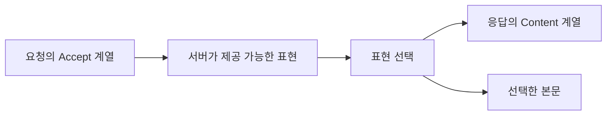
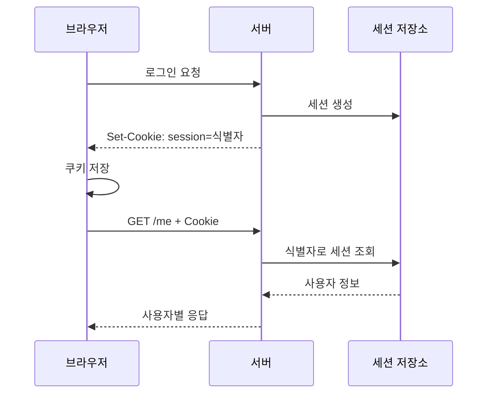

> 이 글은 김영한님의 [모든 개발자를 위한 HTTP 웹 기본 지식](https://www.inflearn.com/course/http-웹-네트워크/dashboard?cid=326277) 강의를 학습한 내용을 정리한 글입니다.
>
> [학습성과](/learning-evidence/inflearn-http-basics/)

헤더는 본문 옆에 붙는 부가 설명처럼 보이지만, 클라이언트가 본문을 해석하고 다음 요청을 만드는 데 영향을 준다. 도서 데이터를 같은 URI에서 받더라도 언어·형식·압축 방식이 다를 수 있고, 인증 여부에 따라 접근 가능 범위가 달라질 수 있다.

이 섹션은 헤더를 이름순으로 외우는 대신 무엇을 설명하는지에 따라 묶어 본다.

## 리소스와 표현을 구분한다

도서 42번이라는 리소스와 그 도서를 JSON으로 직렬화한 바이트는 같은 개념이 아니다. 하나의 리소스를 HTML이나 JSON, 서로 다른 언어로 표현할 수 있다.

| 헤더 | 설명하는 대상 | 혼동하면 안 되는 것 |
| --- | --- | --- |
| Content-Type | 본문의 미디어 타입 | 원하는 응답 타입을 말하는 Accept와 다름 |
| Content-Encoding | 적용된 콘텐츠 인코딩, 예: gzip | 문자 인코딩과 다름 |
| Content-Language | 표현의 대상 언어 정보 | 프로그래밍 언어가 아님 |
| Content-Length | 바이트 단위 길이 | 문자열의 글자 수가 아님 |

예를 들어 압축된 JSON을 응답하면 JSON이라는 형식과 gzip이라는 인코딩이 별도로 표현된다. 수신자는 인코딩을 해제한 뒤 미디어 타입에 따라 내용을 해석한다.

## Accept는 희망이고 Content-Type은 실제 형식이다

```http
GET /books/42 HTTP/1.1
Host: catalog.example
Accept: application/json
Accept-Language: ko, en;q=0.7
Accept-Encoding: gzip

```

요청은 JSON과 한국어를 선호한다고 알린다. 서버가 모든 선호를 만족시킬 수 있다는 보장은 없다. 무엇을 지원할지와 만족하지 못할 때 어떻게 응답할지는 협상 정책의 일부다.



`q`는 상대적인 선호도를 나타내며 생략하면 1로 해석한다. 타입 범위가 겹칠 때는 구체적인 매칭 관계도 고려하므로 숫자 하나만 단순 정렬하는 구현으로 일반화하면 안 된다.

보충해서 생각할 문제는 캐시다. 같은 URI의 응답이 언어에 따라 달라진다면 캐시는 그 차이를 구별해야 한다. 그렇지 않으면 첫 한국어 응답을 영어 요청에도 재사용할 수 있다. `Vary`는 다음 캐시 글에서 이 문제와 연결한다.

## 압축, 청크, 범위 요청은 다른 축이다

압축은 표현의 바이트를 줄이는 방식이고, 청크 전송은 메시지 본문의 경계를 전달하는 방식이다. HTTP/1.1의 chunked 전송은 전체 길이를 미리 확정하지 않아도 조각별로 전송할 수 있게 한다.

아래는 CRLF 줄 구분을 사용하는 개념 예시다. `5`는 다음 데이터 `hello`의 바이트 길이를 16진수로 표현한 값이며, 마지막 크기 0의 청크로 종료한다.

```http
HTTP/1.1 200 OK
Content-Type: text/plain
Transfer-Encoding: chunked

5
hello
0

```

이 형식을 `Content-Length`와 임의로 함께 사용해서는 안 된다. HTTP/2·3의 프레이밍을 HTTP/1.1의 chunked와 동일하게 설명해서도 안 된다. [RFC 9112](https://www.rfc-editor.org/rfc/rfc9112.html)

범위 요청은 또 다르다. 큰 파일에서 일부 바이트만 요청하고, 서버가 범위 요청을 수용하면 206과 `Content-Range`로 응답할 수 있다. 파일을 여러 청크로 보낸다는 사실과 클라이언트가 파일의 일부만 요청했다는 사실은 구별해야 한다.

## 제어용 헤더의 방향을 확인한다

| 헤더 | 주로 읽는 위치 | 역할 |
| --- | --- | --- |
| Host | HTTP/1.1 요청 | 동일 서버의 여러 호스트 구분 |
| Location | 응답 | 이동 대상 또는 생성된 리소스 안내 |
| Allow | 응답 | 대상에서 허용하는 메서드, 405 응답에서 중요 |
| Retry-After | 응답 | 재요청까지의 대기 시간이나 시각 안내 |
| Referer | 요청 | 이전 문맥의 URI 정보, 정책에 따라 생략·축소 가능 |
| User-Agent | 요청 | 클라이언트 정보, 신뢰할 수 있는 신원 증명은 아님 |
| Server | 응답 | 서버 소프트웨어 정보 |
| Date | 메시지 | 메시지 생성 시각 |
| From | 요청 | 요청 주체의 연락처 정보, 일반 브라우징에서는 드묾 |

헤더 이름만 보고 항상 전달된다고 기대하지 않는 것이 중요하다. 예를 들어 Referer는 인증 수단이 아니며 개인정보 보호 정책에 따라 내용이 달라질 수 있다. Server 헤더의 상세 버전 노출 여부도 운영 정책으로 검토할 부분이다.

## 인증 정보와 인증 요구는 방향이 반대다

`Authorization`은 클라이언트가 인증 자격을 전달하는 요청 헤더다. 값의 구성은 인증 방식에 따라 달라진다. 반대로 `WWW-Authenticate`는 서버가 인증에 필요한 챌린지를 알릴 때 사용한다.

```http
HTTP/1.1 401 Unauthorized
WWW-Authenticate: Basic realm="catalog", charset="UTF-8"
Content-Length: 0

```

이는 헤더의 역할을 보여주는 예시이지 Basic 인증 도입을 권하는 설정은 아니다. 인증 방식의 선택, HTTPS 적용, 자격 정보 보관은 별도로 검토해야 한다.

## 쿠키는 다음 요청에 정보를 이어 붙인다

로그인 응답을 받았다는 사실만으로 이후 모든 요청의 사용자가 자동 식별되지는 않는다. 쿠키는 서버가 전달한 작은 값을 브라우저가 보관하고, 전송 조건에 맞는 요청에 다시 포함하는 메커니즘이다.



쿠키와 세션은 같은 것이 아니다. 그림에서 브라우저의 쿠키는 식별자를 운반하고, 서버의 세션 저장소는 그 식별자에 대응하는 상태를 보관한다. 클라이언트가 보낸 사용자 이름만 믿는 방식으로 이 검증을 대체해서는 안 된다.

## 쿠키의 전송 범위와 보안 속성

```http
Set-Cookie: session=opaque-example; Path=/; Max-Age=1800; Secure; HttpOnly; SameSite=Lax
```

실제 인증 토큰이 아닌 설명용 값이다. 각 속성은 다른 조건을 제어한다.

| 속성 | 확인할 기준 |
| --- | --- |
| Expires / Max-Age | 만료 시각 또는 수명, 둘 다 있으면 Max-Age 우선 |
| Domain | 생략하면 해당 호스트에 한정, 지정하면 허용되는 하위 도메인 범위까지 고려 |
| Path | 요청 경로에 따른 전송 범위, 보안 격리 수단으로 의존하지 않음 |
| Secure | 보안 연결에서의 전송 제한 |
| HttpOnly | 자바스크립트의 쿠키 접근을 제한, 모든 XSS 피해를 막지는 않음 |
| SameSite | 교차 사이트 요청에서 쿠키 전송을 제한하는 정책 |

`SameSite`의 site는 단순히 호스트 문자열이 같은지와 동일하지 않다. `Lax`, `Strict`, `None`의 차이와 실제 로그인·외부 이동 흐름을 함께 확인해야 한다. 세션 쿠키도 브라우저의 세션 복원으로 다시 유지될 수 있으므로 “창을 닫으면 반드시 로그아웃된다”는 보안 보장으로 사용하지 않는다. [MDN Set-Cookie](https://developer.mozilla.org/en-US/docs/Web/HTTP/Reference/Headers/Set-Cookie)

쿠키는 조건에 맞는 요청에 반복해서 실리므로 큰 데이터를 저장하면 요청 비용도 늘어난다. 클라이언트에서만 사용하는 설정은 웹 스토리지 등과 역할을 구분할 수 있다. 다만 저장소를 바꾸었다고 인증 정보 노출 문제가 자동 해결되는 것은 아니다.

## 복습할 때 요청과 응답을 짝으로 본다

Accept와 Content-Type, Authorization과 WWW-Authenticate, Cookie와 Set-Cookie를 각각 짝지어 보면 방향이 분명해진다. 헤더를 개별 암기하기보다 “누가 무엇을 알려 주고, 상대가 다음에 무엇을 하는가”를 적는 편이 실제 요청 분석에 도움이 된다.

## 참고

- [HTTP 헤더 개요](https://www.inflearn.com/courses/lecture?courseId=326277&unitId=61374), [표현](https://www.inflearn.com/courses/lecture?courseId=326277&unitId=61375), [콘텐츠 협상](https://www.inflearn.com/courses/lecture?courseId=326277&unitId=61377)
- [전송 방식](https://www.inflearn.com/courses/lecture?courseId=326277&unitId=61378), [일반 정보](https://www.inflearn.com/courses/lecture?courseId=326277&unitId=61379), [특별한 정보](https://www.inflearn.com/courses/lecture?courseId=326277&unitId=61380)
- [인증](https://www.inflearn.com/courses/lecture?courseId=326277&unitId=61381), [쿠키](https://www.inflearn.com/courses/lecture?courseId=326277&unitId=61382)
- [RFC 6265: Cookie](https://www.rfc-editor.org/rfc/rfc6265.html), [RFC 9112: HTTP/1.1](https://www.rfc-editor.org/rfc/rfc9112.html), [MDN Set-Cookie](https://developer.mozilla.org/en-US/docs/Web/HTTP/Reference/Headers/Set-Cookie)
