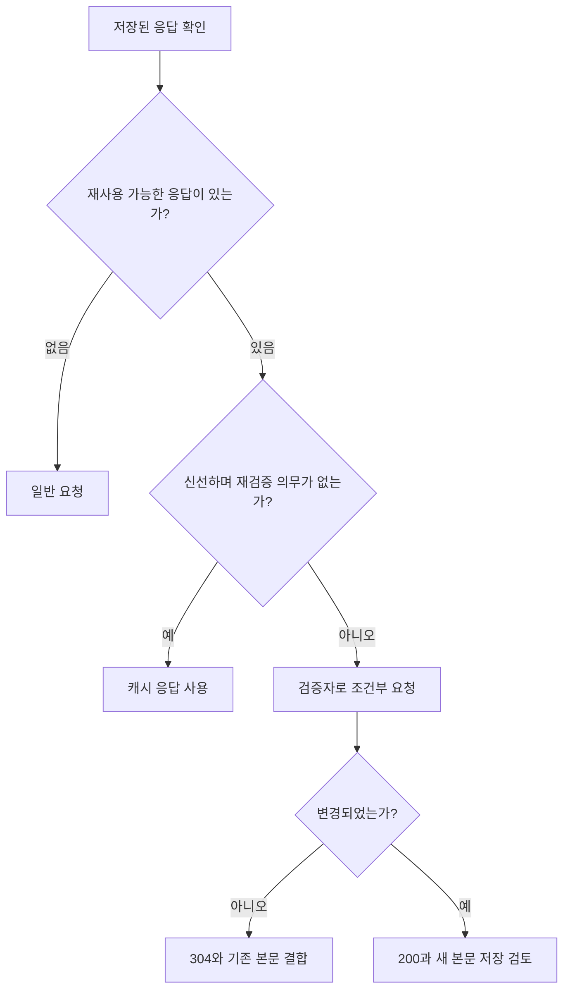
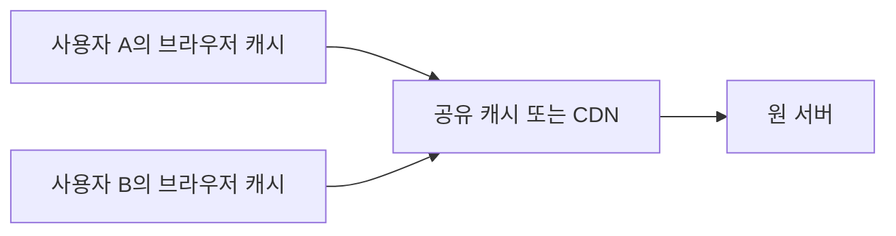

> 이 글은 김영한님의 [모든 개발자를 위한 HTTP 웹 기본 지식](https://www.inflearn.com/course/http-웹-네트워크/dashboard?cid=326277) 강의를 학습한 내용을 정리한 글입니다.
>
> [학습성과](/learning-evidence/inflearn-http-basics/)

캐시를 켜거나 끈다는 표현만으로는 정책을 설명하기 어렵다. 저장할 수 있는지, 저장된 응답을 확인 없이 재사용할 수 있는지, 누구에게 재사용할 수 있는지가 각각 다르기 때문이다. 캐시 섹션은 기본 동작에서 시작해 검증 헤더, 조건부 요청, 공유 캐시, 재사용 제한으로 이어진다.

## 만료와 변경은 같은 사건이 아니다

도서 표지 응답에 `Cache-Control: max-age=120`이 있다고 가정하자. 다른 제약이 없다면 캐시는 신선한 기간에 저장된 응답을 재사용할 수 있다. 이때는 본문 재전송뿐 아니라 서버와의 왕복도 줄일 수 있다.

하지만 신선도가 끝났다고 표지 이미지가 바뀌었다는 뜻은 아니다. 단지 확인 없이 재사용할 수 있는 기간이 끝났다는 뜻이다. 여기서 변경 여부만 물어볼 수 있다면 같은 이미지를 다시 내려받지 않아도 된다.



검증자가 없는 경우나 저장을 금지한 응답 등은 별도로 처리한다. 그림은 조건부 GET을 이해하기 위한 기본 경로이지 캐시의 모든 예외를 담은 구현 명세는 아니다.

## Last-Modified와 ETag

| 검증 정보 | 다음 요청의 조건 | 비교 기준 |
| --- | --- | --- |
| Last-Modified | If-Modified-Since | 수정 시각 |
| ETag | If-None-Match | 서버가 부여한 표현의 검증자 |

수정 시각은 이해하기 쉽지만 시간 정밀도와 실제 콘텐츠 변경이 항상 일치하지 않는 문제가 있다. ETag는 날짜가 아니라 버전 식별 정보를 이용할 수 있다. 반드시 파일 해시여야 하는 것은 아니다.

그렇다고 콘텐츠가 바뀌어도 같은 강한 ETag를 임의로 유지해도 된다는 뜻은 아니다. 어떤 표현을 동일하게 볼지와 검증자의 강도에 맞는 생성 규칙이 필요하다. 클라이언트는 ETag 내부의 버전 문자열을 해석하지 않고 서버가 준 값을 조건에 사용한다.

## 조건부 GET의 왕복

다음은 표지의 메타데이터를 JSON으로 반환하는 설명용 예시다. 본문은 줄바꿈을 제외하고 9바이트다.

```http
HTTP/1.1 200 OK
Content-Type: application/json
Content-Length: 9
Cache-Control: max-age=120
ETag: "cover-v7"

{"id":42}
```

신선도가 끝나면 저장한 검증자를 보낸다.

```http
GET /cover-metadata/42 HTTP/1.1
Host: catalog.example
If-None-Match: "cover-v7"

```

선택된 표현이 바뀌지 않았다면 다음과 같은 응답을 받을 수 있다.

```http
HTTP/1.1 304 Not Modified
ETag: "cover-v7"
Cache-Control: max-age=120

```

304에는 새 본문이 없다. 캐시는 저장된 본문을 재사용하고 응답의 메타데이터를 반영한다. 변경되었다면 새 표현을 담은 200 응답을 받는 흐름이다.

따라서 304는 “네트워크 요청이 없었다”는 의미가 아니다. 왕복은 있었고 큰 본문의 재전송을 줄인 것이다. 완전히 신선한 캐시에서 바로 가져온 경우와 구별해야 한다.

## 조건부 요청이 모두 304인 것은 아니다

강의에서는 캐시 검증을 중심으로 조건부 요청을 다룬다. 보충해서 구분할 점은 조건부 수정이다. GET의 `If-None-Match`와, 수정 전에 버전을 맞추는 `If-Match`는 목적이 다르다.

```text
GET + If-None-Match  -> 저장한 표현이 그대로인지 확인
PUT + If-Match      -> 내가 아는 버전일 때만 변경하도록 요구
```

수정 조건이 실패한 경우에는 304가 아니라 412 같은 결과가 적용될 수 있다. “조건이 안 맞으면 언제나 304”로 외우지 않고, 메서드와 조건을 함께 읽어야 한다.

## Cache-Control은 목적별로 읽는다

| 지시어 | 핵심 질문 |
| --- | --- |
| max-age | 응답이 얼마나 오래 신선한가? |
| no-cache | 재사용 전에 성공적인 검증이 필요한가? |
| no-store | 캐시에 저장하는 것 자체를 금지하는가? |
| private | 공유 캐시에 저장하지 못하게 할 것인가? |
| public | 공유 캐시를 포함한 저장을 명시적으로 허용하는가? |
| s-maxage | 공유 캐시의 신선도 기간을 따로 정하는가? |
| must-revalidate | 오래된 응답을 검증 없이 재사용하지 못하게 하는가? |

`no-cache`는 저장 금지와 다르다. 저장된 본문이 있어도 사용 전에 검증해야 한다는 뜻이다. `no-store`는 저장을 막는 목적이다. 또한 private는 암호화가 아니라 저장 범위에 대한 지시다. [RFC 9111, 응답 지시어](https://www.rfc-editor.org/rfc/rfc9111.html#section-5.2.2)

`Expires`는 만료 시각을 나타내며, 적용 가능한 `max-age`가 함께 있으면 그 지시가 우선한다. `Pragma`는 과거 호환성 맥락을 구분해 읽어야 한다. 특히 응답의 `Pragma: no-cache`만을 현대적인 캐시 제어의 대체물로 의존하지 않는다.

## 브라우저 캐시와 공유 캐시



공용 표지는 여러 사용자에게 재사용해도 될 수 있지만 `/me/loans`의 대출 목록은 그렇지 않다. URI가 같아도 인증된 사용자에 따라 응답이 다르기 때문이다. “GET이면 공유 캐시에 저장” 같은 일괄 정책은 위험하다.

헤더를 생략했다고 기본적으로 private가 되는 것도 아니다. 저장 가능성은 응답 전체와 캐시 규칙으로 결정되므로 사용자별 데이터의 정책을 명시해야 한다.

언어 협상으로 본문이 달라지는 응답에는 `Vary: Accept-Language`처럼 어떤 요청 필드가 표현 선택에 영향을 주는지 전달할 수 있다. Vary를 무조건 많이 추가하면 캐시 변형이 늘어나므로 실제로 표현을 바꾸는 기준과 일치시켜야 한다.

## 현재 명세로 보충한 캐시 무효화

강의의 캐시 무효화 예시는 하위 호환성과 장애 상황까지 고려해 여러 지시어를 조합한다. 다만 이를 “모든 서비스에 반드시 같은 조합이 필요하다”는 규칙으로 적용하기보다는 현재 명세와 목적을 기준으로 나누어야 한다.

현재 RFC 9111에서 인자 없는 응답 `no-cache`는 성공적인 검증 없는 재사용을 허용하지 않는다. 따라서 “no-cache여도 원 서버가 끊기면 언제나 오래된 응답을 줄 수 있다”고 일반화하지 않는다. `must-revalidate`는 응답이 오래된 뒤의 검증 의무를 명시한다. [RFC 9111, no-cache](https://www.rfc-editor.org/rfc/rfc9111.html#section-5.2.2.4)

아래는 운영 처방이 아니라 정책 검토의 출발점이다.

| 요구사항 | 검토할 방향 |
| --- | --- |
| 저장된 본문은 활용하되 매번 변경 여부 확인 | no-cache와 검증자 |
| 민감한 응답을 HTTP 캐시에 남기지 않음 | no-store |
| 사용자별 응답을 브라우저에만 저장 | private와 별도의 신선도·검증 정책 |
| 공개 정적 자산 재사용 | 버전이 포함된 URL과 적절한 신선도 기간 |

헤더 변경은 이미 배포된 모든 캐시를 즉시 지우는 명령이 아니다. CDN 무효화, URL 버전 변경, 애플리케이션 저장소의 갱신은 별도 문제다. HTTP 캐시 제어만으로 화면의 모든 저장 상태가 제거된다고 기대해서는 안 된다.

## 확인할 관찰 항목

직접 검증할 때는 동일 요청의 첫 응답, 신선한 상태의 재요청, 신선도가 끝난 뒤의 요청을 구분해 기록한다. 상태 코드만 보지 말고 전송 크기, 캐시 출처 표시, ETag, 조건부 요청 헤더를 함께 본다. 개발자 도구의 캐시 비활성화 옵션이 켜져 있으면 평상시 동작과 다른 결과가 나올 수 있다.

이 글의 메시지는 설명용으로 구성했으며 특정 브라우저나 CDN에서 실행한 측정 결과가 아니다. 실제 정책 검증에서는 사용하는 캐시 구현과 응답 경로를 함께 기록해야 한다.

## 참고

- [캐시 기본 동작](https://www.inflearn.com/courses/lecture?courseId=326277&unitId=61383), [검증 헤더와 조건부 요청1](https://www.inflearn.com/courses/lecture?courseId=326277&unitId=61384), [검증 헤더와 조건부 요청2](https://www.inflearn.com/courses/lecture?courseId=326277&unitId=61385)
- [캐시와 조건부 요청 헤더](https://www.inflearn.com/courses/lecture?courseId=326277&unitId=61386), [프록시 캐시](https://www.inflearn.com/courses/lecture?courseId=326277&unitId=61387), [캐시 무효화](https://www.inflearn.com/courses/lecture?courseId=326277&unitId=62171)
- [RFC 9111: HTTP Caching](https://www.rfc-editor.org/rfc/rfc9111.html), [RFC 9110: HTTP Semantics](https://www.rfc-editor.org/rfc/rfc9110.html)
