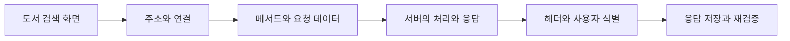

> 이 글은 김영한님의 [모든 개발자를 위한 HTTP 웹 기본 지식](https://www.inflearn.com/course/http-웹-네트워크/dashboard?cid=326277) 강의를 학습한 내용을 정리한 글입니다.
>
> [학습성과](/learning-evidence/inflearn-http-basics/)

웹 프레임워크로 API를 만들다 보면 요청을 받는 코드는 금방 작성할 수 있다. 하지만 응답이 오지 않을 때 다시 요청해도 되는지, 로그인한 사용자의 응답을 캐시해도 되는지는 컨트롤러 문법만으로 답하기 어렵다. HTTP를 공부하는 이유는 이런 선택에 기준을 갖기 위해서다.

소개 섹션의 중심도 여기에 있다. HTTP의 모든 확장 규격을 외우기보다 웹 개발에서 자주 만나는 개념을 연결하고, 필요한 세부사항을 찾아갈 수 있는 기반을 만드는 것이다.

## 하나의 요청에 여러 판단이 들어간다

다음은 이 시리즈에서 사용할 독립적인 학습 상황이다. 작은 도서 목록 서비스를 만들고, 검색·수정·로그인·표지 이미지 조회를 제공한다고 가정한다.

이 흐름에서 질문은 서로 다르다. 서버를 찾는 것과 어떤 책을 조회하는 것은 다르고, 요청이 전달된 것과 대출 처리가 완료된 것도 다르다. 한 계층의 성공을 전체 작업의 성공으로 해석하지 않는 것이 첫 번째 학습 기준이다.

| 학습 범위 | 도서 서비스에서 확인할 질문 |
| --- | --- |
| 네트워크 | 서버의 주소와 애플리케이션의 포트를 어떻게 구분하는가? |
| URI | 책 한 권, 검색 결과, 화면 내부 위치를 어떻게 표현하는가? |
| HTTP 기본 | 연결을 재사용하면서도 요청을 독립적으로 처리할 수 있는가? |
| 메서드 | 조회와 변경을 클라이언트가 구별할 수 있는가? |
| 상태 코드 | 작업 완료와 접수만 된 상태를 구별할 수 있는가? |
| 일반 헤더 | 데이터의 형식과 인증 정보를 어떻게 전달하는가? |
| 캐시 | 이미 받은 표지를 언제 다시 내려받아야 하는가? |

## 용어보다 판단의 근거를 남긴다

복습할 때는 정의 옆에 반례를 붙여 놓는 편이 유용하다. “GET은 조회다”에서 끝내지 않고 “조회 URL에 삭제 기능이 들어가면 어떤 자동화가 위험해지는가”까지 적는다. “PUT은 멱등이다” 옆에는 “응답 코드가 매번 같아야 한다는 뜻인가”를 붙인다.

이 시리즈의 메시지와 다이어그램은 이러한 질문을 설명하기 위해 별도로 구성했다. 강의의 슬라이드나 실습 결과를 재현한 것이 아니며, 실제로 측정하지 않은 성능 수치도 넣지 않는다.

## 프레임워크와 HTTP를 양방향으로 연결하기

애노테이션 이름을 HTTP 메시지로 바꿔 설명해 보는 것이 한 가지 방법이다. 요청 파라미터를 받는 기능은 URI의 질의 부분과 연결되고, 응답 객체를 직렬화하는 기능은 본문과 `Content-Type`으로 연결된다. 반대로 HTTP 응답을 보고 프레임워크의 어느 설정이 영향을 주었는지 찾아갈 수도 있어야 한다.

공부의 결과물은 기능 목록보다 작은 설계표로 남기는 것이 좋다. 도서 조회 하나에 대해 메서드, URI, 정상 응답, 실패 응답, 캐시 정책을 적는다. 이후 섹션에서 그 표를 조금씩 구체화한다.

## 참고

- [소개영상](https://www.inflearn.com/courses/lecture?courseId=326277&unitId=61388)
- [시리즈 전체 목록](/series/http-web-basics/)
