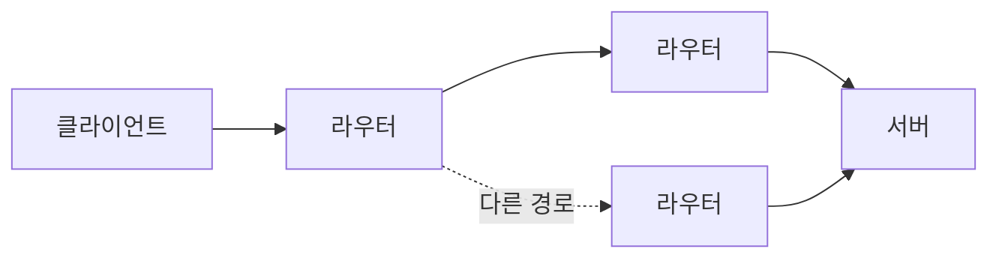
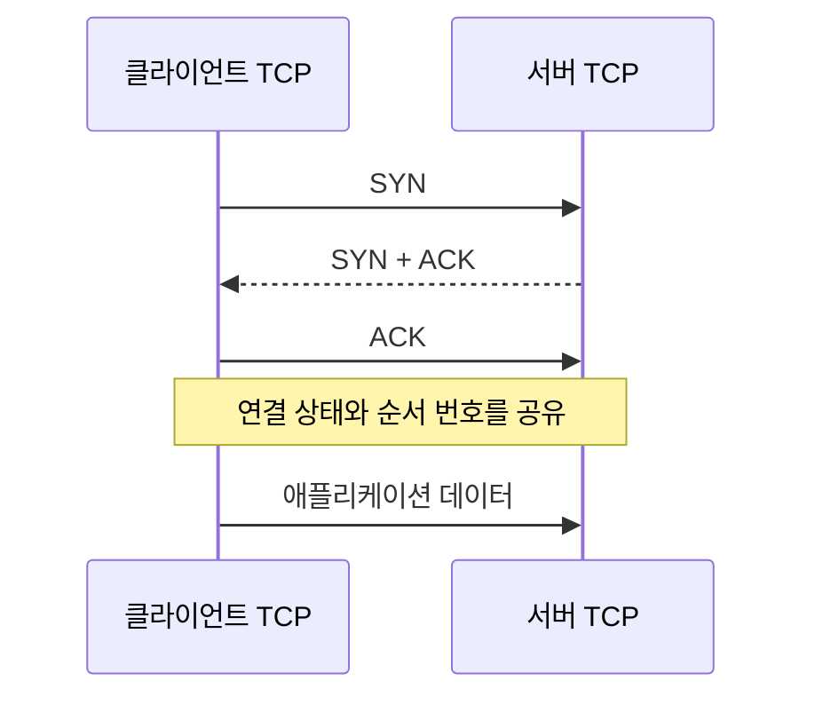

> 이 글은 김영한님의 [모든 개발자를 위한 HTTP 웹 기본 지식](https://www.inflearn.com/course/http-웹-네트워크/dashboard?cid=326277) 강의를 학습한 내용을 정리한 글입니다.
>
> [학습성과](/learning-evidence/inflearn-http-basics/)

브라우저에서 도서 검색 버튼을 누르면 서버로 요청이 간다. 이 짧은 문장을 나누면 여러 문제가 나타난다. 서버가 어디에 있는지 알아야 하고, 중간 네트워크를 지나야 하며, 도착한 데이터를 어떤 프로그램에 전달할지도 결정해야 한다.

네트워크 섹션은 인터넷 통신, IP, TCP·UDP, 포트, DNS를 통해 이 문제를 나누어 설명한다. 모든 계층을 하나의 “연결”로 뭉뚱그리지 않는 것이 복습의 출발점이다.

## 주소를 안다고 전달이 보장되지는 않는다

IP는 출발지와 목적지 주소를 이용해 패킷을 전달하는 기반이다. 하지만 목적지 프로그램이 준비되어 있는지 미리 확인하거나, 중간에 빠진 패킷을 애플리케이션 대신 복구해 주는 역할까지 맡지는 않는다.



그림은 가능한 경로를 단순화한 것이다. 실제 경로는 네트워크 상태와 라우팅 정책에 따라 달라질 수 있다. 주소가 올바르더라도 장비 장애나 혼잡으로 전달에 실패할 수 있고, 나누어 보낸 데이터가 같은 순서로 도착한다는 보장도 없다.

따라서 “IP 주소가 맞다”와 “HTTP 응답을 받을 수 있다”는 별개의 확인 항목이다. 주소 다음에는 전송 계층과 애플리케이션 상태를 확인해야 한다.

## TCP가 애플리케이션에 제공하는 것

TCP는 신뢰성 있는 순서화된 바이트 스트림을 제공한다. 순서 번호와 확인 응답, 재전송 같은 메커니즘으로 손실과 순서 문제를 다룬다. 단, 네트워크가 영원히 끊겨도 전달을 완료한다는 보장은 아니다. 실패를 감지하고 연결이 종료되는 상황도 있다. [RFC 9293](https://www.rfc-editor.org/rfc/rfc9293.html)

연결을 만드는 기본 흐름은 다음과 같다.



여기서 연결은 두 끝점이 관리하는 논리적 상태다. 인터넷의 중간 장비들이 이 클라이언트만을 위한 전용선을 예약한 것은 아니다.

또한 TCP는 순서가 있는 바이트 스트림을 제공할 뿐, 도서 JSON 하나가 어디서 끝나는지 같은 애플리케이션 메시지 경계를 알지 못한다. 그 경계를 해석하는 일은 HTTP 같은 상위 프로토콜의 역할이다.

## 전달 확인과 업무 성공을 구별한다

다음 상황을 생각해 볼 수 있다.

1. 클라이언트가 대출 신청 데이터를 보낸다.
2. 서버의 TCP 계층이 데이터를 수신한다.
3. 서버 애플리케이션이 데이터베이스에 반영하기 전에 종료된다.

2번이 성공했다고 3번까지 완료된 것은 아니다. 반대 상황도 가능하다. 데이터베이스 반영은 끝났는데 응답이 돌아오는 중 연결이 끊길 수 있다. 그래서 TCP의 신뢰성과 HTTP 요청 재시도 정책은 대체 관계가 아니다.

이 차이를 놓치면 “응답이 없으니 처리도 안 됐다”는 잘못된 전제로 중복 신청을 만들 수 있다. 메서드의 멱등성은 뒤에서 이 문제와 연결된다.

## UDP는 무엇을 생략하는가

| 구분 | TCP | UDP |
| --- | --- | --- |
| 애플리케이션이 보는 단위 | 바이트 스트림 | 데이터그램 |
| 연결 설정 | 연결 상태를 수립 | TCP와 같은 연결 설정 없음 |
| 순서·손실 처리 | 프로토콜이 제공 | UDP 자체는 제공하지 않음 |
| 설계 시 질문 | 연결과 스트림을 어떻게 관리할까? | 누락·중복·순서 문제를 어디에서 처리할까? |

UDP를 사용한다는 사실만으로 서비스 전체가 신뢰성을 포기하는 것은 아니다. 필요한 기능을 상위 프로토콜이 제공할 수 있다. 보충 사례로 HTTP/3는 UDP 위의 QUIC을 사용한다. 이를 “HTTP/3는 데이터가 유실되어도 상관없다”로 해석하면 안 된다. [RFC 9114](https://www.rfc-editor.org/rfc/rfc9114.html)

## 포트와 DNS를 같은 주소로 생각하지 않는다

하나의 서버에서 웹 API와 다른 네트워크 서비스가 함께 실행될 수 있다. IP 주소가 호스트를 찾는 데 쓰인다면, TCP·UDP의 포트 번호는 그 호스트에서 통신 끝점을 구분하는 데 쓰인다. 연결을 구별할 때는 목적지 포트 하나만이 아니라 출발지·목적지 주소와 포트 등의 조합을 본다.

DNS는 사람이 사용하는 이름과 네트워크 주소를 연결한다. `catalog.example`이라는 이름을 유지하면서 서버 주소를 바꿀 수 있지만, 캐시가 있으므로 모든 클라이언트의 관찰이 즉시 바뀐다고 가정하면 안 된다.

```text
catalog.example       이름을 어떻게 해석할까?  -> DNS
192.0.2.20            어느 주소로 보낼까?      -> IP
192.0.2.20:443        어느 통신 끝점일까?     -> TCP 포트
/books/42             무엇을 요청할까?        -> HTTP 요청 대상
```

예시의 도메인과 IP는 설명용이다. 실제 서비스에 대한 접속 결과가 아니다.

## 장애를 계층별 질문으로 바꾸기

DNS 조회 실패, 연결 거부, 연결 타임아웃, HTTP 500 응답은 같은 현상이 아니다. 이름 해석에 실패한 것인지, 통신 끝점에 도달하지 못한 것인지, 요청을 받은 애플리케이션이 처리에 실패한 것인지부터 나누어야 한다.

HTTP 상태 코드를 받았다면 적어도 그 응답을 만든 HTTP 서버나 중간 서버까지는 통신이 진행되었다. 그렇다고 원래 애플리케이션의 업무가 성공했다는 의미는 아니다. 이 정도만 구분해도 장애 조사에서 첫 질문이 훨씬 구체적이 된다.

## 참고

- [인터넷 통신](https://www.inflearn.com/courses/lecture?courseId=326277&unitId=61344), [IP](https://www.inflearn.com/courses/lecture?courseId=326277&unitId=61353), [TCP, UDP](https://www.inflearn.com/courses/lecture?courseId=326277&unitId=61354)
- [PORT](https://www.inflearn.com/courses/lecture?courseId=326277&unitId=61355), [DNS](https://www.inflearn.com/courses/lecture?courseId=326277&unitId=61356)
- [RFC 9293: TCP](https://www.rfc-editor.org/rfc/rfc9293.html), [RFC 9114: HTTP/3](https://www.rfc-editor.org/rfc/rfc9114.html)
