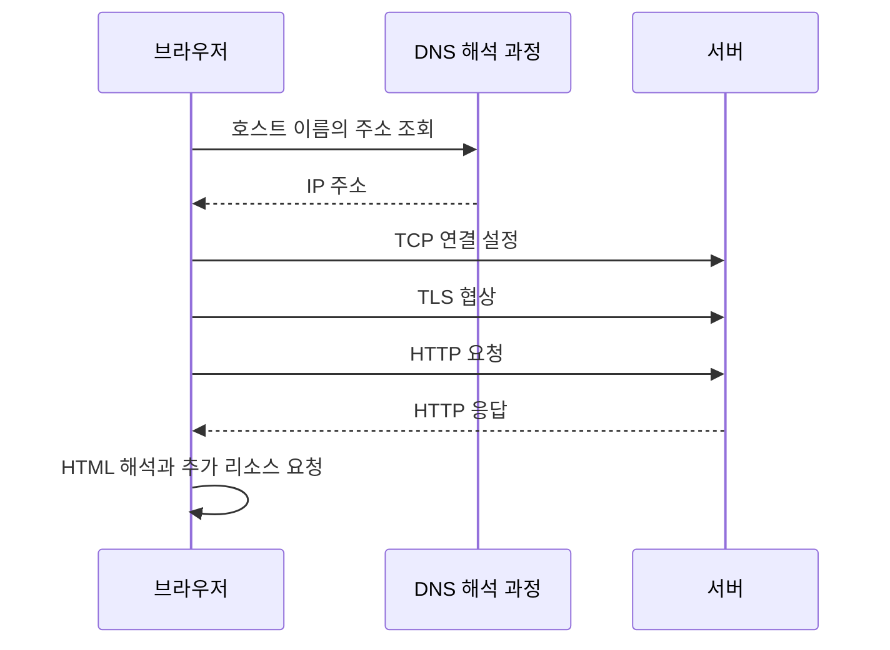

> 이 글은 김영한님의 [모든 개발자를 위한 HTTP 웹 기본 지식](https://www.inflearn.com/course/http-웹-네트워크/dashboard?cid=326277) 강의를 학습한 내용을 정리한 글입니다.
>
> [학습성과](/learning-evidence/inflearn-http-basics/)

주소창의 문자열 전체가 그대로 서버에 전달되는 것은 아니다. 일부는 접속 대상을 정하는 데 쓰이고, 일부는 HTTP 요청에 들어가며, 일부는 브라우저 쪽에서 처리된다. URI 섹션은 이 차이를 이해한 뒤 브라우저 요청 흐름으로 연결한다.

## 식별자와 위치를 구분한다

URI는 리소스를 식별하는 개념이고, URL은 위치와 접근 방법을 통해 식별하는 URI다. URN은 이름을 중심으로 식별하는 방식을 떠올리면 된다. 웹 개발에서는 HTTP URL을 두고 URI라는 말을 자주 쓰지만, 세 용어의 정의가 완전히 같다는 뜻은 아니다. [RFC 3986](https://www.rfc-editor.org/rfc/rfc3986.html)

리소스는 파일에 한정되지 않는다. 도서 한 권, 검색 결과, 비동기 작업의 상태도 식별 대상이 될 수 있다. `/books/42`가 실제 디스크의 `42`라는 파일과 대응할 필요는 없다.

## URL을 부분별로 해석한다

```text
https://catalog.example:443/books/42?lang=ko#reviews
\___/   \_____________/\_/\_______/ \_____/ \_____/
scheme       host     port  path     query  fragment
```

| 부분 | 예시 | 역할 |
| --- | --- | --- |
| 스킴 | `https` | 접근 방식 |
| 호스트 | `catalog.example` | 요청 대상의 호스트 이름 |
| 포트 | `443` | 통신 끝점의 포트, 기본값이면 생략 가능 |
| 경로 | `/books/42` | 서비스 안에서 대상 식별 |
| 질의 | `lang=ko` | 추가 식별·선택 정보 |
| 프래그먼트 | `reviews` | 가져온 표현 안의 특정 부분 식별 |

이 예시를 HTTP/1.1 요청으로 표현하면 다음과 같다.

```http
GET /books/42?lang=ko HTTP/1.1
Host: catalog.example
Accept: text/html

```

`#reviews`는 요청 대상에 포함되지 않는다. 같은 문서를 받은 뒤 어느 부분으로 이동할지 브라우저가 처리할 수 있기 때문이다. 따라서 서버가 `reviews` 값을 받아야 하는 기능이라면 프래그먼트에 넣는 설계는 맞지 않는다.

질의의 `lang`이라는 이름에 HTTP가 한국어 선택이라는 의미를 부여하지도 않는다. 그 의미는 애플리케이션 계약이다. `page=2`를 숫자로 변환하는 규칙 역시 서버에서 결정한다.

## 브라우저 요청을 계층별로 따라가기

다음은 새 연결이 필요한 HTTPS 요청의 단순화된 흐름이다. 강의의 TCP 기반 설명에 TLS 단계를 보충했다.



이 그림의 모든 단계를 매번 반복하는 것은 아니다. DNS 결과나 응답이 캐시에 있을 수 있고, 이미 열린 연결을 재사용할 수도 있다. HTTP/3를 사용하는 경우에는 TCP 단계가 아니라 QUIC 기반의 흐름을 고려해야 한다.

또한 HTML 응답 하나가 도착했다고 페이지 로딩이 끝난 것은 아니다. 문서가 참조하는 스타일시트·이미지·스크립트 때문에 추가 요청이 발생할 수 있다. 개발자 도구에서 요청이 여러 개 보이는 이유다.

## 주소 변경과 요청 변경을 구분한다

도서 상세 페이지에서 `#reviews`만 바뀌는 이동과 `?lang=en`으로 바뀌는 이동은 서버 관점에서 같지 않다. 전자는 기존 문서 안에서 처리될 수 있고, 후자는 다른 표현을 요청하는 URL이 될 수 있다.

물론 클라이언트 라우터가 URL 변경을 가로채 화면만 바꿀 수도 있다. 따라서 주소창이 바뀌었다는 사실만으로 네트워크 요청 발생을 단정하지 말고, Network 패널의 실제 요청을 함께 확인해야 한다.

이 섹션을 복습할 때는 URL 하나를 선택해 세 가지 색으로 나누어 보는 것이 좋다. 접속에 쓰는 부분, HTTP 요청 대상으로 보내는 부분, 클라이언트에서 해석하는 부분이다. 주소의 문법을 외우는 것보다 각 부분을 누가 소비하는지 설명하는 데 도움이 된다.

## 참고

- [URI](https://www.inflearn.com/courses/lecture?courseId=326277&unitId=61357), [웹 브라우저 요청 흐름](https://www.inflearn.com/courses/lecture?courseId=326277&unitId=61358)
- [RFC 3986: URI Generic Syntax](https://www.rfc-editor.org/rfc/rfc3986.html)
- [RFC 9114: HTTP/3](https://www.rfc-editor.org/rfc/rfc9114.html)
