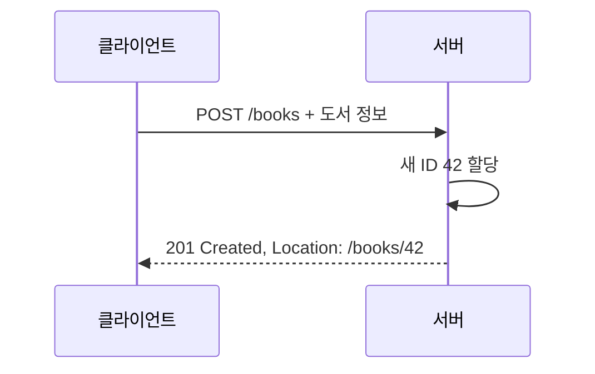

> 이 글은 김영한님의 [모든 개발자를 위한 HTTP 웹 기본 지식](https://www.inflearn.com/course/http-웹-네트워크/dashboard?cid=326277) 강의를 학습한 내용을 정리한 글입니다.
>
> [학습성과](/learning-evidence/inflearn-http-basics/)

메서드의 정의를 알아도 화면과 API를 설계하면 선택지가 남는다. 검색 조건은 어디에 넣는지, 파일은 어떻게 전송하는지, 생성할 자원의 주소는 누가 정하는지 같은 문제다. 이 섹션은 데이터 전송 방식과 API 설계를 함께 다룬다.

## 전송할 데이터와 요청 의미를 함께 본다

| 상황 | 일반적인 구성 | 설계 시 확인할 점 |
| --- | --- | --- |
| 정적 이미지 조회 | GET + 경로 | 리소스 주소와 캐시 정책 |
| 검색 결과 조회 | GET + 질의 | 검색 조건과 페이지 기준 |
| HTML 폼 제출 | GET 또는 POST | 브라우저의 기본 폼 동작 |
| 파일과 텍스트 제출 | POST + multipart | 각 파트의 타입·용량·검증 |
| 프로그램 간 API | 메서드 + 헤더 + 본문 | 명시적인 스키마와 오류 계약 |

GET과 POST의 차이를 암호화 여부로 설명하면 안 된다. 질의 문자열을 쓰는지 본문을 쓰는지는 표현 방식이고, 전송 구간의 보호는 HTTPS 등의 문제다. 본문이라고 해서 자동으로 민감정보가 보호되지는 않는다.

## 기본 HTML 폼이 만드는 요청

다음은 실행 결과가 아니라 브라우저의 전송 형태를 설명하는 예시다.

```html
<form action="/books" method="get">
  <input name="keyword" value="network">
  <button type="submit">검색</button>
</form>
```

이 폼은 검색 조건을 URL의 질의 부분으로 전달한다. 실제 문자가 포함되면 인코딩이 적용된다.

```http
GET /books?keyword=network HTTP/1.1
Host: catalog.example

```

일반적인 POST 폼은 `application/x-www-form-urlencoded` 형식으로 본문에 값을 담는다. 파일을 함께 보낼 때는 다음처럼 `multipart/form-data`를 사용한다.

```html
<form action="/covers" method="post" enctype="multipart/form-data">
  <input name="bookId" value="42">
  <input name="image" type="file">
  <button type="submit">표지 업로드</button>
</form>
```

multipart는 각 파트를 경계 문자열로 나누고 텍스트와 파일을 함께 표현한다. 파트별로 이름과 콘텐츠 정보가 있으므로 서버는 각각을 해석할 수 있다. 클라이언트가 보낸 파일 이름과 콘텐츠 타입만 믿고 저장하는 것은 별도 보안 문제를 만든다. 이 글의 전송 예시가 파일 업로드 검증 전체를 대신하지는 않는다.

기본 HTML 폼의 HTTP 전송은 GET과 POST를 중심으로 동작한다. 자바스크립트 API 호출에서는 PUT·PATCH·DELETE를 사용할 수 있지만, 이를 기본 폼 동작과 혼동해서는 안 된다.

## 생성할 URI를 누가 정하는가

도서 등록은 서버가 ID를 발급하는 방식으로 설계할 수 있다.



클라이언트는 등록 전에 `/books/42`라는 주소를 몰라도 된다. 이처럼 서버가 관리하는 컬렉션에 생성 요청을 보낼 수 있다.

반면 파일 저장 API에서 클라이언트가 `/covers/42.png`라는 대상을 정한다면 PUT으로 해당 위치의 표현을 생성하거나 대체하는 모델이 자연스러울 수 있다. 이를 스토어 관점으로 볼 수 있다. 차이는 파일인지 JSON인지보다 **대상 URI를 누가 결정하는가**에 있다.

| 모델 | 생성 대상 결정 | 예시 |
| --- | --- | --- |
| 컬렉션 | 서버가 새 항목의 URI 결정 | `POST /books` |
| 스토어 | 클라이언트가 대상 URI 지정 | `PUT /covers/42.png` |
| 개별 문서 | 이미 식별된 하나의 대상 | `GET /books/42` |

이 분류는 API를 설명하는 설계 어휘다. HTTP가 모든 서비스에 같은 도메인 모델을 강제하는 것은 아니다.

## 화면 주소와 처리 주소는 다를 수 있다

서버 렌더링 화면에서는 입력 폼을 여는 요청과 실제 데이터를 변경하는 요청을 구별한다.

```text
GET  /books/new          등록 화면
POST /books              등록 처리
GET  /books/42/edit      수정 화면
POST /books/42/edit      폼 기반 수정 처리
```

이 구성은 기본 폼의 제약을 받아들인 예시다. JSON API의 PATCH 엔드포인트와 화면용 POST 엔드포인트를 반드시 같게 만들 필요는 없다. 대신 동일한 업무 규칙을 서로 다르게 구현하지 않도록 내부 책임을 나눠야 한다.

## CRUD로 설명되지 않는 작업

“출판 승인”에는 권한 확인, 현재 상태 검사, 이력 기록 같은 규칙이 들어갈 수 있다. 단순히 `status` 필드를 바꾸는 수정과 같은 계약인지 먼저 판단해야 한다.

```http
POST /books/42/publish HTTP/1.1
Host: catalog.example
Content-Length: 0

```

이런 업무 동작을 명시하는 URI도 선택지다. 먼저 리소스 모델로 설명할 수 있는지 검토하되, 모든 동작을 억지로 CRUD 네 가지에 숨길 필요는 없다. 위 요청의 재실행이 허용되는지, 이미 출판된 책이면 어떤 응답을 주는지도 함께 정해야 한다.

API 검토에서는 “동사가 URI에 있느냐”보다 “클라이언트가 결과와 재시도를 예측할 수 있느냐”를 함께 보는 편이 생산적이다. 리소스 이름만 정하고 실패 계약을 비워 두면 사용하기 좋은 API가 되기 어렵다.

## 참고

- [클라이언트에서 서버로 데이터 전송](https://www.inflearn.com/courses/lecture?courseId=326277&unitId=61368)
- [HTTP API 설계 예시](https://www.inflearn.com/courses/lecture?courseId=326277&unitId=61369)
