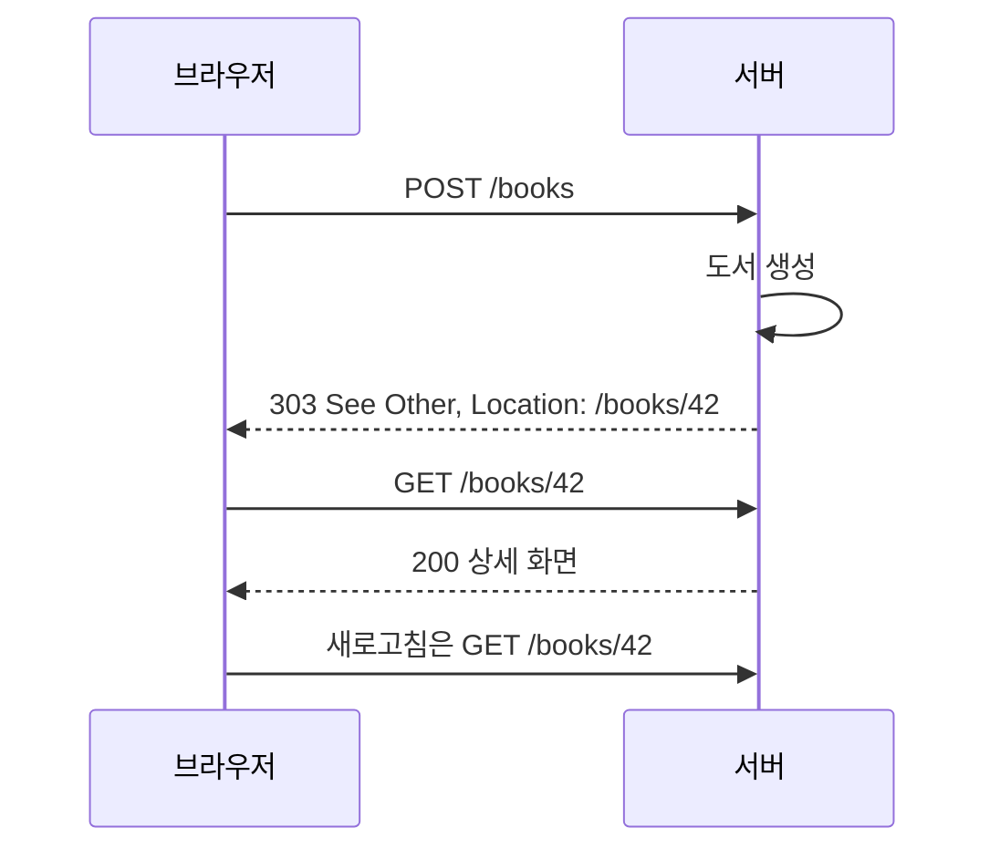

> 이 글은 김영한님의 [모든 개발자를 위한 HTTP 웹 기본 지식](https://www.inflearn.com/course/http-웹-네트워크/dashboard?cid=326277) 강의를 학습한 내용을 정리한 글입니다.
>
> [학습성과](/learning-evidence/inflearn-http-basics/)

상태 코드는 서버가 숫자로 남기는 로그가 아니다. 클라이언트가 결과를 표시할지, 다른 주소로 이동할지, 인증을 다시 시도할지 판단하는 공통 신호다. 본문에 `success: false`만 넣고 모든 응답을 200으로 보내면 이 공통 신호를 활용하기 어렵다.

## 먼저 응답의 종류를 구별한다

| 계열 | 의미 | 클라이언트가 확인할 것 |
| --- | --- | --- |
| 1xx | 중간 정보 | 최종 응답이 아직 남아 있는가? |
| 2xx | 요청 성공 | 생성·접수·완료 중 어떤 성공인가? |
| 3xx | 추가 동작 필요 | 이동 위치 또는 저장된 응답의 활용 |
| 4xx | 요청 측 문제 | 입력·인증·권한·요청 조건 |
| 5xx | 서버 측 처리 문제 | 일시적 문제인지와 재시도 계약 |

모든 숫자를 외우기보다 자주 사용하는 코드가 어떤 차이를 드러내는지 설명하는 것이 우선이다. 같은 2xx라고 완료 시점까지 같은 것은 아니다.

## 성공도 여러 종류가 있다

| 코드 | 도서 서비스 예시 | 주의점 |
| --- | --- | --- |
| 200 OK | 도서 조회 결과 반환 | 메서드에 따라 본문의 의미가 달라짐 |
| 201 Created | 새 도서 생성 | `Location`으로 생성된 대상을 안내할 수 있음 |
| 202 Accepted | 대량 가져오기 작업 접수 | 처리 완료나 최종 성공을 보장하지 않음 |
| 204 No Content | 본문 없이 수정 완료 알림 | JSON 본문을 붙이는 응답이 아님 |

예를 들어 대량 가져오기에 202를 사용한다면 클라이언트가 결과를 확인할 별도 방법이 필요하다. 작업 ID와 상태 조회 URI를 제공하는 방식은 독립적인 설계 선택이다. 상태 코드 하나가 비동기 작업의 수명 전체를 설명하지는 않는다.

## 리다이렉션에서는 메서드도 중요하다

Location만 확인하면 놓치는 부분이 있다. 원래 요청이 POST였을 때 이동한 주소에도 POST를 보내는가 하는 문제다.

| 코드 | 이동 성격 | 메서드 관련 의미 |
| --- | --- | --- |
| 301 | 영구 이동 | 역사적 호환성에 따라 POST가 GET으로 바뀔 수 있음 |
| 302 | 임시 이동 | POST가 GET으로 바뀔 수 있음 |
| 303 | 다른 리소스로 조회 안내 | 일반적으로 GET으로 결과를 조회하는 데 사용 |
| 307 | 임시 이동 | 메서드와 본문을 유지 |
| 308 | 영구 이동 | 메서드와 본문을 유지 |

따라서 쓰기 요청을 새 주소로 그대로 전달해야 하는 API와, 쓰기 결과를 조회 화면으로 보여주려는 UI는 다른 코드가 필요할 수 있다. 리다이렉션의 메서드 보존 여부는 [RFC 9110의 3xx 정의](https://www.rfc-editor.org/rfc/rfc9110.html#section-15.4)와 함께 확인한다.

## POST 이후 조회로 이동하는 PRG

폼 제출의 결과를 곧바로 POST 응답 화면으로 보여주면 새로고침이 다시 제출로 이어질 수 있다. PRG는 처리 후 조회 주소를 열도록 흐름을 나눈다.



PRG는 브라우저의 재제출 위험을 줄이는 화면 흐름이다. 사용자가 버튼을 연속으로 누르거나 첫 응답이 유실되는 모든 중복 요청을 막지는 않는다. 업무적으로 한 번만 처리되어야 하는 동작에는 서버 측 중복 처리 정책이 별도로 필요하다.

304는 위와 같은 새 URL 이동과 다르다. 조건부 조회에서 저장해 둔 표현을 재사용할 수 있음을 알리는 응답이며, 응답 본문을 다시 전송하지 않는다. 구체적인 흐름은 캐시 섹션에서 다룬다.

## 오류의 책임과 복구 방법

| 코드 | 대표 의미 | API에서 함께 전달할 정보 |
| --- | --- | --- |
| 400 | 잘못된 요청 | 수정 가능한 입력 문제 |
| 401 | 유효한 인증 자격이 필요 | `WWW-Authenticate` 인증 챌린지 |
| 403 | 요청 수행 거부 | 공개 가능한 범위의 거부 이유 |
| 404 | 대상을 찾을 수 없거나 공개하지 않음 | 클라이언트가 취할 수 있는 다음 행동 |
| 500 | 예상하지 못한 서버 오류 | 내부 정보 대신 추적 가능한 오류 식별자 |
| 503 | 일시적으로 처리 불가 | 필요한 경우 `Retry-After` |

401과 403을 단순히 “로그인 전/후”만으로 외우면 실제 인증 정책을 설명하기 어렵다. 403이 항상 이미 인증된 사용자만을 뜻하는 것은 아니다. 또한 자원의 존재를 공개하지 않기 위해 404를 사용하는 경우도 있다.

서버 내부 스택 트레이스를 그대로 오류 본문에 담을 필요는 없다. 다음은 형식 설명을 위한 별도 예시다.

```json
{
  "code": "INVALID_PUBLICATION_YEAR",
  "message": "출판 연도는 허용 범위 안이어야 합니다.",
  "field": "publicationYear"
}
```

## 재시도는 상태 코드 표만으로 결정하지 않는다

서버 오류라고 쓰기 요청을 무조건 다시 보내면 중복 처리 가능성이 있다. 입력 문제라고 모든 4xx를 영구 실패로 고정하는 것도 부정확하다. 실제 복구 여부는 코드의 의미, 메서드, 서버의 처리 계약에 따라 달라진다.

오류 계약을 작성할 때는 “누가 수정해야 하는가”, “같은 요청을 다시 보내도 되는가”, “얼마나 기다려야 하는가”를 나누어 적는다. 그러면 상태 코드는 예외를 분류하는 숫자에서 클라이언트 행동을 설명하는 인터페이스가 된다.

## 참고

- [HTTP 상태코드 소개](https://www.inflearn.com/courses/lecture?courseId=326277&unitId=61370), [2xx - 성공](https://www.inflearn.com/courses/lecture?courseId=326277&unitId=61371)
- [3xx - 리다이렉션1](https://www.inflearn.com/courses/lecture?courseId=326277&unitId=61372), [3xx - 리다이렉션2](https://www.inflearn.com/courses/lecture?courseId=326277&unitId=61780)
- [4xx - 클라이언트 오류, 5xx - 서버 오류](https://www.inflearn.com/courses/lecture?courseId=326277&unitId=61373)
- [RFC 9110, Status Codes](https://www.rfc-editor.org/rfc/rfc9110.html#section-15)
