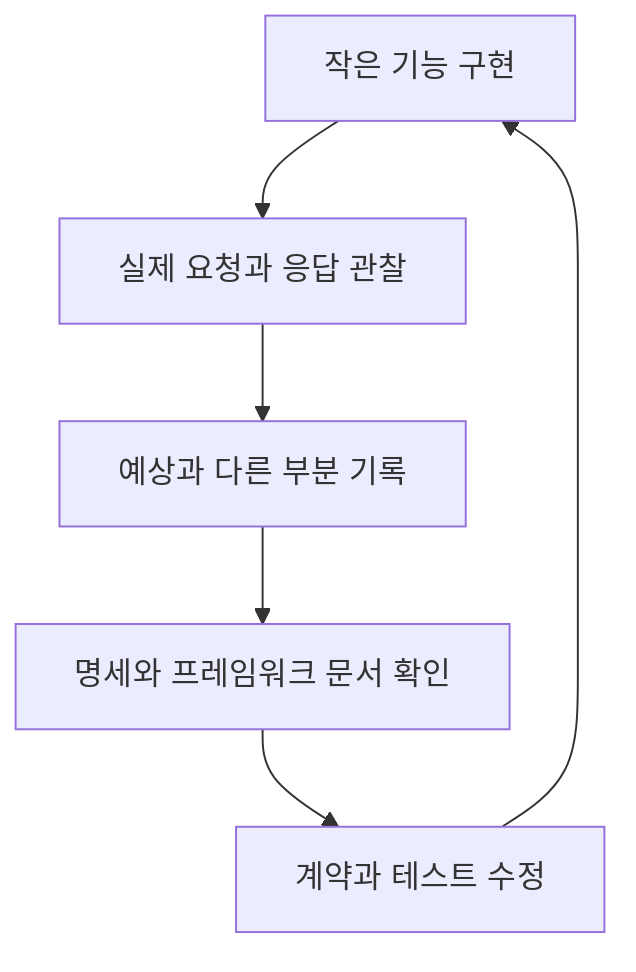

> 이 글은 김영한님의 [모든 개발자를 위한 HTTP 웹 기본 지식](https://www.inflearn.com/course/http-웹-네트워크/dashboard?cid=326277) 강의를 학습한 내용을 정리한 글입니다.
>
> [학습성과](/learning-evidence/inflearn-http-basics/)

마지막 섹션은 앞선 내용을 되짚고 웹 프레임워크 학습으로 연결한다. 기술의 세부사항을 모두 외운 다음 개발하기보다, 작은 구현에서 부족한 부분을 발견하고 다시 개념을 확인하는 학습 방법도 설명한다.

여기서는 그 방향을 도서 API 하나의 설계 과제로 바꿔 본다. 아래 과제는 강의의 실습을 옮긴 것이 아니라 이 시리즈를 위한 별도 복습 제안이며, 구현을 완료했다는 기록은 아니다.

## 작은 요청 하나에 배운 내용을 모은다

`GET /books/42` 하나만으로도 여러 판단을 검토할 수 있다.

| 항목 | 작성할 계약 |
| --- | --- |
| 대상 | 도서 42번, 없는 ID의 처리 |
| 표현 | JSON 형식과 필드 정의 |
| 정상 응답 | 200과 본문 |
| 실패 응답 | 404 및 공개 가능한 오류 정보 |
| 인증 | 공개 조회인지 사용자 전용인지 |
| 캐시 | 저장 범위, 신선도, 검증자 |

여기에 수정 API를 추가하면 메서드 선택과 동시 수정 문제가 생긴다. 비동기 가져오기를 추가하면 202와 완료 확인이 필요하다. 로그인한 사용자의 대출 목록을 추가하면 쿠키와 공유 캐시 정책을 다시 살펴보게 된다.

학습의 단위를 “강의 한 편 더 보기”에서 “설계 질문 하나에 답하기”로 옮기는 방식이다. 정답 코드를 복제하기보다 어떤 관찰이 설명과 일치하는지 남기는 데 의미가 있다.

## 프레임워크 기능을 메시지로 설명한다

웹 프레임워크에서 요청 매핑은 메서드와 경로를 애플리케이션 동작에 연결한다. 본문 변환은 미디어 타입과 객체 사이를 연결하고, 예외 처리 기능은 오류를 상태 코드와 응답 형식으로 연결한다.

따라서 프레임워크를 공부할 때도 기능 이름만 적지 말고 결과 메시지를 함께 남긴다. “이 설정이 어떤 헤더와 본문을 만드는가”를 설명할 수 있어야 내부 추상화와 프로토콜 사이를 오갈 수 있다.

마무리 강의에서 다루는 서블릿과 JSP도 같은 관점으로 볼 수 있다. 모든 과거 기술을 동일한 깊이로 공부하기보다, 현재 사용하는 웹 기술이 어떤 문제를 추상화하는지 이해하는 데 필요한 기반부터 연결한다.

## 명세의 세대도 확인한다

녹화 당시의 자료에서 언급하는 명세와 현재 읽을 문서가 다를 수 있다. 이 시리즈의 보충 설명은 HTTP 의미를 RFC 9110, 캐시를 RFC 9111, HTTP/1.1 메시지를 RFC 9112와 대조했다. 이전 문서의 설명을 읽을 때는 개정·대체 관계를 확인한다.

| 문서 | 필요한 상황 |
| --- | --- |
| RFC 9110 | 메서드·상태 코드·조건부 요청의 의미 확인 |
| RFC 9111 | 저장과 재사용, 검증, 캐시 지시어 확인 |
| RFC 9112 | HTTP/1.1 메시지 경계와 연결 관리 확인 |

처음부터 모든 절을 순서대로 읽을 필요는 없다. 예를 들어 “no-cache면 저장을 못 하나?”라는 질문이 생겼다면 해당 지시어 정의에서 출발해 요청·응답의 차이와 관련 절을 확인하는 식으로 범위를 좁힐 수 있다.

## 후속 실습에서 남길 증거

실습 기록에는 사용한 서버와 브라우저, 요청, 응답 헤더, 관찰 결과를 적는다. 캐시 실험이라면 개발자 도구의 캐시 비활성화 여부도 포함한다. 실패 재시도 실험이라면 응답을 끊은 위치와 서버의 반영 여부를 구분한다.

“캐시가 빨랐다”는 감상보다 “두 번째 요청은 네트워크 왕복 없이 저장된 응답을 사용했다”는 관찰이 재현하기 쉽다. 반대로 실행하지 않은 시나리오는 예상 결과로 남겨야 한다. 개념 이해와 구현 검증을 구분하는 것까지가 이 시리즈의 복습 기준이다.

## 참고

- [다음으로](https://www.inflearn.com/courses/lecture?courseId=326277&unitId=61412)
- [RFC 9110](https://www.rfc-editor.org/rfc/rfc9110.html), [RFC 9111](https://www.rfc-editor.org/rfc/rfc9111.html), [RFC 9112](https://www.rfc-editor.org/rfc/rfc9112.html)
- [시리즈 전체 목록](/series/http-web-basics/)
