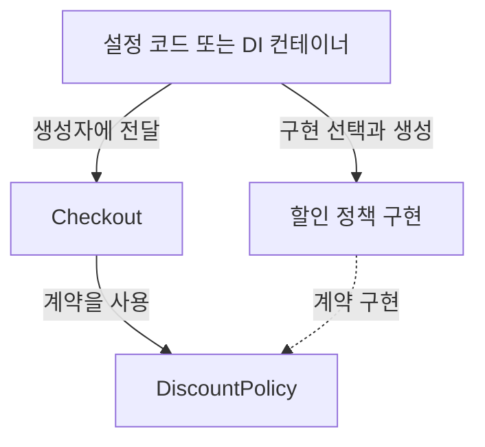

> 이 글은 김영한님의 [스프링 핵심 원리 - 기본편](https://www.inflearn.com/course/스프링-핵심-원리-기본편/dashboard?cid=325969) 강의를 학습한 내용을 정리한 글입니다.
>
> [학습성과](/learning-evidence/inflearn-spring-core/)

스프링을 배우면서 가장 먼저 익히기 쉬운 것은 애너테이션이다. 하지만 이 강의의 출발점은 `@Component`가 아니다. 저장소와 할인 정책이 아직 확정되지 않은 상황에서 회원과 주문 기능을 어떻게 설계할지부터 살펴본다.

다시 확인한 요구사항 설명에서는 회원 저장소가 내부 데이터베이스인지 외부 시스템인지 결정되지 않았고, 할인 정책도 변경 가능성이 있다. 모든 결정을 기다린 뒤 개발하기보다 역할을 나누어 구현을 교체할 수 있게 만드는 접근이다.

## 강의 흐름을 세 가지 질문으로 묶기

| 구간 | 다루는 내용 | 복습할 질문 |
| --- | --- | --- |
| 순수 자바 애플리케이션 | 회원, 주문, 할인 정책과 관심사 분리 | 정책이 바뀌면 어떤 클래스를 수정하는가? |
| 컨테이너와 등록 | 설정 클래스, 빈 조회, 싱글톤, 컴포넌트 스캔 | 객체를 누가 만들고 연결하는가? |
| 주입과 생명주기 | 생성자 주입, 후보 선택, 초기화와 종료, 스코프 | 객체를 언제 만들고 얼마나 오래 사용하는가? |

이 흐름으로 보면 컨테이너는 갑자기 등장하는 마법 상자가 아니다. 애플리케이션에서 분리한 조립 책임을 맡는 도구로 이해할 수 있다.

## 인터페이스와 구현 선택은 다른 문제다

다음은 할인 정책을 전달받는 구조만 남긴 별도 예시다. 금액의 통화와 반올림 정책 등은 생략했다.

```java
interface DiscountPolicy {
    int discount(int price);
}

final class Checkout {
    private final DiscountPolicy policy;

    Checkout(DiscountPolicy policy) {
        this.policy = policy;
    }

    int payable(int price) {
        return price - policy.discount(price);
    }
}
```

`Checkout`은 할인 결과가 필요하지만 할인 구현을 직접 고르지 않는다. 테스트에서는 `new Checkout(price -> 100)`처럼 작은 대역을 전달할 수도 있다. 이는 실제 테스트 실행 결과가 아니라 의존성을 분리했을 때 가능한 사용 예다.

반대로 필드 타입만 인터페이스이고 내부에서 구체 클래스를 생성한다면 구현 선택 책임은 여전히 사용 객체에 남는다. 의존성 주입(DI)은 그 선택과 공급을 객체 밖으로 옮기는 방식이다. [Spring 공식 문서](https://docs.spring.io/spring-framework/reference/core/beans/dependencies/factory-collaborators.html)도 생성자 인자나 프로퍼티 등으로 의존성을 선언하고 컨테이너가 이를 공급하는 구조로 설명한다.

아래 그림은 사용 객체와 조립하는 쪽의 책임을 분리한 구조다.



## 등록 방식보다 객체의 상태를 먼저 보기

후반부의 싱글톤, 초기화, 스코프는 객체를 등록한 뒤 생기는 문제다. 여러 요청이 같은 객체를 사용한다면 요청마다 달라지는 값을 필드에 보관해도 되는지 검토해야 한다. 생성자 주입으로 참조를 고정하는 것과 참조 대상의 내부 상태가 안전한 것은 별개의 문제다.

예를 들어 `Checkout`에 `currentUserId` 같은 요청별 값을 저장하기 시작하면, 할인 정책을 잘 분리했더라도 공유 상태 문제가 생길 수 있다. 요청 입력은 메서드 인자로 받고 결과는 반환하는 구조부터 검토하는 편이 이해하기 쉽다.

생명주기를 복습할 때도 생성과 준비 완료를 구분해야 한다. 외부 자원이 필요한 초기화, 사용 종료 시 정리, 요청에 묶인 객체의 수명은 같은 질문이 아니다. 강의의 콜백과 스코프 내용을 이 구분에 맞춰 다시 보면 API 이름을 외우는 부담이 줄어든다.

## 남겨둘 학습 기준

이 강의의 학습 결과는 애너테이션 개수보다 변경의 범위를 설명하는 데서 확인할 수 있다. 정책을 하나 바꿨을 때 업무 코드와 조립 코드 중 어디를 수정하는지, 스프링 없이도 업무 객체를 생성할 수 있는지 설명해 보는 것이다.

복습 실습으로는 할인 구현 두 개를 만들어 설정만 교체하고, 같은 업무 테스트를 적용해 볼 수 있다. 여기에는 실습 완료나 성능 개선을 주장할 근거가 없으므로, 실행 결과와는 구분해 학습 점검 방법으로 남긴다.

## 참고

- [스프링 핵심 원리 - 기본편](https://www.inflearn.com/course/스프링-핵심-원리-기본편/dashboard?cid=325969): 전체 커리큘럼과 「비즈니스 요구사항과 설계」의 명시한 구간.
- [Spring Framework: Dependency Injection](https://docs.spring.io/spring-framework/reference/core/beans/dependencies/factory-collaborators.html): 의존성 주입 개념 보충. 현재 문서의 버전과 강의 환경은 다를 수 있다.
