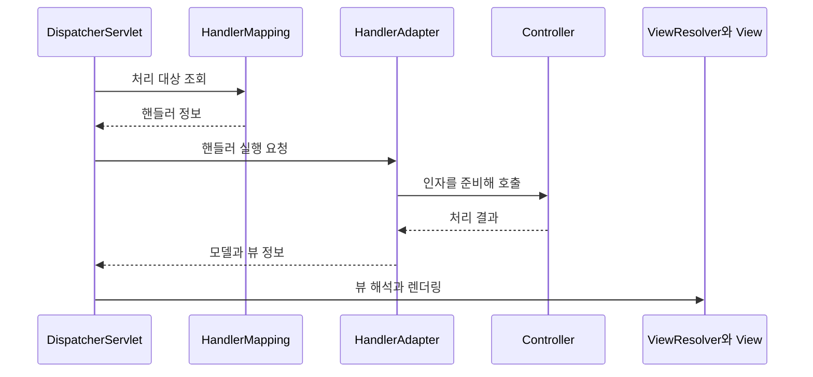

> 이 글은 김영한님의 [스프링 MVC 1편 - 백엔드 웹 개발 핵심 기술](https://www.inflearn.com/course/스프링-mvc-1/dashboard?cid=326674) 강의를 학습한 내용을 정리한 글입니다.
>
> [학습성과](/learning-evidence/inflearn-spring-mvc/)

컨트롤러 메서드가 호출되려면 그 전에 해야 할 일이 있다. URL에 맞는 처리 대상을 찾고, 요청 값을 메서드 인자로 바꾸고, 실행 결과를 HTTP 응답으로 만들어야 한다. 이 과정을 한 메서드의 내부 동작처럼 생각하면 오류가 났을 때 살펴볼 범위가 너무 넓어진다.

이 강의는 서블릿에서 시작해 직접 MVC를 개선한 뒤 스프링 MVC로 이어진다. 완성된 프레임워크의 이름부터 외우기보다, 반복되는 요청 처리 코드를 어디로 분리하는지 따라가는 구성이다.

## 직접 만든 구조와 스프링의 연결

다시 확인한 「스프링 MVC 전체 구조」에서는 앞서 만든 구성 요소를 스프링의 대응 요소와 연결한다.

| 직접 만든 구성 | 스프링 MVC의 대응 요소 | 맡는 일 |
| --- | --- | --- |
| FrontController | DispatcherServlet | 공통 요청 처리 흐름 조율 |
| 핸들러 매핑 정보 | HandlerMapping | 요청을 처리할 대상 찾기 |
| MyHandlerAdapter | HandlerAdapter | 처리 대상의 호출 방식에 맞춰 실행 |
| ModelView | ModelAndView | 모델과 뷰 정보 전달 |
| 뷰를 찾는 로직 | ViewResolver | 논리적 뷰 이름 해석 |
| MyView | View | 응답 화면 렌더링 |

공식 문서도 [DispatcherServlet](https://docs.spring.io/spring-framework/reference/web/webmvc/mvc-servlet.html)을 공통 알고리즘을 제공하고 실제 작업은 위임하는 프런트 컨트롤러로 설명한다. 컨트롤러의 종류가 달라도 공통 흐름을 유지하는 이유를 여기서 찾을 수 있다.

다음은 서버에서 화면을 렌더링하는 경우를 단순화한 순서다. 예외 처리와 인터셉터는 생략했다.

## 요청 매핑과 데이터 변환은 다른 단계다

커리큘럼 후반부에는 요청 파라미터, HTTP 메시지 본문, 메시지 컨버터와 인자 처리 등이 이어진다. 이 주제들은 모두 요청을 읽지만 같은 입력 경로를 뜻하지 않는다.

| 확인할 경계 | 예시 질문 |
| --- | --- |
| 매핑 | URL과 HTTP 메서드가 원하는 핸들러를 선택하는가? |
| 인자 준비 | 값이 쿼리 파라미터에 있는가, JSON 본문에 있는가? |
| 변환 | 문자열을 숫자로, JSON을 객체로 바꿀 수 있는가? |
| 응답 | 뷰 이름을 반환하는가, 응답 본문을 만드는가? |

예를 들어 JSON을 보냈는데 요청 파라미터 방식으로만 읽으려고 하면 입력 위치에 대한 가정이 어긋난다. 반대로 JSON 응답을 만드는 컨트롤러를 설명하면서 항상 ViewResolver를 거친다고 그리면 응답 경로를 잘못 설명하게 된다. 위 순서도는 화면 렌더링 경로에 한정한 그림이다.

## 상품 등록 예제에서 PRG를 보는 이유

상품 관리 화면 부분에는 등록 이후 리다이렉트와 RedirectAttributes가 포함된다. POST 처리 결과를 그대로 화면에 남기면 새로고침이 같은 변경 요청을 다시 보내는 동작으로 이어질 수 있다. POST 이후 GET 조회 화면으로 이동하는 PRG(Post/Redirect/Get)는 이 브라우저 흐름을 나눈다.

다만 PRG를 중복 처리 방지 전체의 해법으로 받아들이면 안 된다. 동시에 두 번 들어오는 요청이나 네트워크 재시도는 별도의 문제다. 화면 이동 흐름과 서버가 동일한 업무 요청을 식별하는 정책을 구분하는 것이 이 부분의 복습 포인트다.

## 오류를 좁혀 가는 복습

컨트롤러에 로그가 찍히지 않는다면 업무 로직보다 매핑과 인자 변환 경계를 먼저 살펴볼 수 있다. 메서드는 실행됐는데 화면이 나오지 않는다면 반환값 처리와 뷰 해석 경계를 점검한다. 이는 특정 장애를 해결했다는 기록이 아니라, 강의 구조를 디버깅 질문으로 바꾼 점검 방식이다.

커리큘럼을 다시 볼 때는 서블릿, 직접 만든 MVC, 스프링 MVC가 각각 어떤 반복을 없애는지 설명해 보는 편이 좋다. 같은 상품 등록 기능이더라도 공통 처리와 업무 코드의 경계가 어떻게 달라지는지 비교할 수 있다.

## 참고

- [스프링 MVC 1편](https://www.inflearn.com/course/스프링-mvc-1/dashboard?cid=326674): 전체 커리큘럼과 「스프링 MVC 전체 구조」의 명시한 구간.
- [Spring Framework: DispatcherServlet](https://docs.spring.io/spring-framework/reference/web/webmvc/mvc-servlet.html): 프런트 컨트롤러와 위임 구조 보충.
