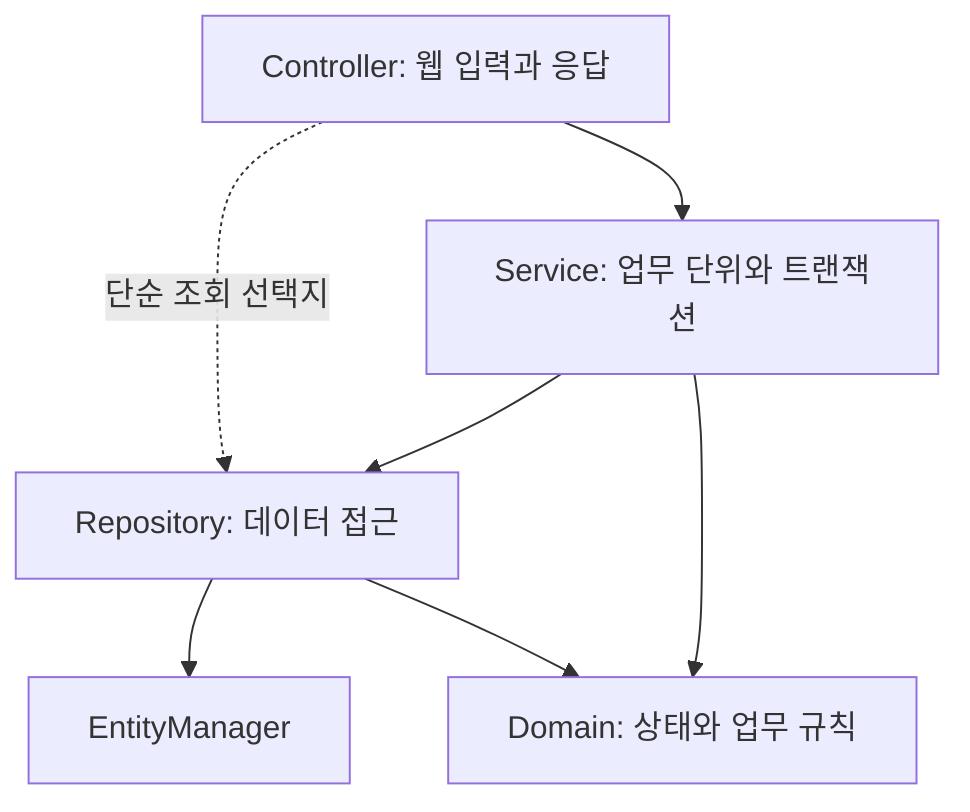

> 이 글은 김영한님의 [실전! 스프링 부트와 JPA 활용1 - 웹 애플리케이션 개발](https://www.inflearn.com/course/스프링부트-JPA-활용-1/dashboard?cid=324119) 강의를 학습한 내용을 정리한 글입니다.
>
> [학습성과](/learning-evidence/inflearn-jpa-application-1/)

JPA로 웹 애플리케이션을 만든다는 것은 저장 메서드를 호출하는 것보다 범위가 넓다. 요청 값을 해석하는 코드, 업무 규칙을 적용하는 코드, 데이터베이스에 접근하는 코드를 어디에 둘지 정해야 한다. 주문처럼 여러 데이터가 함께 바뀌는 기능에서는 변경을 하나의 업무 단위로 묶는 문제도 생긴다.

이 강의의 커리큘럼은 도메인과 테이블 설계, 엔티티 구현, 회원·상품·주문 기능과 테스트, 웹 화면 연결로 이어진다. 수정 기능에서는 변경 감지와 병합도 다룬다. 복습할 때는 기능별 코드보다 각 책임의 위치를 먼저 정리했다.

## 계층은 통과해야 할 관문이 아니다

다시 확인한 아키텍처 설명에서 컨트롤러는 웹 요청을, 서비스는 업무 로직과 트랜잭션을, 리포지토리는 데이터 접근을 담당한다. 도메인에는 엔티티와 값 객체가 들어간다. 단순 조회는 컨트롤러에서 리포지토리에 직접 접근할 수도 있다고 설명하므로, 모든 요청에 무조건 같은 계층 수를 강제하는 규칙으로 받아들일 필요는 없다.

아래 그림은 책임과 의존 방향을 단순화했다. 도메인 객체는 여러 계층에서 사용될 수 있지만, 도메인이 웹 컨트롤러를 호출하는 방향으로 그리지 않았다.

| 경계 | 주문 취소를 예로 든 책임 |
| --- | --- |
| Controller | 주문 식별자를 받아 업무 호출로 연결 |
| Service | 주문 조회와 취소를 하나의 업무 흐름으로 묶기 |
| Domain | 취소 가능한 상태인지 판단하고 상태 변경 |
| Repository | 주문을 조회하는 영속성 접근 제공 |

이 표는 강의 코드를 옮긴 것이 아니라 책임을 설명하기 위해 만든 예시다. 실제 프로젝트에서는 권한 검사 위치, 외부 결제 연동, 실패 복구까지 추가로 설계해야 한다.

## 트랜잭션을 저장 호출과 혼동하지 않기

트랜잭션은 함께 성공하거나 실패해야 하는 데이터 변경의 경계다. 여러 저장 호출을 사용하더라도 서로 다른 트랜잭션으로 실행되면 전체 업무가 하나의 원자적 작업이 되는 것은 아니다.

예를 들어 주문 상태 변경과 재고 복원이 한 업무라면 둘 중 하나만 반영된 상태를 허용하는지 먼저 정해야 한다. 서비스 계층에 트랜잭션 책임을 두는 구조는 이런 업무 경계를 표현하기 위한 출발점이다. 다만 데이터베이스 트랜잭션만으로 외부 결제 시스템의 취소까지 자동으로 되돌릴 수 있는 것은 아니다.

## 수정 요청은 변경할 값만 전달하기

커리큘럼의 변경 감지와 병합은 둘 다 수정 기능과 관련되지만 같은 사용 방식으로 생각하면 위험하다. 복습의 초점은 웹에서 받은 객체를 그대로 저장하는 습관보다, 무엇을 바꿀 수 있는지 명시하는 데 두었다.

설명용으로 상품 이름 변경 요청을 생각해 보자. 요청에 이름만 있다고 해서 가격과 재고를 빈 값으로 덮어쓰려는 의도는 아니다. 식별자로 대상을 찾고 허용된 변경을 적용하는 흐름은 입력에 없던 필드의 의미를 함부로 결정하지 않는다. 이것은 강의 실습의 실행 결과가 아니라 수정 API를 점검하는 설계 기준이다.

## 기능 완료와 검증 완료를 나누기

웹 화면에서 한 번 성공했다고 업무 규칙 전체를 확인한 것은 아니다. 취소 불가능한 주문, 존재하지 않는 상품, 부족한 재고 같은 입력에서 어떤 상태가 남아야 하는지까지 정의해야 한다.

이 강의를 복습하며 남길 산출물로는 기능별 책임표와 실패 시나리오 목록이 적절하다. 완강 표시는 학습 이력의 근거지만, 실제 테스트 통과나 운영 경험의 근거는 아니다. 그 부분은 테스트 코드와 실행 결과를 별도로 남겨야 한다.

## 참고

- [JPA 활용1 - 웹 애플리케이션 개발](https://www.inflearn.com/course/스프링부트-JPA-활용-1/dashboard?cid=324119): 전체 커리큘럼과 「애플리케이션 아키텍처」의 명시한 구간. 책임표와 업무 시나리오는 자체 구성했다.
