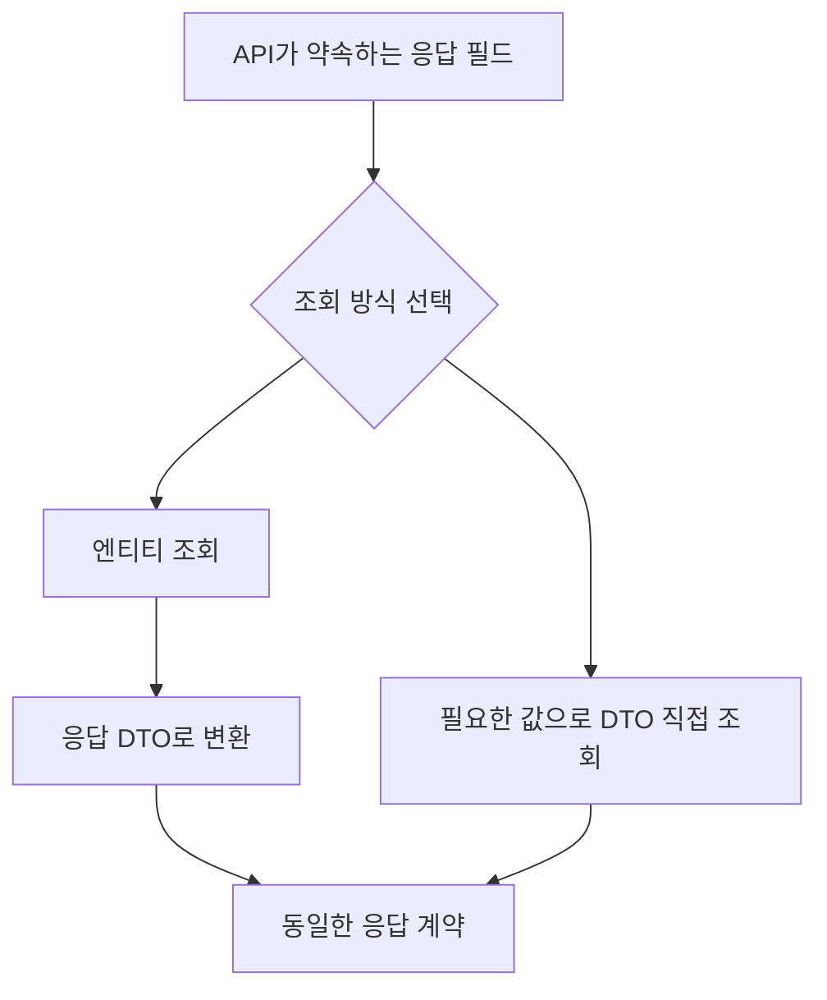
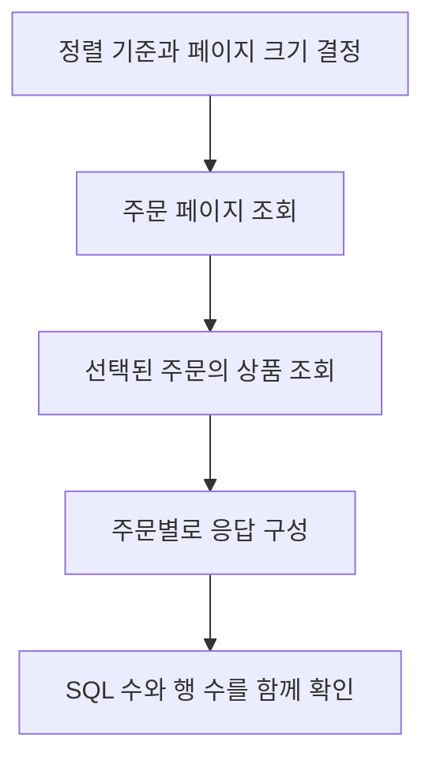

> 이 글은 김영한님의 [실전! 스프링 부트와 JPA 활용2 - API 개발과 성능 최적화](https://www.inflearn.com/course/스프링부트-JPA-API개발-성능최적화/dashboard?cid=324214) 강의를 학습한 내용을 정리한 글입니다.
>
> [학습성과](/learning-evidence/inflearn-jpa-application-2/)

조회 API의 성능을 볼 때 SQL 개수만 세면 놓치는 것이 있다. 한 번의 조회로 줄였더라도 결과 행이 크게 늘어날 수 있고, 데이터베이스에서 처리할 페이징을 애플리케이션 메모리에서 처리하게 될 수도 있다. 먼저 반환할 응답의 형태와 조회할 관계를 구분해야 한다.

이 강의는 기본 API에서 시작해 단일 연관관계 조회, 컬렉션 조회, DTO 직접 조회와 OSIV로 확장한다. OSIV는 웹 요청 동안 영속성 컨텍스트를 열어 두는 방식이다. 조회 범위와 트랜잭션 밖의 데이터 접근을 함께 고민하게 하는 주제지만, 이 글은 다시 확인한 조회 전략 부분에 초점을 둔다.

## 응답 모델과 조회 모델은 같은 선택이 아니다

다시 확인한 정리 구간은 엔티티를 조회한 뒤 DTO로 변환하는 방식과 DTO를 직접 조회하는 방식을 나눈다. DTO는 외부에 전달할 데이터를 묶은 객체다. 엔티티 자체를 API에 노출하면 내부 모델 변경이 응답 계약의 변경으로 이어질 수 있다.

아래 그림은 응답 형식을 유지하면서 조회 구현을 다르게 선택하는 구조다.

| 방식 | 장점 | 확인할 비용 |
| --- | --- | --- |
| 엔티티 조회 후 변환 | 도메인 모델 기반으로 구성하기 쉽다 | 변환 중 접근하는 연관관계와 추가 SQL |
| DTO 직접 조회 | 응답에 필요한 열 중심으로 조회할 수 있다 | 조회 코드와 응답 구조의 결합 |
| 페치 조인 활용 | 필요한 연관 데이터를 함께 읽을 수 있다 | 관계의 개수와 결과 행 증가, 페이징 |

세 번째 행은 앞의 두 방식과 같은 층위의 대안이라기보다 엔티티 조회에 적용하는 최적화 수단이다. DTO를 사용한다는 사실만으로 조회가 최적화되지는 않는다.

## 컬렉션을 조인하면 페이지의 단위가 달라진다

설명용으로 주문 A에 상품 3개, 주문 B에 상품 2개가 있다고 하자. 주문과 상품을 조인한 결과는 5행이 될 수 있다. 하지만 API가 원하는 것은 주문 2건이다. SQL 결과 행 수와 최상위 객체 수가 달라지는 지점이다.

이때 조인 결과에서 단순히 2행만 자르면 주문 A의 상품 일부만 남을 수 있다. 따라서 컬렉션을 함께 가져오면서 최상위 주문 기준으로 페이지를 자르는 문제는 별도로 다뤄야 한다.

[Hibernate 6.6 HQL 문서](https://docs.hibernate.org/orm/6.6/querylanguage/html_single/#limits-and-offsets)는 페치 조인과 제한을 결합할 때 전체 결과를 읽고 메모리에서 제한할 수 있음을 경고한다. 강의 환경과 현재 프로젝트의 Hibernate 버전·설정은 다를 수 있으므로 실제 SQL과 경고, 실패 여부를 확인해야 한다. “페치 조인이니까 한 번에 빨라졌다”는 결론만 남겨서는 부족하다.

## 페이지를 먼저 정하고 필요한 관계를 읽기

복습용 대안은 최상위 주문 페이지를 먼저 결정하고, 그 주문들에 필요한 컬렉션을 별도로 읽는 흐름이다. 강의 커리큘럼의 페이징과 배치 조회를 이 문제에 연결해 볼 수 있다.

이는 언제나 두 번의 SQL로 끝난다는 보장은 아니다. 조회 방식, 배치 크기, 접근하는 다른 관계에 따라 SQL 수는 달라진다. 여러 쿼리 사이의 데이터 변경을 어떻게 볼지도 트랜잭션 격리 수준과 함께 검토해야 한다.

## 성능 정리에 남길 숫자

실제 실습 결과를 추가한다면 부모 객체 수, 부모당 자식 수, 페이지 크기, SQL 수, 반환 행 수와 실행 시간을 함께 기록할 계획이다. 이 글에는 측정 환경과 결과가 없으므로 특정 방식이 몇 배 빨랐다는 수치는 넣지 않았다.

이 강의의 복습 기준은 최적화 기법을 많이 나열하는 것이 아니라, 응답 계약을 유지하면서 어떤 조회 비용을 줄였고 어떤 제약이 생겼는지 설명하는 것이다.

## 참고

- [JPA 활용2 - API 개발과 성능 최적화](https://www.inflearn.com/course/스프링부트-JPA-API개발-성능최적화/dashboard?cid=324214): 전체 커리큘럼과 「API 개발 고급 정리」의 명시한 구간.
- [Hibernate 6.6: Limits and offsets](https://docs.hibernate.org/orm/6.6/querylanguage/html_single/#limits-and-offsets): 페치 조인과 페이징 제약 보충.
