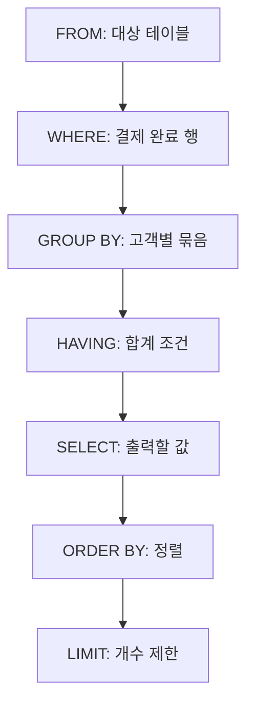

> 이 글은 [김영한의 실전 데이터베이스 입문 - 모든 IT인을 위한 SQL 첫걸음(SQL부터 차근차근)](https://www.inflearn.com/course/김영한-실전-데이터베이스-입문/dashboard?cid=338210) 강의를 학습한 내용을 정리한 글입니다.
>
> [학습성과](/learning-evidence/inflearn-database-intro/)

SQL을 처음 복습할 때는 문법이 맞는지에 집중하기 쉽다. 하지만 문장이 실행되더라도 원하는 데이터를 의미하는지는 다른 문제다. 어떤 행을 먼저 남기고, 무엇을 기준으로 묶고, 묶인 결과 중 무엇을 선택하는지 설명할 수 있어야 한다.

이 강의는 데이터베이스가 필요한 이유에서 시작해 테이블과 제약 조건, 데이터 변경, 조회, 함수와 집계로 범위를 넓힌다. 다시 확인한 실행 순서 구간은 이 여러 문법을 하나의 흐름으로 연결하는 부분이다.

## 저장 규칙과 조회 규칙을 나누기

| 학습 구간 | 중심 질문 |
| --- | --- |
| DBMS와 관계형 모델 | 데이터를 파일과 구분해 관리하는 이유는 무엇인가? |
| 자료형과 제약 조건 | 허용되는 값과 식별 규칙을 어디에 둘 것인가? |
| DDL과 DML | 구조 변경과 데이터 변경을 어떻게 구분하는가? |
| 조회와 정렬 | 어떤 행과 열이 필요하며 순서는 무엇인가? |
| 함수와 집계 | 개별 값과 행의 집합에 어떤 연산을 할 것인가? |

조회문을 잘 쓰는 것만으로 저장된 값의 의미가 보장되지는 않는다. 반대로 테이블을 잘 정의했더라도 집계 대상이 잘못되면 결과는 업무 질문과 달라진다. 두 규칙을 함께 복습할 필요가 있다.

## WHERE와 HAVING이 다루는 대상

다음은 결제 완료 주문 중 고객별 결제액이 10만 원 이상인 고객을 찾는 예시다. `orders`에 `customer_id`, `amount`, `status`가 있다고 가정한다.

```sql
SELECT customer_id, SUM(amount) AS total_amount
FROM orders
WHERE status = 'PAID'
GROUP BY customer_id
HAVING SUM(amount) >= 100000
ORDER BY total_amount DESC, customer_id ASC
LIMIT 10;
```

`WHERE`는 집계에 들어갈 주문 행을 고른다. `HAVING`은 고객별로 묶인 집계 결과를 고른다. 결제액 기준을 `WHERE amount >= 100000`으로 옮기면 개별 주문이 10만 원 이상인 경우만 합산하게 되어 질문 자체가 바뀐다.

가령 한 고객의 결제 완료 주문이 6만 원과 5만 원이라면 합계는 11만 원이다. 고객 합계 조건은 통과하지만, 개별 주문에 10만 원 조건을 적용하면 두 행 모두 사라진다. 이는 가상의 입력으로 계산한 차이이며 실제 데이터 조회 결과는 아니다.

다음은 이 예시를 이해하기 위한 논리적 처리 순서다. 데이터베이스가 실제로 실행하는 물리적 연산 순서나 실행 계획을 뜻하지 않는다.



## 별칭을 WHERE에서 사용할 수 없는 이유

다시 확인한 스크립트에서는 SELECT에서 만든 별칭을 WHERE에서 사용하려는 사례로 순서 문제를 설명한다. `total_amount`라는 이름을 붙였다고 모든 절에서 그 결과를 사용할 수 있는 것은 아니다.

[MySQL 8.4 SELECT 문서](https://dev.mysql.com/doc/refman/8.4/en/select.html)도 WHERE가 평가될 때 SELECT 별칭의 값이 아직 결정되지 않을 수 있으므로 이를 참조할 수 없다고 설명한다. MySQL은 HAVING이나 ORDER BY에서는 SELECT 별칭을 허용하지만, 이를 모든 SQL 제품과 모든 절의 일반 규칙으로 확장하지는 않아야 한다.

위 예시에서 HAVING에 집계식을 다시 적은 이유는 어떤 집계에 조건을 거는지 드러내기 위해서다. ORDER BY에는 별칭을 사용하고 고객 ID를 두 번째 정렬 기준으로 넣어 동률일 때의 순서도 명시했다.

## 복습에서 확인할 것

새 조회문을 만들면 작은 입력 데이터를 먼저 정해 예상 결과를 손으로 적어 볼 수 있다. 특히 필터에 걸리는 행, 같은 그룹에 속하는 행, 정렬 값이 같은 행을 넣으면 문법만 봐서는 놓치기 쉬운 차이가 드러난다.

이 글은 입문 과정의 문법과 의미를 정리한 글이다. 특정 인덱스의 성능이나 옵티마이저 동작을 검증한 글은 아니다. 논리적 처리 순서로 결과를 설명한 다음, 성능 문제가 있다면 별도로 실행 계획을 확인해야 한다.

## 참고

- [실전 데이터베이스 입문](https://www.inflearn.com/course/김영한-실전-데이터베이스-입문/dashboard?cid=338210): 전체 커리큘럼과 「SQL 실행 순서」의 명시한 구간.
- [MySQL 8.4: SELECT Statement](https://dev.mysql.com/doc/refman/8.4/en/select.html): WHERE, HAVING, 별칭 사용 규칙 보충.
