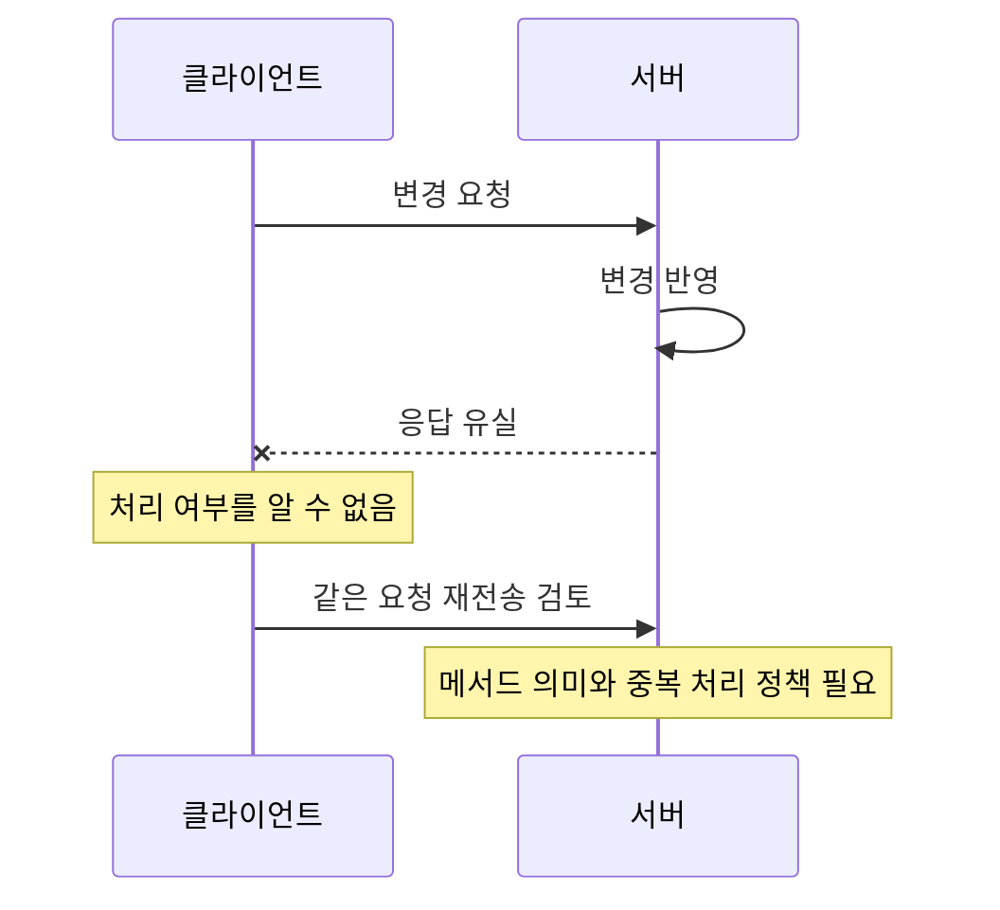

> 이 글은 김영한님의 [모든 개발자를 위한 HTTP 웹 기본 지식](https://www.inflearn.com/course/http-웹-네트워크/dashboard?cid=326277) 강의를 학습한 내용을 정리한 글입니다.
>
> [학습성과](/learning-evidence/inflearn-http-basics/)

웹 요청을 보낼 수 있다는 것과 HTTP를 이해한다는 것은 다르다. 요청 결과가 도착하지 않았을 때 다시 보내도 되는지, 같은 응답을 저장해 재사용해도 되는지, 조회 링크가 서버 상태를 바꾸어도 되는지에는 프로토콜의 의미가 필요하다.

이 강의는 네트워크와 URI, 메시지 구조에서 출발해 메서드, 상태 코드, 헤더와 캐시로 이어진다. 복습에서는 각 단원의 용어보다 요청을 보내고 응답을 다시 사용하는 흐름을 중심으로 묶었다.

## 강의 내용을 요청의 생애로 연결하기

| 단계 | 강의에서 연결되는 주제 | 확인할 질문 |
| --- | --- | --- |
| 대상 결정 | URI와 요청 흐름 | 어떤 리소스를 가리키는가? |
| 동작 표현 | 메서드와 메시지 | 조회, 대체, 처리 요청 중 무엇인가? |
| 결과 해석 | 상태 코드와 헤더 | 성공, 이동, 실패를 어떻게 전달하는가? |
| 표현 협상 | 콘텐츠 관련 헤더 | 어떤 형식과 언어로 전달하는가? |
| 재사용 | 캐시와 검증 | 저장된 응답이 아직 유효한가? |

각 단계는 서로 연결되지만 같은 개념은 아니다. JSON을 사용한다는 사실만으로 메서드의 의미나 캐시 정책이 결정되지는 않는다.

## 안전성과 멱등성은 서로 다른 질문이다

다시 확인한 메서드 속성 구간에서는 안전성과 멱등성, 캐시 가능성을 나누어 소개한다. 안전성은 클라이언트가 상태 변경을 요청하는 의미인지에 관한 속성이다. 조회 중 접근 로그가 쌓인다는 이유만으로 GET이 안전하지 않은 메서드가 되지는 않는다. 이는 [RFC 9110의 안전한 메서드 정의](https://www.rfc-editor.org/rfc/rfc9110.html#section-9.2.1)에서도 구분한다.

멱등성은 같은 요청을 여러 번 보냈을 때 의도한 효과가 한 번 보낸 경우와 같은지에 관한 속성이다. 응답 내용이나 상태 코드까지 항상 같다는 뜻은 아니다. [RFC 9110의 멱등성 정의](https://www.rfc-editor.org/rfc/rfc9110.html#section-9.2.2)를 기준으로 구분하면 다음과 같다.

| 메서드 | 안전성 | 멱등성 | 의미를 이해하는 예 |
| --- | --- | --- | --- |
| GET | 안전함 | 멱등 | 표현 조회 |
| PUT | 안전하지 않음 | 멱등 | 지정한 리소스의 상태 대체 |
| DELETE | 안전하지 않음 | 멱등 | 지정한 리소스와 현재 기능의 연결 제거 |
| POST | 안전하지 않음 | 일반적으로 보장하지 않음 | 리소스별 의미에 따른 처리 |

POST도 애플리케이션에서 중복 식별 정책을 설계할 수 있지만, 메서드 이름만으로 그 보장이 생기지는 않는다. 반대로 DELETE의 두 번째 응답이 첫 번째와 다르더라도 멱등성과 곧바로 모순되는 것은 아니다.

## 응답 유실과 처리 실패는 다르다

다음은 서버가 처리했지만 응답을 받지 못한 상황을 표현한 별도 예시다.

클라이언트의 타임아웃은 서버에서 아무 일도 없었다는 증거가 아니다. 그래서 재시도를 논의할 때는 통신 오류뿐 아니라 요청이 나타내는 동작을 함께 봐야 한다. 이 그림은 실제 장애 기록이 아니라 프로토콜 속성이 필요한 이유를 보여주는 시나리오다.

## 캐시는 메서드 표 하나로 끝나지 않는다

커리큘럼 후반부는 캐시 유효 시간, 검증, 조건부 요청, 프록시 캐시와 캐시 제어로 이어진다. 이 부분은 메서드가 무엇인지와 더불어 응답 헤더, 인증 상태, 공유 여부를 함께 점검하는 단원으로 복습할 수 있다.

예를 들어 사용자별 응답이라면 “GET이니 캐시해도 된다”에서 멈추면 안 된다. 누가 저장하고 누구에게 재사용하는지, 변경을 어떻게 확인하는지까지 설계해야 한다. 구체적인 캐시 헤더 조합은 이 글에서 검증하지 않았으므로 운영 설정의 처방으로 제시하지 않는다.

## 복습의 기준

하나의 API를 골라 리소스, 메서드, 성공·실패 응답, 재시도 정책, 캐시 범위를 한 장에 적어 볼 수 있다. 이 항목을 각각 설명할 수 있다면 HTTP를 단순 전송 수단이 아니라 서버와 클라이언트 사이의 계약으로 정리한 셈이다.

## 참고

- [모든 개발자를 위한 HTTP 웹 기본 지식](https://www.inflearn.com/course/http-웹-네트워크/dashboard?cid=326277): 전체 커리큘럼과 「HTTP 메서드의 속성」의 명시한 구간.
- [RFC 9110, 9.2.1 Safe Methods](https://www.rfc-editor.org/rfc/rfc9110.html#section-9.2.1).
- [RFC 9110, 9.2.2 Idempotent Methods](https://www.rfc-editor.org/rfc/rfc9110.html#section-9.2.2).
