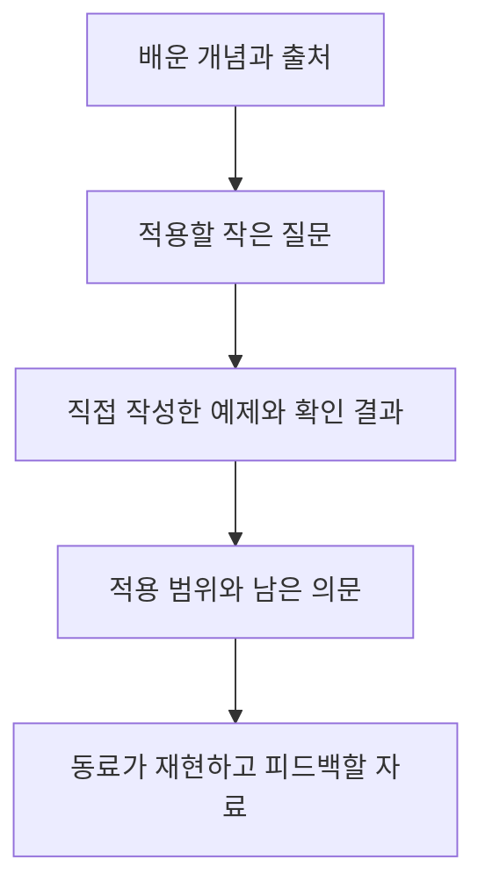

> 이 글은 [30만 수강생 기념, 1/31 김영한님 온라인 밋업 Live](https://www.inflearn.com/course/30만-김영한-라이브세션/dashboard?cid=332034)를 학습한 내용을 정리한 글입니다.
>
> [학습성과](/learning-evidence/inflearn-kim-young-han-meetup/)

기술 강의에는 구현 대상과 동작 결과가 비교적 분명하게 나온다. 반면 커리어에 관한 질문은 회사와 팀, 역할에 따라 답의 적용 범위가 달라진다. 그래서 이 밋업은 채용의 정답 목록보다 학습과 협업을 돌아보는 질문 모음으로 정리했다.

## 세션 목록에서 확인한 관심사

전체 세션 목록에는 기술 학습뿐 아니라 성장 환경과 동료에 관한 질문도 포함되어 있다. 아래 표는 질문의 주제를 묶은 것이며, 각 질문에 대한 강연자의 답변을 요약한 표는 아니다.

| 주제 | 세션에서 다루는 질문의 방향 |
| --- | --- |
| 기술과 경쟁력 | JPA의 전망, 업무에 도움이 되는 역량 |
| 주니어와 채용 | 주니어에게 기대하는 것, 구직과 성장 환경 |
| 지속적인 학습 | 슬럼프, 동기, 지식 공유 |
| 동료와 조직 | 좋은 동료, 경력에 따른 역할, 회사 생활 |

과거 밋업에서 나온 채용 이야기를 현재 채용 시장의 통계처럼 받아들이지는 않아야 한다. 이 글도 현재 시장 전망이나 특정 전략의 취업 성공률을 주장하지 않는다.

## 다시 확인한 답변: 함께 시도할 수 있는 동료

「좋은 동료 개발자의 특징」에서 다시 확인한 구간은 새로운 도전과 학습을 함께할 수 있는 관계, 서로 돕는 협업을 중심으로 이야기한다. 개발자 사이뿐 아니라 리더와 함께 일하는 관계에서도 이러한 상호작용을 언급한다.

이 답변을 복습하며 주목한 것은 기술의 보유량만으로 동료의 기여를 설명하지 않는다는 점이다. 혼자 알고 있는 내용과 다른 사람이 함께 문제를 풀 수 있도록 전달하는 내용에는 차이가 있다. 뒤의 기록 방식은 이 답변에서 출발한 자체 제안이며, 강연자가 제시한 공식이나 방법론은 아니다.

## 강의 노트를 협업 가능한 자료로 바꾸기

학습 기록이 제목과 수료 여부에 머물면 어떤 문제를 함께 풀 수 있는지 알기 어렵다. 반대로 모든 강의 내용을 길게 옮긴다고 자신의 판단이나 검증 과정이 드러나는 것도 아니다.

그래서 학습 자료를 다음 네 단계로 나누어 남기는 방식을 생각해 볼 수 있다.

| 기록 항목 | 구체적인 예 | 구분해야 할 것 |
| --- | --- | --- |
| 개념 | HTTP 멱등성의 의미 | 강의 설명과 공식 명세 |
| 질문 | 같은 요청을 재전송하면 무엇이 남는가? | 예상과 실제 결과 |
| 확인 | 입력, 환경, 응답과 상태 변화 | 가상 예시와 실행 기록 |
| 한계 | 어떤 실패나 동시성은 확인하지 못했는가? | 검증한 범위와 추정 |

이 표의 항목을 다 채웠다고 협업 성과가 자동으로 생기지는 않는다. 다만 읽는 사람이 결과를 재현하거나 다른 조건을 제안하기는 쉬워진다. 지식 공유를 완성된 설명의 전달뿐 아니라 함께 확인할 수 있는 상태로 만드는 작업으로 볼 수 있다.

## 완강과 역량 증거는 따로 남긴다

완강 이력은 학습에 참여했다는 근거다. 특정 시스템을 설계하고 운영할 수 있다는 근거는 코드, 테스트, 의사결정과 결과에서 찾아야 한다. 두 종류의 기록을 섞으면 실제로 확인한 범위가 흐려진다.

학습성과 페이지에는 완강 이력과 요약 글을 연결하고, 향후 직접 검증한 내용은 별도의 실험 기록으로 추가하는 편이 적절하다. 이 글에서 제시한 기록 흐름 역시 현재 모두 실행했다는 성과 보고가 아니라, 다음 학습 산출물을 설계하기 위한 기준이다.

## 참고

- [김영한님 온라인 밋업 Live](https://www.inflearn.com/course/30만-김영한-라이브세션/dashboard?cid=332034): 전체 세션 목록과 「좋은 동료 개발자의 특징」의 명시한 구간. 후반의 학습 기록 제안은 자체 해석이다.
