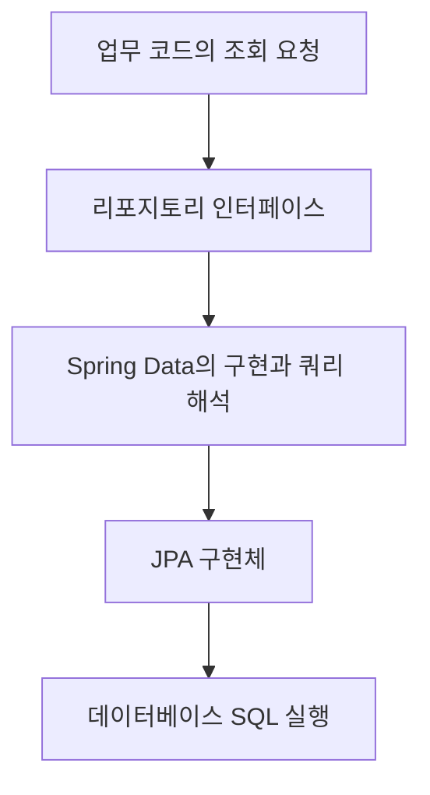

> 강의: [김영한, 실전! 스프링 데이터 JPA](https://www.inflearn.com/course/스프링-데이터-JPA-실전/dashboard?cid=324474)
>
> 2026-10-02 기준 32/32강 완강 표시를 확인했다. 전체 커리큘럼과 「@Query, 리포지토리 메소드에 쿼리 정의하기」의 0:00~2:12 스크립트를 다시 확인했다. 코드와 점검표는 별도로 구성했다. [학습성과](/learning-evidence/inflearn-spring-data-jpa/)

스프링 데이터 JPA를 사용하면 저장소 구현 코드가 짧아진다. 하지만 코드가 짧아진 것과 조회의 의미가 단순해진 것은 다르다. 반환할 데이터의 개수, 정렬, 필요한 관계, 데이터 변경의 경계는 여전히 개발자가 결정해야 한다.

이 강의는 순수 JPA 리포지토리와 공통 리포지토리를 비교한 뒤 쿼리 메서드, 페이징, 벌크 수정, EntityGraph, 사용자 정의 리포지토리, Auditing 등으로 이어진다. 뒤에서는 새 엔티티 판단과 여러 조회 기능도 다룬다.

## 메서드 이름은 조회를 표현하는 한 가지 방식이다

다시 확인한 스크립트에서는 인터페이스 메서드에 JPQL을 선언하는 `@Query`를 다룬다. 조건이 많아져 파생 메서드 이름이 길어지는 경우, 쿼리를 메서드 가까이에 명시하는 선택지다.

다음은 이름과 최소 점수로 회원을 조회하는 별도의 예시다. `Member` 엔티티에 `name`, `score`, `id` 속성이 있다고 가정했다.

```java
public interface MemberRepository extends JpaRepository<Member, Long> {
    @Query("""
        select m from Member m
        where m.name = :name and m.score >= :minScore
        order by m.id
        """)
    List<Member> findCandidates(
        @Param("name") String name,
        @Param("minScore") int minScore
    );
}
```

JPQL은 이 예시에서 테이블과 컬럼이 아니라 엔티티와 속성을 대상으로 한다. Java 텍스트 블록을 사용했으므로 오래된 강의 프로젝트에 그대로 붙이기보다는 Java 버전을 확인해야 한다. 전체 애플리케이션이나 실행을 검증한 코드는 아니다.

[Spring Data JPA 쿼리 메서드 문서](https://docs.spring.io/spring-data/jpa/reference/jpa/query-methods.html)도 `@Query`를 사용해 리포지토리 메서드에 쿼리를 연결하는 방식을 설명한다. 명시적으로 적었다고 최적화까지 끝난 것은 아니므로 SQL과 실행 계획은 별도로 확인해야 한다.

## 추상화가 줄이는 일과 남기는 일

아래 그림은 애플리케이션의 조회 의도가 실제 데이터베이스 접근으로 내려가는 경계다. 내부의 세부 구현 호출 순서를 나타낸 그림은 아니다.



| 강의 주제 | 사용 전에 정할 것 |
| --- | --- |
| 반환 타입 | 없음, 한 건, 여러 건을 어떻게 표현하는가? |
| 페이징 | 전체 개수가 필요한가, 다음 페이지 유무면 충분한가? |
| EntityGraph | 이번 조회에서 필요한 연관 데이터는 무엇인가? |
| 벌크 수정 | 이미 읽어 둔 객체와 DB 값의 차이를 어떻게 다룰 것인가? |
| 사용자 정의 리포지토리 | 복잡한 조회를 어느 구현 경계로 분리할 것인가? |
| Auditing | 생성·수정 시각과 주체를 무엇으로 결정할 것인가? |

이 표는 기능별 설명을 모두 재현하려는 목적이 아니다. 인터페이스 한 줄 뒤로 숨겨진 결정을 드러내기 위한 복습 목록이다.

## 조회 계약은 서비스에서도 보인다

앞의 `findCandidates`는 여러 건을 반환하고, 결과 개수를 제한하지 않는다. 이름이 단정해 보여도 데이터가 늘어나면 큰 목록을 만들 수 있다. 호출하는 쪽이 정말 전체 목록을 요구하는지, 정렬과 페이지가 필요한지부터 검토해야 한다.

또한 영속성 추상화를 사용한다고 SQL 지식이 필요 없어지는 것은 아니다. 데이터가 어떤 조건으로 걸러지고 어떤 관계에서 늘어나는지 모르면 반환값만 보고 비용을 판단하기 어렵다. 공통 코드를 줄인 시간을 조회 계약과 데이터 크기를 확인하는 데 쓰는 것이 이 강의를 복습하는 방향이다.

## 점검할 학습 산출물

같은 조회를 순수 JPA, 파생 메서드, `@Query`로 표현해 차이를 비교하는 실습을 생각해 볼 수 있다. 이때 비교 대상은 줄 수만이 아니다. 조건이 하나 추가될 때 수정 위치, 잘못된 입력의 처리, 결과가 없거나 많을 때의 계약도 함께 확인해야 한다.

이 글에서는 해당 비교를 실행했다고 주장하지 않는다. 완강과 스크립트 재확인으로 확보한 것은 학습 이력이며, 구현 숙련도는 별도의 코드와 테스트로 보여줄 부분이다.

## 참고

- [실전! 스프링 데이터 JPA](https://www.inflearn.com/course/스프링-데이터-JPA-실전/dashboard?cid=324474): 전체 커리큘럼과 「@Query, 리포지토리 메소드에 쿼리 정의하기」의 명시한 구간.
- [Spring Data JPA: JPA Query Methods](https://docs.spring.io/spring-data/jpa/reference/jpa/query-methods.html): `@Query` 사용 방식 보충.
