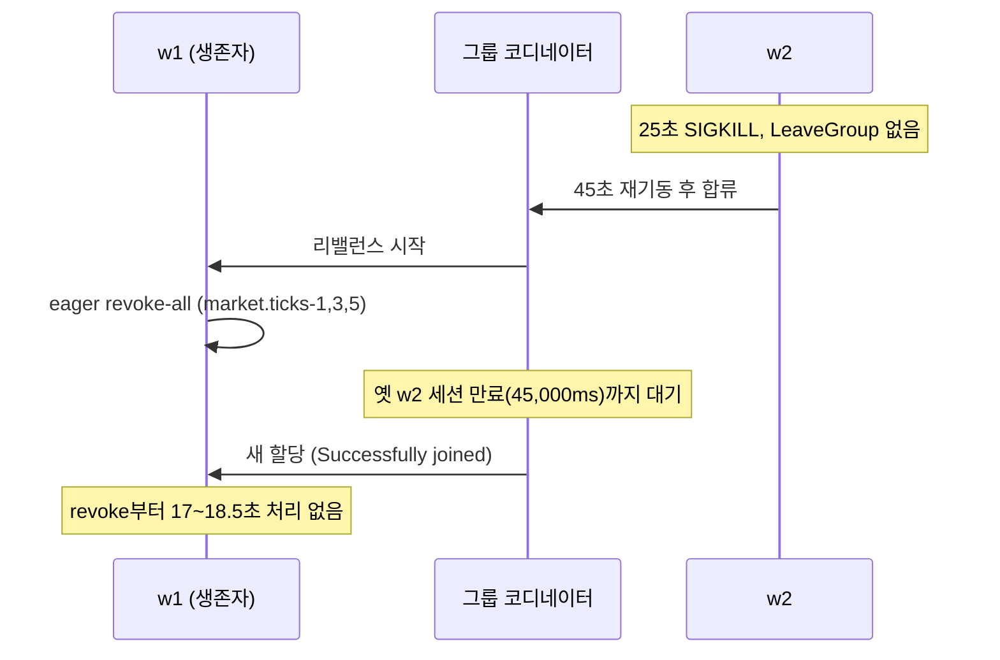

[GitHub 저장소](https://github.com/polynomeer/monticker) · 보고서 [reports/M-002.md](https://github.com/polynomeer/monticker/blob/main/reports/M-002.md)

[앞 글](/posts/monticker-ws-vs-polling/)이 시세가 클라이언트에 닿는 마지막 구간을 쟀다면, 이 글은 그 앞 구간이다. Go 게이트웨이가 202종목의 틱을 Kafka `market.ticks`에 넣고, Kotlin worker가 그것을 읽어 Redis 최신가·캔들·이벤트 감지로 넘긴다. 파티션 키는 종목 ID([ADR-005](https://github.com/polynomeer/monticker/blob/main/docs/decisions/005-kafka-go-gateway-netty-broadcast.md)). 같은 종목의 틱은 같은 파티션에 들어가므로 순서가 지켜진다는 것이 설계의 전제다.

전제를 확인한 적은 없었다. 이 글은 세 가지를 쟀다. 파티션 수와 컨슈머 스레드 수의 격자에서 처리량·지연·종목별 순서 위반 건수가 어떻게 달라지는가. 컨슈머가 죽으면 순서·중복·유실이 얼마나 나는가. 한 종목이 폭주하면 같은 파티션의 다른 종목은 어떻게 되는가. 첫 번째 질문에서 전제가 틀려 있었다.

이 저장소는 페이퍼 트레이딩 규모의 개인 프로젝트다. 숫자는 로컬 한 대에서 잰 것이고 운영 트래픽 검증이 아니다.

## 방법

- **발행**: 게이트웨이가 202종목마다 고루틴 1개, 100ms 간격 → 약 2,020 tick/s. 실험 스위치(기본 꺼짐)로 종목별 단조 시퀀스, 키 없는 발행(라운드로빈), 핫 종목을 켠다.
- **소비**: worker 1프로세스, `experiment` 프로파일. 컨슈머 스레드 수 C는 리스너 동시성이지 프로세스 수가 아니다(리밸런스 실험만 2프로세스).
- **관측**: `TickOrderMonitor`가 컨슈머가 받는 순서 그대로 종목별 시퀀스를 대조한다. violation = 시퀀스가 그 종목의 지금까지 최댓값보다 작음(뒤바뀜), dup = 이미 본 시퀀스, gap = 최댓값+1보다 큼. 나중에 오면 violation으로 잡히므로 유실 ≈ gap − violation. e2e = 게이트웨이 생성 시각 → 컨슈머 수신. 전수 샘플.
- **절차**: 조건마다 worker 재기동 → 토픽 삭제·재생성 → 워밍업 20초(JIT 전 첫 실행은 p50이 10배 이상 높았다) → 3회 × 40초.
- **환경**: Apple M1 Max 10코어. Kafka 3.8.0 단일 브로커(1.5GiB·2CPU), Redis 512MiB·1CPU, Postgres 1GiB·2CPU. worker·게이트웨이는 호스트 프로세스라 리소스 상한 없음.

## 키가 같은데 순서가 깨졌다

격자 첫 실행. 파티션 P ∈ {1, 3, 6, 12} × 스레드 C ∈ {1, 3, 6}, 키 = 종목 ID, 각 3회.

| P | C | violations (3회) | p50 | p99 (3회) |
| ---: | ---: | --- | ---: | --- |
| 1 | 1 | 0 · 0 · 0 | 37ms | 599 · 876 · 435 |
| 1 | 6 | 0 · 0 · 0 | 34ms | 596 · 599 · 288 |
| 3 | 1 | 0 · 0 · **133** | 47ms | 1,063 · 645 · 1,006 |
| 3 | 3 | **335** · 0 · 0 | 25ms | 544 · 257 · 91 |
| 3 | 6 | **64** · 0 · 0 | 26ms | 210 · 231 · 118 |
| 6 | 6 | 0 · 0 · 0 | 21ms | 59 · 62 · 64 |
| 12 | 1 | **30** · 0 · **30** | 39ms | 329 · 584 · 359 |
| 12 | 3 | 0 · **98** · **55** | 26ms | 191 · 175 · 145 |
| 12 | 6 | 0 · **116** · **16** | 22ms | 147 · 188 · 162 |

**P > 1인 27회 중 9회에서 30~335건의 순서 위반이 났다.** P = 1에서는 9회 모두 0. 모든 경우 위반 수 = gap 수이고 중복은 0이었다. 유실이 아니라 같은 파티션 안에서 배치가 뒤바뀐 것이다.

컨슈머는 한 파티션을 한 스레드가 순서대로 읽으므로 이것은 프로듀서 쪽이다. 파티션 2를 직접 읽었다.

```text
offsets 2208-2276 seq=33 n=69  ts=…07.402
offsets 2277-2336 seq=35 n=60  ts=…07.622   ← seq 35 배치가
offsets 2337-2405 seq=34 n=69  ts=…07.532   ← seq 34 배치보다 먼저 적재됐다
```

원인은 kafka-go `Writer`의 `RequiredAcks` 기본값이 `RequireNone`(acks=0)이고 게이트웨이가 그것을 명시하지 않은 것이었다. kafka-go 소스의 필드 주석도 "Defaults to RequireNone."이다([writer.go, v0.4.51](https://github.com/segmentio/kafka-go/blob/v0.4.51/writer.go)). 브로커 응답을 기다리지 않으니 파티션 라이터가 다음 배치를 바로 보내고, 두 요청이 서로 다른 커넥션으로 나가면 브로커가 나중 것을 먼저 적재한다. 같은 이유로 브로커가 죽어도 프로듀서는 실패를 모른다. 그래서 acks=0에서는 순서 역전과 조용한 유실([at-most-once](/posts/kafka-delivery-guarantees/))이 같은 원인에서 나온다. [parity-pay 8편](/posts/parity-pay-kafka-failures/)에서 acks=1·0으로 "PUBLISHED인데 브로커에 없음"을 만들어 본 것과 같은 자리의 문제가, 여기서는 만들지 않았는데 이미 있었다.

`RequiredAcks: RequireAll`로 고쳤다(복제 계수 1인 로컬에서는 acks=1과 같고, 운영 RF ≥ 2에서 맞는 값). 고친 뒤 격자 키 = 종목 ID 36회 + 이후 9회, 위반 0. e2e p50은 조건별로 −5~+9ms로 차이가 없었다. 결함 D-M2-01.

## 키 없음(라운드로빈)은 언제 깨지는가

acks를 고친 뒤 키 없이 발행해 대조했다.

| P | C | 키 | violations (3회) | p50 | p99 (3회) |
| ---: | ---: | --- | --- | ---: | --- |
| 3 | 6 | 없음 | 7 · 0 · 0 | 26ms | 109 · 84 · 126 |
| 6 | 6 | 없음 | 15 · 13 · 27 | 21ms | 132 · 73 · 206 |
| 12 | 6 | 없음 | 3 · 7 · 15 | 21ms | 62 · 104 · 53 |
| 6 | 6 | 핫 종목(11ms 간격) + 없음 | **107 · 172 · 84** | — | — |

라운드로빈은 9회 중 7회에서 위반이 났지만 3~27건에 그쳤다. 종목당 틱 간격이 100ms인데 파티션 간 처리 시점 차이는 보통 수십 ms라, 같은 종목의 연속 틱이 다른 파티션에서 뒤집힐 기회가 드물다. 그런데 핫 종목(약 11ms 간격)을 라운드로빈으로 뿌리자 84~172건으로 뛰었고 위반은 거의 전부 그 종목에 몰렸다. 라운드로빈은 보통은 괜찮아 보이지만 빠른 종목에서 곧바로 깨진다. 키 = 종목 ID는 맞는 결정이었고, 다만 acks 없이는 키만으로 부족했다.

## 파티션과 스레드는 어디에 두어야 하나

acks를 고친 격자에서 처리량은 어느 조건도 병목이 아니었다. 12조건 모두 입력 2,015 tick/s를 그대로 처리했고 worker CPU는 0.2~0.3코어. 이 부하에서 P·C가 가르는 것은 처리량이 아니라 꼬리 지연(p99처럼 느린 쪽 끝의 지연, [백분위 통계](/posts/percentile-statistics/))이다.

| 조건 | p50 | p99 | 읽는 법 |
| --- | ---: | ---: | --- |
| P=1 (C 무관) | 30~32ms | 288~1,578ms | 파티션 1개는 스레드 1개만 쓴다. C=6이어도 246개 스레드 중 1개가 일한다 |
| C=1 (P 무관) | 40~56ms | 260~1,918ms | 파티션은 병렬성의 상한이지 병렬성 자체가 아니다 |
| **P=6, C=6** | **20~21ms** | 59~64ms (수정 전) / 115~484ms (수정 후, 스파이크 1회 포함) | 가장 낮다 |
| P=12, C=6 | 22ms | 107~224ms | P=6보다 못하거나 같다. 202종목을 12개로 쪼개면 파티션당 배치가 작아지고 스레드당 파티션 2개를 번갈아 폴링한다 |

이 부하에서는 **파티션 수 ≈ 스레드 수 ≈ 6**이 답이다. [ADR-040](https://github.com/polynomeer/monticker/blob/main/docs/decisions/040-kafka-topic-declaration.md)의 로컬 12·운영 64는 미래의 틱 레이트를 위한 여유지 지금 성능을 위한 값이 아니다.

증명하지 못한 것이 하나 있다. p95 1.5~2.6초의 꼬리 스파이크가 3회 중 1회꼴로 아무 조건에서나 났다. 분 경계에 202종목의 1분 캔들을 리스너 스레드에서 동기 upsert하는 `CandleAggregator`를 의심했지만, 실행 창이 분 경계를 넘은 53회 중 16회 vs 넘지 않은 19회 중 5회로 차이가 없었다. 원인 미확정으로 남긴다. 어느 쪽이든 P6C6도 실시간 SLO(서비스 수준 목표, p99 300ms)를 안정적으로는 못 지키고, 이 스파이크가 다음 실험 대상이다.

부수 관찰 하나. worker 스레드 수가 C에 정비례로 커진다(C=1 86, C=3 152, C=6 251). `@RetryableTopic`이 리스너마다 본토픽+retry-0+retry-1+dlt 컨테이너를 만들고 각각 C 스레드를 갖는다. 3 리스너 × 4 컨테이너 × C. 지연에는 영향이 없었지만 운영 스레드 예산에 넣어야 한다.

## worker 하나가 죽으면 시세 전체가 멈춘다

worker 2프로세스(P=6, 각 C=3). 25초에 w2를 SIGKILL, 45초에 재기동. 두 프로세스가 Redis 스트림에 남긴 15만 건 전부를 대조했다.

| 상태 | 유실 | 중복 | 위반 | w2 파티션 인계 공백 | **생존자 w1 최장 정지** | w2 재합류 |
| --- | ---: | ---: | ---: | ---: | ---: | ---: |
| 수정 전 (session.timeout 45s, eager), 3회 | 0 | 0 | 0 | **45,035~45,045ms** | **17,042~18,530ms** | 25.0~25.1초 |
| 수정 후 (10s/3s, cooperative-sticky), 3회 | 0 | 0 | 0 | 10,607~12,514ms | **111~287ms** | 8.7~10.6초 |

좋은 소식은 유실 0·중복 0·위반 0이다. [at-least-once](/posts/kafka-delivery-guarantees/)가 실제로 동작하고 커밋 간격이 짧아 재전달도 없었다. 나쁜 소식은 시간이다.

w2가 맡던 파티션 3개(전체 틱의 절반)가 45.0초 동안 아무도 읽지 않았다. 3회 모두 45,035~45,045ms, Kafka 3.x 컨슈머의 `session.timeout.ms` 기본값 45,000ms 그대로다([Kafka 3.8 컨슈머 설정](https://kafka.apache.org/38/generated/consumer_config.html)). 이 시간 안에 heartbeat가 오지 않아야 코디네이터가 그 멤버를 그룹에서 빼고 [리밸런스](/posts/kafka-consumer-group-rebalance/)를 시작한다. SIGKILL된 멤버는 LeaveGroup을 보내지 못하므로 코디네이터가 세션 만료까지 기다린다.

더 나쁜 것은 대체 프로세스가 합류하는 순간이다. **생존자 w1이 자기 파티션까지 전부 내려놓고(eager 프로토콜의 revoke-all) 세션 만료까지 17~18.5초 아무것도 처리하지 않았다.** w1 로그에 `Revoke previously assigned partitions market.ticks-1,3,5` → 18.5초 뒤 `Successfully joined`. 크래시 하나가 시세 전체를 멈춘다.

아래는 수정 전 리밸런스를 이 글의 로그 순서대로 그린 것이다.



Kubernetes의 정상 종료(SIGTERM → LeaveGroup)는 이 경로가 아니지만 OOM-kill·노드 장애는 이 경로다. 결함 D-M2-03.

`session.timeout.ms=10000`, `heartbeat.interval.ms=3000`, `CooperativeStickyAssignor`로 바꿨다. 인계 공백 10.6~12.5초, 생존자 정지 111~287ms. 남은 10초는 세션 타임아웃의 본질이라 더 줄이려면 heartbeat를 더 촘촘히 하거나([GC 정지](/posts/why-a-process-pauses/)에 취약) 정적 멤버십으로 가야 한다. eager → cooperative 전환은 롤링 배포 시 두 단계로 해야 한다는 운영 주의도 남겼다. 다만 Kafka 3.8 문서는 기본 목록 `[RangeAssignor, CooperativeStickyAssignor]`에서 시작했다면 `RangeAssignor`를 빼는 롤링 한 번으로 충분하다고 적는다. 두 단계가 필요한 것은 기존 설정에 cooperative 어사이너가 없을 때다.

## 파티션을 공유하는 종목은 핫 종목과 운명을 같이한다

P=6, C=6. 종목 하나(파티션 1에 고정)를 핫 종목으로 만들고, 그 종목의 틱마다 리스너 스레드에 인위적 처리 비용을 얹었다. `same` = 핫 종목과 같은 파티션에 해시된 나머지 종목(30개 안팎), `other` = 다른 파티션의 종목.

| 조건 | 핫 종목 p99 | 같은 파티션 종목 p50 / p99 | 다른 파티션 종목 p50 / p99 |
| --- | ---: | ---: | ---: |
| 대조군 (핫 종목 없음) | — | 19ms / 61~121ms | 19~20ms / 62~124ms |
| 핫 종목만 (9배 빠름, 비용 없음) | 30~99ms | 13~14ms / 59~140ms | 18ms / 58~162ms |
| + 틱당 2ms (스레드의 ~18%) | 54~125ms | 16~18ms / 86~143ms | 19~20ms / 73~114ms |
| **+ 틱당 10ms (~90%)** | **12,847~14,326ms** | **5,863~6,787ms / 12,845~14,333ms** | 17~18ms / 39~46ms |
| + 틱당 20ms (~180%) | 65,134~66,251ms | 30,755~32,229ms / 65,126~66,226ms | 18ms / 55~85ms |

핫 종목이 빠르기만 할 때는 영향이 없다. 오히려 배치가 빨리 차서 p50이 낮다. 처리 비용이 스레드 시간의 18%까지도 괜찮다. **90%가 되는 순간 같은 파티션의 종목이 핫 종목과 정확히 같이 밀린다.** p50 6초, p99 13초. 다른 파티션 종목은 p99 39~46ms로 아무 일도 없다. 3회 모두 같은 그림이다.

키 = 종목 ID의 대가가 이것이다. 파티션은 다른 파티션과의 격리 단위이지만, 같은 파티션 안의 종목끼리는 지연을 함께 겪는다([순서와 격리](/posts/ordering-versus-isolation/)). 지금 파이프라인은 틱당 비용이 일정해서(CPU 0.3코어) 문제가 없지만, 종목별 비용이 큰 처리(종목당 무거운 감지 규칙 같은 것)를 리스너 스레드에 넣는 순간 그 종목의 파티션 이웃이 인질이 된다. 대응은 셋 중 하나다. 무거운 처리를 파티션 스레드에서 떼어 별도 큐로, 핫 종목 전용 파티션(키 → 파티션 수동 매핑), 종목별 처리 시간 상한과 드롭.

핫 종목이 초당 500틱이 아니라 약 90틱에서 묶인 것도 적어 둔다. acks를 켜자 종목 고루틴의 동기 `Publish`가 배치 왕복(BatchTimeout 10ms + RTT)마다 한 건이 됐다. 실제 체결가는 종목당 초당 수십 건이라 지금은 여유가 있지만, 폭주 종목을 실험하려면 비동기 발행이나 종목별 채널이 필요하다. 결함이 아니라 설계 특성으로 기록했다.

## 실험이 찾은 것 하나 더: 게이트웨이가 SIGTERM에 멈춘다

(이 글의 기본값 변경인 게이트웨이 acks, worker 세션 타임아웃·어사이너는 앞 글의 두 건과 함께 [ADR-050](https://github.com/polynomeer/monticker/blob/main/docs/decisions/050-realtime-pipeline-defaults-from-load-tests.md)에 근거가 정리돼 있다.)

첫 격자가 워밍업에서 28분간 멈췄다. 게이트웨이가 SIGTERM을 받고 `shutting down`을 찍은 뒤 `producer.Close()`에서 영원히 기다렸다. 고루틴 덤프를 보니 종목 고루틴이 컨텍스트 취소 뒤에도 `WriteMessages`를 한 번 더 부르고, kafka-go가 `closed` 검사 뒤 뮤텍스를 놓았다가 Close가 비운 맵에 새 파티션 라이터를 만든다. 그 고루틴의 큐는 아무도 닫지 않는다. kafka-go의 경합이지만 우리가 유발했다. Kubernetes에서는 매 배포마다 terminationGracePeriod만큼 기다린 뒤 SIGKILL됐을 것이다. 종목 고루틴 종료를 `WaitGroup`으로 기다린 뒤 Close하도록 고쳤고, 이후 75회 무재발. 결함 D-M2-02.

실험을 하려다 실험 도구가 아니라 대상이 멈춘 경우다. 부하를 걸지 않았다면 게이트웨이의 정상 종료가 되지 않는다는 것을 배포 때 알았을 것이다.

## 한계

- worker·게이트웨이는 호스트 프로세스라 리소스 상한이 없다. Kafka·Redis·Postgres만 컨테이너 제한을 걸었다.
- 단일 브로커, 복제 계수 1. `RequireAll`은 여기서 acks=1과 같다. ISR(리더와 동기화된 복제본 집합)·리더 교체는 재지 않았다.
- 컨슈머 스레드 C는 한 프로세스 안의 동시성이다. 프로세스 수를 늘린 것은 리밸런스 실험뿐이다.
- 꼬리 스파이크의 원인을 증명하지 못했다. 캔들 flush 가설은 기각에 가깝고 대안 가설은 없다.
- 핫 종목의 발행률이 약 90/s에 묶였다. 진짜 폭주(초당 수백)는 게이트웨이 구조를 바꿔야 만들 수 있다.

## parity-pay와 실무의 같은 자리

[parity-pay 8편](/posts/parity-pay-kafka-failures/)에서 파티션 키를 랜덤으로 두면 결제의 1/3이 뒤집혀 판매자에게 3,600원씩 더 나가는 것을 봤다. 여기서는 키가 맞는데도 acks=0 때문에 같은 파티션 안에서 순서가 뒤집혔다. 순서 보장은 키 하나로 끝나는 것이 아니라 **키(어느 파티션에), acks(브로커에 그 순서로 적혔는가), 컨슈머 스레드 모델(그 순서로 읽는가)** 세 조건이 다 맞아야 한다. 두 저장소가 각각 다른 조건을 빠뜨렸다.

[MDS의 SQS 파이프라인](/posts/polling-to-sqs-pipeline/)에서는 순서를 큐가 아니라 데이터의 상태 전이로 다뤘다. 앨범 수정이 등록보다 먼저 와도 상태가 맞지 않으면 재시도로 넘기면 됐다. 시세는 그 방법이 통하지 않는 도메인이다. 틱에는 "아직 아닌" 상태가 없고, 늦게 온 옛 가격을 최신가로 덮어쓰면 그것으로 끝이다. 그래서 여기서는 발행 측(키·acks)과 소비 측(파티션당 스레드 1개)이 순서를 지켜야 하고, 그 대가가 핫 종목의 인질 문제다. 상태 전이로 순서를 흡수할 수 있는 도메인과 없는 도메인의 차이를 실무·parity-pay·monticker 세 곳에서 각각 다른 모양으로 만났다.

## 정리

- 키가 같아도 순서는 깨진다. acks=0이면 프로듀서가 배치를 뒤바꿔 보내고 브로커 장애를 모른다. 고치자 45회 0건.
- 라운드로빈은 느린 종목에서는 괜찮아 보이고 빠른 종목에서 곧바로 깨진다.
- 이 부하에서 처리량은 병목이 아니고 P·C는 꼬리 지연을 가른다. 파티션 ≈ 스레드 ≈ 6. 파티션은 병렬성의 상한이지 병렬성 자체가 아니다.
- 컨슈머 SIGKILL은 유실·중복을 만들지 않았지만 기본값 그대로면 그 파티션 45초, 생존자까지 17초 멈춘다. 세션 타임아웃·어사이너를 바꿔 12초·0.3초.
- 파티션은 다른 파티션과는 격리되지만 안에서는 지연을 공유한다. 핫 종목이 스레드의 90%를 먹으면 이웃 종목이 함께 13초 밀리고, 다른 파티션은 무영향이다.
- 순서 보장은 키·acks·컨슈머 스레드 모델 세 조건이 모두 맞아야 한다.

## 참고

- [segmentio/kafka-go v0.4.51, writer.go](https://github.com/segmentio/kafka-go/blob/v0.4.51/writer.go) — `RequiredAcks` 기본값
- [Apache Kafka 3.8, Consumer Configs](https://kafka.apache.org/38/generated/consumer_config.html) — `session.timeout.ms`, `heartbeat.interval.ms`, `partition.assignment.strategy`
