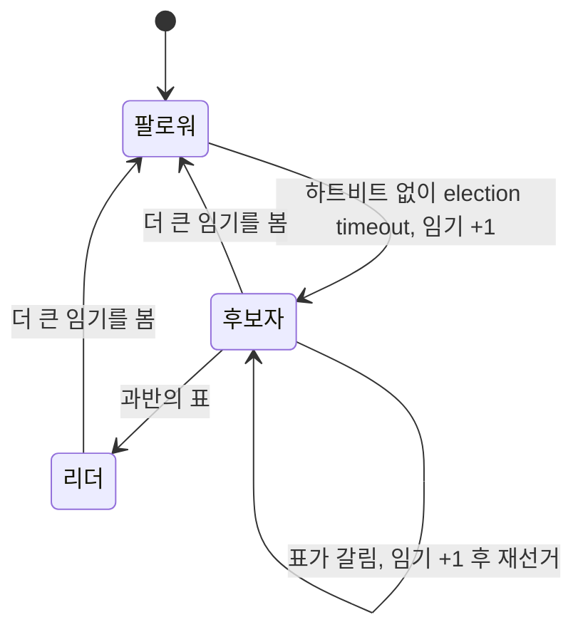

Kafka의 KRaft, etcd, Consul, TiDB가 전부 Raft를 쓴다. 이 도구들을 운영하면서 "리더 선출 중이라 잠깐 못 쓴다", "과반이 살아 있어야 한다" 같은 문장을 만나는데, 그 문장들이 어디서 나오는지 알면 장애 대응이 달라진다. Raft는 이해하기 쉽도록 설계된 알고리즘이라 원논문 제목부터 "In Search of an Understandable Consensus Algorithm"이다.

## 합의가 푸는 문제

여러 노드가 같은 순서의 로그를 갖게 만드는 것이다. 로그가 같으면 그 로그를 차례로 적용한 상태 기계의 결과도 같다. "복제 상태 기계(replicated state machine)"라고 부르는 모델이고, [데이터베이스 복제](/posts/db-replication/), 설정 저장소, 리더 선출이 전부 이 틀에 들어간다.

Raft는 문제를 셋으로 나눈다. 리더 선출, 로그 복제, 안전성.

## 리더 선출: 임기와 과반

노드는 팔로워, 후보자, 리더 중 하나다. 팔로워는 리더의 하트비트를 기다리고, 일정 시간(election timeout) 동안 못 받으면 후보자가 되어 임기(term)를 1 올리고 투표를 요청한다.

- 각 노드는 한 임기에 한 표만 준다. 논문은 먼저 온 후보에게 준다(first-come-first-served)고 적는다.
- 과반의 표를 얻으면 리더가 된다.
- 과반을 못 얻으면(표가 갈리면) 임기를 올려 다시 한다.

election timeout을 노드마다 무작위로 두는 것이 분할 투표를 줄이는 장치다. 모두 같은 시각에 후보가 되면 계속 갈린다. 논문은 이 값을 고정 구간(예: 150–300ms)에서 무작위로 고른다([Ongaro & Ousterhout 2014, 5.2절](https://raft.github.io/raft.pdf)).

세 역할 사이의 전이를 그리면 다음과 같다.

그래서 리더 선출 중에는 쓰기가 멈춘다. 그 시간은 election timeout + 투표 왕복이고, 보통 수백 ms에서 수 초다. "리더 교체 중 잠깐 에러"는 버그가 아니라 이 설계에서 나오는 결과다. 클라이언트에 재시도가 없으면 그 순간이 장애로 보인다.

## 로그 복제: 과반이 받으면 커밋

클라이언트 요청은 리더로 간다. 리더는 자기 로그에 엔트리를 붙이고 팔로워에게 보낸다. 과반이 기록했다고 답하면 그 엔트리를 커밋하고 상태 기계에 적용한 뒤 클라이언트에 응답한다. 논문의 정의는 "A log entry is committed once the leader that created the entry has replicated it on a majority of the servers"다(엔트리를 만든 리더가 그것을 과반 서버에 복제하면 커밋된다, 5.3절).

과반인 이유는 겹침이다. 5노드에서 과반은 3이고, 어떤 두 과반도 최소 한 노드를 공유한다. 그래서 커밋된 엔트리는 다음 리더가 될 수 있는 모든 후보의 로그에 반드시 들어 있다.

노드 수와 내성의 관계도 여기서 나온다.

| 노드 | 과반 | 견딜 수 있는 장애 |
| --- | ---: | ---: |
| 3 | 2 | 1 |
| 4 | 3 | 1 |
| 5 | 3 | 2 |

4노드가 3노드보다 나은 점이 없다. 홀수로 두는 이유다.

## 안전성: 왜 옛 리더가 로그를 덮을 수 없는가

네트워크가 끊겨 옛 리더가 자기가 여전히 리더인 줄 아는 상황이 있다. Raft는 이것을 두 규칙으로 막는다.

투표 제한. 후보자의 로그가 자기 것보다 뒤처져 있으면 표를 주지 않는다. 논문에서는 RequestVote RPC에 후보자의 로그 정보가 실리고, 투표자는 자기 로그가 더 최신이면 거부한다(5.4.1절). 그래서 커밋된 엔트리를 모두 가진 노드만 리더가 될 수 있다.

임기 비교. 모든 메시지에 임기가 실린다. 자기보다 큰 임기를 보면 즉시 팔로워로 내려가고, 옛 임기가 실린 요청은 거부한다(5.1절). 옛 리더가 뒤늦게 쓰기를 시도하면 팔로워들이 더 큰 임기를 알고 있으므로 거부하고, 옛 리더는 그 응답을 보고 물러난다.

이 두 규칙이 [분산락 글](/posts/kleppmann-distributed-locking/)에서 본 fencing token과 같은 일을 한다. 단조 증가하는 번호(임기)를 모든 참여자가 확인하고, 작은 번호의 명령을 거부한다. 그래서 합의 시스템 위에서는 fencing을 따로 만들지 않아도 이미 있는 것처럼 보인다.

## 이 설명이 깨지는 곳

- 과반이 없으면 멈춘다. 3노드 중 2대가 죽으면 읽기도 쓰기도 안 된다. 가용성보다 정합성을 택한 것이고([CP](/posts/consistency-models/)), 그것이 이 도구들을 쓰는 이유다.
- 리더에게 읽어도 옛 값일 수 있다. 분할된 옛 리더가 자기가 리더인 줄 알고 로컬 값을 돌려주면 stale read다. 이를 막으려면 읽기도 과반 확인을 거치거나(ReadIndex), 리스가 유효한지 확인해야 한다. 논문은 리더가 읽기 전용 요청에 답하기 전에 과반과 하트비트를 주고받게 하고, 리스 방식은 시계 오차가 한정돼 있다는 가정에 기댄다고 적는다(8절). etcd의 선형화 읽기 옵션이 이 비용이다.
- Raft는 지연을 줄이지 않는다. 모든 쓰기가 과반 왕복을 포함한다. 노드를 여러 리전에 두면 그 왕복이 곧 쓰기 지연이다.
- Raft는 Paxos보다 강한 보장을 주지 않는다. 논문은 Raft가 (multi-)Paxos와 같은 결과를 내고 Paxos만큼 효율적이라고 적는다. Raft의 기여는 이해 가능성과 구현 가능성이다.

## 무엇을 재면 확인되는가

1. 리더를 죽이고 새 리더가 쓰기를 받기까지의 시간을 여러 번 재 분포를 본다. 클라이언트 타임아웃을 그 분포보다 길게 잡아야 한다.
2. 과반이 깨지는 순간(3노드 중 2대 정지) 읽기와 쓰기가 각각 어떻게 실패하는지.
3. 노드를 여러 리전에 배치했을 때 쓰기 p99(상위 1% 지연)의 변화.

[ParityPay 8편](/posts/parity-pay-kafka-failures/)의 한계에 "단일 노드라 ISR 축소, 리더 교체, 복제본 지연은 재현할 수 없다"고 적었다. 위 세 가지가 그 빈칸이고, 다중 브로커 실험이 계획에 남아 있다.

## 실무와의 접점

직접 합의 알고리즘을 구현한 적은 없다. 대신 Kafka, Zookeeper, etcd를 쓰는 쪽이었고, 그때 만난 문장들이 전부 이 글의 내용이었다. "왜 홀수여야 하나", "왜 리더 교체 때 에러가 나나", "왜 과반이 죽으면 읽기도 안 되나". 사용자 입장에서 알아야 할 것은 알고리즘의 증명이 아니라 그 알고리즘이 정한 운영상의 제약이다.

## 정리

- 커밋은 과반이 기록한 시점이다. 어떤 두 과반도 겹치므로 커밋된 엔트리는 다음 리더에게 반드시 있다.
- 4노드는 3노드보다 나은 점이 없다. 홀수로 둔다.
- 임기 번호가 fencing token과 같은 일을 한다. 작은 임기의 명령은 거부된다.
- 리더 선출 중에는 쓰기가 멈춘다. 클라이언트 재시도가 없으면 그것이 장애로 보인다.
- 리더에게 읽어도 옛 값일 수 있다. 선형화 읽기는 추가 비용이다.

## 참고

- Ongaro & Ousterhout, [In Search of an Understandable Consensus Algorithm](https://raft.github.io/raft.pdf) (2014)
- [The Raft Consensus Algorithm](https://raft.github.io/) — 시각화 포함
- [KRaft: Apache Kafka Without ZooKeeper](https://developer.confluent.io/learn/kraft/)
