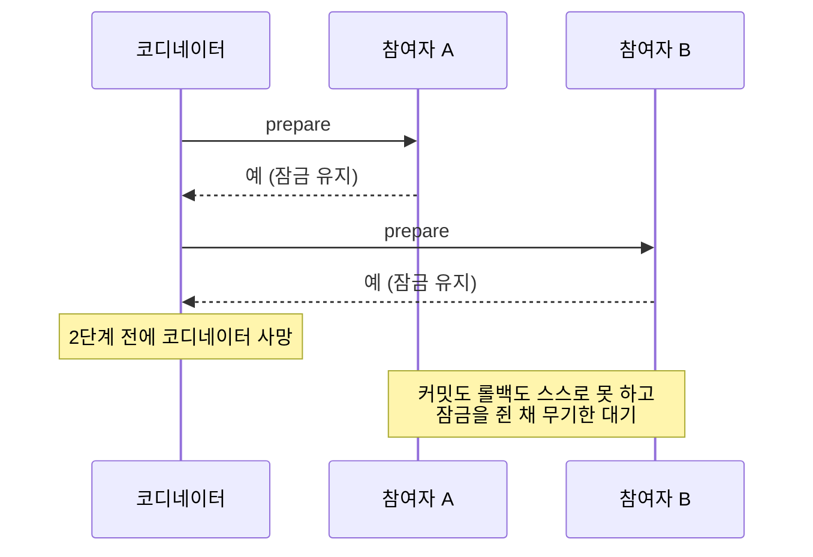

서비스를 나누면 트랜잭션도 나뉜다. 주문 서비스가 커밋했는데 결제 서비스가 실패하면 무엇을 해야 하는가. 답은 둘뿐이다. 둘을 하나의 트랜잭션으로 묶거나(2PC), 나뉜 채로 보정하거나(Saga). 각자 포기하는 것이 다르고, 둘 다 공짜가 아니다.

## 2PC: 하나로 묶는다

코디네이터가 참여자들에게 두 단계로 묻는다.

```text
1단계 (prepare): "커밋할 수 있나?" → 각자 준비하고 "예"라고 답하면 그 상태로 잠긴다
2단계 (commit):  "커밋하라"       → 모두 커밋. 하나라도 "아니오"면 모두 롤백
```

`prepare`에 "예"라고 답한 참여자는 커밋도 롤백도 스스로 못 한다. 코디네이터의 지시를 기다려야 하고, 그 동안 [잠금](/posts/lock-types-and-waits/)을 쥔다.

그래서 **코디네이터가 1단계와 2단계 사이에 죽으면 참여자들은 잠금을 쥔 채 무기한 대기한다.** 이것을 blocking 문제라 하고, 2PC가 마이크로서비스에서 기피되는 주된 이유다. 아래는 그 순간을 그린 것이다.



그 외의 비용도 있다.

- 참여자가 하나라도 느리면 전체가 그 속도다.
- 모든 참여자가 XA 같은 프로토콜을 지원해야 한다. 외부 API는 대개 지원하지 않는다.
- 가용성이 곱해진다. 참여자 각각이 99.9%면 넷을 묶었을 때 99.6%다.

2PC가 맞는 곳이 없지는 않다. 참여자가 적고, 같은 조직이 운영하며, 지연에 민감하지 않고, XA를 지원하는 자원들(DB 여러 대) 사이라면 쓸 만하다.

## Saga: 나뉜 채로 보정한다

각 단계를 로컬 트랜잭션으로 즉시 커밋하고, 실패하면 이미 커밋된 것들을 보상 트랜잭션으로 되돌린다.

```text
주문 생성(커밋) → 결제 승인(커밋) → 재고 차감(실패)
                                    ↓
              주문 취소(보상)  ←  결제 취소(보상)
```

잠금을 오래 쥐지 않고 서비스 간 결합도 낮다. 대신 [격리](/posts/isolation-levels-and-anomalies/)가 없다. 중간 상태가 다른 트랜잭션에 보인다. 결제는 승인됐는데 재고 차감 전인 상태를 누군가 읽을 수 있다.

ACID의 A, C, D는 각 로컬 트랜잭션에서 지켜지지만 **I(격리)는 전체에서 성립하지 않는다.** [microservices.io의 Saga 패턴 설명](https://microservices.io/patterns/data/saga.html)도 단점으로 자동 롤백이 없다는 것과 격리가 없다는 것을 꼽는다. 여러 Saga와 트랜잭션이 동시에 돌면 데이터 이상 현상이 생길 위험이 있어서, 격리를 흉내 내는 대응책(countermeasure)을 설계해야 한다는 것이다.

## 보상이 어려운 이유

"되돌리면 된다"가 실제로는 쉽지 않다.

보상 자체가 실패할 수 있다. 결제 취소 API가 죽어 있으면 어떻게 하는가. 그래서 보상은 무한히 재시도 가능해야 하고 [멱등해야](/posts/idempotency-key-design/) 한다. 실패하면 수동 개입 큐로 보내는 경로가 필요하다.

되돌릴 수 없는 것이 있다. 발송된 메일, 출고된 물건, 외부 기관에 보낸 통보. 이때 보상은 취소가 아니라 사과 메일 발송, 반품 요청 생성 같은 다른 행동이 된다. 그래서 Saga 설계는 "어떻게 되돌릴까"가 아니라 **"되돌릴 수 없는 단계를 뒤로 미룰 수 있는가"** 로 시작한다.

중간 상태가 보인 뒤의 보상은 사용자 경험 문제다. 주문이 생성됐다가 몇 초 뒤 사라지면 사용자는 혼란스럽다. `PENDING` 같은 명시적 중간 상태를 두고 그것을 UI에 드러내는 편이 낫다.

의미적 잠금(semantic lock)이 부분적인 답이다. 중간 상태를 "처리 중"으로 표시해 다른 트랜잭션이 그 자원을 건드리지 못하게 한다. 격리를 애플리케이션 수준에서 흉내 내는 것이고, 그만큼 복잡도가 는다.

## 코레오그래피와 오케스트레이션

Saga를 조율하는 방식이 둘이다.

| | 코레오그래피 | 오케스트레이션 |
| --- | --- | --- |
| 흐름 | 각 서비스가 이벤트를 듣고 반응 | 조정자가 순서대로 호출 |
| 결합 | 낮음 | 조정자가 모두를 안다 |
| 흐름 파악 | 어렵다. 코드 어디에도 전체가 없다 | 한 곳에 있다 |
| 단계 수 | 적을 때 유리 | 많아질수록 유리 |

단계가 서넛을 넘으면 코레오그래피는 추적이 어려워진다. "이 주문이 왜 멈춰 있지"에 답하려면 여러 서비스의 로그를 이어 붙여야 한다. 오케스트레이션은 상태 기계를 한 곳에 두므로 그 질문에 바로 답한다.

## 세 번째 선택지: 트랜잭션을 나누지 않기

가장 자주 간과되는 답이다. 경계를 다시 그어 하나의 로컬 트랜잭션으로 만들 수 있으면 그것이 가장 싸다. 주문과 결제가 항상 함께 성공하거나 실패해야 한다면, 두 서비스로 나눈 것이 잘못된 경계일 수 있다.

[모듈러 모놀리스](/posts/modular-monolith-boundaries/)가 이 방향이다. 모듈로 나누되 트랜잭션은 하나로 둔다. 분산 트랜잭션 비용을 내지 않고 경계의 이점을 얻는다.

## 이 설명이 깨지는 곳

- 외부 기관 호출은 Saga의 단계로 넣기 어렵다. 응답이 유실되면 성공인지 실패인지 모르므로, 보상을 걸지 조회를 할지 정할 수 없다. [ParityPay 3편](/posts/parity-pay-unknown-state/)의 `UNKNOWN` 상태가 이 자리의 답이다.
- Outbox는 Saga가 아니다. DB와 메시지의 이중 쓰기를 푸는 것이고, 여러 서비스의 업무 흐름을 조율하는 것이 아니다([ParityPay 5편](/posts/parity-pay-outbox/)).
- 보상이 원래 트랜잭션의 정확한 역이 아닐 수 있다. 환불 수수료, 재고 복원 시점, 포인트 소멸 같은 것들이 그 차이를 만든다. 회계적으로는 역분개가 더 정확한 모델이다([ParityPay 7편](/posts/parity-pay-ledger/)).
- Saga가 항상 2PC보다 낫다는 것은 아니다. 참여자가 둘이고 같은 DB 클러스터 안이면 분산 트랜잭션이 단순할 수 있다.

## 무엇을 재면 확인되는가

1. Saga의 각 단계에서 프로세스를 죽이고 최종 상태가 일관되는지 본다. 보상이 도는지, 중간에 멈추는지.
2. 보상 트랜잭션을 실패하게 만들고 그 다음 무엇이 일어나는지. 재시도하는가, 사람에게 가는가, 잊히는가.
3. 중간 상태가 보이는 시간의 분포. 그 값이 사용자 경험 요구를 넘는지.

[ParityPay](/posts/parity-pay-experiments-and-defects/)는 모듈러 모놀리스라 분산 Saga가 없고, 대신 외부 기관과의 경계에서 같은 문제를 다뤘다. 위 세 가지는 서비스를 실제로 나눠야 잴 수 있다.

## 정리

- 2PC는 참여자가 적고 XA를 지원하는 자원들 사이에서만 쓸 만하고, 외부 API가 끼면 선택지에서 빠진다.
- Saga를 고르면 격리를 애플리케이션이 대신 만들어야 하고(`PENDING`, 의미적 잠금), 보상이 실패할 때 사람에게 가는 경로가 필요하다.
- 분산 트랜잭션을 고르기 전에 경계를 다시 그어 트랜잭션을 나누지 않을 수 있는지부터 본다.

## 참고

- [Microservices.io: Saga pattern](https://microservices.io/patterns/data/saga.html)
- Garcia-Molina & Salem, [Sagas](https://www.cs.cornell.edu/andru/cs711/2002fa/reading/sagas.pdf) (1987)
- [ParityPay 3편 - UNKNOWN 상태](/posts/parity-pay-unknown-state/)
