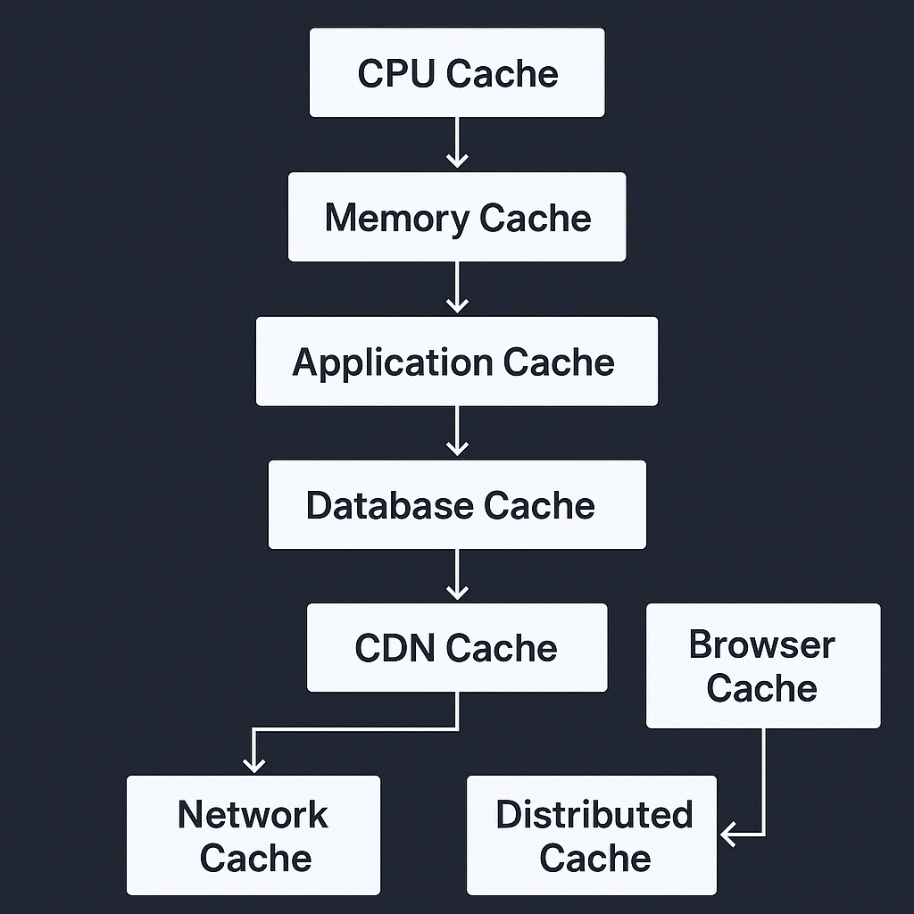

캐싱은 반복적인 계산과 원격 조회 비용을 줄이기 위해 데이터를 더 가까운 위치에 저장하는 기술이다. CPU 내부부터 CDN까지 거의 모든 계층에 등장하며, 계층이 달라도 핵심 질문은 비슷하다. 무엇을 저장할 것인지, 언제 무효화할 것인지, 원본과 얼마나 차이를 허용할 것인지가 중요하다.

---

## 1. CPU 캐시

### 개요:
- CPU는 메모리에서 데이터를 읽는 속도가 상대적으로 느리기 때문에, 자주 접근하는 데이터를 저장하기 위한 고속 메모리(Cache)를 사용한다.
- CPU 캐시는 L1, L2, L3 계층으로 나뉜다.

### 주요 개념:
- **L1 캐시**: 가장 빠르고 크기가 작다. CPU 코어별로 존재.
- **L2 캐시**: L1보다 크지만 상대적으로 느리다. CPU 코어별로 존재하거나 공유 가능.
- **L3 캐시**: 여러 코어가 공유하는 캐시. 크기는 크지만 L1, L2보다 느리다.

### 캐싱 전략:
- **LRU (Least Recently Used):** 가장 오래 사용되지 않은 데이터를 제거.
- **Write-back:** 변경된 데이터를 메모리에 바로 쓰지 않고, 일정 시간 후 배치로 업데이트.
- **Write-through:** 데이터를 캐시에 저장할 때마다 즉시 메모리에도 저장.

---

## 2. 메모리 캐시 (RAM 캐시)
### 개요:
- 애플리케이션에서 자주 사용하는 데이터를 메모리에 저장하여 **디스크 I/O를 줄이는 방식**.

### 주요 방식:
- **Page Cache:** OS가 디스크의 페이지를 메모리에 유지.
- **Buffer Cache:** 파일 시스템의 입출력 성능을 높이기 위해 사용.
- **In-Memory Database:** Redis, Memcached 등을 사용하여 데이터를 메모리에 저장.

### 캐싱 전략:
- **Write-behind:** 데이터를 캐시에 저장하고 나중에 디스크로 저장.
- **Read-through:** 캐시에 데이터가 없을 경우 원본 데이터베이스에서 가져와 캐시에 저장.

---

## 3. **애플리케이션 레벨 캐시**
### 개요:
- 웹 애플리케이션, 백엔드 서비스 등에서 자주 조회되는 데이터를 캐싱.

### 주요 방식:
- **Session Cache:** 사용자 로그인 세션을 빠르게 조회하기 위한 캐시 (예: Redis, Memcached).
- **Object Cache:** 자주 생성되는 객체를 캐시 (예: Hibernate 2차 캐시).
- **Computed Cache:** 무거운 연산 결과를 캐시 (예: 머신러닝 모델의 예측 결과).

### 캐싱 전략:
- **Lazy Loading:** 요청이 들어올 때만 캐시에 데이터 저장.
- **Eager Loading:** 애플리케이션 실행 시 미리 데이터를 캐시에 로드.

---

## 4. **데이터베이스 캐시**
### 개요:
- DB에서 반복적으로 실행되는 쿼리 결과를 캐싱하여 성능을 최적화.

### 주요 방식:
- **Query Cache:** 동일한 쿼리 결과를 저장하여 다시 사용.
- **Row Cache:** 특정 행 데이터를 캐싱.
- **Materialized View:** 쿼리 결과를 물리적으로 저장.
- **Read Replica:** 읽기 전용 복제본을 사용하여 부하 분산.

### 캐싱 전략:
- **Write-through:** DB가 갱신될 때 캐시도 동시에 갱신.
- **Write-around:** 캐시를 거치지 않고 직접 DB를 업데이트.
- **Write-back:** DB 업데이트 전에 캐시에서 먼저 반영 후 배치로 저장.

---

## 5. **CDN (Content Delivery Network) 캐시**
### 개요:
- **정적 자원(이미지, CSS, JavaScript 등)**을 여러 지역에 분산하여 빠르게 제공하는 방식.

### 주요 방식:
- **Edge Cache:** CDN 엣지 서버에서 사용자와 가까운 곳에 데이터 저장.
- **Origin Shield:** 원본 서버 부하를 줄이기 위한 중간 캐시 계층.

### 캐싱 전략:
- **Time-to-Live (TTL):** 특정 시간 동안 캐시 유지.
- **Cache Purging:** 특정 조건에서 캐시를 수동으로 삭제.

---

## 6. **브라우저 캐시**
### 개요:
- 웹 브라우저가 페이지 리소스를 로컬에 저장하여 네트워크 요청을 줄임.

### 주요 방식:
- **Memory Cache:** 현재 세션 동안만 유지.
- **Disk Cache:** 브라우저를 닫아도 유지됨.
- **Service Worker Cache:** 오프라인에서도 웹 페이지를 제공하기 위한 캐시.

### 캐싱 전략:
- **Cache-Control 헤더:** `max-age`, `no-cache`, `must-revalidate` 등으로 캐시 설정.
- **ETag:** 콘텐츠 변경 여부를 체크하여 캐시 갱신 여부 결정.

---

## 7. **네트워크 계층 캐시**
### 개요:
- 네트워크 장비(프록시 서버, 로드 밸런서 등)에서 캐시를 활용하여 요청을 최적화.

### 주요 방식:
- **Reverse Proxy Cache:** 서버 앞단에서 캐싱 (예: Nginx, Varnish).
- **DNS Cache:** 도메인 이름을 IP로 변환하는 과정에서 결과를 캐싱.

### 캐싱 전략:
- **Least Recently Used (LRU):** 오래 사용하지 않은 항목을 제거.
- **First In First Out (FIFO):** 먼저 들어온 데이터를 먼저 제거.

---

## 8. **분산 캐시**
### 개요:
- 여러 노드에 걸쳐 데이터를 캐싱하여 확장성과 가용성을 높임.

### 주요 방식:
- **Sharding:** 데이터를 여러 서버에 분산하여 저장.
- **Consistent Hashing:** 캐시 서버 추가/제거 시 최소한의 데이터 이동만 발생하도록 해 부하를 최소화.

### 캐싱 전략:
- **Replication:** 동일한 데이터를 여러 서버에 저장.
- **Eviction Policies:** `LRU`, `LFU`, `FIFO` 등을 사용하여 캐시 정리.

---

## 9. **AI/ML 캐시**
### 개요:
- 머신러닝 모델의 결과값을 캐싱하여 반복적인 예측 연산을 줄임.

### 주요 방식:
- **Feature Store Cache:** 머신러닝 모델에 필요한 특징(feature) 데이터를 캐싱.
- **Inference Cache:** 동일한 입력에 대한 예측 결과를 캐싱.

## 결론
캐싱은 속도와 효율성을 높이기 위해 필수적인 기술이다. CPU부터 DB, 브라우저, 네트워크까지 다양한 계층에서 적용 가능하며, 각각의 계층에서 최적화된 캐싱 전략을 사용해야 한다.

아래는 **시스템의 모든 계층에서 사용되는 캐시(Cache)** 를 **위에서 아래까지, 계층별로 목적・예시・전략까지 포함**해 정리한 **종합 표**입니다.

------

## ✅ 모든 계층에서의 캐시 정리표

| 계층 (Layer)                   | 주요 목적                                   | 대표 예시                                    | 캐싱 전략 / 특징                                    |
| ------------------------------ | ------------------------------------------- | -------------------------------------------- | --------------------------------------------------- |
| **1. CPU 캐시**                | 메모리 접근 속도 향상                       | L1 / L2 / L3 Cache                           | 하드웨어 레벨의 자동 캐싱 (LRU, Write-back 등)      |
| **2. RAM 캐시**                | 디스크 I/O 최소화, 시스템 응답 속도 개선    | OS의 Page Cache, Buffer Cache                | OS 커널이 자동 캐싱, 디스크 → 메모리 읽기 최적화    |
| **3. 애플리케이션 캐시**       | API 응답 시간 단축, 연산 결과 재사용        | Spring Cache, Caffeine, Guava                | 로컬 메모리 기반 (임베디드), 빠르지만 공유 불가     |
| **4. 분산 캐시**               | 다중 인스턴스 간 데이터 공유 및 일관성 유지 | Redis, Memcached, Hazelcast                  | 중앙 캐시 서버. TTL, Write-through, Pub/Sub 등 지원 |
| **5. 데이터베이스 캐시**       | 쿼리 성능 향상, DB 부하 감소                | Query Cache, Materialized View, Read Replica | DB 내부 또는 외부에서 동작, R/O 최적화              |
| **6. 파일 시스템/디스크 캐시** | 파일 접근 속도 개선                         | OS I/O 캐시, SSD 컨트롤러 캐시               | OS 및 하드웨어에 의해 자동 적용                     |
| **7. CDN (Edge) 캐시**         | 전 세계 사용자에게 빠른 정적 콘텐츠 제공    | Cloudflare, Akamai, AWS CloudFront           | TTL, 캐시 무효화(Purge), 지리적 분산                |
| **8. 브라우저 캐시**           | 페이지 로딩 속도 향상, UX 개선              | Disk Cache, Memory Cache, Service Worker     | Cache-Control, ETag, max-age, offline 가능          |
| **9. 네트워크 계층 캐시**      | 트래픽 최적화, 백엔드 부하 감소             | Reverse Proxy (Nginx), DNS Cache             | 캐시 프록시, TTL 설정, 다중 계층 캐시 가능          |
| **10. AI/ML 캐시**             | 연산 비용 절감, 추론 응답 시간 단축         | Feature Store Cache, Model Output Cache      | 동일 입력 캐싱, 특성값 캐싱, LRU/TTL 활용           |

------

## 🎯 계층별 특징 요약

| 분류 기준         | 로컬/분산 | 휘발성    | 속도      | 사용 주체        |
| ----------------- | --------- | --------- | --------- | ---------------- |
| CPU/RAM 캐시      | 로컬      | 예        | 매우 빠름 | 하드웨어/OS 자동 |
| 애플리케이션 캐시 | 로컬      | 예        | 빠름      | 개발자 직접 구현 |
| 분산 캐시         | 분산      | 예/아니오 | 중간~빠름 | 서비스 전반 공유 |
| DB/파일 캐시      | 로컬/내부 | 예/아니오 | 중간      | DB/OS 내부 처리  |
| CDN/브라우저      | 분산      | 예        | 빠름      | 클라이언트/전역  |

------

## 🧠 핵심 요약

- ✅ **상위 계층일수록 속도는 빠르지만 휘발성이 강함 (ex. CPU, RAM)**
- ✅ **하위 계층일수록 안정적이고 영속적이지만 느림 (ex. DB, 디스크)**
- ✅ **애플리케이션과 서비스 간 공유 필요 시 → 분산 캐시(Redis 등)**
- ✅ **브라우저, CDN, 프록시 등 사용자 근접 캐시도 전체 UX에 매우 중요**

------
