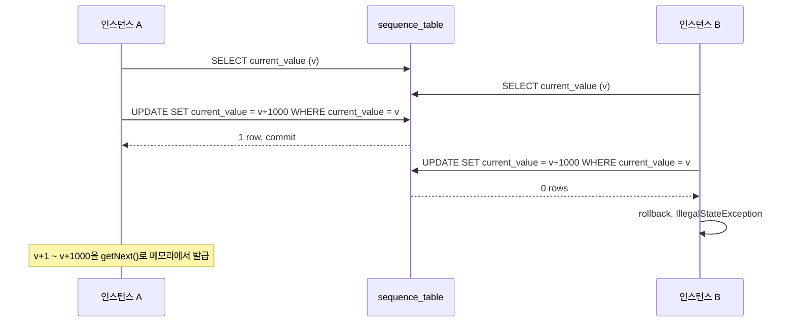

## 시퀀스 테이블 병목을 줄인 계약 코드 생성 최적화 사례

이 글은 계약 코드 생성 과정에서 발생한 시퀀스 테이블 병목을, 코드 체계를 유지한 채 선할당과 낙관적 락으로 줄인 기록입니다. 같은 키 생성 병목을 추적한 과정은 [키 생성 병목을 추적해 구조를 바꾼 기록](/posts/sequence-part1/) 시리즈에 따로 남겼습니다.

---

## 문제 상황: 시퀀스 기반 키 생성의 병목

계약 생성 시에는 고유한 계약 코드가 필요하고, 이를 단일 시퀀스 테이블로 관리하고 있었습니다. 그런데 요청이 늘면서 다음 문제가 점점 심해졌습니다.

* 모든 계약 생성 트랜잭션이 동일 시퀀스 테이블의 같은 행에 접근
* 매 요청마다 `SELECT FOR UPDATE` 발생 → DB [락 경합](/posts/lock-types-and-waits/)
* 다수의 병렬 트랜잭션이 걸리며 성능 저하, 심한 경우 데드락

특히 대량의 계약 데이터를 동시 등록하는 배치나 이벤트성 등록 API 호출 시 **응답 시간이 수 분까지 증가**하는 현상이 반복되었습니다.

## 기존 방식: 시퀀스 테이블 + 프로시저 기반

### 시퀀스 테이블 구조

```sql
CREATE TABLE sequence_table (
    name VARCHAR(100) PRIMARY KEY,
    current_value BIGINT NOT NULL
);
```

### 시퀀스 증가용 프로시저 (MySQL 기준)

아래는 예시로 작성한 시퀀스 증가 프로시저 코드입니다.

```sql
DELIMITER $$

CREATE PROCEDURE get_next_sequence(IN seq_name VARCHAR(100), OUT next_val BIGINT)
BEGIN
    DECLARE current BIGINT;

    START TRANSACTION;

    SELECT current_value INTO current
    FROM sequence_table
    WHERE name = seq_name
    FOR UPDATE;

    SET next_val = current + 1;

    UPDATE sequence_table
    SET current_value = next_val
    WHERE name = seq_name;

    COMMIT;
END$$

DELIMITER ;
```

### 문제점

- 매 호출마다 `SELECT ... FOR UPDATE` → 트랜잭션 락 경쟁 심화
- 병렬 트랜잭션 시 경합 또는 데드락 가능성

`SELECT ... FOR UPDATE`는 읽은 행에 배타 락을 겁니다. MySQL 문서는 그 효과를 "Other transactions are blocked from updating those rows"라고 설명합니다(다른 트랜잭션은 그 행을 갱신하지 못하고 기다린다, [MySQL 8.0 Reference Manual, Locking Reads](https://dev.mysql.com/doc/refman/8.0/en/innodb-locking-reads.html)). 시퀀스 행은 하나뿐이므로, 계약 코드를 받으려는 트랜잭션은 앞선 트랜잭션이 커밋할 때까지 한 줄로 대기합니다. 그래서 동시 등록이 몰릴수록 대기 시간이 누적되었습니다.

---

## 대안 검토: 기술을 바꾸기엔 제약이 많았다

원인이 단일 행에 대한 락이었으므로, 먼저 그 행을 거치지 않는 대안들을 검토했습니다.

| 대안                     | 장점             | 단점                      |
| ---------------------- | -------------- | ----------------------- |
| UUID / Time-based ID   | 락 없음, 분산 처리 적합 | 기존 코드 체계와 호환 불가         |
| Redis Atomic Increment | 빠르고 락 없음       | 장애 시 유실 가능성, 영속성 보장 어려움 |
| DB 시퀀스 분산화             | 물리적 충돌 제거 가능   | 유지보수 복잡도 증가             |

그러나 기존 계약 코드 체계와의 호환성을 반드시 유지해야 했습니다. 그래서 UUID처럼 형식을 바꾸는 방식과, 시퀀스를 외부 저장소(예: Redis)로 이관하는 방식은 어렵다는 결론이 났습니다. 남은 선택지는 시퀀스 테이블은 그대로 두고 그 테이블에 접근하는 횟수를 줄이는 것이었습니다.

---

## 해결 전략: 시퀀스 선할당 + 낙관적 락 + 메모리 캐시

아이디어는 시퀀스를 매번 DB에서 조회하지 않고, 일정량을 미리 확보해 애플리케이션에서 캐시처럼 쓰는 것입니다.

### 설계 포인트

1. 시퀀스 번호를 N개 단위(예: 1,000개)로 선할당
2. 애플리케이션 메모리 캐시에 저장하고 `getNext()`로 꺼내 사용
3. 캐시 소진 시에만 DB 갱신 → 접근 횟수 대폭 감소
4. DB 갱신 시 **낙관적 락(Optimistic Lock)** 적용으로 정합성 보장

여기서 낙관적 락은 `SELECT`로 읽은 값이 그대로일 때만 `UPDATE`가 성공하도록 `WHERE current_value = ?` 조건을 거는 방식입니다. 읽을 때는 락을 잡지 않고 쓰는 순간에 비교한다는 점에서 [CAS(Compare-and-Set)](/posts/lock-free-and-cas/)와 같은 구조입니다.

---

## 개선된 시퀀스 갱신 코드 (Java + JDBC)

```java
public class SequenceCache {
    private final String sequenceName;
    private final int allocationSize;
    private final AtomicLong current = new AtomicLong(0);
    private long max = 0;
    private final DataSource dataSource;

    public SequenceCache(String sequenceName, int allocationSize, DataSource dataSource) {
        this.sequenceName = sequenceName;
        this.allocationSize = allocationSize;
        this.dataSource = dataSource;
    }

    public synchronized long getNext() {
        if (current.get() >= max) {
            allocateFromDb();
        }
        return current.getAndIncrement();
    }

    private void allocateFromDb() {
        try (Connection conn = dataSource.getConnection()) {
            conn.setAutoCommit(false);

            PreparedStatement select = conn.prepareStatement(
                "SELECT current_value FROM sequence_table WHERE name = ?"
            );
            select.setString(1, sequenceName);
            ResultSet rs = select.executeQuery();

            if (!rs.next()) throw new IllegalStateException("No sequence found");
            long currentValue = rs.getLong(1);
            long nextValue = currentValue + allocationSize;

            PreparedStatement update = conn.prepareStatement(
                "UPDATE sequence_table SET current_value = ? WHERE name = ? AND current_value = ?"
            );
            update.setLong(1, nextValue);
            update.setString(2, sequenceName);
            update.setLong(3, currentValue);

            int updated = update.executeUpdate();
            if (updated == 0) {
                conn.rollback();
                throw new IllegalStateException("Optimistic lock failed");
            }

            conn.commit();
            this.current.set(currentValue + 1);
            this.max = nextValue + 1;

        } catch (SQLException e) {
            throw new RuntimeException("Sequence allocation failed", e);
        }
    }
}
```

두 애플리케이션 인스턴스가 동시에 캐시를 채우려 할 때 위 코드가 어떻게 동작하는지는 다음과 같습니다. `v`는 두 인스턴스가 읽은 `current_value`이고, 할당 크기는 사용 예시와 같은 1,000입니다.



두 인스턴스가 같은 범위를 받는 일은 생기지 않습니다. 다만 이 코드는 충돌한 쪽에서 재시도 없이 예외를 던지므로, 재시도는 호출 측의 몫입니다.

### 사용 예시

```java
SequenceCache contractCodeCache = new SequenceCache("CONTRACT_CODE_SEQ", 1000, dataSource);

public String generateContractCode() {
    long next = contractCodeCache.getNext();
    return "C" + String.format("%09d", next); // e.g., C000001234
}
```

---

## 시퀀스 테이블 정의 (MySQL)

```sql
CREATE TABLE sequence_table (
    name VARCHAR(100) PRIMARY KEY,
    current_value BIGINT NOT NULL
);
```

---

## 성과: 처리 시간과 락 경합

| 항목               | 개선 전                   | 개선 후              |
| ---------------- | ---------------------- | ----------------- |
| 계약 생성 트랜잭션 처리 시간 | 약 2분                   | **약 10초**         |
| DB 시퀀스 접근 빈도     | 요청마다 1회                | **N회당 1회 (선할당 크기만큼)** |
| 락 경합 발생률         | 높음                     | **거의 없음**         |
| 데이터 정합성          | `SELECT FOR UPDATE` 기반 | **낙관적 락 기반으로 보장** |

이 방식은 기존 DB 시퀀스 체계와 계약 코드 형식을 유지하면서, 시퀀스 행 접근을 N회당 1회로 줄여 락 대기를 줄인 해결책이었습니다.

---

## 회고: 저장소를 바꾸지 않고 접근 횟수를 줄였다

락 경합이 발생하면 저장소나 키 형식을 바꿔야 한다고 생각하기 쉽습니다. 이번에는 코드 체계 호환성 때문에 그 선택지가 막혀 있었고, 그래서 같은 테이블에 접근하는 빈도를 줄이는 쪽으로 방향을 잡았습니다.

## 참고

- [MySQL 8.0 Reference Manual, Locking Reads](https://dev.mysql.com/doc/refman/8.0/en/innodb-locking-reads.html) — `SELECT ... FOR UPDATE`가 거는 락
