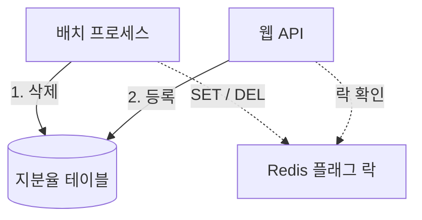

> 이 시리즈는 80만 건 이상 데이터를 처리하는 배치 시스템을 운영하며 겪은 문제와 개선 과정을 기록한 글입니다.
>
> Redis 락, 단일 트랜잭션, 폴링 기반 배치처럼 흔히 쓰이는 구조가
> 실제 운영 환경에서 어떤 식으로 정합성 문제와 장애로 이어지는지,
> 그리고 이를 어떻게 시스템적으로 해결했는지를 다룹니다.
>
> 이 글은 단순한 성능 최적화나 기술 나열이 아니라,
> “운에 맡기던 배치”를 “설명 가능한 시스템”으로 바꾸기까지의 사고 과정에 초점을 둡니다.

## 왜 이 배치는 가끔 터질까?

### 80만 건 지분율 배치에서 반복되던 운영 장애 분석

> 이 글은 대량 배치를 “빠르게” 만든 이야기가 아니다.
> 왜 가끔씩 터지는지를 설명할 수 있게 된 과정에 대한 기록이다.

---

## 기능은 단순했다

 

지분율 대량등록 배치는 구조적으로 복잡하지 않았다.

* 기존 지분율 삭제
* 신규 지분율 등록

두 단계가 순서대로 실행되면 끝이었다.

다만 실행 규모는 컸다.
한 번 실행하면 80만 건 이상의 데이터가 움직였다.

그래도 처음엔 그렇게까지 어렵게 느껴지지 않았다.
Redis 락만 잘 걸면 된다고 생각했다.

---

## 문제는 늘 “가끔” 발생했다

운영 중 이런 이야기가 들려오기 시작했다.

* “이번 달 지분율이 비어 있는 것 같아요.”
* “어제 올린 파일이 반만 반영된 것 같은데요.”
* “다시 실행하니까 또 정상처럼 보이네요.”
* “지분율이 '등록중' 상태로 계속 멈춰있어요.”

이때 처음 확인할 수 있는 것은 로그다. 그런데 로그를 보면 더 헷갈렸다.

* [x] 삭제 로그 정상
* [x] 등록 로그 정상
* [x] 에러 없음

재현도 잘 안 됐다. 완전히 동일한 파일과 동일한 계정, 동일한 환경에서 요청을 해도 발생하는 경우가 드물었다.

그래서 평소에 쓰는 두 가지 확인 수단인 로그와 재현이 모두 막혔다. 증상은 가끔만 나타나고, 그때마다 기록은 정상처럼 보였기 때문이다.

---

## 구조를 다시 보면, 위험 신호는 이미 있었다

당시 구조를 단순화하면 이렇다.

* 삭제는 배치 프로세스에서 실행
* 등록은 웹 API에서 실행
* 동시성 제어는 Redis `SET/DEL` 플래그 락

그림으로 보면 두 단계를 잇는 것은 Redis 플래그 하나뿐이다.

즉, 삭제와 등록이 서로 다른 프로세스에서 실행되고 있었다.

평소엔 잘 돌아간다.
문제는 예외 상황이다.

* 배치가 중간에 죽으면?
* Redis TTL(키에 걸린 만료 시간)이 만료되면?
* 삭제는 끝났는데 등록이 실패하면?
* 두 작업이 동시에 실행되면?

이 질문들에 대해, 시스템은 아무 대답도 하지 못하고 있었다.

---

## Redis 락은 있었지만, 순서는 보장되지 않았다

우리는 Redis 락을 사용하고 있었다.

* 작업 시작 시 락 설정
* 작업 종료 시 락 해제
* 락이 없으면 다음 작업 실행

겉보기엔 안전한 구조다.

그런데 로그를 시간 순으로 쌓아보니, 이상한 패턴이 반복됐다.

* 삭제 Job과 등록 Job이 같은 시간대에 실행
* Redis 락은 정상적으로 해제된 기록
* DB에는 삭제가 끝나지 않은 흔적

락이 해제됐다는 기록과 삭제가 끝나지 않았다는 흔적이 같은 시간대에 있었다. 그래서 "락이 있으니 순서도 지켜진다"는 가정은 버려야 했다. 락은 있었지만 “삭제 → 등록”이라는 순서는 깨지고 있었다.

---

## 문제는 락이 아니라, ‘상태’였다

여기서 관점을 바꿨다.

우리는 계속 이런 질문을 하고 있었다.

* “락이 걸려 있었나?”
* “Redis 값이 뭐였지?”

하지만 답해야 할 질문은 따로 있었다.

> “지금 이 작업은, 실제로 어디까지 끝난 상태인가?”

이 질문에 답할 수 있는 정보는 어디에도 없었다.

* DB에는 작업 상태가 남지 않았고
* Redis는 휘발성이었으며
* 로그는 사후 분석용일 뿐이었다

그 결과 시스템은 스스로의 상태를 설명하지 못했다.

---

## 단일 트랜잭션은 느린 문제가 아니었다

삭제 작업은 한 번에 전량을 처리했다.

* 단일 [트랜잭션](/posts/transaction/)
* 80만 건 DELETE
* 실행 시간 약 2시간

이건 단순히 느린 문제가 아니었다.

* 트랜잭션이 길수록 [롤백](/posts/redo-undo-log/) 비용은 커지고
* DB 락 점유 시간이 늘어나며
* 장애 발생 시 복구 시간은 예측 불가능해졌다

2시간짜리 트랜잭션이 끝 무렵에 실패하면, 그동안 지운 80만 건을 되돌리는 비용까지 함께 치른다. 실패의 크기가 작업의 크기에 비례하는 구조였다.

---

## 이 배치는 ‘운 좋게’ 돌아가고 있었다

이 시점에서 이 배치를 한 문장으로 요약하면 이렇다.

> “평소엔 잘 되지만, 예외 상황에선 아무것도 보장하지 않는다.”

* Redis 락은 있었지만, 언제 풀릴지 알 수 없었고
* 삭제와 등록은 분리돼 있었으며
* 시스템은 현재 상태를 설명하지 못했다

그래서 운영자는 늘 추측으로 판단해야 했다.

---

## 다음 글에서 다룰 것

이 글에서는 “무엇이 문제였는지”만 이야기했다.

이후 글에서는 이 질문을 파고든다.

* 왜 Redis 락이 있는데도 [레이스](/posts/how-to-control-race-condition/)(두 작업이 실행 순서에 따라 다른 결과를 내는 상황)가 발생했을까?
* 흔히 쓰는 `SET/DEL` 락 패턴은 왜 운영에서 위험할까?
* Redis를 어디까지 믿어도 되는 걸까?

`SET/DEL` 패턴의 약점은 [Redis `SET` 명령 문서](https://redis.io/docs/latest/commands/set/)도 짚는다. 문서는 `SET ... NX EX`와 `DEL`로 만드는 락에서, 만료 뒤에 보낸 `DEL`이 다른 클라이언트가 새로 잡은 락을 지울 수 있다고 설명하고, 값이 일치할 때만 지우는 스크립트로 해제하라고 권한다.

[1편. 시스템을 압박하기 시작한 배치](/posts/bulk-insert-with-lock-part1/)에서 구조를 다시 보는 것부터 시작하고, 락 문제는 [4편](/posts/bulk-insert-with-lock-part4/)에서 다룬다.

---

## 마무리하며

이 배치에서 문제가 된 것은 속도가 아니라, 작업이 어디까지 끝났는지 알 수 없다는 점이었다.

이 시리즈는 배치를 빠르게 만든 이야기가 아니라,
운영자가 추측하지 않아도 되는 시스템으로 바꾼 기록이다.

## 참고

- [Redis `SET` command](https://redis.io/docs/latest/commands/set/) — Patterns 절의 `SET ... NX EX` 락과 해제 방식

---
