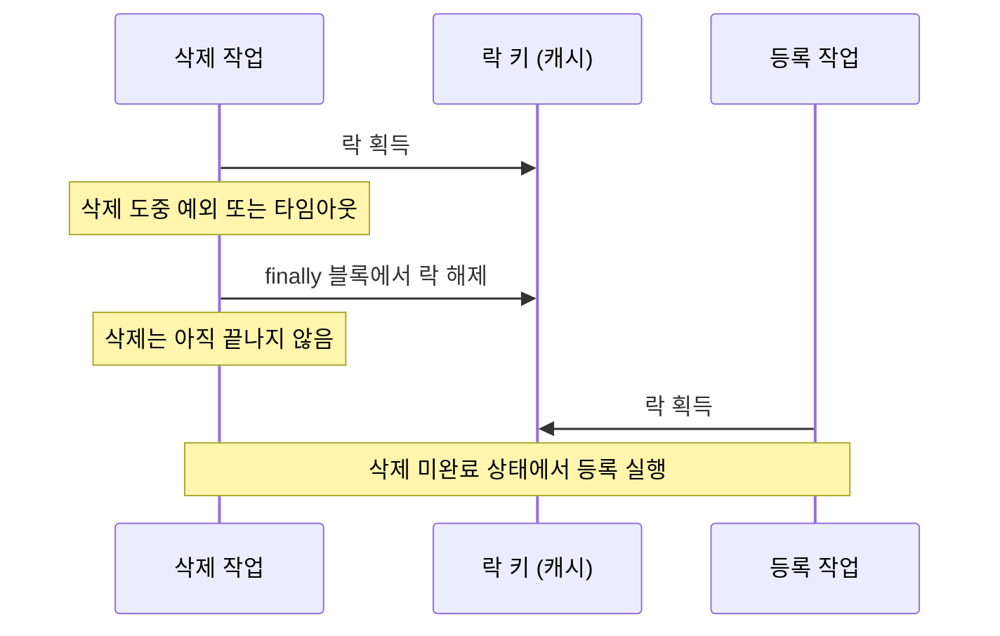

# 4편. 분산 락이 있음에도 Race Condition이 발생한 이유

## 들어가며

[3편](/posts/bulk-insert-with-lock-part3/)의 청크 분할과 병렬 처리로 배치 성능은 크게 개선됐다.
처리 시간은 줄었고, 시스템 부하도 안정적으로 관리되기 시작했다.

그런데 예상하지 못한 문제가 남아 있었다.
락을 사용하고 있는데도 작업 순서가 깨지고 있었다.

이번 글에서는 분산 락이 있었는데도 [Race Condition](/posts/how-to-control-race-condition/)(두 작업의 실행 순서에 따라 결과가 달라지는 상황)이 발생한 이유와, 그 원인을 어떻게 추적하고 해석했는지를 다룬다.

---

## 반드시 지켜져야 하는 작업 순서

해당 배치 작업에는 절대 깨지면 안 되는 순서가 있었다.

1. 기존 데이터 삭제
2. 신규 데이터 등록

이 순서가 단 한 번이라도 뒤바뀌면:

* 신규 데이터가 삭제되거나
* 삭제 미완료 상태에서 중복 데이터가 쌓이거나
* 최악의 경우 데이터 공백이 발생한다

그래서 이 두 작업은 동시에 실행될 수 없도록 분산 락으로 보호되고 있었다.

---

## 우리가 사용하던 기존 분산 락 구조

기존 락 구조는 단순했다.

* 작업 시작 시 캐시에 특정 키 설정
* 다른 프로세스는 해당 키 존재 여부로 실행 여부 판단
* 작업 종료 시 키 삭제

이 구조는 겉보기에는 문제없어 보였다.

* 하나의 작업만 실행되는 것처럼 보였고
* 테스트 환경에서는 정상 동작했다

하지만 운영 환경에서는 다른 결과가 나타났다.

---

## 실제로 발생한 이상 징후

운영 로그를 살펴보던 중, 이상한 패턴이 반복적으로 발견됐다.

* 삭제 작업이 아직 끝나지 않았는데
* 등록 작업이 먼저 실행되는 로그
* 일부 실행에서는 정상, 일부 실행에서는 실패

더 혼란스러웠던 점은 락 키가 분명히 존재했는데도 이런 일이 발생했다는 것이다.
락을 아예 쓰지 않아서 생긴 문제는 아니었다는 뜻이다.

---

## Race Condition은 재현되지 않으면 잡히지 않는다

이 문제는 단순한 코드 리뷰로는 발견할 수 없었다.

* 단일 실행
* 로컬 환경
* 짧은 실행 시간

이 조건에서는 절대 발생하지 않는다.

그래서 접근 방식을 바꿨다.
이상한 현상이 발생한 순간의 로그만 집중적으로 분석하기로 했다.

---

## 로그 타임라인 분석으로 확인한 흐름

문제가 발생한 시점의 로그를 시간순으로 정렬해 보았다.

그 결과, 다음과 같은 흐름이 반복되고 있었다.

1. 삭제 작업이 락을 획득
2. 삭제 작업 도중 예외 또는 타임아웃 발생
3. finally 블록에서 락 해제
4. 삭제 작업은 아직 완전히 끝나지 않음
5. 등록 작업이 락을 획득하고 실행 시작

두 작업이 겹친 순서를 그리면 이렇다.

즉, **락이 작업의 실제 종료보다 먼저 풀리고 있었다.**

---

## TTL이 있다고 해서 안전한 것은 아니다

기존 락에는 TTL(Time To Live, 키가 자동으로 만료되기까지의 시간)이 설정돼 있었다.

의도는 명확했다.

* 작업 중 프로세스가 죽더라도
* 락이 영원히 남지 않도록

하지만 TTL은 **안전장치이지, 순서 보장 장치가 아니다.**

* TTL 만료 시점은 작업 상태와 무관
* 네트워크 지연, [GC](/posts/why-a-process-pauses/), 스케줄링 지연에 따라 흔들림
* TTL 만료 순간에 다른 작업이 바로 진입 가능

[Redis 공식 문서](https://redis.io/docs/latest/develop/clients/patterns/distributed-locks/)도 같은 위험을 적는다.
락을 잡은 클라이언트가 "get blocked performing some operation for longer than the lock validity time"(어떤 작업에 묶여 락 유효 시간보다 오래 멈추는) 경우, 그 사이 키가 만료되고 다른 클라이언트가 락을 가져갈 수 있다.
이 한계는 [Kleppmann의 분산 락 글 리뷰](/posts/kleppmann-distributed-locking/)에서도 다룬다.

이 구조에서는 "락이 있다는 사실"과 "작업이 끝났다는 사실"이 분리되어 있었다.

---

## finally 블록의 해제는 작업 종료를 뜻하지 않았다

문제는 예외 처리 방식에도 있었다.

* 예외가 발생하면 finally 블록에서 락 해제
* 하지만 예외 발생 ≠ 작업 종료

병렬 처리 환경에서는 이 차이가 더 커진다.
메인 스레드가 예외를 감지하면 finally 블록으로 넘어가 락을 해제한다.
그런데 일부 스레드는 그 예외와 무관하게 아직 작업 중이다.
그 결과로 아직 실행 중인 작업을 보호하던 락이 먼저 사라지는 상황이 만들어졌다.

---

## 문제의 본질: 락을 "상태"처럼 사용했다

이 시점에서 문제를 다시 정의했다.

* 락은 "배타적 실행 보장"을 위한 도구인데
* 실제로는 "작업 상태 표시"처럼 사용되고 있었다

이 구조에서는 다음이 보장되지 않았다.

* 락을 가진 주체가 누구인지
* 락을 해제해도 되는 조건이 충족됐는지
* 재진입 시 이전 작업이 완전히 끝났는지

---

## 우리는 무엇을 잘못 믿고 있었을까

이 문제로 다시 보게 된 가정은 세 가지다.

* 캐시 기반 락은 만능이 아니다
* TTL은 안정성을 보장하지 않는다
* "락이 있다"는 사실만으로는 충분하지 않다

특히 대규모 배치나 장시간 작업에서는
**락의 생명주기와 작업의 생명주기가 정확히 일치해야 한다.**

---

## 참고

* [Distributed Locks with Redis](https://redis.io/docs/latest/develop/clients/patterns/distributed-locks/) — 락 유효 시간과 조건부 해제

---

## 다음 편 예고

다음 글에서는 이 문제를 어떻게 구조적으로 해결했는지, 배타적 락과 조건부 해제 구조를 다룬다.

* SETNX 기반 락 설계
* Lock Token 도입 이유
* 조기 해제·중복 해제 방지 방식

[5편. 배타적 락과 조건부 해제로 순서 보장하기](/posts/bulk-insert-with-lock-part5/)에서 이어진다.

---
