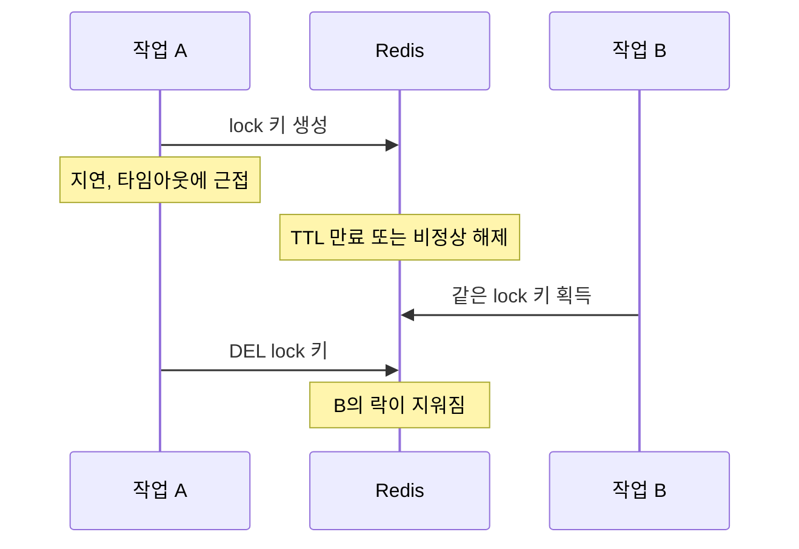

# 5편. 배타적 락과 조건부 해제로 순서를 보장하기

[앞선 글](/posts/bulk-insert-with-lock-part4/)에서 확인한 문제는 단순했다. 락을 쓰고 있었지만, 락의 생명주기와 실제 작업 생명주기가 일치하지 않았다. 결국 필요한 것은 "락이 존재하느냐"가 아니라 **누가 락을 가졌는지, 그리고 그 락을 누가 해제할 수 있는지**를 분명하게 만드는 구조였다.

## 왜 단순한 `SET` / `DEL` 패턴으로는 부족했나

가장 흔한 구현은 다음과 비슷하다.

```text
1. 작업 시작 전 lock 키 생성
2. 작업 종료 후 lock 키 삭제
```

문제는 이 방식이 소유권을 표현하지 못한다는 점이다. 키만 보고는 누가 만든 락인지 알 수 없다.

- 작업 A가 락을 획득한다.
- 작업 A가 지연되거나 타임아웃에 가까워진다.
- TTL이 만료되거나 예외 경로에서 락이 비정상 해제된다.
- 작업 B가 같은 락을 다시 획득한다.
- 뒤늦게 작업 A가 `DEL`을 호출하면, B의 락까지 지워질 수 있다.

이 흐름을 시간 순서로 그리면 다음과 같다.



이 시점부터는 락이 있어도 순서를 보장하지 못한다.

## 핵심 개선 원칙

이번 구조 개선에서 지킨 원칙은 네 가지였다.

1. 락 획득은 원자적으로 수행한다.
2. 락 해제는 소유자만 할 수 있어야 한다.
3. 작업 상태와 락 상태를 분리해 해석한다.
4. 락이 풀려도 다음 작업이 바로 실행되기 전에 검증 가능한 상태를 남긴다.

## SETNX + TTL + Lock Token

락 획득은 Redis의 원자 연산을 사용했다. `NX`는 키가 없을 때만 쓰고, `PX`는 만료 시간(TTL)을 밀리초로 건다.

```text
SET lock:share-ratio {lockToken} NX PX 300000
```

값에는 단순한 `true`가 아니라 **고유한 lock token**을 넣는다.

- `lock:share-ratio` 같은 고정 키를 사용하되
- 값은 UUID 같은 실행 단위 식별자를 넣는다.

이렇게 하면 "락이 존재하는가"뿐 아니라 "지금 락을 잡고 있는 주체가 누구인가"를 식별할 수 있다.

## 해제는 반드시 조건부로

락 해제는 무조건 `DEL` 하면 안 된다. 현재 값이 내가 획득한 token과 일치할 때만 삭제해야 한다.

이를 위해 비교 후 삭제를 하나의 원자 연산으로 묶는다. Redis에서는 보통 [Lua 스크립트](/posts/redis-lite-java-advanced-features/)를 사용한다. Redis 공식 문서의 [분산 락 패턴](https://redis.io/docs/latest/develop/clients/patterns/distributed-locks/)도 같은 스크립트를 제시하고, Redis 8.4부터는 `DELEX key IFEQ value` 명령으로 같은 조건부 삭제를 할 수 있다고 적는다.

```lua
if redis.call("GET", KEYS[1]) == ARGV[1] then
  return redis.call("DEL", KEYS[1])
else
  return 0
end
```

같은 문서는 이유를 "Using just DEL is not safe as a client may remove another client's lock."라고 설명한다(`DEL`만 쓰면 다른 클라이언트의 락을 지울 수 있다). 이 글의 상황에 대입하면 다음과 같다.

- TTL 만료 후 다른 작업이 새 락을 획득했더라도
- 이전 작업은 자기 token이 아니면 해제하지 못한다.

그래서 조기 해제와 중복 해제를 구조적으로 막을 수 있다.

## 락만으로 끝내지 않고 상태를 같이 본 이유

운영 중인 배치는 락만 맞다고 안전해지지 않는다. 삭제 단계가 끝났는지, 등록 단계가 시작됐는지, 실패 후 재시도가 가능한 상태인지도 함께 알아야 한다.

그래서 작업 상태를 별도 저장소에 남겼다.

- `READY`
- `DELETING`
- `REGISTERING`
- `COMPLETED`
- `FAILED`

이 상태는 락을 대체하지 않는다. 대신 락이 풀린 이후에도 운영자가 시스템을 설명할 수 있게 해준다.

예를 들어 다음 상황이 있다.

- 락은 없는데 상태가 `DELETING`에 오래 머문다.
- 락은 있는데 상태가 갱신되지 않는다.
- 상태는 `FAILED`인데 다음 실행이 시작되려 한다.

이런 상황을 분리해 볼 수 있어야 운영과 복구가 가능해진다.

## 장애 상황에서 어떻게 달라졌나

개선 전에는 장애가 나면 이런 식이었다.

- 로그를 보고 사람이 순서를 추정
- Redis 키 유무를 직접 확인
- 재실행해도 되는지 판단이 어려움

개선 후에는 판단 기준이 생겼다.

- 락 token을 통해 현재 실행 주체 확인
- 작업 상태를 통해 어느 단계에서 멈췄는지 확인
- 조건부 해제로 다른 작업의 락을 훼손하지 않음

복구 절차가 사람의 추정이 아니라 규칙에 기대게 됐다.

## 실무에서 얻은 교훈

분산 락은 "한 번에 하나만 실행하자"는 요구를 만족시키는 도구일 뿐이다. 실제 운영에서는 다음까지 함께 설계해야 한다.

- 락 소유권
- 해제 권한
- 상태 전이
- 장애 복구 기준

이 네 가지가 빠지면 락을 도입해도 장애 시점의 상태를 설명하기 어렵다. 같은 Redis 문서는 오래 걸리는 작업이라면 fencing token을 구현하라고 권하는데, 이 글은 fencing token을 다루지 않는다. fencing token이 막는 것과 못 막는 것은 [Kleppmann의 분산 락 글 리뷰](/posts/kleppmann-distributed-locking/)에서 다뤘다.

## 정리

이번 개선은 락을 더 많이 거는 것이 아니라 **락을 운영 가능한 형태로 바꾸는 것**이었다. 그 결과로 "가끔 순서가 깨지는 배치"가 실패해도 왜 실패했는지 설명할 수 있는 배치가 됐다.

## 참고

- [Redis: Distributed Locks with Redis](https://redis.io/docs/latest/develop/clients/patterns/distributed-locks/)
