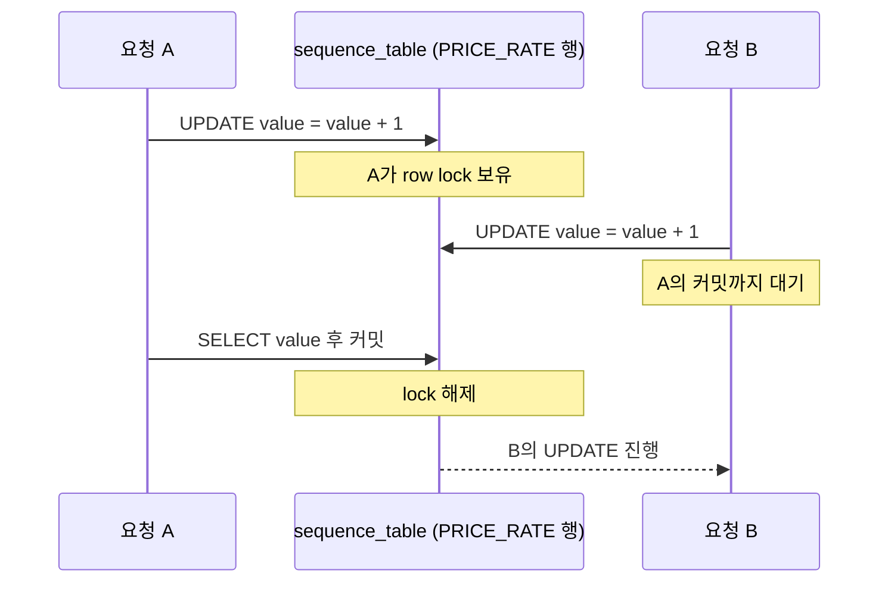

# Part 2. SELECT 안에서 UPDATE가 일어나고 있었다

[1편](/posts/sequence-part1/)에서는 INSERT가 병목처럼 보였지만, 실제로는 그 이전 단계에 더 근본적인 지연이 숨어 있을 가능성을 확인했다. 이번 글에서는 그 의심을 따라가며 왜 읽기처럼 보이는 구간에서 쓰기 비용과 락 경합이 발생했는지를 정리한다.

## 문제는 INSERT 직전에 숨어 있었다

처음 로그만 보면 흐름은 단순했다.

```text
select candidates finished
insert start
... 오래 걸림 ...
insert end
```

그래서 자연스럽게 INSERT가 느리다고 생각했다. 그런데 세부 로그를 더 쪼개 보니 이상한 지점이 하나 있었다.

- 후보 데이터를 읽는 쿼리는 빠르다.
- 실제 다건 INSERT 직전, 특정 키를 생성하는 구간에서 지연이 몰린다.
- 데이터 건수가 늘어날수록 이 지연도 거의 선형적으로 증가한다.

그래서 INSERT 자체보다 INSERT 전에 수행되는 준비 작업을 의심하게 됐다.

## 시퀀스 함수가 하는 일을 열어보니

문제가 된 코드는 겉으로는 단순한 조회 함수처럼 보였다.

```sql
SELECT next_value('PRICE_RATE');
```

호출부만 보면 읽기 작업처럼 느껴진다. 하지만 내부 구현은 달랐다.

```sql
UPDATE sequence_table
SET value = value + 1
WHERE sequence_name = 'PRICE_RATE';

SELECT value
FROM sequence_table
WHERE sequence_name = 'PRICE_RATE';
```

이 함수는 사실상 다음 두 작업을 한다.

1. 시퀀스 테이블의 특정 행을 갱신한다.
2. 갱신된 값을 다시 읽어 온다.

함수 이름은 `next_value`였지만 실제 동작은 읽기 안에 쓰기를 감춘 구조였다.

## 왜 이 구조가 병목이 되나

문제는 모든 요청이 같은 시퀀스 이름을 바라본다는 점이다.

- 모든 INSERT 준비 과정이 같은 행 하나를 갱신한다.
- UPDATE는 그 행에 배타적 [row lock](/posts/lock-types-and-waits/)을 잡고, 이 락은 트랜잭션이 끝날 때까지 유지된다. 그래서 같은 행을 갱신하려는 다음 요청은 앞 요청의 커밋을 기다린다. 이 시스템이 쓰는 MySQL InnoDB 문서도 한 트랜잭션이 행에 X 락을 쥐고 있으면 다른 트랜잭션의 락 요청은 바로 승인되지 않고([InnoDB Locking](https://dev.mysql.com/doc/refman/8.0/en/innodb-locking.html)), 락은 커밋이나 롤백 때 풀린다고 적는다([Locks Set by Different SQL Statements in InnoDB](https://dev.mysql.com/doc/refman/8.0/en/innodb-locks-set.html)).
- 요청 수가 늘어날수록 해당 행은 전역 병목이 된다.

특히 배치처럼 한 번에 수만, 수십만 건을 밀어 넣는 작업에서는 이 비용이 더 크게 드러난다.

- 애플리케이션은 병렬로 움직여도
- 키 생성은 결국 한 줄로 줄을 선다.

결과적으로 INSERT가 느린 것이 아니라, INSERT에 필요한 키를 받기 위해 모두가 대기하고 있었다.

두 요청이 같은 시퀀스 행을 두고 만나면 순서는 아래와 같다.



## DB 관점에서 보면 무슨 일이 일어나나

시퀀스 테이블 기반 키 생성은 다음 부작용을 만든다.

- 같은 행에 대한 지속적인 row lock 경합
- 빈번한 update로 인한 [undo / redo 로그](/posts/redo-undo-log/) 증가
- 커밋 지연 시 대기 시간 누적
- 애플리케이션 병렬성의 상실

이 구조는 데이터 양이 많아질수록 더 나빠진다. 실제 저장 대상 테이블은 여러 건을 병렬로 넣을 수 있어도, 키 생성은 한 지점에 모이기 때문이다.

## 왜 처음에는 잘 안 보였을까

이 병목이 잘 드러나지 않는 이유도 있다.

1. 함수 이름이 읽기처럼 보인다.
2. SQL 로그 상으로는 INSERT 직전의 짧은 호출처럼 보인다.
3. 데이터가 적을 때는 체감 지연이 거의 없다.

그래서 초기에는 구조적 문제가 아니라 단순한 "느린 구간"처럼 관찰된다. 하지만 규모가 커지면 그 숨은 비용이 전체 실행 시간을 지배하게 된다.

## 병목을 의심할 때 확인해야 할 질문

이런 종류의 문제를 볼 때는 다음 질문이 유효했다.

- 읽기처럼 보이는 함수 내부에서 실제로 쓰기가 일어나는가
- 모든 요청이 같은 키나 같은 행을 갱신하고 있는가
- 애플리케이션 병렬성이 DB의 단일 자원 때문에 직렬화되고 있지는 않은가

이 질문을 통해 "INSERT 튜닝"에서 "키 생성 구조 재설계"로 관점을 옮길 수 있었다.

## 다음 단계는 구조를 바꾸는 것

문제 원인을 확인한 뒤에는 선택지가 분명해졌다.

- INSERT SQL만 다듬는 것으로는 한계가 있다.
- 키 생성 책임을 단일 시퀀스 테이블 한 줄에 몰아두면 계속 같은 문제가 반복된다.

결국 필요한 것은 쿼리 튜닝이 아니라 구조 변경이었다.

- 발급 단위를 키워 DB 왕복을 줄일지
- 애플리케이션에서 구간 단위로 할당할지
- 전역 시퀀스가 아니라 도메인별 분리 전략을 쓸지

이 판단은 이후 아키텍처 선택의 핵심이 된다.

## 정리

INSERT 구간에 지연이 몰려 보였지만, 실제 대기는 그 직전의 `next_value` 호출 안에서 같은 행을 갱신하려는 UPDATE끼리 일어나고 있었다. 시퀀스 테이블 방식은 단순하고 이해하기 쉽지만, 규모가 커지면 단일 행 경쟁으로 인해 시스템 전체 병목이 될 수 있다. [다음 글](/posts/sequence-part3/)에서는 이 구조를 실제로 어떻게 바꾸기 시작했는지, 그리고 어떤 기준으로 새로운 키 생성 전략을 선택했는지 정리한다.

## 참고

- [MySQL 8.0 Reference Manual — InnoDB Locking](https://dev.mysql.com/doc/refman/8.0/en/innodb-locking.html)
- [MySQL 8.0 Reference Manual — Locks Set by Different SQL Statements in InnoDB](https://dev.mysql.com/doc/refman/8.0/en/innodb-locks-set.html)
