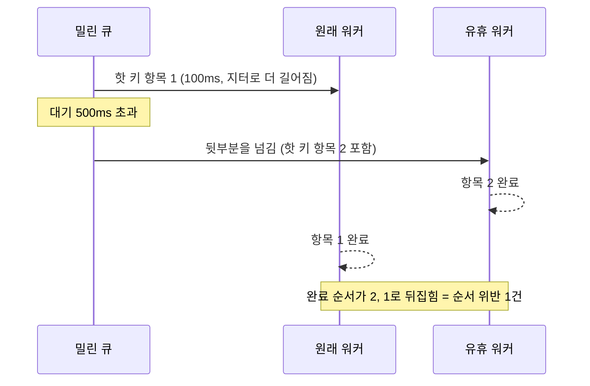

[카카오뱅크 알림 플랫폼 리뷰](/posts/kakaobank-notification-platform/)에서 "순서와 격리는 같은 자원을 두고 반대 방향으로 당긴다"고 썼다. [monticker의 파티션 실험](/posts/monticker-partition-ordering/)에서는 핫 종목이 같은 파티션 이웃을 p99 13초로 함께 밀어내는 것을 봤다. 두 번 다 현상은 확인했지만, 어느 지점에서 갈라지는지는 재지 않았다. 이 글이 그 측정이다.

저장소는 [data-ops-lab](https://github.com/polynomeer/data-ops-lab)이고 재실행은 한 줄이다.

```bash
./.venv/bin/python experiments/ordering/run.py --seconds 20 --repeat 3
```

## 세 가지 설계

워커 8개에 **같은 도착 스트림**을 주고 나눠 주는 방식만 바꾼다.

| 설계 | 동작 | 기대 |
| --- | --- | --- |
| shared | 큐 하나, 아무 워커나 집는다 | 격리 최대, 순서 보장 없음 |
| partition | 키 해시로 큐를 정하고 큐마다 워커 하나 | 키별 순서 보장, 이웃이 인질 |
| steal | 파티션 + 500ms 넘게 기다린 큐를 쪼개 유휴 워커에게 | 격리 회복, 순서는? |

`partition`은 Kafka가 순서를 보장하는 방식과 같은 모양이다. Kafka 문서는 같은 키의 이벤트가 같은 파티션에 쓰이고, 한 파티션의 소비자는 쓰인 순서 그대로 읽는다고 적는다. 원문은 "Kafka guarantees that any consumer of a given topic-partition will always read that partition's events in exactly the same order as they were written"이다([Apache Kafka: Introduction](https://kafka.apache.org/41/getting-started/introduction/)). 순서의 단위가 파티션이므로, 같은 파티션에 들어간 다른 키도 같은 줄에 선다.

키 200개 중 하나가 핫이다. 보통 항목은 5ms, 핫 항목은 100ms의 IO 대기이고 **비용에 ±50% 지터**를 줬다. 지터가 없으면 같은 키 항목이 동시에 돌아도 같은 시간이 걸려 순서가 유지된다. 그러면 공유 큐가 실제보다 얌전해 보인다.

핫 키의 부하를 **워커 몇 개분인지**로 스윕했다. 도착률 400/s에서 핫 비율 1%면 초당 4건 × 100ms = 워커 0.4개분이다. 도착률과 처리율로 부하를 읽는 방법은 [큐잉 이론 한 조각](/posts/queueing-theory-for-servers/)에 정리했다.

## 결과 (3회 중앙값)

피해자는 핫 키가 아닌 키들이고, p50·p95·p99는 그 지연의 백분위다([백분위 통계](/posts/percentile-statistics/)).

| 핫 부하 | 설계 | 순서 위반 | 훔친 항목 | 피해자 p50 | 피해자 p95 | 피해자 p99 |
| ---: | --- | ---: | ---: | ---: | ---: | ---: |
| 0.4 | shared | 0 | 0 | 6.2 ms | 8.9 | **9.6 ms** |
| 0.4 | partition | 0 | 0 | 8.1 | 28.3 | 116.6 |
| 0.4 | steal | 0 | 0 | 8.1 | 22.9 | 109.4 |
| 1.0 | shared | 0 | 0 | 6.1 | 8.9 | **9.6** |
| 1.0 | partition | **0** | 0 | 8.3 | 2,257.4 | **4,430.4** |
| 1.0 | steal | 26 | 192 | 8.4 | 274.4 | 439.9 |
| 2.0 | shared | **56** | 0 | 6.2 | 8.9 | **10.0** |
| 2.0 | partition | **0** | 0 | 8.2 | 11,770.2 | **22,894.5** |
| 2.0 | steal | **188** | 1,394 | 9.1 | 408.1 | 506.9 |

## 워커 하나를 넘기 전에는 아무 차이가 없다

핫 부하 0.4에서 셋의 피해자 p99는 9.6, 116.6, 109.4ms다. 순서 위반은 전부 0이다.

그래서 **한 키가 워커 하나보다 적게 쓰는 동안에는 디스패치 설계를 고민할 이유가 없다.** 설계 사이의 차이는 그 임계를 넘는 순간부터 나타난다.

## 파티션은 정확히 그 지점에서 발산한다

```text
핫 부하 0.4  →  피해자 p99    116.6 ms
핫 부하 1.0  →  피해자 p99  4,430.4 ms
핫 부하 2.0  →  피해자 p99 22,894.5 ms
```

핫 키를 담당하는 파티션은 워커 하나다. 그 키가 워커 하나분보다 많은 일을 요구하면 그 큐는 따라잡지 못하고 계속 자란다. 그리고 큐에 같이 들어 있는 무관한 키들이 그 뒤에 줄을 선다. 맨 앞 항목이 끝나야 뒤가 처리되는 이 대기를 head-of-line 대기라고 부른다.

**피해자는 핫 키가 아니다.** 이 키들은 5ms짜리 일이고 도착률도 낮다. 해시가 핫 키와 겹쳤다는 이유만으로 22초를 기다린다. monticker에서 "파티션은 격리 단위이자 운명 공동체다"라고 적은 것을 숫자로 옮기면 이 표가 된다.

반대로 파티션은 아홉 번 실행 내내 순서 위반 0이었다. 그것을 얻으려고 낸 값이 위 지연이다.

## 훔치기는 지연을 45배 줄이고 순서를 판다

```text
핫 부하 2.0
  partition  피해자 p99 22,894.5 ms   위반   0
  steal      피해자 p99    506.9 ms   위반 188   (항목 1,394개 이동)
```

밀린 큐를 쪼개 유휴 워커에게 넘기면(work stealing) 이웃이 풀려난다. 그런데 그 순간 그 큐 안의 순서가 사라진다. 앞부분은 원래 워커가, 뒷부분은 훔친 워커가 동시에 처리하므로 완료 순서가 뒤집힐 수 있다. 아래는 같은 키의 항목 둘이 그렇게 뒤집히는 경우를 이 실험의 설정으로 그린 것이다.



카카오뱅크 원문은 "순차 처리 (미래 요구사항)" 항목에 "동일 사용자의 연속된 요청 → 순서 보장 필요"라고 적어 뒀다([원문](https://tech.kakaobank.com/posts/2609-new-notification-platform-1/)). 원문이 순서를 미래 요구사항으로 남겨 둔 지점이 바로 여기라고 나는 읽는다. 훔치기는 순서 요구가 없을 때만 제약 없이 할 수 있다. 순서 요구가 생기면 "같은 키는 나누지 않는다"는 제약이 붙고, 그러면 그 키의 큐는 다시 head-of-line이 된다.

## 공유 큐의 청구서는 늦게 온다

공유 큐는 모든 부하에서 피해자 p99 9.6~10.0ms로 가장 좋다. 그런데 순서 위반이 0, 0, 56이다.

이 세 숫자는 공유 큐에 대한 흔한 이해를 고친다. **공유 큐는 "순서가 없는" 설계가 아니다.** 한 키의 항목이 동시에 두 개 이상 처리되지 않는 한 순서는 유지된다. 뒤집히려면 그 키가 처리되는 속도보다 빨리 도착해야 한다.

그리고 그 임계는 파티션이 발산하는 임계와 같은 값이다. 한 키가 워커 하나분을 넘는 순간, 파티션에서는 큐가 자라고 공유 큐에서는 순서가 깨진다. 같은 조건이 두 설계에서 다른 증상으로 나타난다.

그래서 "공유 큐는 순서를 보장하지 않으니 못 쓴다"는 판단은 절반만 맞다. 어떤 키의 도착률이 처리율을 넘지 않는다면 공유 큐도 순서를 지킨다. 그 조건을 알고 있는지가 설계 판단을 가른다.

## 고르는 기준

측정에서 나오는 기준은 단순하다.

1. **어떤 키도 워커 하나분을 넘지 않는가?** 넘지 않으면 무엇을 써도 된다. 공유 큐가 가장 단순하고 가장 빠르다.
2. **넘는 키가 있고 순서가 필요한가?** 파티션이 순서를 주지만 그 키의 이웃이 대가를 낸다. 이웃을 줄이려면 파티션을 늘려야 하고, 그러면 워커도 늘어야 한다.
3. **넘는 키가 있는데 순서는 필요 없는가?** 공유 큐다. 파티션으로 격리 문제를 만들 이유가 없다.
4. **둘 다 필요한가?** 훔치기는 답이 아니다. 지연을 줄이는 대신 순서를 잃는다. 남는 방법은 그 키를 더 잘게 쪼개는 것(순서 단위를 사용자에서 요청으로 낮추기)이거나 그 키의 처리 비용을 줄이는 것이다.

4번이 실무에서 가장 자주 마주치는 자리이고, 디스패치 설계로는 해결되지 않는다는 것이 이 표의 결론이다. [ParityPay 5편](/posts/parity-pay-outbox/)에서 "한 Aggregate에 몰린 적체는 초당 26.6건이 상한"이라고 적은 것도 같은 벽이었다. 그 글에서 순서를 지키는 Outbox 발행기를 한 Aggregate에 몰린 적체로 잰 값이다.

## 측정에서 고친 것 둘

**작업 비용이 전부 같아서 공유 큐가 얌전해 보였다.** 첫 실행에서 공유 큐의 순서 위반이 0이었다. 같은 키 항목이 동시에 돌아도 비용이 같으면 시작 순서대로 끝나기 때문이다. 실제 핸들러는 그렇지 않으므로 ±50% 지터를 넣었고, 그제서야 핫 부하 2.0에서 56건이 나왔다. 지터가 없는 부하는 실제보다 순서가 잘 지켜지는 것처럼 보인다.

**조건이 하나뿐이면 "파티션은 나쁘다"밖에 말할 수 없다.** 처음에는 핫 부하 2.0만 쟀다. 그 조건에서 파티션의 지연은 실행 길이에 비례해 커지는 값이고, 어느 조건부터 그런지는 알 수 없다. 부하를 0.4·1.0·2.0으로 스윕하자 갈라지는 지점이 보였다. 나쁜 수치 하나보다 부하에 따른 변화 곡선이 설계 판단에 더 많은 정보를 준다.

## 한계

- **작업이 IO 대기 시뮬레이션이다.** `time.sleep`은 DB나 HTTP를 기다리는 핸들러를 모사한다. sleep 중에는 GIL(파이썬이 한 번에 한 스레드만 바이트코드를 실행하게 하는 잠금)이 풀리므로 워커 스레드가 실제로 동시에 돈다. CPU 바운드 핸들러는 다르게 동작하고 여기서 재지 않았다.
- **브로커가 아니라 디스패치 하니스다.** Kafka의 [리밸런스](/posts/kafka-consumer-group-rebalance/)·페치 배칭·커밋 동작을 일부러 배제해 디스패치 전략만 남겼다. 브로커 쪽 버전은 [monticker](/posts/monticker-partition-ordering/)에서 따로 쟀다.
- **핫 키가 하나다.** 여러 개가 다른 파티션에 흩어지면 피해가 분산되고, 같은 파티션에 몰리면 집중된다.
- **훔치기 임계 500ms를 스윕하지 않았다.** 그 값이 지연과 순서를 얼마씩 교환하는지를 직접 정하는데, 그 곡선이 없다.
- **순서 위반을 완료 순서로 센다.** 하류에서 시퀀스 번호로 재정렬하는 소비자라면 보이지 않는다.
- **3회 반복이다.** 결과의 순서는 안정적이었고, 발산한 파티션 수치는 포화된 큐만큼의 폭을 갖는다.

## 정리

- 한 키가 워커 하나분을 넘기 전에는 세 설계가 사실상 같다. 넘는 순간 파티션의 피해자 p99는 116ms → 4,430ms → 22,894ms로 발산하고, 대가는 해시가 겹친 무관한 키들이 낸다.
- 훔치기는 지연을 45배 줄이지만 순서 위반 188건을 만든다. 큐를 쪼개는 순간 그 안의 순서가 사라진다.
- 공유 큐의 순서가 깨지는 임계와 파티션이 발산하는 임계는 같은 값이다. 한 키의 도착률이 처리율을 넘는지가 둘 다를 정한다.
- 순서와 격리가 둘 다 필요하면 디스패치 설계로는 해결되지 않는다. 순서 단위를 낮추거나 처리 비용을 줄여야 한다.

## 참고

- [data-ops-lab](https://github.com/polynomeer/data-ops-lab) — 원본은 `reports/data/t12-ordering.json`, 표는 `reports/01-experiment-report.md`
- [카카오뱅크 알림 시스템 리뷰](/posts/kakaobank-notification-platform/) — 같은 긴장을 원문에서 본 글
- [하루 N억 건의 알림 시스템 구축기 (1)](https://tech.kakaobank.com/posts/2609-new-notification-platform-1/) — 카카오뱅크 기술블로그, 2026-09-07
- [monticker 파티션 × 컨슈머 격자](/posts/monticker-partition-ordering/) — 브로커 쪽에서 잰 같은 문제
- [큐잉 이론 한 조각](/posts/queueing-theory-for-servers/)
- [Apache Kafka: Introduction](https://kafka.apache.org/41/getting-started/introduction/) — 키, 파티션, 파티션 단위 순서 보장
