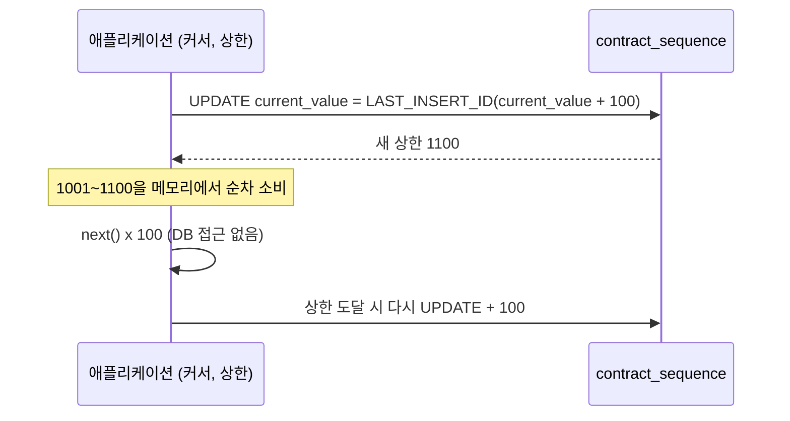

# Part 3. 채번을 INSERT 시점으로 옮기고 범위 단위로 받기

2편에서 병목의 정체를 확인했다. INSERT가 느린 게 아니라, INSERT에 필요한 키를 받기 위해 모든 요청이 시퀀스 테이블의 행 하나를 갱신하려고 줄을 서고 있었다. 이번 글에서는 그 구조를 실제로 어떻게 바꿨는지, 그리고 바꾸면서 무엇을 포기하기로 했는지 정리한다.

> 이 글의 코드와 SQL은 회사의 실제 소스가 아니라, 설계 결정을 원리대로 다시 구성한 예시다. 청크 크기 같은 숫자도 설명용 값이지 운영값이 아니다.

## 바꿔야 할 것은 세 가지였다

2편 끝에서 남긴 선택지를 다시 보면, 사실 서로 배타적인 선택지가 아니었다. 병목을 만든 요인이 세 겹으로 겹쳐 있었고, 각각을 따로 풀어야 했다.

1. **채번 시점이 너무 이르다.** 후보를 조회하는 단계에서 키를 미리 받아두니, 조회부터 INSERT까지 이어지는 긴 구간 내내 시퀀스 행에 대한 갱신이 트랜잭션에 묶여 있었다.
2. **채번 단위가 너무 작다.** 한 건마다 한 번씩 시퀀스 행을 갱신하니, 건수만큼 락 경합이 발생했다.
3. **채번이 비즈니스 트랜잭션과 같은 트랜잭션에 있다.** 시퀀스 행의 락이 비즈니스 트랜잭션이 커밋될 때까지 풀리지 않았다.

셋 중 하나만 고쳐도 체감은 좋아진다. 하지만 하나만 고치면 나머지 둘이 다음 병목이 된다.

## 첫 번째: 채번을 SELECT에서 INSERT 직전으로 옮기기

기존 흐름은 이랬다.

```text
후보 조회 (SELECT ... next_value('CONTRACT_CODE') ...)
  → 단가 계산
  → 검증
  → INSERT
```

키가 조회 결과에 포함되어 나왔기 때문에, 시퀀스 행의 갱신은 트랜잭션의 맨 앞에서 일어나고 락은 맨 뒤에서 풀렸다. 그 사이의 계산과 검증 시간이 전부 락 보유 시간이 됐다.

게다가 조회된 후보가 검증에서 탈락하면, 이미 증가시킨 시퀀스 값은 쓰이지 않은 채 버려졌다. 채번은 됐는데 INSERT는 안 되는 경우가 구조적으로 존재했다.

바꾼 흐름은 단순하다.

```text
후보 조회 (키 없음)
  → 단가 계산
  → 검증
  → 채번
  → INSERT
```

키가 필요한 순간은 INSERT 직전 하나뿐이다. 그 시점까지 채번을 미루면 락 보유 구간이 "트랜잭션 전체"에서 "채번 한 줄"로 줄어든다. 검증에서 탈락한 후보는 애초에 채번하지 않는다.

이 변경만으로는 경합 횟수가 줄지 않는다. 여전히 건수만큼 채번한다. 하지만 각 경합의 길이가 짧아져서, 다음 변경의 효과가 온전히 드러날 수 있는 바탕이 됐다.

## 두 번째: 한 건이 아니라 범위를 받기

시퀀스 행을 갱신하는 횟수 자체를 줄여야 했다. 방법은 한 번의 갱신으로 N개의 번호를 통째로 확보하고, 그 범위를 애플리케이션 메모리에서 순서대로 소비하는 것이다. Hibernate가 `allocationSize`로 하는 것과 같은 원리다.

MySQL에는 `RETURNING`이 없어서 갱신과 조회를 한 번에 묶기 어렵지만, `LAST_INSERT_ID(expr)`를 쓰면 같은 커넥션 안에서 원자적으로 새 상한을 받을 수 있다.

```sql
UPDATE contract_sequence
SET current_value = LAST_INSERT_ID(current_value + 100)
WHERE name = 'CONTRACT_CODE';

SELECT LAST_INSERT_ID();   -- 새 상한. [상한-99, 상한]이 이 인스턴스의 몫이 된다
```

애플리케이션 쪽은 커서와 상한 두 값만 들고 있으면 된다.

```java
@Component
public class ContractCodeAllocator {

    private static final int RANGE_SIZE = 100; // 예시값

    private final JdbcTemplate jdbcTemplate;
    private final TransactionTemplate allocationTx;

    private long cursor = 0;
    private long upperBound = 0;

    public ContractCodeAllocator(JdbcTemplate jdbcTemplate, PlatformTransactionManager txManager) {
        this.jdbcTemplate = jdbcTemplate;
        this.allocationTx = new TransactionTemplate(txManager);
        this.allocationTx.setPropagationBehavior(TransactionDefinition.PROPAGATION_REQUIRES_NEW);
    }

    public synchronized long next() {
        if (cursor >= upperBound) {
            allocateRange();
        }
        return ++cursor;
    }

    private void allocateRange() {
        long newUpper = allocationTx.execute(status -> {
            jdbcTemplate.update(
                "UPDATE contract_sequence SET current_value = LAST_INSERT_ID(current_value + ?) WHERE name = ?",
                RANGE_SIZE, "CONTRACT_CODE");
            return jdbcTemplate.queryForObject("SELECT LAST_INSERT_ID()", Long.class);
        });
        this.upperBound = newUpper;
        this.cursor = newUpper - RANGE_SIZE;
    }
}
```

동작을 시간순으로 보면 이렇다.



시퀀스 행에 대한 경합은 사라지지 않는다. 다만 "매 채번마다"가 아니라 "N번의 채번마다 한 번"으로 빈도가 N분의 1이 된다. 배치가 수만 건을 밀어 넣을 때, 시퀀스 행을 만지는 횟수는 수만 번에서 수백 번으로 줄어든다.

## 세 번째: 채번을 별도 트랜잭션으로 분리하기

위 코드에서 `REQUIRES_NEW`가 눈에 띄지 않을 수 있는데, 실제로는 이 한 줄이 두 번째 변경만큼 중요했다.

범위를 확보하는 UPDATE가 비즈니스 트랜잭션 안에서 실행되면, 시퀀스 행의 락은 그 트랜잭션이 커밋될 때까지 유지된다. 배치 트랜잭션이 몇 초씩 걸리면 그동안 다른 인스턴스는 범위를 확보하지 못하고 대기한다. 첫 번째 변경으로 채번을 INSERT 직전까지 미뤄도, 트랜잭션 경계가 같으면 락은 여전히 커밋까지 붙잡혀 있다.

채번을 별도 트랜잭션으로 떼어내면 UPDATE와 SELECT가 끝나는 즉시 커밋되고 락이 풀린다. 시퀀스 행의 락 보유 시간은 비즈니스 로직과 무관하게 밀리초 단위로 고정된다.

대신 한 가지를 받아들여야 한다. 비즈니스 트랜잭션이 롤백돼도 확보한 범위는 되돌아오지 않는다. 그 번호들은 쓰이지 않은 채 사라진다. 이 문제는 다음 절로 이어진다.

## 결번을 허용하기로 했다

범위 할당 방식은 필연적으로 결번을 만든다.

- 확보한 범위를 다 쓰기 전에 인스턴스가 재시작되면, 남은 번호가 유실된다.
- 비즈니스 트랜잭션이 롤백돼도 채번 트랜잭션은 이미 커밋됐으므로 그 번호는 유실된다.
- 인스턴스가 여러 대면 각자 다른 범위를 들고 있으므로, 생성 시각 순서와 번호 순서가 일치하지 않는다.

이걸 막으려면 유실된 번호를 회수하는 별도 장치를 만들거나, 범위 할당을 포기하고 다시 한 건씩 채번해야 한다. 어느 쪽이든 원래 병목으로 돌아가는 비용이다.

그래서 먼저 확인한 것은 "계약 코드는 연속적이어야 하는가"였다. 답은 아니었다. 계약 코드에 요구되는 것은 유일성이지 연속성이 아니었다. 정산과 외부 유통에서 이 코드를 식별자로 쓰지만, 코드 사이에 빈 번호가 있다고 해서 잘못되는 업무는 없었다. 회계 전표나 세금계산서처럼 법적으로 연속 번호를 요구하는 도메인이었다면 다른 답을 냈어야 한다.

결번을 허용하기로 하면서 한 가지는 코드 규칙으로 못 박았다. **번호로 정렬하지 않는다.** 여러 인스턴스가 각자의 범위를 소비하면 나중에 생성된 계약이 더 작은 번호를 가질 수 있다. 시간순이 필요한 조회는 생성 시각 컬럼을 쓰고, 계약 코드는 오직 식별에만 쓴다.

## 범위 크기는 어떻게 정해야 하는가

솔직하게 적으면, 당시 범위 크기는 근거를 갖고 계산한 값이 아니라 감으로 정한 값이었다. 돌이켜보면 이 값은 다음 세 가지 사이의 트레이드오프이고, 그 기준으로 정했어야 했다.

**1. 시퀀스 행을 만지는 주기**

범위 크기 N을 채번 처리량으로 나누면 시퀀스 행을 갱신하는 주기가 나온다. 초당 1,000건을 채번하는 배치에서 N=100이면 0.1초마다 갱신이 일어나고, 이 정도면 경합이 다시 보이기 시작한다. 갱신 주기가 최소 초 단위, 가능하면 분 단위가 되도록 N을 잡는 것이 출발점이다.

**2. 한 번에 잃어도 되는 번호의 양**

재시작 한 번에 최대 N개가 사라진다. 인스턴스가 M대면 배포 한 번에 최대 M×N개가 사라진다. 이 양이 식별자의 자릿수 예산에서 무시할 수 있는 수준이어야 한다. 9자리 코드라면 10억 개 중 배포마다 수천 개가 비는 것은 문제가 아니지만, 6자리 코드라면 이야기가 다르다.

**3. 번호 순서가 시각 순서에서 얼마나 벗어나도 되는가**

N이 클수록 인스턴스 간 번호 역전 폭이 커진다. 결번을 허용했더라도 "대략 최근 것이 큰 번호"라는 성질을 운영자가 기대하고 있다면, N은 그 기대를 깨지 않는 범위 안에 있어야 한다.

이 셋을 놓고 보면 답은 "고정값 하나"가 아니라 "채번 처리량을 관측하고 조정하는 값"이다. 실제로 필요한 것은 두 가지 지표였다.

- 단위 시간당 범위 할당 횟수 — 이 값이 높으면 N을 키운다.
- 재시작으로 유실된 번호 수(할당 상한과 실제 최대 사용값의 차이) — 이 값이 자릿수 예산 대비 커지면 N을 줄인다.

Hibernate의 `allocationSize` 기본값이 50인 것도 참고할 만하다. 대부분의 OLTP 트래픽에서는 그 정도로도 경합이 사라지고, 배치처럼 몰아서 채번하는 경로만 별도로 더 큰 N을 쓰는 편이 낫다. 채번 경로가 하나뿐이라면 배치 기준으로 N을 잡되, 위의 2번 기준으로 상한을 두면 된다.

## 검토했지만 택하지 않은 것

- **UUID 또는 시각 기반 ID** — 락이 없고 분산 환경에 맞지만, 기존 계약 코드 형식을 유지해야 하는 제약 때문에 제외했다. 정산과 외부 유통이 이 형식을 전제로 돌고 있었다.
- **Redis INCR** — 빠르지만 Redis 장애나 재시작 시 값이 유실될 수 있고, 계약 코드처럼 영속성이 필요한 식별자를 휘발성 저장소에 맡기고 싶지 않았다.
- **DB 네이티브 시퀀스** — MySQL에는 없고, 있는 DB로 옮기는 것은 이 문제를 풀기 위한 변경으로는 너무 컸다.

세 가지 모두 "기술을 바꾸는" 선택이고, 범위 할당은 "구조를 바꾸는" 선택이었다. 기존 시퀀스 테이블과 코드 형식을 그대로 두고 병목만 제거할 수 있다는 점이 결정적이었다.

## 결과

계약 생성 처리 시간이 2분에서 10초로 줄었다. INSERT 튜닝으로는 2분에서 1분 30초까지밖에 못 갔던 것(1편)과 비교하면, 병목의 위치를 제대로 찾은 뒤의 변경이 얼마나 다른지 드러난다.

더 중요한 것은 처리 시간이 건수에 비례해 늘지 않게 됐다는 점이다. 이전에는 건수가 두 배가 되면 채번 대기도 두 배가 됐다. 지금은 건수가 늘어도 시퀀스 행을 만지는 횟수는 N분의 1로만 늘어난다.

## 정리

이 시리즈에서 바꾼 것은 결국 세 가지다.

- 채번 시점을 트랜잭션의 앞에서 INSERT 직전으로 옮겨 락 보유 구간을 줄였다.
- 채번 단위를 한 건에서 범위로 바꿔 경합 빈도를 N분의 1로 줄였다.
- 채번 트랜잭션을 분리해 락 보유 시간을 비즈니스 로직과 무관하게 만들었다.

그리고 그 대가로 결번을 받아들였다. 이 결정은 "계약 코드에 연속성이 필요한가"라는 도메인 질문에 답한 뒤에야 내릴 수 있었다.

1편에서 INSERT가 느리다고 생각했을 때는 INSERT를 튜닝했다. 2편에서 시퀀스 함수 안의 UPDATE를 찾았을 때는 그 함수를 고칠지 고민했다. 3편에서 실제로 바꾼 것은 SQL 한 줄이 아니라 채번의 시점, 단위, 트랜잭션 경계였다. 병목을 찾는 일과 병목을 없애는 일은 다른 종류의 작업이고, 후자는 대개 "무엇을 포기할 것인가"를 정하는 일이었다.
