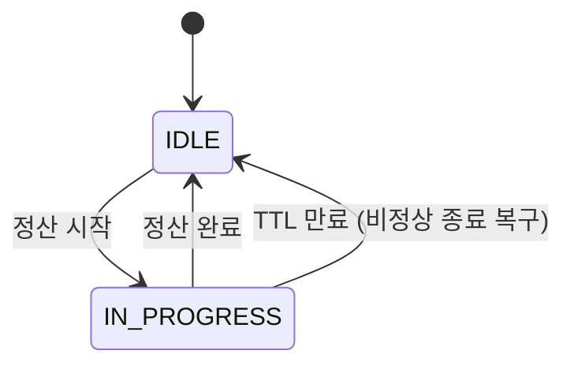
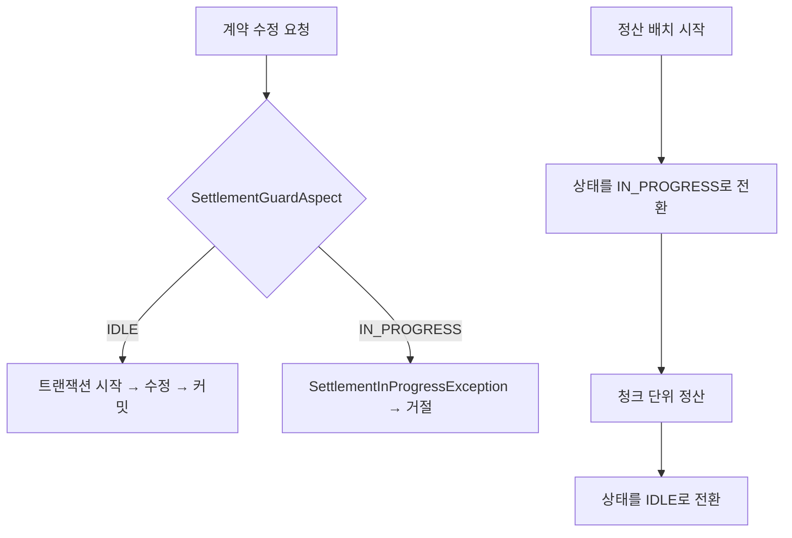

글로벌 유통 시스템(MDS)에서 정산은 계약, 앨범, 곡 메타데이터를 기준으로 수익을 계산하는 프로세스였다. 이 글은 그 정산이 도는 동안 기준 데이터가 바뀌는 문제를 어떻게 막았는지, 왜 DB 락이 아니라 애플리케이션 레벨의 상태 플래그를 택했는지, 그리고 그 선택이 남긴 구멍을 어디까지 받아들였는지 정리한 기록이다.

> 이 글의 코드와 SQL은 회사의 실제 소스가 아니라, 설계 결정을 원리대로 다시 구성한 예시다. TTL 같은 숫자도 설명용 값이지 운영값이 아니다.

## 정산 도중에 기준이 움직였다

MDS는 해외 파트너사가 앨범을 등록하고 관리자가 검수하며, 해외 플랫폼에 유통하고 그 수익을 정산하는 시스템이다. 정산은 배치로 돌고, 대상 계약과 앨범, 곡의 메타데이터를 읽어 계약 조건대로 수익을 배분한다.

문제는 정산이 도는 동안에도 운영자가 메타데이터를 수정할 수 있었다는 점이다. 계약 조건이 바뀌거나 앨범의 곡 구성이 바뀌면, 그 변경이 정산 중인 데이터에 그대로 반영됐다.

```text
정산 시작 (계약 A: 배분율 70%)
  → 곡 1~500 계산 (70% 기준)
  → 운영자가 계약 A 배분율을 60%로 수정
  → 곡 501~1000 계산 (60% 기준)
정산 종료
```

한 번의 정산 안에서 같은 계약이 두 가지 기준으로 계산됐다. 결과는 어느 쪽 기준으로도 맞지 않는 숫자였고, 발견되면 재정산해야 했다. 발견되지 않으면 더 나빴다.

이 문제는 "가끔" 발생했다. 정산은 주기적으로 돌고 운영 수정은 매일 일어나니, 둘이 겹치는 창은 좁았다. 하지만 겹치면 정산 결과 전체를 의심해야 했다. 지분율 배치에서 겪은 것과 같은 종류의 문제였다. 실패가 드물다는 것과 실패해도 된다는 것은 다르다.

## 가장 먼저 떠오른 답은 DB 락이었다

정산이 읽는 행을 정산이 끝날 때까지 잠그면 된다. `SELECT ... FOR UPDATE`로 대상 계약과 앨범을 잠그고, 정산 트랜잭션이 커밋될 때 풀면 그 사이의 수정은 대기하거나 실패한다.

이 방식을 택하지 않은 이유는 정산이 오래 걸리기 때문이다.

- 정산 배치는 트랜잭션 하나로 감쌀 수 있는 길이가 아니다. 그 시간 동안 트랜잭션을 열어두면 장기 트랜잭션이 되고, undo 로그와 커넥션을 계속 붙잡는다.
- 잠긴 행을 읽는 다른 조회까지 영향을 받거나, 락 대기가 쌓여 타임아웃이 난다.
- 정산 배치가 청크 단위로 커밋하는 구조라면 하나의 긴 트랜잭션이라는 전제 자체가 성립하지 않는다.

즉, 물리 락은 정합성을 즉시 강제하지만 "정산이 오래 걸린다"는 사실과 정면으로 충돌한다. 대용량 배치에서 장기 트랜잭션을 없앤 직후에 다시 장기 트랜잭션을 만들 수는 없었다.

## 필요한 것은 락이 아니라 상태였다

문제를 다시 정의하면 이렇다. 정산이 잠가야 하는 것은 특정 행이 아니라 "정산 중인 계약을 지금 수정해도 되는가"라는 판단이다. 이건 DB 락의 문제가 아니라 도메인 상태의 문제다.

그래서 정산 대상 단위(계약)에 상태를 두기로 했다.



상태가 `IN_PROGRESS`인 계약에 대한 수정 요청은 처리하지 않고 거절한다. 정산은 시작할 때 상태를 켜고 끝날 때 끈다. 상태 확인과 갱신은 밀리초 안에 끝나는 짧은 트랜잭션이고, 정산 배치 자체는 이 상태와 무관하게 청크 단위로 커밋하며 돌 수 있다.

물리 락과 비교하면 이렇다.

| | 물리 DB 락 | 상태 플래그 |
| --- | --- | --- |
| 강제 수준 | DB가 강제, 우회 불가 | 애플리케이션이 강제, 코드 규율 필요 |
| 트랜잭션 길이 | 정산 전체 | 상태 갱신 한 번 |
| 대기 동작 | 수정 요청이 락 해제까지 블로킹 | 수정 요청이 즉시 거절 |
| 비정상 종료 | 커넥션 끊기면 자동 해제 | 별도 복구 장치 필요 |
| 다른 조회 영향 | 있음 | 없음 |

강제 수준과 자동 복구를 내주고 트랜잭션 길이와 조회 영향을 얻는 거래다. 정산처럼 오래 걸리는 작업에서는 이 거래가 남는다.

## 수정 API마다 검사 코드를 넣지 않기 위해

상태 플래그의 약점은 "코드 규율이 필요하다"는 점이다. 모든 수정 경로가 상태를 확인해야 하고, 하나라도 빠지면 그 경로로 정산 중 수정이 들어온다. 수정 API는 계약, 앨범, 곡에 걸쳐 여러 개였고, 앞으로도 늘어날 것이었다.

그래서 검사를 각 서비스 메서드 안에 쓰지 않고 애너테이션으로 선언하게 했다.

```java
@Target(ElementType.METHOD)
@Retention(RetentionPolicy.RUNTIME)
public @interface BlockDuringSettlement {
}

@Aspect
@Component
@RequiredArgsConstructor
public class SettlementGuardAspect {

    private final SettlementStateRepository stateRepository;

    @Before("@annotation(BlockDuringSettlement) && args(contractId,..)")
    public void rejectIfSettling(Long contractId) {
        if (stateRepository.isInProgress(contractId)) {
            throw new SettlementInProgressException(contractId);
        }
    }
}
```

수정 API는 애너테이션 한 줄만 붙인다.

```java
@BlockDuringSettlement
@Transactional
public void updateContract(Long contractId, ContractUpdateRequest request) {
    // 수정 로직. 정산 상태는 여기서 신경 쓰지 않는다.
}
```

AOP를 택한 이유는 두 가지다.

1. **검사 위치가 트랜잭션 경계의 바깥이 된다.** `@Before` 어드바이스는 `@Transactional` 프록시보다 먼저 실행되도록 순서를 잡을 수 있다. 정산 중이면 트랜잭션을 열기도 전에 거절하므로, 거절된 요청은 DB에 아무 흔적도 남기지 않는다.
2. **빠뜨린 경로를 찾기 쉽다.** "수정 API인데 `@BlockDuringSettlement`가 없는 메서드"는 정적으로 찾을 수 있다. MDS는 아키텍처 규칙을 ArchUnit으로 강제하는 구조였고, 이런 종류의 규칙을 테스트로 만드는 것이 자연스러운 팀이었다.

요청 흐름 전체는 이렇다.



거절된 요청은 오류로 돌려주고, 운영자는 정산이 끝난 뒤 다시 시도한다. 정산 중 들어온 수정을 보관했다가 자동으로 적용하는 방식은 택하지 않았다. 정산 결과를 본 뒤에야 그 수정이 여전히 유효한지 판단할 수 있는 경우가 많아서, 사람이 다시 요청하는 편이 안전하다.

## 정산이 죽으면 플래그도 죽는가

상태 플래그 방식의 가장 큰 구멍은 정산 프로세스가 비정상 종료됐을 때다. `IN_PROGRESS`를 켜고 정산을 돌리다가 프로세스가 죽으면, 플래그는 영원히 켜진 채 남고 그 계약은 아무도 수정할 수 없게 된다. 물리 락이라면 커넥션이 끊기는 순간 DB가 풀어주지만, 상태 플래그는 아무도 풀어주지 않는다.

그래서 플래그에 만료 시각을 함께 기록했다.

```sql
CREATE TABLE settlement_state (
    contract_id BIGINT PRIMARY KEY,
    status      VARCHAR(20) NOT NULL,   -- IDLE | IN_PROGRESS
    expires_at  DATETIME NULL,
    updated_at  DATETIME NOT NULL
);
```

`IN_PROGRESS`이지만 `expires_at`이 지난 상태는 `IDLE`로 취급한다. 수정 API의 검사도, 정산 시작의 전이도 이 규칙을 따른다. 정산이 죽어도 TTL이 지나면 시스템이 저절로 열린다.

TTL 값은 "정산이 정상적으로 걸리는 최대 시간에 여유를 더한 값"으로 잡아야 한다. 너무 짧으면 정상적인 정산 도중에 락이 풀려 원래 문제가 재발하고, 너무 길면 장애 후 복구까지 그만큼 수정이 막힌다. 정산 소요 시간을 관측하고 있어야 정할 수 있는 값이다.

## 남은 구멍과 그것을 받아들인 이유

애플리케이션 레벨 검사는 이론적으로 경합 창이 있다.

```text
t0  수정 요청 A: 상태 확인 → IDLE
t1  정산 배치: 상태를 IN_PROGRESS로 전환, 정산 시작
t2  수정 요청 A: 트랜잭션 시작 → 수정 → 커밋
```

A는 검사 시점에는 통과했지만 실제 쓰기는 정산 시작 이후에 일어났다. 물리 락이라면 있을 수 없는 일이다.

이 창을 다룰 때 지켜야 할 것과, 없애기 위해 하지 않은 것을 구분해서 적는다.

**정산 시작 측은 원자적이어야 한다.** 상태를 확인하고 나서 갱신하는 두 단계로 나누면 두 정산 배치가 같은 계약을 동시에 잡을 수 있다. 조건부 UPDATE 한 문장으로 "갱신이 곧 확인"이 되게 하면 이 문제가 사라진다.

```sql
UPDATE settlement_state
SET status = 'IN_PROGRESS',
    expires_at = NOW() + INTERVAL 6 HOUR,   -- 예시값
    updated_at = NOW()
WHERE contract_id = :contractId
  AND (status = 'IDLE' OR expires_at < NOW());
```

영향받은 행이 1이면 정산을 시작하고, 0이면 이미 다른 정산이 돌고 있는 것이므로 건너뛴다. JPA의 `@Version` 낙관적 락이 내부에서 하는 일과 같은 원리다.

**수정 요청 측의 창은 받아들였다.** 검사를 트랜잭션 진입 직전으로 옮겨 창을 밀리초 단위로 줄였지만, 완전히 없애려면 수정 트랜잭션 안에서 상태 행을 잠그거나 버전 컬럼으로 낙관적 락을 걸어야 한다. 그렇게 하면 모든 수정 트랜잭션이 상태 행을 건드리게 되고, 물리 락을 피하려던 이유 중 일부가 되돌아온다.

받아들인 근거는 트래픽 패턴이었다. 정산은 정해진 주기에 시작하고, 운영 수정은 사람이 화면에서 한 건씩 한다. 두 사건이 같은 밀리초 안에 같은 계약에 겹칠 확률은 "정산이 도는 내내 수정이 열려 있던" 원래 문제와 비교하면 무시할 수 있는 수준이었다. 창을 0으로 만드는 비용보다 창의 크기를 정산 전체 길이에서 몇 밀리초로 줄인 것으로 충분하다고 판단했다.

다만 이 판단은 트래픽 패턴이 바뀌면 다시 해야 한다. 수정이 자동화되어 정산 시작과 같은 시각에 대량으로 들어오는 구조가 된다면, 그때는 수정 트랜잭션 안에서 상태 행을 잠그는 쪽으로 옮겨야 한다.

## 지분율 배치와 무엇이 같고 무엇이 다른가

[대량 배치 안정성 시리즈](/series/batch-structure-improvement/)에서 다룬 지분율 배치도 상태 전이로 정합성을 지켰다. 두 사례를 나란히 놓으면 원리는 같고 적용 위치가 다르다.

| | 지분율 배치 | MDS 정산 |
| --- | --- | --- |
| 지키려는 것 | 삭제와 등록의 순서 | 정산 기준 데이터의 불변 |
| 경쟁하는 주체 | 배치 vs 배치 | 배치 vs 운영자 |
| 상태의 주인 | 작업(Job) | 대상(계약) |
| 락의 성격 | 배타적, 작업 간 상호 배제 | 방향성, 배치는 진행하고 수정만 차단 |

지분율 배치는 두 작업이 서로를 배제해야 했고, MDS 정산은 한쪽(정산)은 진행하면서 다른 쪽(수정)만 막아야 했다. 그래서 지분율에서는 Redis 분산락과 소유 토큰이 필요했고, MDS에서는 DB 행 하나의 상태와 TTL로 충분했다.

두 사례에서 공통으로 배운 것은 하나다. "지금 이 데이터가 어떤 상태에 있는가"를 시스템이 명시적으로 알고 있으면, 그 상태에서 허용되지 않는 동작을 코드로 막을 수 있다. 상태를 암묵적으로 두면 운영자의 호출 순서나 타이밍에 정합성을 맡기게 된다.

## 정리

- 정산이 오래 걸리는 작업이라는 사실이 물리 DB 락을 배제했다. 정합성 도구를 고를 때 "얼마나 강제적인가"만이 아니라 "얼마나 오래 잡고 있어야 하는가"를 먼저 봐야 했다.
- 상태 플래그는 검사 규율과 비정상 종료 복구를 애플리케이션이 떠안는 대신, 트랜잭션을 짧게 유지하고 조회에 영향을 주지 않는다. 검사 규율은 AOP로, 복구는 TTL로 메웠다.
- 정산 시작 전이는 조건부 UPDATE로 원자화하고, 수정 측의 밀리초 단위 창은 트래픽 패턴을 근거로 받아들였다. 이 판단의 전제가 바뀌면 설계도 바뀌어야 한다.

정합성 문제를 풀 때 첫 번째 답이 락이라면, 두 번째 질문은 "그 락을 얼마나 오래 쥐고 있어야 하는가"여야 한다. 답이 "오래"라면 락이 아니라 상태가 필요하다.
