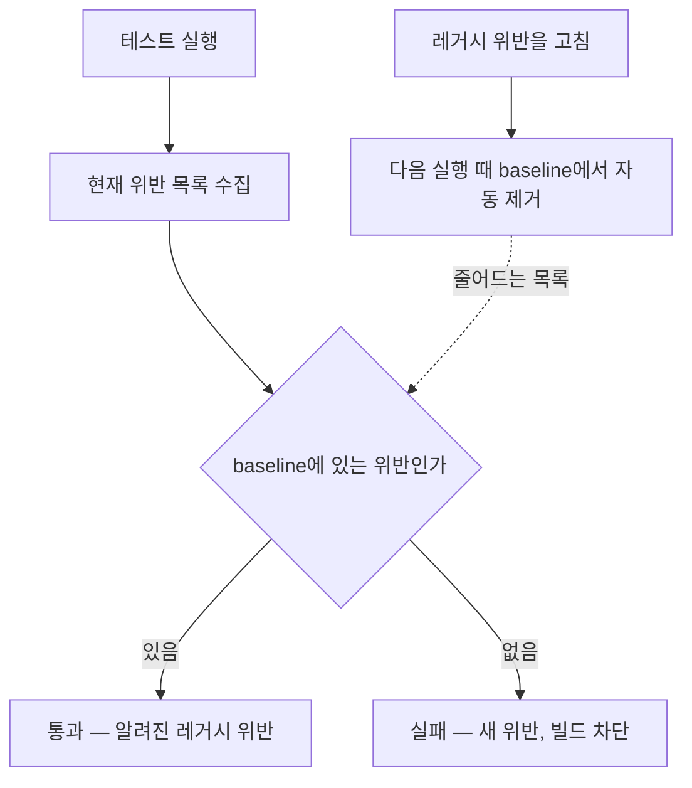

음원 콘텐츠 플랫폼(MCP)을 화면 중심 API에서 도메인 중심 구조로 재설계하는 동안, 백엔드 세 명이 같은 코드베이스에서 동시에 작업했다. 이 글은 "구조를 이렇게 가자"는 합의가 왜 코드 리뷰만으로는 지켜지지 않았는지, 규칙을 테스트로 만들면 무엇이 달라지는지, 그리고 이미 수백 건의 위반이 있는 코드베이스에 규칙을 도입할 때 빌드를 막지 않으면서 강제하는 방법을 정리한 기록이다.

> 이 글의 코드는 회사의 실제 소스가 아니라, 설계 결정을 원리대로 다시 구성한 예시다. 패키지 이름과 규칙 목록은 설명용이다.

## 합의는 있었는데 구조는 흐트러졌다

재설계의 방향은 명확했다. 화면 단위로 쪼개진 API를 도메인 책임 단위로 다시 묶고, Controller → Service → Domain → Repository의 의존 방향을 지키며, 입력은 DTO로 받아 MapStruct로 매핑한다. 팀이 합의했고 문서에도 적었다.

몇 주 지나자 이런 코드가 리뷰에 올라오기 시작했다.

- Controller가 Service를 건너뛰고 Repository를 직접 호출한다. "조회 하나라서요."
- 도메인 엔티티가 인프라 계층의 클래스를 import한다. "이게 편해서요."
- 어떤 API는 MapStruct를 쓰고 어떤 API는 손으로 매핑한다. "급해서요."
- 패키지 A가 B를, B가 A를 참조하는 순환 의존이 생긴다. 아무도 의도하지 않았는데 생긴다.

각각은 사소하고 각각에는 이유가 있었다. 문제는 리뷰어가 매번 이걸 잡아내야 한다는 점이었다. 리뷰어도 사람이라 놓치고, 놓친 것이 다음 코드의 참고 사례가 되고, 몇 달 뒤에는 "규칙이 있긴 한데 지키는 곳과 안 지키는 곳이 섞인" 코드베이스가 된다. 이전 프로젝트(MDS)에서 시니어 개발자가 ArchUnit으로 계약을 강제해둔 코드베이스에서 일해본 경험이 있었기 때문에, 그 차이를 알고 있었다. 규칙이 문서에 있으면 리뷰어가 지키게 하고, 규칙이 테스트에 있으면 빌드가 지키게 한다.

## 규칙을 테스트로 옮기기

ArchUnit은 컴파일된 클래스를 읽어 의존 관계를 분석하고, 규칙을 JUnit 테스트로 표현하게 해주는 라이브러리다. 규칙이 깨지면 테스트가 실패하고, 테스트가 실패하면 CI가 빌드를 막는다.

```java
@AnalyzeClasses(packages = "com.example.mcp", importOptions = DoNotIncludeTests.class)
class ArchitectureRules {

    @ArchTest
    static final ArchRule layers_depend_inward =
        layeredArchitecture().consideringAllDependencies()
            .layer("Controller").definedBy("..controller..")
            .layer("Service").definedBy("..service..")
            .layer("Domain").definedBy("..domain..")
            .layer("Repository").definedBy("..repository..")
            .whereLayer("Controller").mayNotBeAccessedByAnyLayer()
            .whereLayer("Service").mayOnlyBeAccessedByLayers("Controller")
            .whereLayer("Repository").mayOnlyBeAccessedByLayers("Service");

    @ArchTest
    static final ArchRule domain_is_infrastructure_free =
        noClasses().that().resideInAPackage("..domain..")
            .should().dependOnClassesThat().resideInAnyPackage(
                "..infrastructure..", "org.springframework.web..", "jakarta.persistence..");

    @ArchTest
    static final ArchRule no_package_cycles =
        slices().matching("com.example.mcp.(*)..").should().beFreeOfCycles();

    @ArchTest
    static final ArchRule mappers_are_mapstruct =
        classes().that().haveSimpleNameEndingWith("Mapper")
            .should().beAnnotatedWith(org.mapstruct.Mapper.class);
}
```

네 규칙이 리뷰에서 반복되던 네 가지 문제에 대응한다. 규칙을 고를 때 기준은 "리뷰에서 실제로 반복해서 지적된 것"이었다. 이론적으로 좋은 규칙을 전부 넣으면 규칙이 너무 많아져서 위반이 나도 아무도 안 본다. 실제로 깨지고 있는 것부터 막는 게 먼저다.

테스트로 옮기면 세 가지가 달라진다.

1. **지적이 사람에게서 도구로 옮겨간다.** "이건 규칙 위반입니다"를 리뷰어가 말할 필요가 없다. 빌드가 말한다. 리뷰어는 구조가 아니라 로직을 본다.
2. **규칙이 실행 가능한 문서가 된다.** 새로 합류한 사람은 이 테스트 파일을 읽으면 구조 규칙을 안다. 문서와 달리 이 문서는 낡지 않는다. 낡으면 빌드가 깨지니까.
3. **위반이 커밋 시점에 드러난다.** 몇 달 뒤 리팩터링 때가 아니라, 위반을 만든 그 PR에서 드러난다. 고치는 비용이 가장 쌀 때다.

## 이미 위반이 수백 건인데 빌드를 막으면

여기서 실제 어려움이 시작된다. 위 규칙을 레거시 코드베이스에 넣고 돌리면 첫 실행부터 실패한다. 재설계 전 코드에 위반이 수백 건 있기 때문이다. 이 상태로 CI에 올리면 모든 PR이 빨간불이고, 빨간불이 일상이 되면 아무도 빨간불을 보지 않는다.

선택지는 셋이다.

- **전부 고친 뒤 도입한다.** 수백 건을 고치는 동안 새 위반이 계속 들어온다. 끝나지 않는다.
- **규칙을 느슨하게 만든다.** 현재 코드가 통과할 만큼 규칙을 약화하면, 규칙이 막아야 할 것을 못 막는다.
- **기존 위반을 목록으로 얼려두고, 새 위반만 막는다.** 신규 코드는 100% 강제되고, 레거시는 빌드를 막지 않되 목록에 남아 있다.

세 번째가 답이다. ArchUnit에는 이 용도의 `FreezingArchRule`이 있다. 규칙을 감싸면 첫 실행 때 현재 위반을 저장소(기본은 텍스트 파일)에 기록하고, 이후 실행에서는 기록에 없는 새 위반만 실패로 처리한다.

```java
@ArchTest
static final ArchRule layers_depend_inward =
    FreezingArchRule.freeze(
        layeredArchitecture().consideringAllDependencies()
            // ... 위와 같은 정의
    );
```

```properties
# archunit.properties
freeze.store.default.path=src/test/resources/archunit-baseline
freeze.refreeze=false
```

동작은 이렇다.



중요한 성질이 하나 있다. baseline은 줄어들기만 한다. 위반을 고치면 다음 실행에서 baseline에서 빠지고, 다시 늘어나려면 `refreeze`를 명시적으로 켜야 한다. 그래서 baseline 파일의 줄 수가 곧 "남은 레거시 위반 수"가 되고, 이 숫자가 줄어드는 것을 PR마다 볼 수 있다.

당시 정확히 `FreezingArchRule`을 썼는지, 아니면 같은 원리를 다른 방식으로 구현했는지는 기억이 흐리다. 기억하는 것은 원칙이다. 신규 코드는 규칙을 100% 따라야 하고, 레거시 위반은 빌드를 막지 않되 목록으로 관리되며, 그 목록은 줄어들기만 한다. `FreezingArchRule`이 없는 도구에서 같은 효과를 내려면 현재 위반을 파일로 저장하고 실행 시점에 diff해서 새 위반만 실패시키는 로직을 직접 쓰면 된다. 정적 분석 도구의 baseline이나 suppression 파일과 같은 개념이다.

## SonarCloud를 PR 게이트로

ArchUnit은 의존 관계를 본다. 코드 스멜, 중복, 복잡도, 보안 취약 패턴은 보지 않는다. 그쪽은 SonarCloud가 맡았다. GitHub PR마다 분석이 돌고, Quality Gate를 통과하지 못하면 머지가 막힌다.

여기서도 같은 문제와 같은 해법이 있었다. SonarCloud는 "New Code" 개념이 기본으로 들어 있다. 기준 브랜치 이후에 추가되거나 바뀐 코드에만 Quality Gate를 적용하고, 기존 코드의 이슈는 전체 대시보드에는 보이지만 PR을 막지는 않는다. ArchUnit의 baseline과 같은 구조다.

두 도구를 합치면 게이트는 이렇게 된다.

| 검사 | 도구 | 신규 코드 | 레거시 |
| --- | --- | --- | --- |
| 레이어 의존 방향 | ArchUnit | 빌드 차단 | baseline, 점진 정리 |
| 패키지 순환 | ArchUnit | 빌드 차단 | baseline, 점진 정리 |
| 매핑 방식 통일 | ArchUnit | 빌드 차단 | baseline, 점진 정리 |
| 코드 스멜, 중복, 복잡도 | SonarCloud | Quality Gate 차단 | 대시보드 추적 |

## 레거시 위반을 줄인 순서

480건에서 75건까지 줄이는 데 심각도별 분류 같은 정해진 우선순위 체계가 있었는지는 기억나지 않는다. 큰 흐름은 "신규 코드 강제, 레거시 점진 정리"였고, 점진 정리는 두 경로로 이뤄졌다.

**재설계 대상 도메인을 옮길 때 같이 정리한다.** MCP 재설계는 앨범, 트랙, 계약, 지분율 같은 도메인을 하나씩 새 구조로 옮기는 작업이었다. 도메인을 옮기면 그 도메인의 레거시 위반은 자연히 사라진다. 감소분의 대부분은 여기서 나온다.

**옮기지 않는 코드의 위반은 건드릴 때 고친다.** 버그 수정이나 기능 추가로 레거시 파일을 열게 되면 그 파일의 baseline 위반을 같이 고치고, 열지 않은 파일은 그대로 둔다. 이 원칙이 없으면 "정리하러 들어갔다가 범위가 커지는" 일이 생긴다.

75건을 0건으로 만들지 않은 이유도 같은 원칙이다. 건드릴 이유가 없는 코드에 위반만 고치러 들어가는 것은 리스크 대비 이득이 작다. baseline에 남아 있으니 누군가 그 파일을 열면 그때 고친다.

돌이켜보면 심각도 분류는 했어야 했다. 순환 의존은 레이어 침범보다 구조적으로 위험하다. 순환이 있으면 한쪽을 바꿀 때 다른 쪽이 따라 깨지고, 모듈을 분리하려 할 때 잘라낼 수 없다. 다시 한다면 baseline을 규칙별로 나눠 순환 의존 항목부터 비우는 순서를 정했을 것이다.

## 규칙이 생기고 나서 달라진 것

정적 분석 위반 480건이 75건으로 줄었다는 숫자보다 체감이 컸던 것은 리뷰의 성격 변화였다. 규칙 도입 전에는 "이건 Service를 거쳐야 합니다" 같은 구조 지적이 리뷰에 섞여 있었다. 도입 후에는 그런 코멘트가 필요 없어졌다. 위반이면 빌드가 이미 막았고, 통과했으면 구조는 맞는 것이다. 리뷰어는 로직과 도메인 규칙만 보면 됐다.

새 기능을 어디에 놓을지 고민하는 시간도 줄었다. Package-by-Component 구조에서는 "이 기능은 어느 컴포넌트의 책임인가"만 정하면 패키지가 정해지고, 그 패키지가 무엇에 의존할 수 있는지는 규칙이 정한다. 선택지가 좁아진 만큼 결정이 빨라졌다.

주의할 부작용도 있다. 규칙이 막는 것을 우회하려고 클래스를 규칙에 안 걸리는 패키지에 넣는 코드가 나올 수 있다. 이건 규칙이 틀렸다는 신호일 때도 있고, 규칙을 피하려는 것일 때도 있다. 전자면 규칙을 고치고, 후자면 리뷰에서 잡아야 한다. 규칙이 있어도 리뷰가 없어지는 건 아니다. 리뷰가 볼 것이 바뀔 뿐이다.

## 정리

- 구조 합의가 문서에만 있으면 리뷰어가 지키게 해야 하고, 리뷰어는 놓친다. 규칙을 테스트로 옮기면 빌드가 지킨다.
- 규칙은 이론적으로 좋은 것이 아니라 실제로 깨지고 있는 것부터 넣는다. 규칙이 많으면 위반도 많고, 위반이 많으면 아무도 안 본다.
- 이미 위반이 많은 코드베이스에는 baseline이 필요하다. 신규 코드는 100% 강제하고, 기존 위반은 얼려둔 채 줄어들기만 하게 한다. ArchUnit의 `FreezingArchRule`과 SonarCloud의 New Code가 이 원리를 각각 구현한다.
- 레거시 정리는 "정리하러 들어가는" 것이 아니라 "건드릴 때 같이 고치는" 것이 범위를 통제하는 방법이다. 다만 순환 의존처럼 구조적으로 위험한 것은 우선순위를 따로 줘야 한다.

MDS에서는 시니어가 만든 규칙 안에서 개발했고, MCP에서는 그 규칙을 직접 설계했다. 두 경험의 차이는 "규칙을 따르는 것"과 "어떤 규칙이 필요한지 정하는 것"의 차이였고, 후자에서 배운 것은 규칙의 내용보다 도입 방식이 성패를 가른다는 점이었다. 빌드를 막는 규칙은 처음부터 완벽할 필요가 없다. 새 위반을 막고, 옛 위반을 세고, 그 숫자가 줄어드는 것을 모두가 볼 수 있으면 된다.
