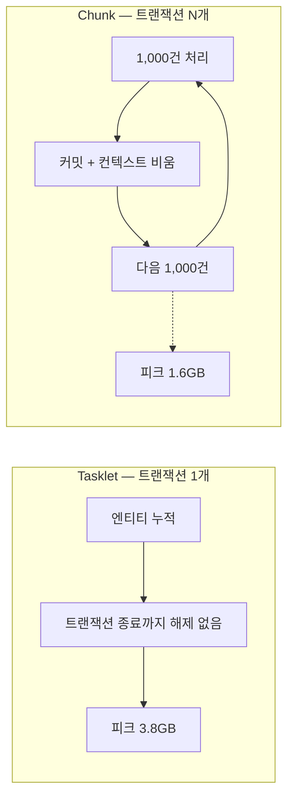

배치가 가끔 죽었다. 로그에는 `OutOfMemoryError: Java heap space`가 찍혀 있었고, 죽지 않은 날에도 Full GC가 반복되며 처리 시간이 늘어졌다. 이 글은 그 원인을 어떻게 특정했는지, 왜 "메모리를 늘린다"가 답이 아니었는지, 그리고 배치 구조와 Excel 생성 구조를 각각 어떻게 바꿨는지 정리한 기록이다.

> 이 글의 코드는 회사의 실제 소스가 아니라, 설계 결정을 원리대로 다시 구성한 예시다. 청크 크기와 윈도우 크기 같은 숫자는 설명용 값이지 운영값이 아니다.

## 증상: 데이터가 많은 날에만 죽는다

문제가 된 작업은 두 종류였다.

- 대량 엔티티를 읽어 가공하고 저장하는 배치. Spring Batch의 Tasklet 하나가 전체 작업을 한 트랜잭션 안에서 처리했다.
- 조회 결과를 Excel로 내려주는 기능. 결과를 전부 메모리에 올린 뒤 워크북을 만들어 응답했다.

둘 다 데이터가 적을 때는 멀쩡했다. 건수가 늘어난 날에만 Full GC가 잦아지고, 더 늘어나면 OOM으로 죽었다. 처음 나온 가설은 자연스러웠다. "데이터가 많아서 그렇다. 힙을 늘리자."

이 가설은 절반만 맞다. 데이터가 많은 것은 사실이지만, 그 데이터가 왜 처리가 끝난 뒤에도 힙에 남아 있는지는 설명하지 못한다. 힙을 늘리면 죽는 날이 조금 뒤로 밀릴 뿐이고, 건수가 더 늘면 같은 자리에서 다시 죽는다.

## 계측: GC 로그, Heap Dump, Thread Dump 순서로

추측으로 힙을 늘리기 전에 세 가지를 봤다.

**GC 로그**. Full GC가 일어난 뒤 힙 사용량이 얼마나 회복되는지를 봤다. 정상적인 배치라면 Full GC 후 사용량이 크게 떨어져야 한다. 처리가 끝난 데이터는 가비지가 되기 때문이다. 그런데 회복 폭이 점점 줄었다. Full GC를 해도 힙이 비워지지 않는다는 것은, 그 객체들이 가비지가 아니라 어딘가에서 참조되고 있는 살아 있는 객체라는 뜻이다.

```text
# 패턴을 보여주기 위한 예시 — 실제 로그 값이 아니다
[Full GC] 3.1G -> 2.8G    (회복 300M)
[Full GC] 3.4G -> 3.2G    (회복 200M)
[Full GC] 3.7G -> 3.6G    (회복 100M)
OutOfMemoryError
```

이 패턴은 "메모리가 부족하다"가 아니라 "무언가가 놓아주지 않는다"를 가리킨다.

**Heap Dump**. OOM 시점의 힙 덤프를 Eclipse MAT로 열었다. 힙 덤프를 볼 때 첫 질문은 "어떤 클래스의 인스턴스가 힙을 가장 많이 차지하는가"이고, 두 번째 질문은 "그 인스턴스들을 누가 붙잡고 있는가"다. 이 케이스에서는 첫 질문의 답이 배치가 처리하는 JPA 엔티티였고, 두 번째 질문의 답이 Hibernate의 영속성 컨텍스트 내부 컬렉션이었다. 처리가 끝난 엔티티가 가비지가 되지 못한 이유는, 영속성 컨텍스트가 트랜잭션이 끝날 때까지 모든 관리 엔티티를 1차 캐시에 들고 있기 때문이었다.

**Thread Dump**. 배치 스레드가 무엇을 하고 있는지 확인했다. 느려지는 원인이 GC 정지인지 DB 대기인지는 힙만 봐서는 구분되지 않기 때문이다. 이 케이스는 GC가 주 원인이었고, Thread Dump는 DB 락 대기가 섞여 있지 않은지 배제하는 용도였다.

세 가지를 합치면 원인은 명확했다. Tasklet 하나가 트랜잭션 하나로 수십만 건을 처리하는 구조에서, 영속성 컨텍스트는 그 수십만 건을 트랜잭션 종료까지 전부 기억하고 있었다. 힙이 모자란 게 아니라, 구조가 힙을 놓아주지 않았다.

## 배치: Tasklet 단일 트랜잭션에서 Chunk로

Spring Batch에서 Tasklet은 "이 메서드를 한 트랜잭션 안에서 실행하라"는 단순한 계약이다. 처리할 데이터가 트랜잭션 하나에 담길 만큼 작을 때는 가장 간단한 선택이다. 문제는 데이터가 자라면서 이 계약이 "수십만 건을 한 트랜잭션에서"로 바뀌었다는 점이다.

Chunk 기반 Step은 계약이 다르다. Reader가 N건을 읽고, Processor가 가공하고, Writer가 쓰면 커밋한다. 다음 N건은 새 트랜잭션이다.

```java
@Bean
public Step rebuildStep(JobRepository jobRepository,
                        PlatformTransactionManager txManager,
                        JpaPagingItemReader<SourceEntity> reader,
                        ItemProcessor<SourceEntity, TargetEntity> processor,
                        JpaItemWriter<TargetEntity> writer) {
    return new StepBuilder("rebuildStep", jobRepository)
        .<SourceEntity, TargetEntity>chunk(1_000, txManager)   // 예시값
        .reader(reader)
        .processor(processor)
        .writer(writer)
        .build();
}
```

이 전환이 메모리를 줄이는 이유는 청크 경계에서 트랜잭션이 커밋되고 영속성 컨텍스트가 비워지기 때문이다. `JpaItemWriter`는 쓰기 후 `flush()`를 호출하고, 청크 트랜잭션이 끝나면 영속성 컨텍스트가 정리된다. 엔티티는 청크 하나 분량만 살아 있다.



Tasklet 구조를 당장 바꾸기 어려운 곳에서는 같은 효과를 수동으로 낼 수도 있다.

```java
int count = 0;
for (SourceEntity source : sources) {
    entityManager.persist(convert(source));
    if (++count % FLUSH_INTERVAL == 0) {
        entityManager.flush();   // 쌓인 변경을 SQL로 DB에 반영
        entityManager.clear();   // 1차 캐시를 비워 엔티티를 가비지로 만든다
    }
}
```

`flush()`와 `clear()`는 둘 다 필요하다. `flush()` 없이 `clear()`만 하면 아직 DB에 반영되지 않은 변경이 사라진다. `clear()` 없이 `flush()`만 하면 DB에는 반영되지만 엔티티는 여전히 1차 캐시에 남아 메모리가 줄지 않는다. 다만 이 방식은 여전히 트랜잭션 하나이므로 DB 락 점유 시간은 줄지 않는다. 메모리만 급한 경우의 임시 조치이고, 락까지 줄이려면 청크로 가야 한다.

### 청크 크기는 무엇과 무엇의 거래인가

당시 청크 크기를 어떤 근거로 정했는지는 솔직히 기억나지 않는다. 돌이켜보면 이 값은 두 비용 사이의 거래다.

- **너무 작으면** 커밋이 잦아진다. InnoDB 기준으로 커밋마다 redo 로그를 디스크에 fsync하는 비용이 붙고, 이 비용은 건수가 아니라 커밋 횟수에 비례한다. 청크 100건이면 10만 건에 1,000번 커밋이다.
- **너무 크면** 영속성 컨텍스트가 다시 비대해지고, 트랜잭션이 길어져 락 점유 시간이 늘어난다. 원래 문제로 되돌아가는 방향이다.

실무에서 이 값을 정하려면 두 지표를 봐야 한다. 청크당 처리 시간(커밋 오버헤드가 지배적인지 확인)과 청크 처리 중 힙 사용량 증가폭(컨텍스트 크기 확인)이다. 둘 다 관측 가능하면 값은 실험으로 정할 수 있고, 관측하지 않으면 감으로 정하게 된다.

### 실패한 청크는 어떻게 되는가

Tasklet 단일 트랜잭션에서는 중간에 실패하면 전부 롤백되고 처음부터 다시 돌려야 했다. 수십만 건 중 마지막 건에서 실패해도 마찬가지였다.

Chunk 구조에서는 Spring Batch의 JobRepository가 Step 실행 상태를 기록한다. 실패한 청크는 롤백되지만 이미 커밋된 청크는 그대로 남고, 같은 Job을 재시작하면 마지막 커밋 지점부터 이어서 처리한다. 별도 상태 테이블 없이 프레임워크가 제공하는 기본 동작이다. 다만 이것이 성립하려면 Reader가 재시작 가능해야 한다. `JpaPagingItemReader`처럼 읽은 위치를 ExecutionContext에 저장하는 Reader를 써야 하고, 페이징 기준이 되는 정렬 키가 처리 중에 바뀌지 않아야 한다.

## Excel: 전체 행을 올리는 XSSF에서 스트리밍 SXSSF로

Excel 생성은 배치와 원인이 달랐지만 증상은 같았다. Apache POI의 `XSSFWorkbook`은 시트의 모든 행과 셀을 객체로 메모리에 유지한다. 수십만 행이면 행 객체, 셀 객체, 스타일 참조가 전부 힙에 올라간다. 조회 결과 리스트에 더해 워크북 객체 트리가 한 번 더 메모리를 차지하는 구조다.

`SXSSFWorkbook`은 메모리에 최근 N행만 유지하고, 윈도우 밖으로 밀려난 행은 임시 파일에 XML로 기록한다. 최종 `write()` 시점에 임시 파일과 나머지를 조립해 `.xlsx`를 만든다.

```java
public void export(Stream<ExportRow> rows, OutputStream out) throws IOException {
    SXSSFWorkbook workbook = new SXSSFWorkbook(100);   // 메모리에 유지할 행 수, 예시값
    try {
        Sheet sheet = workbook.createSheet("data");
        int[] idx = {0};
        rows.forEach(data -> {
            Row row = sheet.createRow(idx[0]++);
            row.createCell(0).setCellValue(data.code());
            row.createCell(1).setCellValue(data.amount());
        });
        workbook.write(out);
    } finally {
        workbook.dispose();   // 임시 파일 삭제. 빠뜨리면 디스크가 샌다
        workbook.close();
    }
}
```


두 가지를 같이 바꿔야 효과가 난다. 워크북만 SXSSF로 바꾸고 조회 결과는 여전히 `List`로 전부 받아오면, 워크북 쪽 메모리는 줄어도 조회 결과 쪽은 그대로다. 조회도 청크 단위로 끊어 읽거나 스트림으로 흘려야 입력과 출력 양쪽이 모두 윈도우 크기로 제한된다.

### 스트리밍이 가져오는 제약

SXSSF는 윈도우를 벗어난 행을 다시 읽거나 수정할 수 없다. 그 행은 이미 메모리를 떠나 디스크에 있다. 이 제약은 두 경우에 부딪힌다.

- **마지막에 합계 행을 넣거나 열 너비를 데이터에 맞춰 조정하는 경우**. 합계는 쓰면서 누적하면 되고, 열 너비는 `trackColumnForAutoSizing`으로 미리 추적하거나 고정값을 쓴다.
- **뒤쪽 행의 값에 따라 앞쪽 행의 서식을 바꿔야 하는 경우**. 이건 스트리밍과 근본적으로 충돌한다. 해법은 두 번 순회하는 것이다. 1차 순회에서 서식 결정에 필요한 값만 가볍게 집계하고(합계, 최댓값, 플래그 몇 개), 2차 순회에서 이미 결정된 값으로 쓴다. 1차 순회가 전체 행을 메모리에 올리는 게 아니라 집계값 몇 개만 들고 있으므로 메모리 이점은 유지된다.

단순 데이터 나열용 Excel이었기 때문에 이 제약이 실제로 문제가 되지는 않았다. 하지만 "SXSSF로 바꾸면 끝"이 아니라 "쓰기 패턴이 순차적인가"를 먼저 확인해야 한다는 것은 분명하다.

## 결과와 남은 것

| 항목 | 개선 전 | 개선 후 |
| --- | --- | --- |
| 배치 메모리 피크 | 3.8GB | 1.6GB |
| Excel 생성 메모리 | 1.2GB | 180MB |
| Full GC / OOM | 반복 발생 | 없음 |
| 실패 시 재실행 | 처음부터 | 마지막 커밋 청크부터 |

배치 피크가 1.6GB에서 더 내려가지 않은 이유는 따로 파지 않았다. 청크 하나 분량의 엔티티, Reader의 페이지 버퍼, 애플리케이션의 기본 힙 사용량이 합쳐진 값일 것이라고 추정했지만, 그 시점에는 OOM이 사라진 것으로 충분했다. 다시 한다면 개선 후에도 힙 덤프를 한 번 더 떠서 남은 1.6GB의 구성을 확인했을 것이다. "왜 줄었는가"만큼 "왜 여기서 멈추는가"도 다음 병목을 예고하기 때문이다.

## 정리

- OOM의 첫 가설 "데이터가 많아서"는 증상이지 원인이 아니다. GC 로그에서 Full GC 후 회복 폭이 줄어드는 패턴을 보면 "부족"이 아니라 "누수 또는 보유"를 의심해야 한다.
- 힙 덤프는 "무엇이 많은가"와 "누가 붙잡고 있는가" 두 질문에 답한다. 이 케이스의 답은 엔티티와 영속성 컨텍스트였고, 그래서 해법이 힙 크기가 아니라 트랜잭션 경계였다.
- Tasklet에서 Chunk로 가는 것은 메모리 문제이면서 동시에 락 점유 시간과 재실행 단위의 문제다. 셋이 같은 변경으로 풀린다.
- Excel은 워크북과 조회를 함께 스트리밍해야 효과가 나고, 스트리밍은 "쓴 행을 되돌아가지 않는다"는 쓰기 패턴을 전제로 한다.

힙을 늘리는 것은 언제나 가능한 선택이지만, 힙 덤프를 열기 전에 하면 원인을 모른 채 증상만 미루는 것이다. 계측이 먼저고 조치가 나중이라는 순서는 이 사례에서 배운 것 중 가장 오래 남은 것이다.
