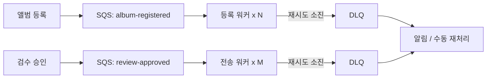

글로벌 유통 시스템(MDS)에서는 파트너사가 앨범을 올리고, 관리자가 검수하고, 검수가 끝나면 해외 플랫폼으로 전송하는 흐름이 계속 발생한다. 처음에는 이 작업들을 폴링 배치가 순서대로 처리했다. 이 글은 그 구조가 어디서 한계에 부딪혔는지, 큐로 바꾸면서 무엇을 새로 떠안게 됐는지(중복 전달, 순서, 실패 격리), 그리고 각각을 어떻게 다뤘는지 정리한 기록이다.

> 이 글의 코드는 회사의 실제 소스가 아니라, 설계 결정을 원리대로 다시 구성한 예시다. 재시도 횟수와 가시성 타임아웃 같은 숫자는 설명용 값이지 운영값이 아니다.

## 폴링이 한계에 부딪힌 지점

폴링 배치의 구조는 단순하다. 일정 주기마다 "처리할 것이 있는가"를 DB에서 조회하고, 있으면 하나씩 처리한다.

```text
매 N분:
  SELECT * FROM task WHERE status = 'PENDING' ORDER BY created_at
  for each task:
    process(task)          -- 단일 스레드, 순차
    UPDATE task SET status = 'DONE'
```

이 구조는 처리할 것이 드물고 고르게 들어올 때는 문제가 없다. MDS는 그렇지 않았다. 파트너사가 앨범을 한꺼번에 수십 장 올리는 날이 있었고, 검수 승인이 한 시간에 몰리는 날이 있었다. 그럴 때 세 가지가 동시에 나빠졌다.

**대기 시간이 폴링 주기에 묶인다.** 요청이 폴링 직후에 들어오면 다음 폴링까지 기다린다. 주기를 줄이면 빈 조회가 늘어나 DB만 괴롭힌다. 주기를 늘리면 대기가 늘어난다. 어느 쪽으로 조정해도 "요청이 들어오는 순간 처리를 시작한다"는 목표에는 닿지 않는다.

**한 작업의 지연이 뒤 작업 전체의 지연이 된다.** 단일 스레드가 순서대로 처리하므로, 외부 플랫폼 전송 하나가 응답을 30초 기다리면 그 뒤에 줄 선 검수 요청 수십 건이 전부 30초씩 밀린다. 실패해서 재시도하면 그만큼 더 밀린다.

**처리량을 늘릴 방법이 없다.** 배치 인스턴스를 두 대 띄우면 같은 작업을 둘 다 집어간다. 그걸 막으려면 조회에 락을 걸거나 작업을 인스턴스별로 나눠야 하는데, 그 순간 폴링 배치는 더 이상 단순하지 않다.

평균 처리 대기 시간이 3~5분이었다. 이 숫자 자체보다, 요청이 몰리는 날에 이 숫자가 얼마까지 늘어날지 예측할 수 없다는 점이 문제였다.

## 큐로 바꾸면 무엇이 달라지는가

작업을 "DB의 PENDING 행"이 아니라 "큐의 메시지"로 정의하면 세 문제가 각각 풀린다.

- 메시지가 도착하는 순간 워커가 받는다. 폴링 주기가 사라진다.
- 워커가 여러 개면 메시지가 분산된다. 한 워커가 30초를 기다려도 다른 워커는 계속 처리한다.
- 워커를 더 띄우면 처리량이 늘어난다. 큐가 분배를 맡으므로 워커끼리 조율할 필요가 없다.



워커를 역할별로 나눈 이유는 부하 특성이 다르기 때문이다. 앨범 등록은 DB 쓰기가 주고 빠르다. 외부 플랫폼 전송은 네트워크 대기가 주고 느리며 실패가 잦다. 한 큐에 섞으면 느린 작업이 빠른 작업의 처리량을 잡아먹는다. 큐를 나누면 각 워커의 수를 그 작업의 특성에 맞춰 따로 조정할 수 있다.

Amazon SQS를 택한 것은 이미 AWS 위에서 운영 중이었고, 메시지 브로커를 직접 운영하지 않아도 되며, 재시도와 DLQ가 큐 설정만으로 붙기 때문이다. 순서 보장이나 정확히 한 번 전달 같은 강한 보장은 표준 큐에서 제공하지 않는데, 그 부분은 아래에서 다룬다.

## 큐가 가져오는 새 문제 1: 같은 메시지가 두 번 온다

SQS 표준 큐는 최소 한 번(at-least-once) 전달이다. 워커가 메시지를 받아 처리하고 삭제하기 전에 죽으면, 가시성 타임아웃이 지난 뒤 같은 메시지가 다른 워커에게 다시 간다. 네트워크 사정에 따라 드물게는 처리 중에도 중복 전달된다.

폴링 배치에서는 없던 문제다. 그때는 한 스레드가 한 행을 읽고 상태를 바꿨으니 두 번 처리될 일이 없었다. 큐로 바꾸는 순간 "같은 작업이 두 번 실행돼도 결과가 같아야 한다"는 요구가 생긴다.

해법은 메시지에 고유 ID를 부여하고, 처리 완료된 ID를 기록해서 다시 오면 건너뛰는 것이다. 어디에 기록하느냐가 설계의 갈림길이다.

| | DB 테이블 + 유니크 제약 | Redis SET + TTL |
| --- | --- | --- |
| 동시 중복 방어 | 제약 위반으로 DB가 막아줌 | `SET NX`로 원자적 |
| 영속성 | 영구 | TTL 만료 후 사라짐 |
| 처리 결과와의 원자성 | 같은 트랜잭션에 넣을 수 있음 | 별도 시스템, 원자성 없음 |
| 비용 | 쓰기마다 행 추가, 정리 필요 | 빠름, 자동 만료 |

정산 기준 데이터를 다루는 MDS에서는 "처리했다는 기록"과 "처리 결과" 사이의 원자성이 중요했다. 결과는 커밋됐는데 기록이 안 남으면 중복 처리되고, 기록은 남았는데 결과가 롤백되면 영영 처리되지 않는다. 같은 DB 트랜잭션에 넣을 수 있는 유니크 제약 방식이 이 요구에 맞는다.

```java
@Component
@RequiredArgsConstructor
public class AlbumRegisteredListener {

    private final ProcessedMessageRepository processed;
    private final AlbumRegistrationService service;

    @SqsListener("album-registered")
    @Transactional
    public void on(AlbumRegisteredEvent event) {
        try {
            // 기록을 먼저 시도한다. 이미 있으면 유니크 제약이 막는다.
            processed.save(new ProcessedMessage(event.messageId(), Instant.now()));
        } catch (DataIntegrityViolationException duplicate) {
            log.info("duplicate skipped: {}", event.messageId());
            return;
        }
        service.register(event);   // 같은 트랜잭션. 실패하면 기록도 롤백된다.
    }
}
```

```sql
CREATE TABLE processed_message (
    message_id   VARCHAR(64) PRIMARY KEY,
    processed_at DATETIME NOT NULL
);
```

기록을 처리보다 먼저 시도하는 이유는, 두 워커가 같은 메시지를 동시에 받았을 때 둘 다 "아직 처리 안 됨"으로 읽고 둘 다 처리하는 창을 없애기 위해서다. `existsById()`로 확인한 뒤 처리하는 방식은 확인과 기록 사이에 창이 있다. INSERT를 먼저 하면 유니크 제약이 둘 중 하나를 확실히 거른다. DB 종류에 따라 예외 형태가 다르지만, Spring의 `DataIntegrityViolationException`이 드라이버별 예외를 통일해주므로 catch 블록은 하나면 된다.

정확히 어느 방식으로 구현했는지는 기억이 흐리다. 위는 지금 다시 설계한다면 택할 방식이고, 그 근거는 "기록과 결과가 같이 커밋되거나 같이 롤백돼야 한다"는 요구다.

## 큐가 가져오는 새 문제 2: 순서가 뒤바뀐다

표준 큐는 순서를 보장하지 않는다. 앨범 등록 이벤트와 그 앨범의 수정 이벤트가 거의 동시에 발행되면, 수정이 먼저 처리될 수 있다.

FIFO 큐로 바꾸면 순서는 보장되지만 처리량 상한이 생기고, 같은 그룹 안에서는 병렬 처리를 포기해야 한다. 순서가 정말 필요한 곳에만 쓸 도구다.

MDS의 앨범은 등록, 검수, 전송이라는 상태를 이미 데이터에 갖고 있었다. 그래서 순서를 큐에 맡기는 대신 이 상태를 기준으로 삼는 쪽을 택했다. 원칙은 이렇다. 메시지는 "무엇을 하라"가 아니라 "어떤 대상이 어떤 상태가 되어야 한다"를 싣고, 워커는 처리 전에 대상의 현재 상태를 읽어 이 전이가 지금 유효한지 확인한다.

```java
public void apply(AlbumEvent event) {
    Album album = albumRepository.findById(event.albumId());
    if (!album.canTransitionTo(event.targetState())) {
        noOpCounter.increment(event.type());   // 무효한 전이는 무시하되 세어둔다
        return;
    }
    album.transitionTo(event.targetState());
}
```

이미 검수 완료된 앨범에 "검수 요청" 이벤트가 늦게 도착하면 무시된다. 아직 등록되지 않은 앨범에 "전송" 이벤트가 먼저 도착하면, 그 메시지는 실패로 처리돼 재시도 대상이 되고, 그사이 등록이 끝나면 다음 재시도에서 성공한다.

무시할 때 로그만 남기지 않고 카운터를 올리는 이유는 운영 때문이다. 순서가 뒤바뀌어 정상적으로 무시되는 이벤트와, 버그 때문에 계속 무시되고 있는 이벤트는 로그로는 구분이 안 된다. no-op 횟수가 평소 수준을 넘으면 알림이 가야 "무시되면 안 되는데 무시되고 있다"를 알 수 있다.

## 큐가 가져오는 새 문제 3: 실패를 어디에 격리하는가

폴링 배치에서 실패한 작업은 다음 폴링에 다시 잡혔다. 영영 실패하는 작업은 매 폴링마다 다시 실패하며 뒤 작업을 막았다.

SQS에서는 워커가 메시지를 삭제하지 않으면 가시성 타임아웃 후 재전달된다. 이게 재시도다. 재전달 횟수가 설정한 상한(maxReceiveCount)을 넘으면 큐가 그 메시지를 DLQ로 옮긴다. 이게 격리다.

```text
메시지 수신 → 처리 실패 (삭제 안 함)
  → 가시성 타임아웃 경과 → 재전달 (1회)
  → 실패 → 재전달 (2회)
  → ...
  → maxReceiveCount 도달 → DLQ로 이동
```

이 흐름에서 정해야 할 값이 셋 있다.

- **가시성 타임아웃**: 워커가 정상적으로 처리를 끝내는 데 걸리는 최대 시간보다 길어야 한다. 짧으면 처리 중인 메시지가 다른 워커에게 재전달돼 중복이 는다. 외부 전송 워커는 네트워크 대기 때문에 이 값이 등록 워커보다 훨씬 길어야 하고, 이것도 큐를 나눈 이유 중 하나다.
- **재시도 상한**: 일시적 장애(네트워크 순단, 외부 API 일시 오류)를 넘길 만큼은 되어야 하고, 영구적 실패(잘못된 데이터)를 몇 시간씩 붙잡고 있지 않을 만큼은 작아야 한다.
- **DLQ 이후**: 여기가 가장 중요한데 가장 놓치기 쉽다. DLQ는 실패를 격리할 뿐 해결하지 않는다. DLQ에 메시지가 쌓이면 알림이 가야 하고, 원인을 고친 뒤 DLQ의 메시지를 원래 큐로 되돌리는 절차가 있어야 한다. 이 절차 없이 DLQ만 두면, 실패한 작업이 조용히 사라지는 것과 다르지 않다.

DLQ 이후 절차가 당시 어디까지 갖춰져 있었는지는 정확히 기억나지 않는다. 다시 한다면 DLQ 깊이를 메트릭으로 두고 임계값 알림을 걸고, 재처리는 운영자가 원인을 확인한 뒤 수동으로 트리거하는 방식으로 시작했을 것이다. 자동 재처리는 원인이 고쳐지지 않은 상태에서 같은 실패를 반복할 뿐이다.

## 결과

평균 처리 대기 시간이 3~5분에서 1분 내외로 줄었다. 더 중요한 것은 요청이 몰리는 날에도 이 값이 크게 흔들리지 않게 됐다는 점이다. 워커 수를 늘리면 처리량이 따라 늘었고, 외부 전송이 실패해도 등록과 검수는 영향받지 않았다.

폴링을 큐로 바꾸는 것은 "빠르게 만드는" 변경이 아니라 "실패의 범위를 좁히는" 변경이었다. 속도는 그 결과로 따라왔다.

## 정리

- 폴링 배치의 한계는 느린 것이 아니라, 대기 시간이 폴링 주기에 묶이고 한 작업의 실패가 전체를 막으며 처리량을 늘릴 수 없다는 구조에 있다.
- 큐로 바꾸면 세 문제가 풀리지만, 대신 중복 전달, 순서 역전, 실패 격리라는 세 문제를 새로 떠안는다. 큐 도입의 실제 작업량은 여기에 있다.
- 중복은 메시지 ID를 처리 결과와 같은 트랜잭션에 기록해서 막는다. 순서는 큐가 아니라 데이터의 상태 전이로 다룬다. 실패는 재시도 상한과 DLQ로 격리하되, DLQ 이후 절차가 없으면 격리가 아니라 유실이다.

[정산 중 수정 차단](/posts/settlement-write-guard/)에서 상태 플래그가 락을 대신했듯이, 여기서는 상태 전이가 큐의 순서 보장을 대신했다. "지금 이 대상이 어떤 상태인가"를 시스템이 알고 있으면, 인프라가 보장해주지 않는 것을 도메인 규칙으로 메울 수 있다.
