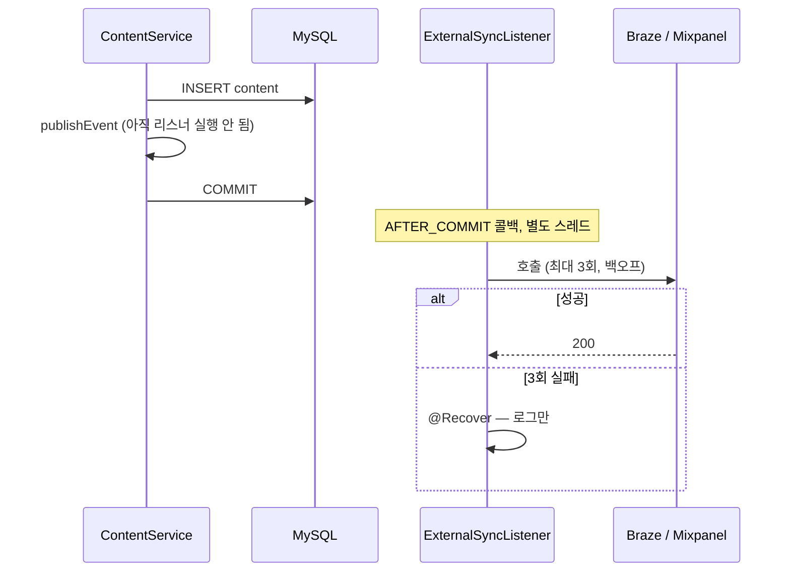

크리에이터 스튜디오는 누구나 오디오 콘텐츠를 만들어 배포할 수 있게 하는 B2C 플랫폼이었다. 콘텐츠가 생성되거나 수정되면 Braze(마케팅 자동화)와 Mixpanel(행동 분석)에 그 사실을 알려야 했다. 이 글은 그 외부 호출을 어디에 둘지 정한 과정과, "실패하면 어떻게 하는가"에 대한 답이 왜 "3회 재시도 후 로그만"이었는지, 그리고 그 답이 결제 영수증 발송 같은 다른 도메인에서는 왜 틀린 답인지를 정리한 기록이다.

> 이 글의 코드는 회사의 실제 소스가 아니라, 설계 결정을 원리대로 다시 구성한 예시다.

## 문제: 외부 호출이 트랜잭션 안에 있었다

처음 구조는 직관적이었다. 콘텐츠를 저장하는 서비스 메서드 안에서 저장이 끝나면 바로 Braze와 Mixpanel을 호출했다.

```java
@Transactional
public void createContent(ContentCreateRequest request) {
    Content content = contentRepository.save(Content.from(request));
    brazeClient.notifyContentCreated(content.getId());     // 트랜잭션 안
    mixpanelClient.track("content_created", content.getId());
}
```

이 코드는 세 가지 문제를 만든다.

1. **외부 응답 시간이 트랜잭션 길이가 된다.** Braze가 2초 걸리면 DB 트랜잭션이 2초 열려 있다. 그동안 콘텐츠 행의 락과 커넥션이 잡혀 있다.
2. **외부 실패가 핵심 저장을 롤백시킨다.** Mixpanel이 500을 돌려주면 예외가 올라가고, 콘텐츠 저장이 롤백된다. 사용자는 콘텐츠를 만들었는데 분석 도구가 죽어서 실패 화면을 본다. 부수 효과가 본 효과를 막는 구조다.
3. **재시도가 호출부마다 다르다.** 어떤 곳은 try-catch로 삼키고, 어떤 곳은 그대로 던지고, 어떤 곳은 직접 반복문으로 재시도한다. 정책이 없으니 일관성도 없다.

세 번째 문제가 가장 조용하고 가장 오래 간다. 첫 두 문제는 장애가 나면 드러나지만, 재시도 정책의 불일치는 아무도 모르는 채로 남는다.

## 결정: 외부 연동은 부수 효과이고, 부수 효과는 커밋 뒤에

문제를 다시 정의하면 이렇다. Braze와 Mixpanel 호출은 콘텐츠 생성의 일부가 아니라 콘텐츠 생성이 **일어났다는 사실**에 대한 반응이다. 반응은 사실이 확정된 뒤에 일어나야 하고, 반응의 실패가 사실을 취소해서는 안 된다.

Spring에서 이것을 표현하는 도구가 `@TransactionalEventListener`다. 도메인 로직은 이벤트를 발행하기만 하고, 리스너는 트랜잭션이 커밋된 뒤에 실행된다.

```java
@Service
@RequiredArgsConstructor
public class ContentService {

    private final ContentRepository contentRepository;
    private final ApplicationEventPublisher events;

    @Transactional
    public void createContent(ContentCreateRequest request) {
        Content content = contentRepository.save(Content.from(request));
        events.publishEvent(new ContentCreatedEvent(content.getId()));
        // 외부 호출은 여기 없다. 이벤트 발행까지가 이 메서드의 책임이다.
    }
}

@Component
@RequiredArgsConstructor
public class ExternalSyncListener {

    private final BrazeClient brazeClient;
    private final MixpanelClient mixpanelClient;

    @Async
    @TransactionalEventListener(phase = TransactionPhase.AFTER_COMMIT)
    @Retryable(maxAttempts = 3, backoff = @Backoff(delay = 1000, multiplier = 2))
    public void on(ContentCreatedEvent event) {
        brazeClient.notifyContentCreated(event.contentId());
        mixpanelClient.track("content_created", event.contentId());
    }

    @Recover
    public void exhausted(Exception e, ContentCreatedEvent event) {
        log.warn("external sync gave up after 3 attempts: contentId={}", event.contentId(), e);
    }
}
```



이 구조에서 세 문제가 어떻게 되는지 보면,

- 외부 호출은 커밋 뒤에, `@Async`로 별도 스레드에서 나간다. 트랜잭션 길이는 DB 작업만큼이다.
- 트랜잭션이 롤백되면 `AFTER_COMMIT` 리스너는 아예 실행되지 않는다. 외부 시스템에 존재하지 않는 콘텐츠를 알리는 일이 없다. 반대로 외부 호출이 실패해도 콘텐츠 저장은 이미 커밋된 뒤다.
- 재시도 정책이 리스너 한 곳에 있다. 호출부는 정책을 모른다.

`@TransactionalEventListener`가 "커밋 뒤"를 아는 방식은 트랜잭션 동기화다. Spring이 `TransactionSynchronizationManager`에 콜백을 등록해두고, 실제 커밋 시점에 등록된 리스너를 호출한다. 이 메커니즘의 함정(트랜잭션 밖에서 발행하면 리스너가 안 돈다, `AFTER_COMMIT` 안에서 DB에 쓰면 커밋되지 않는다)은 [별도 노트](/posts/transactional-event-listener/)에 정리해뒀다.

## 진짜 질문: 커밋은 됐는데 외부 연동이 끝내 실패하면

여기까지는 패턴이다. 실제 설계 결정은 그다음 질문에 있었다. 3회 재시도 후에도 실패하면 어떻게 하는가.

선택지는 셋이다.

| 선택지 | 보장 | 비용 |
| --- | --- | --- |
| 로그만 남기고 끝낸다 | 없음. 그 이벤트는 외부에 반영되지 않는다 | 거의 없음 |
| 재처리 큐에 넣고 나중에 다시 보낸다 | 최종적으로 반영된다. 단, 중복 가능 | 큐, 재처리 워커, 멱등 키 |
| Outbox로 이벤트 자체를 영속화한다 | 커밋과 이벤트 기록이 원자적, 유실 없음 | Outbox 테이블, 발행기, 소비자 멱등 |

정답은 "보장이 강한 쪽"이 아니다. **이 도메인이 어느 수준의 정합성을 요구하는가**에 달려 있다.

Braze와 Mixpanel은 개별 이벤트를 하나씩 정확히 세는 시스템이 아니다. "이번 주에 콘텐츠 생성이 몇 건이고 지난주 대비 어떤 추이인가"를 보는 시스템이다. 이벤트 하나가 누락되거나 재시도로 하나가 중복되면 그 주의 카운트가 1만큼 틀린다. 추이를 보는 목적에서 그 오차는 의미가 없다.

이 판단을 혼자 내리지 않고 마케팅과 데이터 쪽과 협의했다. 결론은 "약간의 미스카운트는 허용한다"였다. 그래서 첫 번째 선택지를 택했다. 3회 재시도, 최종 실패 시 로그, 재처리 큐 없음, 멱등 키 없음. 정합성 수준을 낮게 잡은 것이 아니라, **도메인이 요구하는 수준에 맞춘** 것이다.

## 같은 패턴이 틀린 답이 되는 곳

이 결정을 그대로 다른 도메인에 옮기면 틀린다. 결제 영수증 발송, 세금계산서 발행, 파트너사에 정산 완료 통보 같은 연동은 "약간의 미스카운트"가 허용되지 않는다. 영수증이 한 번 안 가면 고객 불만이고, 두 번 가면 이중 청구로 오해받는다.

그 도메인에서는 세 번째 선택지가 필요하다. 이벤트를 발행만 하고 끝내는 것이 아니라, 도메인 트랜잭션 안에서 이벤트를 Outbox 테이블에 함께 저장한다. 커밋되면 이벤트도 남고, 롤백되면 이벤트도 사라진다. 별도 발행기가 Outbox를 읽어 외부에 보내고, 발행 성공이 확인되면 그 레코드를 완료로 표시한다. 소비 쪽은 이벤트 ID로 중복을 거른다. 재시도 이력이 DB에 있으므로 프로세스가 죽어도 유실되지 않는다.

이 두 방식의 차이는 "커밋과 이벤트 기록이 같은 트랜잭션인가"에 있다. Post-Commit 이벤트는 커밋 뒤에 메모리에서 리스너를 부른다. 리스너가 실행되기 전에 프로세스가 죽으면 그 이벤트는 사라진다. Outbox는 이벤트를 커밋 안에 넣는다. 그래서 유실이 없고, 그래서 비용이 크다.

[ParityPay](/series/parity-pay/)에서 결제 이벤트에 Outbox를 쓴 이유가 이것이다. 같은 사람이 같은 패턴을 두고 한 곳에서는 "안 쓴다", 다른 곳에서는 "쓴다"고 결정했다. 두 결정이 다른 것은 패턴에 대한 이해가 바뀌어서가 아니라 도메인이 요구하는 정합성 수준이 다르기 때문이다.

## 정합성 수준을 정하는 질문

돌이켜보면 이 결정에서 실제로 한 일은 세 질문에 답한 것이었다.

1. **이 연동이 실패하면 누가 무엇을 잃는가.** 마케팅 카운트 1 → 아무도 잃지 않는다. 영수증 1건 → 고객이 잃는다.
2. **중복이 허용되는가.** 카운트 +1 → 허용. 영수증 2통 → 불허.
3. **유실이 허용되는가.** 카운트 -1 → 허용. 영수증 0통 → 불허.

셋 다 "허용"이면 Post-Commit 이벤트와 제한된 재시도로 충분하다. 하나라도 "불허"면 Outbox와 멱등 소비자가 필요하다. 그 사이에 재처리 큐가 있지만, 큐를 두는 순간 멱등 키가 필요해지므로 실제로는 Outbox와 비용이 크게 다르지 않다.

이 질문에 답하지 않고 "안전하게 Outbox로 가자"고 하면 마케팅 연동에 결제 수준의 인프라를 붙이게 된다. 반대로 답하지 않고 "간단하게 이벤트로 가자"고 하면 영수증이 사라진다. 둘 다 질문을 건너뛴 결과다.

## 정리

- 외부 연동은 도메인 트랜잭션의 일부가 아니라 부수 효과다. 부수 효과는 커밋 뒤에 실행하고, 그 실패가 본 효과를 취소하게 두지 않는다.
- `@TransactionalEventListener(AFTER_COMMIT)`과 `@Async`, `@Retryable`이 이 구조를 만든다. 재시도 정책이 한 곳에 모이는 것이 부수 이득이다.
- 최종 실패 시 무엇을 할지는 패턴이 정하지 않는다. 도메인이 정한다. "누가 잃는가, 중복은, 유실은" 세 질문에 답하면 Post-Commit 이벤트로 충분한지 Outbox가 필요한지가 갈린다.
- 마케팅 카운트에는 전자를, 결제 이벤트에는 후자를 썼다. 같은 패턴에 다른 답을 낸 것이 아니라, 다른 질문에 각각 답한 것이다.
