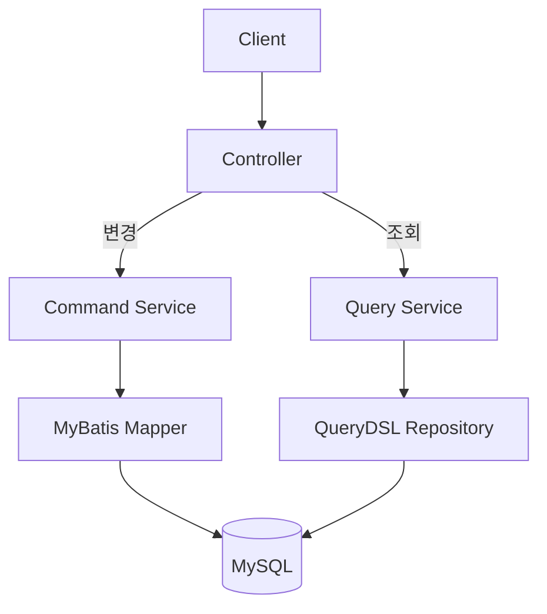
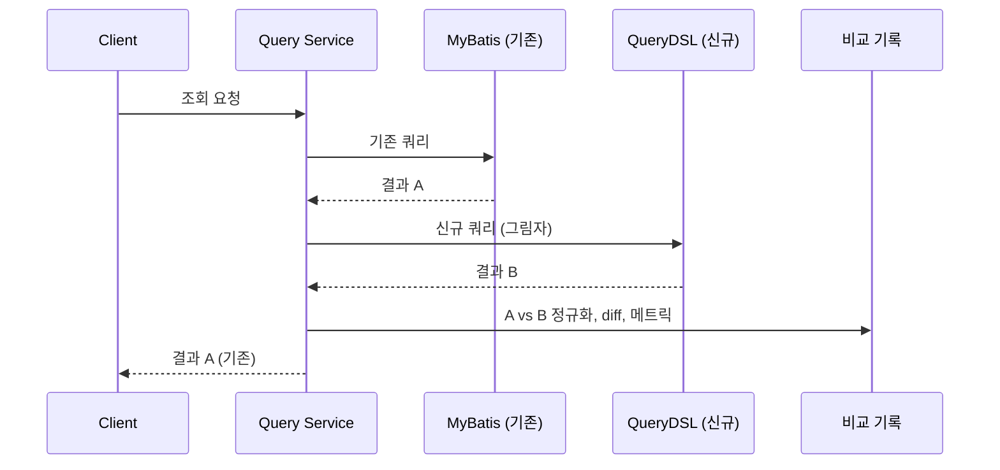

음원 콘텐츠 플랫폼(MCP) 재설계에서 데이터 접근 구조를 바꾼 방식은 "전부 JPA로 옮기기"가 아니었다. 변경은 MyBatis에 그대로 두고, 조회만 QueryDSL로 분리했다. 이 글은 왜 조회만 옮겼는지, 옮기면서 결과가 달라지는 것을 어떻게 잡았는지, 그리고 어디까지 그 절차를 적용했는지 정리한 기록이다.

> 이 글의 코드는 회사의 실제 소스가 아니라, 설계 결정을 원리대로 다시 구성한 예시다.

## 문제: 조회와 변경이 같은 곳에 있었다

기존 구조에서는 MyBatis 매퍼 하나가 특정 화면의 조회와 변경을 모두 담당했다. 화면이 늘어나면서 비슷한 조회 SQL이 매퍼마다 반복됐고, 어떤 화면의 조회를 빠르게 하려고 SQL을 고치면 그 매퍼를 같이 쓰는 변경 로직이 영향을 받았다. 조회 최적화가 변경의 리스크가 되는 구조였다.

이 문제의 핵심은 조회 쪽에 있었다. 변경 로직은 오래 운영되며 검증된 상태였고, 정산과 외부 유통이 그 결과에 의존하고 있었다. 변경까지 새 스택으로 다시 쓰는 것은 문제를 푸는 데 필요한 것보다 훨씬 큰 변경이었다.

## 결정: 조회만 분리한다

변경은 MyBatis 매퍼를 그대로 유지하고, 조회는 JPA 엔티티 위에 QueryDSL로 별도 Query 모델을 만들었다.



조회를 QueryDSL로 옮긴 이유는 두 가지다. 조건이 null이면 무시되는 동적 쿼리를 `BooleanExpression` 조합으로 타입 안전하게 쓸 수 있고, Projection으로 화면이 필요한 필드만 DTO에 바로 담을 수 있다. 화면마다 다른 조건 조합과 다른 필드 집합을 갖는 조회에 맞는 도구였다.

```java
@Repository
@RequiredArgsConstructor
public class ContractQueryRepository {

    private final JPAQueryFactory queryFactory;

    public List<ContractSummary> search(ContractSearchCondition c) {
        return queryFactory
            .select(Projections.constructor(ContractSummary.class,
                contract.id, contract.code, contract.status, album.title))
            .from(contract)
            .join(album).on(contract.albumId.eq(album.id))
            .where(distributorIdEq(c.distributorId()), statusEq(c.status()))
            .fetch();
    }

    private BooleanExpression distributorIdEq(Long id) {
        return id != null ? contract.distributorId.eq(id) : null;
    }

    private BooleanExpression statusEq(ContractStatus s) {
        return s != null ? contract.status.eq(s) : null;
    }
}
```

두 기술이 공존하면 트랜잭션 경계를 어떻게 하느냐는 질문이 따라온다. 같은 `DataSource`와 `TransactionManager`를 쓰면 물리적으로는 같은 커넥션과 트랜잭션에서 동작한다. 조회 모델은 영속성 컨텍스트에 엔티티를 올리지 않는 순수 Projection이라, 1차 캐시가 변경 결과와 어긋나는 문제는 구조적으로 생기지 않는다. 조회는 읽기 전용 트랜잭션, 변경은 MyBatis 트랜잭션으로 책임을 나눴다.

## 문제 안의 문제: 옮긴 조회가 같은 결과를 내는지 어떻게 아는가

조회를 새로 쓰면 결과가 달라질 수 있다. SQL을 그대로 옮긴 것이 아니라 QueryDSL로 다시 썼기 때문이다. 조인 조건, null 처리, 정렬, 날짜 기본값, Enum 매핑 어디서든 차이가 날 수 있고, 그 차이는 테스트 데이터로는 안 나오다가 운영 데이터의 특정 조합에서 나온다.

차이가 나면 안 되는 조회가 있었다. 라이선스 관리와 콘텐츠 관리 조회는 정산과 외부 유통이 보는 데이터였다. 여기서 한 필드가 빠지거나 한 행이 더 나오면 정산 결과가 달라진다. 단위 테스트를 통과했다고 전환할 수 있는 조회가 아니었다.

## Shadow Release: 나란히 실행하고, 비교하고, 기존 결과를 내보낸다

그래서 중요 조회는 두 쿼리를 나란히 실행했다. 요청이 오면 기존 MyBatis 쿼리와 신규 QueryDSL 쿼리를 둘 다 돌리고, 결과를 비교하고, 응답은 기존 결과로 내보낸다. 신규 쿼리는 그림자처럼 따라 돌기만 하고 사용자에게는 보이지 않는다.

```java
public List<ContractSummary> search(ContractSearchCondition c) {
    List<ContractSummary> legacy = contractMapper.search(c);

    if (shadow.isEnabled("contract.search")) {
        try {
            List<ContractSummary> candidate = contractQueryRepository.search(c);
            shadow.compare("contract.search", c, legacy, candidate);
        } catch (Exception e) {
            shadow.recordFailure("contract.search", c, e);   // 신규 쿼리 실패가 응답에 영향을 주면 안 된다
        }
    }
    return legacy;
}
```

`compare`가 하는 일은 세 가지다.

1. **정규화**. 정렬 순서가 명세에 없는 조회라면 양쪽을 같은 키로 정렬한 뒤 비교한다. `null`과 빈 문자열, `0`과 `null`처럼 의미가 같은 값은 비교 전에 맞춘다. 정규화 규칙 자체가 "이 조회에서 무엇이 같은 것인가"의 정의이고, 이 정의를 쓰는 과정에서 기존 쿼리의 암묵적 가정이 드러난다.
2. **필드 단위 diff**. 행 수가 다른지, 같은 키의 행에서 어느 필드가 다른지를 기록한다. "다르다"만으로는 고칠 수 없다. 어느 필드가 어떻게 다른지가 있어야 한다.
3. **집계와 샘플**. 조회별 비교 횟수와 불일치 횟수를 메트릭으로 올리고, 불일치는 요청 조건과 diff를 로그로 남기되 샘플링한다. 불일치가 많은 초기에는 로그가 폭발하기 때문이다.



전환 기준은 "불일치율이 0인 상태가 충분히 오래 유지되는가"여야 한다. 조회 조건의 조합이 운영에서 한 바퀴 돌 만큼의 기간이 필요하고, 주기 단위 정산 조회라면 최소 한 정산 주기다. 그 뒤 응답을 신규 결과로 바꾸고, 그림자를 반대로 돌려(기존 쿼리가 그림자) 한 주기 더 본 뒤 기존 쿼리를 제거하는 것이 안전한 순서다. 당시 정확히 몇 주기를 봤는지는 기억나지 않는다.

## 어떤 종류의 불일치를 봤는가

실제로 어떤 불일치가 몇 건 나왔는지는 기록이 남아 있지 않다. 다만 MyBatis와 JPA를 같은 DB 위에 공존시킬 때 어긋나는 지점은 유형이 정해져 있고, 그 유형은 [MyBatis와 JPA 공존 환경의 데이터 정합성 전략](/posts/legacy-jsp-system-refactoring-3/)에 따로 정리해뒀다. Shadow Release의 비교 로직은 이 유형들을 전제로 설계해야 한다.

- **Enum 매핑**. MyBatis는 문자열을 그대로 내보내고 JPA는 `@Enumerated` 설정에 따라 이름 또는 순서값을 쓴다. DB에 있는 값이 Enum 정의에 없으면 한쪽은 null, 한쪽은 예외다.
- **날짜와 기본값**. `DATETIME` 컬럼의 기본값, 타임존, `TIMESTAMP` 자동 갱신이 매퍼와 엔티티에서 다르게 해석된다.
- **null과 기본값**. MyBatis 결과 맵의 null과 JPA Projection 생성자의 기본값이 다르다. 정규화 없이는 전부 불일치로 잡힌다.
- **비즈니스 로직 중복**. 조회 SQL 안에 CASE 문으로 들어 있던 규칙이 QueryDSL 쪽에서는 Java 코드로 옮겨지면서 경계 조건이 달라진다.

이 유형들을 알고 있으면 비교 로직의 정규화 규칙을 미리 쓸 수 있다. 모르면 첫 주의 불일치 로그가 전부 노이즈가 된다.

## 어디까지 적용했는가

Shadow Release는 전체 조회 API에 일괄 적용한 것이 아니다. 라이선스 관리와 콘텐츠 관리처럼 정산과 외부 유통에 닿는 조회에 적용했고, 나머지 조회는 통합 테스트만으로 전환했을 가능성이 크다. 두 쿼리를 나란히 돌리는 비용(DB 부하 두 배, 비교 로직 유지)이 모든 조회에 정당화되지 않기 때문이다.

이 선을 어디에 긋느냐가 실제 판단이었다. 기준은 "이 조회 결과가 틀리면 누가 손해를 보는가"였다. 운영자가 화면에서 보고 바로 알아챌 수 있는 조회는 통합 테스트로 충분하다. 정산 배치가 읽어가서 금액이 되는 조회, 외부로 전송되어 되돌릴 수 없는 조회는 그림자를 돌렸다.

## 정리

- 문제가 조회에 있으면 조회만 옮긴다. 검증된 변경 로직까지 새로 쓰는 것은 문제 크기에 맞지 않는 리스크다.
- 새로 쓴 조회가 기존과 같은 결과를 내는지는 테스트 데이터로 알 수 없다. 운영 데이터와 운영 조건 조합에서 나란히 돌려봐야 안다.
- Shadow Release의 실제 작업은 비교가 아니라 정규화다. "무엇이 같은 것인가"를 정의하는 과정에서 기존 쿼리의 암묵적 가정이 드러난다.
- 모든 조회에 그림자를 돌릴 수는 없다. 결과가 틀렸을 때의 비용으로 선을 긋는다.

[정산 중 수정 차단](/posts/settlement-write-guard/)과 [SQS 파이프라인](/posts/polling-to-sqs-pipeline/)이 "상태를 명시해 시스템이 판단하게 한다"는 원칙이었다면, 이 글은 "바꾸기 전에 운영 조건에서 같은지 확인한다"는 원칙이다. 둘 다 정산이 걸린 데이터를 다룰 때 추측 대신 확인을 택한 결과다.
