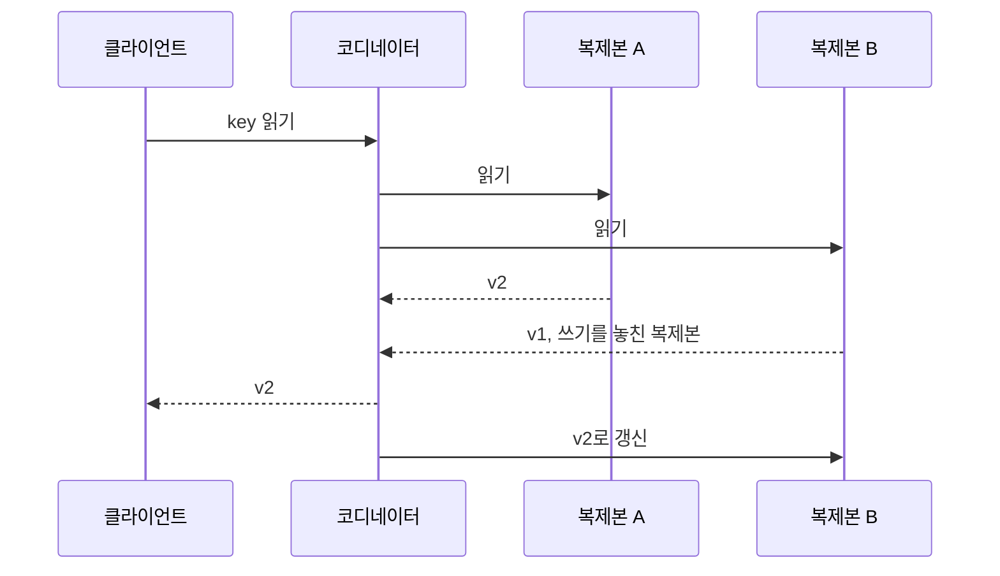

[Airbnb 결제 멱등성 글 리뷰](/posts/airbnb-orpheus-idempotency/)에는 이런 문장이 나온다. 2PC 없이 최종 일관성을 얻는 흔한 방법이 read repair, write repair, asynchronous repair 셋이고, Airbnb 결제는 셋을 다 쓰며, 그 글은 write repair를 다룬다. 세 단어가 한 문장에 묶여 나오지만 각각이 무엇을 고치는지는 설명이 없다.

세 방법은 같은 질문에 대한 서로 다른 답이다. 복제본끼리 값이 어긋났을 때, 그것을 누가 언제 맞추는가.

## 왜 수리가 필요한가

[최종 일관성](/posts/consistency-models/)은 "새 쓰기가 멈추면 언젠가 모든 복제본이 같은 값이 된다"는 약속이다. 약속만으로는 값이 맞춰지지 않는다. 어딘가에서 어긋난 복제본을 찾아 고치는 장치가 돌아야 한다.

복제본이 어긋나는 이유는 평범하다. 쓰기 순간에 노드 하나가 잠깐 죽어 있었거나, 네트워크가 끊겨 복제 메시지가 안 갔거나, 요청은 처리됐는데 응답이 유실돼 호출한 쪽이 결과를 모른다. [복제 정리](/posts/db-replication/)에서 본 primary-replica 구조라면 primary가 기준이 되지만, Dynamo나 Cassandra처럼 여러 노드가 모두 쓰기를 받는 구조에서는 "누가 맞는가"부터 비교해서 정해야 한다.

## 읽기 수리: 읽는 김에 고친다

읽기 수리(read repair)는 읽기 요청이 여러 복제본에 닿는 순간을 이용한다. 코디네이터가 복제본 여러 개에 읽기를 보내고, 돌아온 값 중 낡은 것이 있으면 그 복제본에 최신 값을 다시 써 준다.

[Dynamo 논문](https://www.allthingsdistributed.com/files/amazon-dynamo-sosp2007.pdf) 5절은 이 과정을 설명하고, 최근 갱신을 놓친 복제본을 "기회가 생긴 시점에" 고치므로 anti-entropy 프로토콜의 일을 덜어 준다고 적는다. 위 그림은 Dynamo처럼 응답을 먼저 돌려주고 수리하는 순서다. Cassandra의 기본 동작은 반대로, 수리 쓰기가 일관성 수준만큼 끝날 때까지 응답을 막는다. 그래야 연달아 두 번 읽었을 때 두 번째가 첫 번째보다 과거 값을 보지 않는다.

한계도 같은 곳에서 나온다. 읽히는 데이터만 고쳐진다. [Cassandra 문서](https://cassandra.apache.org/doc/latest/cassandra/managing/operating/read_repair.html)는 읽기 수리가 `SELECT`가 다룬 데이터만 고친다고 적는다. 또 복제본 하나만 읽는 `ONE`, `LOCAL_ONE` 일관성 수준에서는 비교할 상대가 없으니 일어나지 않는다. 한 번도 안 읽히는 행은 영원히 어긋난 채로 남을 수 있다. Cassandra 4.0은 일정 확률로 뒤에서 돌던 백그라운드 읽기 수리(`read_repair_chance`)를 없앴고, 테이블 옵션 `read_repair`의 기본값 `BLOCKING`은 수리가 끝난 뒤 응답한다.

## 쓰기 수리: 다시 쓰면서 고친다

쓰기 수리(write repair)는 Airbnb 글의 용어다. 원문은 [클라이언트의 쓰기 호출 하나하나가 깨진 상태를 고치려 시도하는 방식](https://medium.com/airbnb-engineering/avoiding-double-payments-in-a-distributed-payments-system-2981f6b070bb)이라고 정의한다. 클라이언트는 결과가 확실해질 때까지 같은 요청을 다시 보낸다. 서버는 그 요청을 받을 때마다 지금 상태를 보고 모자란 부분만 채운다.

이 방식은 같은 요청을 여러 번 받아도 결과가 한 번 받은 것과 같아야 성립한다. 그래서 원문은 쓰기 수리에서 멱등성이 매우 중요하다고 적고, 해법의 중심이 [멱등 키](/posts/idempotency-key-design/)다. 수리의 시점은 클라이언트가 정한다. 클라이언트가 필요할 때 일관성을 요구할 수 있다는 것이 원문이 꼽는 장점이고, 클라이언트가 멱등 키를 저장하고 재시도해야 한다는 것이 대가다.

저장소 수준에서 쓰기 경로에 붙는 비슷한 장치로 Dynamo의 hinted handoff가 있다. 논문 4.6절에 따르면 노드 A가 쓰기 순간 닿지 않으면 다른 노드 D가 "원래 A의 것"이라는 힌트를 붙여 대신 보관하고, A가 돌아오면 넘겨준다. 쓰기를 실패시키지 않으면서 나중에 맞출 재료를 남기는 것이다.

## 비동기 수리: 아무도 안 볼 때 고친다

비동기 수리는 요청과 무관하게 서버 쪽 작업이 주기적으로 복제본을 비교해 고친다. 저장소 문헌에서는 anti-entropy라고 부른다. 읽히지 않는 데이터, 힌트가 유실된 쓰기까지 잡는 유일한 방법이다.

문제는 비교 비용이다. 복제본 두 개의 데이터를 통째로 주고받으면 너무 비싸다. Dynamo 4.7절은 Merkle 트리로 이것을 줄인다. 리프는 키 하나의 값의 해시, 부모는 자식 해시들의 해시다. 두 노드가 루트 해시를 비교해 같으면 그 범위 전체가 같다. 다르면 자식으로 내려가며 다른 가지만 따라가서 어긋난 키를 찾는다. 논문은 이것이 전송할 데이터 양과 디스크 읽기 횟수를 줄인다고 적는다.

Cassandra의 `nodetool repair`가 같은 구조다. [repair 문서](https://cassandra.apache.org/doc/latest/cassandra/managing/operating/repair.html)는 이것을 anti-entropy 메커니즘이라 부르고, 지난 수리 이후 데이터만 보는 incremental repair와 전체를 보는 full repair를 나눈다. 운영에서 중요한 조건이 하나 있다. 삭제는 tombstone이라는 표식으로 남고, `gc_grace_seconds`(기본 10일)가 지나면 표식이 지워진다. 그 전에 수리가 돌지 않아 어떤 복제본이 삭제를 못 받았다면, 표식이 사라진 뒤 그 복제본의 옛 값이 수리로 다시 퍼진다. 문서가 수리를 grace 기간 안에 반드시 돌리라고, 지운 데이터가 되살아날 수 있다고 경고하는 이유다.

Airbnb 글의 비동기 수리는 더 넓은 뜻이다. 테이블 스캔, 람다 함수, cron 작업으로 서버가 정합성을 검사하고, 서버가 클라이언트에 비동기 알림을 보내 클라이언트 쪽 상태도 맞춘다. 원문은 이것이 읽기·쓰기 수리와 함께 쓰이는 두 번째 방어선이라고 적는다. [ParityPay 3편](/posts/parity-pay-unknown-state/)에서 결과를 모르는 결제를 `UNKNOWN`으로 두고 서버의 복구 작업이 외부에 조회해 확정한 것이 이 범주다.

## 세 방법의 비교

| | 읽기 수리 | 쓰기 수리 | 비동기 수리 |
| --- | --- | --- | --- |
| 누가 시작하나 | 읽기 요청 | 클라이언트의 재시도 | 서버의 주기 작업 |
| 언제 고쳐지나 | 그 키가 읽힐 때 | 클라이언트가 다시 보낼 때 | 작업 주기마다 |
| 못 고치는 것 | 안 읽히는 데이터 | 클라이언트가 포기한 요청 | 다음 주기 전까지의 어긋남 |
| 전제 | 여러 복제본을 읽는 일관성 수준 | 멱등한 쓰기 | 비교 비용을 줄이는 장치(Merkle 트리 등) |

셋은 서로를 대체하지 않는다. 읽기·쓰기 수리는 요청이 오는 데이터를 빨리 고치고, 비동기 수리는 요청이 안 오는 데이터를 늦게라도 고친다. Dynamo와 Airbnb 결제가 둘 이상을 함께 쓰는 이유다.

## 정리

- 최종 일관성은 약속이고, 실제로 값을 맞추는 것은 수리 장치다. 수리가 안 돌면 "언젠가"는 오지 않는다.
- 읽기 수리는 싸지만 읽히는 데이터만 고친다. 단일 복제본 읽기에서는 일어나지 않는다.
- 쓰기 수리는 클라이언트의 재시도로 수렴하므로 멱등성이 전제다. 클라이언트가 재시도를 멈추면 수렴도 멈춘다.
- 비동기 수리는 마지막 안전망이다. Cassandra에서는 tombstone이 지워지기 전에 돌아야 삭제가 되살아나지 않는다.

## 참고

- [Dynamo: Amazon's Highly Available Key-value Store](https://www.allthingsdistributed.com/files/amazon-dynamo-sosp2007.pdf) — DeCandia et al., SOSP 2007. 4.6절 hinted handoff, 4.7절 Merkle 트리 anti-entropy, 5절 read repair
- [Read repair](https://cassandra.apache.org/doc/latest/cassandra/managing/operating/read_repair.html) — Apache Cassandra 문서
- [Repair](https://cassandra.apache.org/doc/latest/cassandra/managing/operating/repair.html) — Apache Cassandra 문서
- [Avoiding double payments in a distributed payments system](https://medium.com/airbnb-engineering/avoiding-double-payments-in-a-distributed-payments-system-2981f6b070bb) — The Airbnb Tech Blog, 2019-04-17
- [Airbnb 「Avoiding double payments in a distributed payments system」 리뷰](/posts/airbnb-orpheus-idempotency/)
