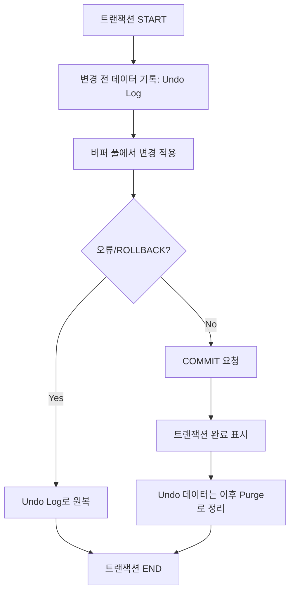
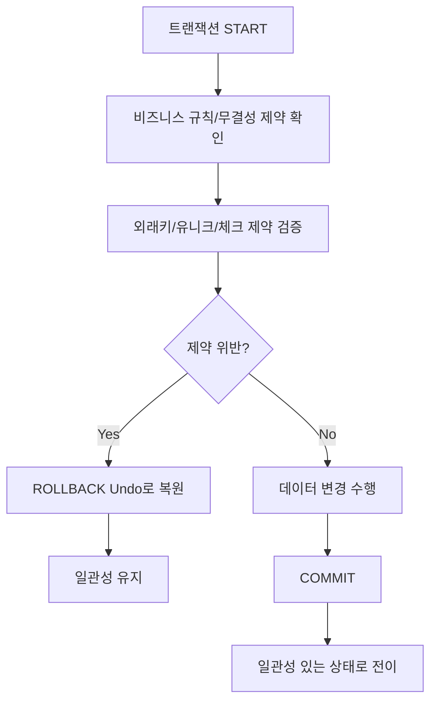
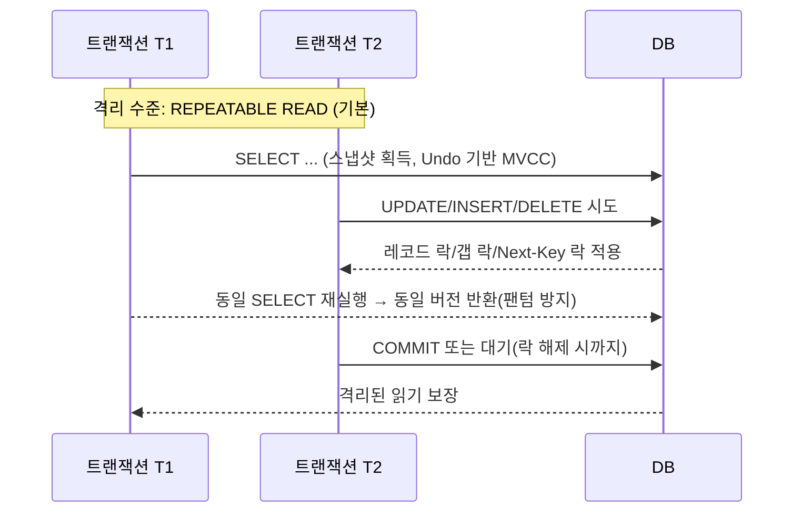

## ACID

데이터베이스에서 **ACID**는 트랜잭션이 안전하고 일관되게 처리되도록 보장하는 **4가지 핵심 속성**을 뜻한다. 이 4가지 속성은 트랜잭션 패러다임에서 신뢰성을 보장할 수 있는 중요한 사항으로, 데이터베이스 시스템 개발의 여러 측면에서 영향을 미쳤다.

참고로, ACID와 반대 개념인 BASE는 기본적으로 사용 가능, 소프트 상태, [최종적으로 일관성](https://en.wikipedia.org/wiki/Eventual_consistency)을 의미한다. ACID 데이터베이스는 가용성 보다는 **즉각적인 일관성**을 우선시한다. 트랜잭션 내의 어떤 단계에서든 오류가 발생하면 전체 트랜잭션이 실패한다. -> (원자성) 반면, BASE 데이터베이스는 일관성보다 가용성을 우선시한다. 트랜잭션이 실패하는 대신 사용되지 않은 데이터에 일시적으로 엑세스할 수 있다. 데이터 일관성은 달성되지만 즉시 달성되지는 않을 수 있다.

### A — Atomicity (원자성)

원자성은 트랜잭션이 **전부 수행되거나, 전혀 수행되지 않아야 함**을 의미한다. 중간에 실패하면 모든 변경 사항이 취소(rollback)되어 DB는 트랜잭션 전 상태로 되돌아간다. 예를 들어, 은행 계좌 이체에서 돈이 빠져나가기만 하고 들어가지 않는 상황이 없어야 한다.

원자성을 보장하기 위해서는 전부 수행되거나, 전혀 수행되지 않도록 **진행상황과 상태를 어딘가에 기록해야한다.** 그리고 중간에 실패한다면 트랜잭션 안에서 수행한 여러가지 연산이나 쿼리가 최종적으로 DB에 반영되지 않도록 보장해야한다.

InnoDB는 **Undo Log**에 “변경 전 값/반대 연산”을 남겨두고 작업을 진행한다. 실패 시 Undo Log로 **완전히 되돌릴 수 있어** 트랜잭션이 “All or Nothing”의 성질을 가진다. 커밋 후에도 Undo 레코드는 MVCC를 위해 잠시 남아 있다가 **Purge**로 정리된다.

---

### C — Consistency (일관성)

트랜잭션이 완료되면 **데이터베이스의 무결성과 규칙**이 항상 유지되어야 한다. 다시 말해, DB의 스키마, 제약 조건(Constraints), 비즈니스 규칙 등이 위배되지 않아야 한다. 예를 들어, 쇼핑몰 DB의 상품 테이블에서 상품 재고가 음수가 되면 안 된다.

일관성을 보장하기 위해서는 규칙의 위반에 대한 처리가 필요하다. **외래키, 유니크 인덱스, 체크 제약, 트리거** 등 무결성 규칙을 통해 커밋 전후 데이터의 논리적 일관성을 보장한다. 제약 위반 시 즉시 **롤백**되며, 커밋된 상태는 항상 규칙을 만족하도록 유지된다. 이러한 처리를 통해 최종적으로는 유효한 데이터의 일관성을 보장할 수 있다.

예시로 설명한 '상품 재고의 음수 금지'에 대한 규칙을 DBMS의 기능으로 처리할수도 있겠지만, 좀 더 확장해서 생각해볼 수 있어야한다. 애플리케이션 레벨까지 끌어올려보면 '비즈니스 로직' 또는 '도메인 규칙'으로도 표현할 수 있을것이다. 그리고 분산 시스템이나 MSA 구조라면? 이때 일관성을 어떻게 보장할 수 있을지도 생각해볼 문제이다.

---

### I — Isolation (고립성)

동시에 여러 트랜잭션이 수행될 때, **서로 간섭하지 않고 독립적으로 실행된 것처럼 보여야 한다.** 즉, 실제로는 동시에 실행되더라도, 결과는 마치 순차적으로 실행된 것과 동일해야 한다. 예를 들어, 두 사람이 동시에 같은 좌석을 예매하려 할 때, 한 명만 성공해야 한다.

동시에 실행되더라도 순차적으로 실행된 것처럼 보이게 하려면, 결국에는 시간순으로 줄을 세우는 방법뿐이다. 이 순차적인 직렬화를 구현하기 위해서는 여러가지 방법이 있겠지만, 가장 간단한 방법은 경합에 대한 락(Lock)을 구현해서 줄이 세워지도록 하는 것이다.

MySQL InnoDB에서는 **MVCC(Undo 기반)** 로 읽기 스냅샷을 제공하여 다른 트랜잭션 변경의 간섭을 줄인다. 갱신 경합에는 **Row Lock**, 팬텀 방지에는 **Gap/Next‑Key Lock**을 사용한다. 기본 격리 수준(REPEATABLE READ)에서 동일 쿼리는 트랜잭션 동안 **일관된 결과**를 본다. 필요 시 READ COMMITTED/READ UNCOMMITTED/SERIALIZABLE로 조정 가능하다.

---

### D — Durability (지속성, 내구성)

트랜잭션이 성공적으로 완료되면, 그 결과는 **전원 꺼짐, 장애 등에도 영구적으로 저장**되어야 한다. DBMS는 이를 위해 로그, 백업, 디스크 저장 등의 메커니즘을 사용한다. 예를 들어, 주문이 완료된 뒤 서버가 꺼져도 주문 기록은 사라지지 않아야 한다.

InnoDB에서는 다음과 같은 기술을 구현하여 지속성을 보장한다. 먼저, **WAL(Write‑Ahead Logging)**는 데이터 파일에 쓰기 전에 **Redo Log**에 변경을 먼저 기록한다. 커밋 시 fsync로 로그를 디스크에 내리며, 장애가 나도 **Redo Log 재적용**으로 복구한다. 그리고 **Doublewrite Buffer**를 통해 일부 페이지만 쓰여 발생하는 **Partial Page Write**를 방지한다.

## References

- [Wikipedia - ACID](https://en.wikipedia.org/wiki/ACID)